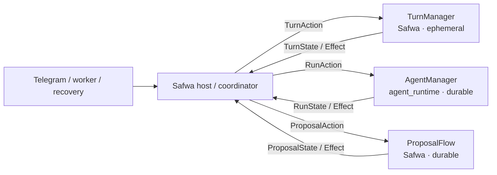
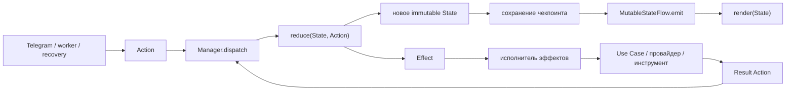
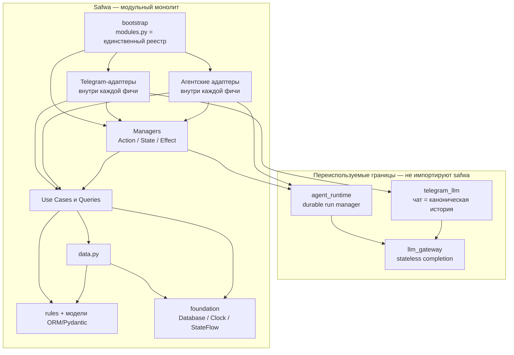
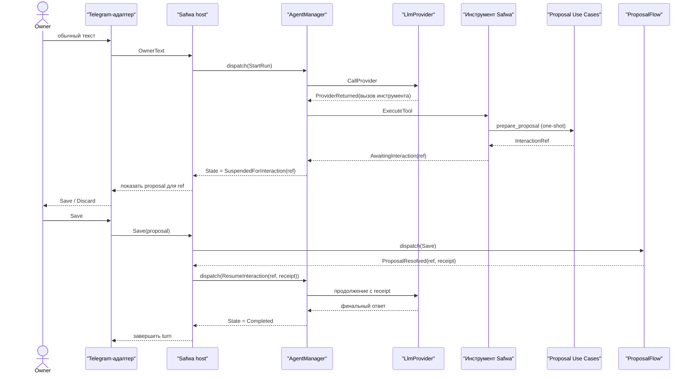

# Safwa — план рефакторинга к модульной Clean Architecture

**Статус: финальная версия.** Документ прошёл два круга ревью: план v3 был сверен с кодом, затем
результат этой сверки отревьюирован ещё раз. Здесь сведено то, что пережило оба круга. После
принятия черновики `REFACTPRING_CLEAN_ARCH_v1.md`, `REFACTORING_CLEAN_ARCH_v2.md`,
`REFACTORING_CLEAN_ARCH_v3.md`, `REFACTORING_CLEAN_ARCH.md` и
`REFACTORING_CLEAN_ARCH_final_review.md` можно удалить.

---

## О документе

Основой служит фактический код, а не текст предыдущих версий: 50 production-модулей, 18 909 строк,
31 тестовый файл, 396 тестовых функций. Все утверждения о текущем состоянии проверены в исходниках,
и там, где ссылка на конкретное место меняет решение, она приведена явно.

`examples/plain_chat_bot/`, упомянутый ниже, — это будущий acceptance-пример извлечённого пакета,
то есть способ доказать, что граница проведена верно. Он не является переносом архитектуры откуда-то
ещё.

План отвечает на четыре запроса владельца проекта:

1. Привести проект к Clean Architecture с модульным делением по функциям.
2. Сделать Telegram↔LLM-оболочку переиспользуемой в других проектах.
3. Сделать переиспользуемой модель работы агентов и субагентов поверх абстрактного LLM-провайдера.
4. Получить чистый слой бизнес-логики Safwa в виде Use Case — **и, что важнее всего, сделать так,
   чтобы новые функции добавлялись по уже существующему шаблону, а не изобретались каждый раз
   заново.**

Четвёртый пункт — главный. Он же был выполнен в v3 хуже всего, и большая часть этого документа
посвящена именно ему.

## Что изменилось на втором круге ревью

Первый круг нашёл главную проблему проекта — девять реестров, по которым размазана одна фича, — и
предложил механизм: `FeatureModule` плюс единый шов AI-мутаций. Механизм оказался верным, но в
шести местах он был описан так, что нарушал собственные правила документа. Второй круг это поймал.

**Исправленные противоречия:**

1. **`FeatureModule` жил в `foundation`, но импортирует `aiogram.Router`.** А `foundation`
   импортируется из `data.py` и `use_cases.py`, которым Rule A запрещает знать aiogram. Manifest
   перенесён в `bootstrap` — это wiring-DTO самого внешнего слоя, а не доменный контракт.

2. **Единый `ChangeSpec` смешивал три слоя в одном объекте:** `apply` (application), `description`
   для промпта (AI-адаптер), `describe` для экрана (presentation). Разделён на `ProposalHandler`,
   `MutationToolSpec` и `ProposalPresenter`, которые связываются только в manifest-е фичи. Файлы
   для них в шаблоне фичи уже есть, так что деление ничего не усложняет.

3. **`ENTITY_MODELS` оставался в общем коде** — притом что он под номером 4 в списке тех самых
   девяти реестров, ради устранения которых всё затевалось. Загрузка сущности, `archived_at` и
   проверка закрытого повтора уезжают к handler-у фичи.

4. **`agent_runtime` получал `proposal_id`** — то есть пакет, который не должен знать Safwa,
   оперировал понятием Safwa. Заменено на непрозрачный `InteractionRef` с проверкой совпадения
   перед переходом.

5. **`AgentManager` живёт в `agent_runtime` и нуждается в `StateFlow`, лежащем в
   `safwa/foundation`** — прямое нарушение Rule F. Пока границы логические, код общий; при
   физическом извлечении runtime получает внутреннюю копию этих сорока строк. Четвёртый публичный
   пакет ради одного helper-а не создаётся.

6. **«Верхний» и «нижний» Manager — выдуманная иерархия.** В двух реальных путях вложенности нет:
   фоновая работа держит аренду без запуска агента, а proposal после перезапуска разрешается, когда
   активного хода нет вовсе. Три процесса образуют workflow, а не дерево объектов. Правило
   переформулировано: Manager не импортирует соседа, host переводит State/Effect одного в Action
   другого.

**Улучшения, а не исправления:**

7. **`StateFlow` разделён на `MutableStateFlow` (писатель, приватный для Manager-а) и read-only
   `StateFlow`.** «Один писатель» становится свойством выданной наружу capability, а не надеждой на
   архитектурный тест. Сделать неправильное невозможным лучше, чем проверять его тестом.

**Что уточнено здесь, на третьем проходе:**

8. Мягкие формулировки второго круга («порог ревью», «без формальной квоты») сохранены по смыслу,
   но снабжены операционным критерием — иначе они перестают быть проверяемыми (разделы 9.1 и 17).
9. Названо, где физически живут типы `MutationToolSpec` и `ProposalPresenter` (раздел 7.2).
10. Добавлено Rule K, которое делает разделение слоёв proposal-а проверяемым, а не декларативным.

Всё остальное — карта миграции, BDD-аудит, деление батчей, границы трёх пакетов, порядок фаз —
пережило оба круга без изменений.

---

# Часть I. Результат ревью v3

## 1. Что из v3 принимается без изменений

План v3 в основе своей правильный, и его ключевые решения переносятся сюда целиком.

**Use Case без базового класса.** У Use Case нет общего родителя, нет обязательного метода
`execute()`, нет реестра по строковому имени. Это прямое требование владельца, и оно верное: при
шести бизнес-модулях единый контракт не даёт ничего, кроме лишнего слоя.

**Разделение на one-shot операции и долгие процессы.** Use Case выполняется от начала до конца и не
хранит прогресс. Всё, что переживает несколько событий, ожидание человека или перезапуск процесса,
принадлежит Manager-у. Это разделение точно описывает реальность кода.

**Реактивность только там, где она уместна.** Immutable union-состояния и однонаправленный поток
данных применяются к настоящим процессам, а не к каждой кнопке. Без этой оговорки Telegram UI
превращается в Redux, и это была бы худшая из возможных ошибок.

**SQLAlchemy и Pydantic разрешены в доменном слое.** 28 из 50 модулей уже импортируют SQLAlchemy.
Дублировать 31 ORM-модель в отдельные доменные сущности с мапперами — работа, которая не окупится
никогда.

**BRD/BDD как источник истины при миграции.** Сценарии Given–When–Then утверждаются владельцем
продукта до написания тестов и до переноса кода. Это единственный способ отличить архитектурный
рефакторинг от тихого изменения продукта.

**Три переиспользуемые границы:** `llm_gateway`, `agent_runtime`, `telegram_llm`.

## 2. Что исправлено и почему

### 2.1. Расширяемость была объявлена, но не реализована

Это главная претензия к v3.

План v3 в разделе «Definition of Done» требует: «Новая feature не требует `if feature_name` в
generic code». Раздел 8.1 перечисляет имена файлов шаблона фичи, раздел 24 описывает шаги
«как добавить операцию». Но ни одна из девяти фаз v3 не устраняет причину, по которой сегодня
добавить функцию дорого.

Я посчитал по коду. Чтобы добавить одну сущность, которую агент может изменять (ровно так в проект
добавлялись Diary и Reminders), нужно отредактировать девять центральных мест. Полный список — в
разделе 4. Пока эти девять мест существуют, шаблон остаётся описанием намерения, а не рабочим
механизмом.

**Исправление:** введён wiring manifest `FeatureModule` и capability-specific contributions
(разделы 6 и 7). Фича объявляет подключаемые возможности один раз, а composition root строит из
них отдельные реестры Telegram, AI, proposal и lifecycle. Требуемое число правок при добавлении
фичи — один пакет плюс одна строка регистрации. Это проверяется архитектурным тестом и входит в
измеримый Definition of Done.

### 2.2. Правило «выделить StateFlow после второй реализации» противоречило само себе

v3 в разделе 10.2 предлагает не строить общий механизм наблюдаемого состояния, а реализовать
контракт локально в первом Manager-е и выделить общий `StatePublisher` только после второй
одинаковой реализации.

Но раздел 11 того же документа уже называет трёх Manager-ов: агентный процесс, очередь proposal-ов
и генерацию. То есть на момент написания плана известно три потребителя, а не один. Написать три
раза вручную conflation, distinct, «один писатель» и «публикация только после коммита» — это ровно
тот случай, который CLAUDE.md проекта называет главным сигналом неправильного решения: несколько
механизмов, компенсирующих одно недостающее свойство.

**Исправление:** `foundation/state_flow.py` пишется в нулевой фазе (раздел 8). Это около шестидесяти
строк при трёх заранее известных потребителях. Откладывать дороже, чем написать.

### 2.3. Три текущих процесса образуют workflow, но не иерархию объектов

v3 подаёт их как три независимые строки таблицы. В реальности один пользовательский workflow
проходит через три разных владельца состояния: аренду генерации, запуск агента и решение по
proposal. Сегодня эта последовательность существует неявно, размазанная по `GenerationGuard`,
`AgentSession` и `ProposalService`.

Если не назвать эту вложенность явно, при возобновлении приостановленной цепочки почти неизбежно
появятся два писателя одного состояния и взаимные ожидания. Это самый дорогой класс ошибок в такой
системе — их трудно воспроизвести и почти невозможно поймать тестом задним числом.

**Исправление:** раздел 9 вводит правило композиции — один Manager не импортирует и не вызывает
другой Manager напрямую. Каждый публикует своё состояние и принимает свои Actions; host переводит
завершение одного процесса в Action следующего. Так сохраняются один писатель и направление
зависимостей без искусственных понятий «верхний» и «нижний» Manager.

### 2.4. Не было карты миграции

v3 размещает шесть файлов из пятидесяти. Остальные 44 остаются без ответа на вопрос «куда это
переезжает». На практике это означает, что каждый батч миграции начинается со спора о размещении, и
решения принимаются по-разному в разные дни.

**Исправление:** раздел 12 содержит таблицу «текущий файл → целевой дом» для всех 50 модулей, плюс
отдельные разрезы для двух самых больших — `ai/service.py` (3062 строки) и `domain.py` (1908 строк).

### 2.5. Пилотный батч не был изолирован, хотя план это утверждал

v3 выбирает Diary как пилотную фичу и называет её изолированной. Это неверно. Мутация Diary
проходит через `ChangePreparer.prepare` — ветку `if change.entity == "diary"` на
[prepare.py:114](src/safwa/ai/prepare.py:114) — и через `ProposalService._apply_diary_change` на
[service.py:2820](src/safwa/ai/service.py:2820). Оба метода живут внутри god-модулей, которые
план собирается разбирать только в шестой и седьмой фазах.

Значит, «маленький изолированный пилот» на деле вскрывает всю AI-подсистему. Он теряет главное
свойство пилота — обратимость — и рискует самой сложной частью проекта в самом начале миграции,
когда опыта работы с новой структурой ещё нет.

**Исправление:** выделение proposal-шва перенесено во вторую фазу, до любого бизнес-батча
(раздел 15). Application-обработчик, LLM-tool и presenter выделяются отдельно. После этого Diary
действительно становится изолированной.

### 2.6. Вся работа была заблокирована за согласованием

v3 в разделе 18 требует: «До первого approval разрешены только read-only audit и draft artifacts».

Но значительная часть работы вообще не трогает бизнес-правила. Вынести провайдера LLM за интерфейс,
написать StateFlow, разрезать `ChangePreparer` на протокол — всё это не меняет ни одного
наблюдаемого поведения. Требовать для этого утверждённых сценариев значит превратить владельца в
узкое место на работе, которую он и не должен рассматривать.

**Исправление:** раздел 14 делит батчи на технические и бизнесовые. Технические не меняют
поведения, и их ворота — зелёные существующие тесты плюс архитектурные проверки. Согласование
нужно только бизнес-батчам. Признак того, что технический батч перестал быть техническим: пришлось
изменить ожидание существующего теста по существу, а не механически.

### 2.7. Принципы работы с UI не были сформулированы

Владелец прямо сказал, что у него есть определённые принципы работы с Telegram как с оболочкой для
LLM и определённые принципы работы с UI-компонентами. v3 упоминает `Dialogue | Screen | Toast` в
одном абзаце раздела 14.1 и идёт дальше.

Но настоящие инварианты Safwa другие, и они зафиксированы в CLAUDE.md. Именно ради них и стоит
выделять переиспользуемый пакет — если они не перенесены, пакет выделен зря.

**Исправление:** раздел 13.2 формулирует четыре инварианта UI-ядра как явный контракт пакета
`telegram_llm`.

### 2.8. Пакет `telegram_llm` был слишком широким

v3 отдаёт пакету примитивы пагинации и ввода текста, а также сериализацию и отмену генерации.
Первое — вкусовщина конкретного UI Safwa. Второе — политика хода Safwa, то есть бизнес-решение о
том, что делать с текстом владельца, пришедшим во время ответа.

У второго потребителя пакета и то и другое оказалось бы мёртвым грузом, который пришлось бы
обходить или форкать. А это ровно та ситуация, ради избежания которой пакет и выделяется.

**Исправление:** раздел 13.3 содержит явные списки «что внутри» и «что остаётся в Safwa». Приёмкой
служит рабочий пример `examples/plain_chat_bot/` — бот примерно на пятьдесят строк, не импортирующий
Safwa. Если такой пример не пишется, граница проведена неверно.

### 2.9. Конфликт с CLAUDE.md остался незамеченным

CLAUDE.md сейчас требует: каждый лимит, бюджет, интервал и шкала усилий живут в `constants.py`.
Это прямо несовместимо с делением на feature-модули: константа одной фичи не может лежать в общем
файле, если фича должна быть самодостаточной.

Если это противоречие не разрешить явно, в репозитории окажутся два закона, и следующий
контрибьютор — включая будущую сессию Claude Code — выберет случайный.

**Исправление:** раздел 10.4 разрешает конфликт и включает правку CLAUDE.md в нулевую фазу. То же
касается `enums.py`.

### 2.10. Definition of Done был неизмерим

Формулировки вида «`domain.py` больше не является god-модулем» или «простые экраны не обросли
лишними state machines» невозможно проверить. Значит, невозможно и сказать, закончена ли фаза.

**Исправление:** раздел 17 задаёт четырнадцать проверяемых критериев с указанием способа
измерения. Там, где жёсткое число навредило бы, критерием становится обязанность назвать причину.

### 2.11. Не было политики на случай остановки посреди миграции

Девятифазный рефакторинг проекта на 19 тысяч строк будет остановлен — на неделю, на месяц, из-за
смены приоритетов. Если план этого не предусматривает, в репозитории надолго остаются параллельные
старый и новый пути. Это самая дорогая форма технического долга.

**Исправление:** раздел 15.1 требует, чтобы каждая фаза заканчивалась состоянием, которое можно
оставить навсегда. Фаза, которую не удалось закончить, откатывается целиком.

### 2.12. Мелкое, но существенное

v3 ссылается на `docs/SUBAGENTS_PLAN.md` как на источник правил субагентов, но этого файла нет в
таблице «Where the detail lives» в CLAUDE.md. Файл существует и весит 28 килобайт. Новая сессия
Claude Code его не найдёт. Добавление в таблицу входит в нулевую фазу.

## 3. Честная оценка объёма

Проект — 18 909 строк, один владелец, один пользователь. Девятифазный план для такого размера
оправдан только потому, что три вещи действительно нужны: убрать девять точек расширения до одной,
превратить неявные state machine в явные, вынести переиспользуемую оболочку.

Из них **извлечение отдельных пакетов (фазы 7–9) имеет худшее соотношение пользы к затратам**, пока
второго потребителя нет. Поэтому они стоят в конце и сформулированы как «сначала логическая
граница, отдельный пакет — по требованию». Логическое разделение даёт около девяноста процентов
пользы за двадцать процентов работы. Если второй проект так и не появится, **остановка после
восьмой фазы — валидный конечный результат, а не брошенная миграция.**

---

# Часть II. Решение

## 4. Главная проблема: функция размазана по девяти реестрам

Прежде чем говорить о слоях, нужно назвать конкретную причину, по которой проект тяжело расширять.

Возьмём реальную задачу: добавить сущность, которую агент может изменять. Именно так в проект
добавлялись Diary и Reminders. Сегодня для этого нужно отредактировать девять центральных мест:

| # | Где | Что нужно дописать | Ссылка |
|---|---|---|---|
| 1 | `ai/contracts.py` | Pydantic-контракт инструмента | [contracts.py:461](src/safwa/ai/contracts.py:461) |
| 2 | `ai/service.py` | `MUTATION_TOOL_DESCRIPTIONS`, `SAFWA_TOOLS`, `IMMEDIATE_TOOLS` | [service.py:132](src/safwa/ai/service.py:132) |
| 3 | `ai/prepare.py` | ещё одну ветку `if change.entity == "..."` | [prepare.py:114](src/safwa/ai/prepare.py:114) |
| 4 | `ai/prepare.py` | запись в `ENTITY_MODELS` | [prepare.py:118](src/safwa/ai/prepare.py:118) |
| 5 | `ai/service.py` | метод `_apply_<entity>_change` и ветку в `apply` | [service.py:2851](src/safwa/ai/service.py:2851) |
| 6 | `ai/sql.py` | `ALLOWED_VIEWS` **и отдельно** `create_ai_views` | [sql.py:31](src/safwa/ai/sql.py:31) |
| 7 | `telegram/callbacks.py` | записи в `CALLBACK_ACTIONS` | [callbacks.py:1020](src/safwa/telegram/callbacks.py:1020) |
| 8 | `main.py` | элемент в ростере `RoutedSubagent(...)` | [main.py:141](src/safwa/main.py:141) |
| 9 | `SYSTEM_PROMPT` | прозаический абзац в разделе правил маршрутизации | `ai/service.py` |

И это не всё. В зависимости от фичи добавляются `recovery.py`, `backup.py`, фоновая задача в
`main.py`, экспорт в `telegram/__init__.py`, запись в `sync_bot_commands`.

Показательно, что CLAUDE.md уже фиксирует два из этих капканов как известную боль:

> «A new subagent must be added *both* to the roster in `main.py` *and* to that section, or it is
> never routed to.»

> «A new view has to be added to `ALLOWED_VIEWS` *and* to the view list of every prompt that should
> reach it.»

Слово «both» в обоих предложениях — это симптом. Документация вынуждена предупреждать о двойной
регистрации, потому что механизм её не гарантирует.

**Это и есть настоящая причина, по которой проект «сложно расширять».** Не отсутствие слоёв, не
размер файлов, не смешение ответственностей — а то, что знание о существовании фичи размазано по
девяти местам, ни одно из которых не принадлежит самой фиче.

Слои и папки эту проблему не решают. Её решает единый реестр — ему посвящены следующие два раздела.

**Целевое число правок — одна.** Новая сущность это новый пакет `features/<name>/` плюс одна строка
в `bootstrap/modules.py`. Всё остальное система забирает из объявления фичи.

## 5. Словарь

Дальше в документе четыре термина используются в строгом смысле. Стоит зафиксировать его сразу.

### Use Case

Одна законченная бизнес-операция:

```text
неизменяемая команда → одно выполнение → неизменяемый результат или типизированная ошибка
```

Use Case не хранит прогресс между вызовами и не имеет изменяемых полей. Он выполняется до
результата. Если он пишет данные, он сам открывает транзакцию. Он не знает ни про `Message` и
`CallbackQuery` aiogram, ни про SDK провайдера.

По форме это обычная `async def` — так и следует писать по умолчанию. Допустимы function object или
небольшой вызываемый класс, если так читается лучше. **Общего родителя, обязательного метода
`execute` и реестра по имени нет.**

Формулировка «one-shot» означает, что объект состояния операции не переживает вызов. Она **не**
означает разрешения на потерянный `asyncio.create_task`. Фоновая работа всегда принадлежит
Manager-у, который умеет её дождаться, отменить, восстановить и сообщить об ошибке.

### Query

Операция чтения без состояния. Возвращает то, что действительно нужно потребителю: полностью
загруженный ORM-объект, если жизненный цикл сессии безопасен; неизменяемую read-модель, если UI или
LLM нужна своя форма; скаляр или коллекцию, если отдельный тип ничего не добавляет.

Универсальный `EntityDto` на все случаи запрещён — он неизбежно превращается в мешок опциональных
полей.

### Manager

Владелец процесса, который не выражается одним Use Case. Manager — единственный, кто пишет своё
состояние. Он принимает типизированные Actions, публикует неизменяемое union-состояние, запускает
эффекты и превращает их результаты обратно в Actions. Он не содержит рендеринга и не держит
объектов фреймворка. Общего базового класса у Manager-ов тоже нет.

### Четыре разных вещи, которые все называют «состоянием»

Их постоянно смешивают, и от этого возникают ошибки. Разница существенна:

| Что это | Пример | Где истина | Можно ли переиграть новому подписчику |
|---|---|---|---|
| Доменные данные | `Card.stage`, `Sprint`, `Reminder` | строки в SQLite | не применимо, это не поток |
| Durable-состояние процесса | приостановленный запуск агента, активный batch proposal-ов | сохранённая запись | да |
| Ephemeral-состояние процесса | генерация выполняется / в очереди / отменяется | память Manager-а плюс политика восстановления | да |
| Эффект или событие | `ShowToast`, `NavigateToCard`, `SendMessage` | нигде, это одноразовая команда | **нет** |

Требование наблюдаемого потока состояний относится к **состоянию процесса**, а не к каждой строке
ORM и не к каждому enum-полю. Toast и навигация в поток состояний не кладутся никогда: новый
подписчик получит текущее состояние и исполнит старое событие второй раз.

## 6. FeatureModule: одна точка подключения Safwa

Идея простая. Сегодня девять центральных мест спрашивают «а какие у нас есть сущности?». Вместо
этого каждая фича один раз отвечает на вопрос «что я подключаю в приложение», а composition root
строит из ответов capability-specific реестры.

`FeatureModule` — не доменный контракт, не service locator и не API между фичами. Это
Safwa-specific неизменяемый wiring DTO самого внешнего слоя. Поэтому он живёт в `bootstrap`, может
знать об aiogram и SQLAlchemy и никогда не импортируется из `rules.py`, `use_cases.py`, `data.py`
или переиспользуемых пакетов. Новая capability не должна автоматически добавлять поле в manifest:
сначала она получает собственный механизм, и только если её подключают несколько фич — свой
contribution.

### 6.1. Контракт

```python
# safwa/bootstrap/module_manifest.py
from __future__ import annotations

from collections.abc import Awaitable, Callable
from dataclasses import dataclass

from aiogram import Router
from sqlalchemy.ext.asyncio import AsyncSession


@dataclass(frozen=True, slots=True)
class SqlView:
    """Одна ai_* вью: имя, которое видит LLM, и SQL, который её строит."""

    name: str
    sql: str


@dataclass(frozen=True, slots=True)
class ProposalContribution:
    """Связывает три независимые границы только в composition root."""

    handler: ProposalHandler          # application: prepare/apply
    tool: MutationToolSpec            # AI adapter: schema/description
    presenter: ProposalPresenter      # presentation: PreparedChange -> Screen model


@dataclass(frozen=True, slots=True)
class FeatureModule:
    """Всё, что Safwa-фича подключает в конкретное приложение.

    Единственное место, где bootstrap узнаёт, что фича существует.
    Ни один generic-модуль не перечисляет имена фич.
    """

    name: str

    # Telegram
    router: Router | None = None
    commands: tuple[BotCommandSpec, ...] = ()

    # AI
    agents: tuple[AgentDefinition, ...] = ()
    proposals: tuple[ProposalContribution, ...] = ()  # см. раздел 7
    read_tools: tuple[ReadToolSpec, ...] = ()

    # Данные
    views: tuple[SqlView, ...] = ()                # заменяет ALLOWED_VIEWS + create_ai_views
    backup_tables: tuple[str, ...] = ()            # заменяет ручной список в backup.py

    # Жизненный цикл
    recover: Callable[[AsyncSession], Awaitable[None]] | None = None
    background: tuple[BackgroundTask, ...] = ()    # заменяет create_task в main.py
```

Типы `AgentDefinition`, `ReadToolSpec`, `BotCommandSpec` и `BackgroundTask` либо уже существуют,
либо тривиальны. Например, `RoutedSubagent` на [subagents.py:28](src/safwa/ai/subagents.py:28) — это
почти готовый `AgentDefinition`. Он не обязан владеть proposal-обработчиками: агент, изменение
данных и его UI связаны приложением, но являются разными ответственностями.

### 6.2. Реестр

```python
# safwa/bootstrap/modules.py
from safwa.features import continuity, diary, planning, proposals, reminders, saved_requests

MODULES: tuple[FeatureModule, ...] = (
    planning.MODULE,
    reminders.MODULE,
    diary.MODULE,
    saved_requests.MODULE,
    proposals.MODULE,
    continuity.MODULE,
)
```

Добавить фичу — значит добавить сюда одну строку. Это весь объём правок в центральном коде.

### 6.3. Что именно исчезает

| Было | Стало |
|---|---|
| `ALLOWED_VIEWS` и отдельно `create_ai_views` | `{v.name for m in MODULES for v in m.views}` — один источник |
| ростер субагентов в `main.py` | `[a for m in MODULES for a in m.agents]` |
| раздел маршрутизации в `SYSTEM_PROMPT` руками | генерируется из `agent.name` и `agent.purpose` |
| ветки `if change.entity == ...` в `prepare` | `PROPOSAL_HANDLERS[change.entity].prepare(...)` |
| `_apply_<entity>_change` в `ProposalService` | `PROPOSAL_HANDLERS[change.entity].apply(...)` |
| LLM-схемы и описания мутаций | `MUTATION_TOOLS` из `m.proposals[*].tool` |
| ветки рендера proposal | `PROPOSAL_PRESENTERS` из `m.proposals[*].presenter` |
| ручной список таблиц в `backup.py` | `m.backup_tables` |
| фоновые `create_task` в `main.py` | `m.background`, запускаются и отменяются одним циклом |
| `recover_startup`, знающий про все фичи | цикл по `m.recover` |
| импорт подмодулей ради регистрации хендлеров | `dispatcher.include_router(m.router)` — явно |

Отдельно про генерацию раздела маршрутизации: **байтовая стабильность префикса промпта
сохраняется**, потому что `MODULES` — константа времени импорта. Строка собирается один раз при
старте и дальше не меняется, а значит, кэш промпта у провайдера не сбивается. Это критично: CLAUDE.md
отдельно предупреждает, что один лишний изменяющийся байт в `messages[0]` стоит каждого попадания в
кэш.

### 6.4. Почему не автоматический поиск плагинов

Реестр — это явный кортеж, а не сканирование пакетов и не entry points.

Явный список даёт детерминированный порядок, видимые для ruff и mypy импорты, и ответ на вопрос
«почему фича не подключилась» за одно чтение одного файла. Автоматический поиск не решает здесь ни
одной проблемы, зато делает порядок зависящим от файловой системы и потенциально ломает стабильность
префикса промпта.

## 7. Proposal capabilities: одна регистрация, три ответственности

Это самая ценная часть плана, потому что она превращает центральные каскады `if` в регистрации
возможностей фич. Но один объект не должен одновременно быть application-handler-ом, LLM tool
description и Telegram presenter: это три причины для изменения и три разных слоя.

### 7.1. Что происходит сейчас

`ChangePreparer.prepare` — это 66 строк последовательных проверок вида
`if change.entity == "diary"`, потом `"card"`, потом `"reminder"`, потом `"request"`
([prepare.py:110–176](src/safwa/ai/prepare.py:110)). Дальше `ProposalService` содержит приватные
методы `_apply_reminder_change`, `_apply_check_change`, `_apply_diary_change`, `_apply_stage_change`,
`_apply_card_links` ([service.py:2663–2851](src/safwa/ai/service.py:2663)).

То есть одно место знает правила подготовки всех сущностей, а другое — правила применения всех
сущностей. Пятая сущность добавляется правкой обоих. CLAUDE.md проекта называет это прямо:
монолитное сложное решение — это неправильное решение, а правильное решение сложной задачи всегда
есть композиция простых.

### 7.2. Application-контракт

```python
# safwa/features/proposals/api.py
from typing import Protocol


class ProposalHandler(Protocol):
    """Как proposal одной сущности проверяется и применяется.

    Реализация принадлежит feature-владельцу сущности. Generic proposal-код не знает
    ни её ORM-модель, ни её специальные правила.
    """

    entity: str                       # "card", "check", "reminder", "diary", ...

    async def prepare(self, session: AsyncSession, change: ProposedChange) -> PreparedChange:
        """Проверка против живых данных. Кидает ToolPreparationError с подсказкой."""

    async def apply(self, session: AsyncSession, change: ProposalChange) -> list[int]:
        """Вызывает те же domain-операции, что и ручной UI. Возвращает id затронутых."""
```

LLM-адаптер фичи отдельно публикует `MutationToolSpec`: Pydantic input model, имя и описание
инструмента, преобразование аргументов в нейтральный `ProposedChange`. Presentation отдельно
публикует `ProposalPresenter`, который строит неизменяемую screen-модель из `PreparedChange`.
`FeatureModule.proposals` связывает три объекта в `ProposalContribution` только в bootstrap.

```python
# safwa/features/proposals/api.py — рядом с ProposalHandler
from collections.abc import Callable


@dataclass(frozen=True, slots=True)
class MutationToolSpec:
    name: str
    input_model: type[BaseModel]
    description: str
    to_change: Callable[[BaseModel], ProposedChange]


type ProposalPresenter = Callable[[PreparedChange], tuple[str, ...]]
```

Все три типа объявлены в `features/proposals/api.py`, потому что их потребитель — фича proposals.
Реализации живут у владельца сущности: `ProposalHandler` в `features/<f>/proposal.py`,
`MutationToolSpec` в `features/<f>/agent.py`, `ProposalPresenter` в `features/<f>/telegram.py`.
Направление зависимостей одностороннее: фича-владелец импортирует `proposals.api`, а `proposals`
не знает ни одной фичи по имени.

Важно, что generic-часть не исчезает, а **сокращается до того, что действительно общее**: получение
workspace и его версии, хранение batch/proposal, optimistic-lock и единая оркестрация
prepare/apply. Загрузка ORM-модели, `archived_at`, закрытый повтор и `target_not_found` остаются у
handler-а фичи: иначе `entity_models` станет тем же центральным реестром, который рефакторинг
пытался удалить. Общий helper допустим, но feature-владение из него не исчезает.

Специфика уезжает к владельцу. «Goal всегда корневой и не может иметь родителя» — правило
планирования. «SQL запроса нормализуется» — правило Saved Requests. «День резолвится по дате» —
правило Diary. Каждое живёт рядом со своей фичей.

Composition root при старте fail-fast проверяет уникальность `handler.entity` и `tool.name` и
полноту `ProposalContribution`. Связь не дублируется строковыми ключами: handler, tool и presenter
уже находятся рядом в одном contribution. Это wiring validation, а не бизнес-логика.

### 7.3. Инварианты, которые шов обязан сохранить

Они уже зафиксированы в CLAUDE.md и при миграции становятся BRD-сценариями:

- `apply` вызывает **те же** функции домена, что и ручной UI: путей два, операция одна;
- proposal сохраняется всегда, автоапрув решает только вопрос показа экрана;
- несколько мутаций за один ход становятся несколькими независимыми экранами;
- `expected_version` и `workspace.revision` проверяются перед применением, `StaleStateError` —
  ожидаемый, а не аварийный исход;
- поля, допустимые только для Action, срезаются для Goal и Idea на **обеих** границах — и на
  AI-границе, и на доменной.

## 8. StateFlow: наблюдаемое состояние процесса

### 8.1. Почему сразу, а не потом

Разбор в разделе 2.2: потребителей заранее известно трое, реализация — около шестидесяти строк.
Откладывать значит написать одно и то же три раза.

### 8.2. Реализация

```python
# safwa/foundation/state_flow.py
from __future__ import annotations

import asyncio
from collections.abc import AsyncIterator


class StateFlow[S]:
    """Read-only view: current плюс conflated-подписка."""

    def __init__(self, source: MutableStateFlow[S]) -> None:
        self._source = source

    @property
    def current(self) -> S:
        return self._source.current

    def states(self) -> AsyncIterator[S]:
        return self._source.states()


class MutableStateFlow[S]:
    """Писатель, которым владеет только Manager.

    Свойства, которые он гарантирует:
    - current доступен всегда и без ожидания;
    - новый подписчик немедленно получает current, затем обновления;
    - медленный подписчик получает ПОСЛЕДНЕЕ состояние, а не очередь устаревших;
    - равное состояние повторно не публикуется;
    - писатель один — Manager, которому поток принадлежит.
    """

    def __init__(self, initial: S) -> None:
        self._current = initial
        self._subscribers: set[asyncio.Queue[S]] = set()
        self._view = StateFlow(self)

    @property
    def current(self) -> S:
        return self._current

    def as_state_flow(self) -> StateFlow[S]:
        return self._view

    def emit(self, state: S) -> None:
        if state == self._current:
            return
        self._current = state
        for queue in tuple(self._subscribers):
            if queue.full():
                queue.get_nowait()
            queue.put_nowait(state)

    async def states(self) -> AsyncIterator[S]:
        queue: asyncio.Queue[S] = asyncio.Queue(maxsize=1)
        queue.put_nowait(self._current)
        self._subscribers.add(queue)
        try:
            while True:
                yield await queue.get()
        finally:
            self._subscribers.discard(queue)
```

Состояния — это frozen dataclass-ы, поэтому сравнение структурное, и подавление одинаковых
обновлений работает без дополнительного кода.

Manager хранит `MutableStateFlow` приватно и отдаёт наружу только результат `as_state_flow()`.
«Один писатель» обеспечивается выдачей capability, а не надеждой на архитектурный тест. Реализация
event-loop confined; вызовы из другого потока переводятся в loop на границе адаптера.

### 8.3. Правила использования

Для durable-процессов `emit` вызывается **после** успешного сохранения. Наблюдатель никогда не
видит состояния, которого нет в базе — иначе после падения приложения UI и БД разойдутся.

Toast, навигация и отправка сообщения — это эффекты, а не состояния, и в поток они не попадают
никогда.

`emit` вызывает только сам Manager; остальные получают read-only `StateFlow`.

### 8.4. Граница переиспользуемого runtime

`agent_runtime` не импортирует `safwa.foundation`. Его публичный API обещает те же свойства
`current + states()`, но concrete helper остаётся внутренней деталью пакета. Пока границы логические,
код может быть общим; при физическом извлечении runtime либо получает внутреннюю копию этих
нескольких строк, либо маленькая нейтральная библиотека выделяется только после появления второго
реального пакета-потребителя. Ради одного helper-а четвёртый публичный package заранее не создаётся.

## 9. Manager-ы и правило их композиции

### 9.1. Когда Manager вообще нужен

Manager оправдан, когда у процесса есть собственная идентичность и состояние между внешними
событиями. Остальные пункты — сигналы, а не арифметический порог:

1. процесс переживает больше одного внешнего события;
2. есть приостановка, возобновление, отмена или очередь;
3. состояние должно пережить перезапуск приложения;
4. возможны конкурентные действия над одним процессом;
5. UI и фоновый обработчик наблюдают одно и то же текущее состояние;
6. есть три и более осмысленных состояния, и неверный переход реально опасен.

Если операция укладывается в цепочку «нажатие → Use Case → запрос → отрисовка», Manager не нужен.
Количество enum-вариантов само по себе Manager не оправдывает.

Чтобы гейт оставался решаемым, а не вкусовым, есть один операционный вопрос: **назовите идентичность
процесса и место, где она хранится.** Если ответить нечем — `run_id`, `batch_id`, `source_message_id`
или что-то столь же конкретное, — процесса нет, а есть операция, и Manager будет обёрткой вокруг
пустоты. Ответ на этот вопрос попадает в BRD-сценарий процесса, поэтому четвёртый Manager нельзя
завести молча.

### 9.2. Сейчас доказано три владельца состояния



**Правило композиции:**

> Manager владеет только своим StateFlow, не импортирует соседний Manager и не вызывает его
> напрямую. Host переводит State/Effect одного процесса в Action другого.

Это не event bus и не новый framework: translation — обычные явно названные функции рядом с
composition root. Прямой вызов Manager↔Manager создаёт скрытую межпакетную зависимость и размывает
владение состоянием; перевод через Action сохраняет однонаправленность.

Три строки ниже фиксируют только процессы, найденные в текущем коде. Это не лимит архитектуры.
Четвёртый Manager добавляется, если появляется новый процесс, удовлетворяющий разделу 9.1, и его
граница подтверждена BRD-сценариями.

| Manager | Где живёт | Тип состояния | Где сохраняется | Что заменяет |
|---|---|---|---|---|
| `TurnManager` | `safwa/features/turn/` | ephemeral | восстанавливается из `agent_runs` при старте | `GenerationGuard` ([_core.py:83](src/safwa/telegram/_core.py:83)) |
| `AgentManager` | `agent_runtime/` | durable | `agent_runs.state_json` + `claimed_at` | цикл в `ai/service.py` |
| `ProposalFlow` | `safwa/features/proposals/` | durable | `change_proposals` | `ProposalService` ([service.py:2663](src/safwa/ai/service.py:2663)) |

### 9.3. GenerationGuard как образцовый пример мешка состояний

Стоит разобрать подробно, потому что это лучшая иллюстрация того, зачем нужны union-типы.

Сейчас состояние выглядит так ([_core.py:97–143](src/safwa/telegram/_core.py:97)):

```python
self.active_source_id: int | None = None   # None | message_id | BACKGROUND_SOURCE_ID
self.queue_messages = False
self._queued_messages: list[QueuedMessage] = []
self._task: asyncio.Task | None = None
self.dialogue_revision = 0
```

Пять полей. Легальные комбинации существуют, но нигде не записаны, и их приходится держать в
голове:

- `queue_messages=True` при `active_source_id=None` бессмысленно;
- `_task` осмыслен только для переднего плана — для фоновой работы он намеренно `None`, и в коде
  есть комментарий, объясняющий почему;
- `_queued_messages` непусто только при `queue_messages`;
- фоновая работа никогда не ставит сообщения владельца в очередь.

Ни одно из этих правил не выражено в типах. Каждое держится на дисциплине и комментариях.

Целевой вид:

```python
@dataclass(frozen=True, slots=True)
class Idle:
    pass

@dataclass(frozen=True, slots=True)
class Answering:
    source_message_id: int
    run_id: int
    queued: tuple[QueuedMessage, ...] = ()

@dataclass(frozen=True, slots=True)
class BackgroundWork:
    reason: BackgroundReason            # summary | обслуживание памяти | напоминание

@dataclass(frozen=True, slots=True)
class Suspended:
    source_message_id: int
    run_id: int
    proposal_id: int
    queued: tuple[QueuedMessage, ...] = ()

@dataclass(frozen=True, slots=True)
class Cancelling:
    source_message_id: int
    revision: int

type TurnState = Idle | Answering | BackgroundWork | Suspended | Cancelling
```

Что стало явным:

- у `BackgroundWork` просто **нет** поля `queued` — правило «фон не ставит в очередь» теперь
  невозможно нарушить;
- `Suspended` — единственное состояние, из которого текст владельца уходит Advisor-у, а экран
  замораживается. Это правило «грации на один ход» из CLAUDE.md, и теперь оно читается из типа;
- `Cancelling` явно отличается от `Idle`. Сегодня это различие живёт в комбинации
  `_task is not None` и значения `dialogue_revision`.

`dialogue_revision` при этом остаётся отдельным монотонным счётчиком и в union не входит. Это не
состояние, а токен инвалидации для запроса, который уже улетел провайдеру. Смешивать их не нужно.

### 9.4. Однонаправленный поток



Reducer делается чистой функцией, когда переходов много. Для простого Manager-а допустим ясный
`match` прямо внутри `dispatch` — выделять отдельный reducer ради терминологии MVI не нужно.
Любой `match` по union завершается `assert_never`, чтобы забытая ветка стала ошибкой типизации.

### 9.5. Где Manager точно не нужен

| Процесс | Решение |
|---|---|
| Создание и редактирование карточки | обычный запрос-ответ плюс `UiSession`; Manager — только если появится настоящее возобновление черновика |
| Переключение поля, «Назад», пагинация | Use Case и отрисовка |
| `/today`, `/backlog`, дашборды | запрос и чистый рендерер |
| Расчёт расписания напоминания | чистое правило, это доменные данные |
| Планировщик | Manager только если появится наблюдаемое операционное состояние; сейчас его нет |

Реактивный слой появляется там, где state machine **уже существует неявно** и ошибки переходов
дороги. Больше нигде.

## 10. Политика зависимостей

### 10.1. Что разрешено в доменном и прикладном коде

Декларативные модели SQLAlchemy и выражения запросов. Модели и валидаторы Pydantic, включая
неизменяемые команды. Стандартная библиотека, enum-ы, dataclass-ы, typing. Общие `Database`, `Clock`,
`StateFlow`. Собственные `data.py`, `rules.py` и публичные типы фичи.

### 10.2. Что запрещено в бизнес-правилах

Объекты aiogram — `Message`, `CallbackQuery`, клавиатуры, `Bot`. Типы SDK провайдера. Telethon.
Чтение `Settings` и переменных окружения. HTML, эмодзи и формулировки Telegram. Файловый и сетевой
ввод-вывод. Глобальный service locator.

Обратите внимание на суть запрета: он направлен не против библиотеки как таковой, а против **знания
о способе доставки и о сетевой политике**. SQLAlchemy знанием о доставке не является — поэтому она
разрешена.

### 10.3. Ленивая загрузка остаётся опасностью

Разрешение ORM в домене не отменяет жизненного цикла сессии. До выхода из транзакции нужно сделать
одно из трёх: явно загрузить нужные вызывающему связи, построить неизменяемую read-модель или
выполнить проекцию внутри запроса.

Адаптер не должен случайно инициировать ленивый SQL. Проверяется тестом на отрисовку при закрытой
сессии.

### 10.4. Разрешение конфликта с CLAUDE.md

Новое правило вместо «всё в `constants.py`»:

- `foundation/constants.py` содержит только кросс-фичевое: бюджеты токенов, интервалы опроса, общие
  таймауты;
- лимиты одной фичи — константы наверху её модуля, рядом с местом использования;
- `config.py` по-прежнему берёт значения по умолчанию из констант, но собирает их через `MODULES`, а
  не из одного файла.

**Правка соответствующей строки CLAUDE.md входит в нулевую фазу.** То же для `enums.py`:
`MessageKind`, `AIProvider` и прочее общее остаётся в `foundation/enums.py`, а `CardStage`,
`CardKind`, `CheckOutcome` уезжают в `features/planning/model.py`.

---

# Часть III. Целевая система

## 11. Граф зависимостей



## 12. Структура и карта миграции

### 12.1. Целевая структура

```text
src/
  llm_gateway/                  # переиспользуемо, не импортирует safwa
    model.py                    # CompletionRequest / CompletionTurn / ToolCall / Usage
    provider.py                 # Protocol LlmProvider
    openai_compatible.py
    testing.py                  # ScriptedProvider

  agent_runtime/                # переиспользуемо, не импортирует safwa
    model.py                    # AgentDefinition, RunState / RunAction / RunEffect
    manager.py                  # AgentManager
    _state_flow.py              # private implementation of current + conflated states()
    store.py                    # Protocol RunStore и реализация на SQLite
    testing.py                  # store в памяти и фейки

  telegram_llm/                 # переиспользуемо, не импортирует safwa
    model.py                    # MessageKind, ChatOutput, Screen, CallbackToken
    host.py                     # регистрация, маркировка, склейка исходящих
    history.py                  # оконный бюджет диалога
    aiogram_driver.py
    telethon_history.py
    sqlite_state.py
    plain_llm.py                # SimpleLlmBackend — готовый чат на голом LLM
    testing.py

  safwa/
    foundation/
      database.py  clock.py  state_flow.py
      models.py                # Base, TimestampMixin, UtcDateTime, Workspace
      enums.py  constants.py

    features/
      planning/  reminders/  diary/  saved_requests/
      proposals/  continuity/  turn/

    adapters/
      asr.py                    # faster-whisper за Protocol Transcriber

    bootstrap/
      settings.py  module_manifest.py  modules.py  container.py  main.py  qa.py  backup.py
```

### 12.2. Шаблон фичи

```text
safwa/features/<feature>/
  __init__.py      # MODULE: FeatureModule — единственный экспорт наружу
  api.py           # публичные команды, результаты и типы для других фич
  model.py         # модели SQLAlchemy/Pydantic, enum-ы этой фичи
  rules.py         # чистые бизнес-решения
  data.py          # конкретные операции SQLAlchemy
  use_cases.py     # one-shot операции
  queries.py       # необязательно: чтения под конкретного потребителя
  manager.py       # необязательно: только при настоящем состоянии процесса
  telegram.py      # необязательно: router и рендерер
  agent.py         # необязательно: AgentDefinition и MutationToolSpec
  proposal.py      # необязательно: ProposalHandler
  views.py         # необязательно: SqlView для ai_*
```

Это **меню, а не скаффолд**. Пустые файлы не создаются. Например, `features/diary/` состоит из
`__init__.py`, `model.py`, `use_cases.py`, `telegram.py`, `agent.py` и `views.py` — и всё.

### 12.3. Правила пересечения фич

Другая фича импортирует только `<feature>.api` или явно публичный символ. Связи ORM между фичами
допустимы только при реальном общем агрегате. Use Case, затрагивающий две фичи, принадлежит
владельцу операции. Склад вида `shared/utils.py` создавать нельзя. В `foundation` попадает только
доказанно повсеместное.

### 12.4. Карта: все 50 файлов

| Текущий файл | Строк | Куда переезжает | Комментарий |
|---|---:|---|---|
| `ai/service.py` | 3062 | разрезается на пять частей | см. 12.5 |
| `domain.py` | 1908 | разрезается на четыре части | см. 12.6 |
| `telegram/callbacks.py` | 1200 | `features/*/telegram.py` | `CALLBACK_ACTIONS` растворяется в router-ы фич |
| `telegram/cards.py` | 942 | `features/planning/telegram.py` и `queries.py` | редактор отделяется от рендера |
| `telegram/commands.py` | 689 | `features/*/telegram.py` и `bootstrap` | `sync_bot_commands` собирает из `m.commands` |
| `history.py` | 654 | `telegram_llm/history.py` и `features/planning/citations.py` | окно и маркеры общие, цитаты — Safwa |
| `telegram/_messaging.py` | 557 | `telegram_llm/host.py` | ядро «зарегистрировано и помечено» |
| `ai/contracts.py` | 530 | `features/*/agent.py` | каждый `ToolInput` к своей фиче |
| `models.py` | 484 | `foundation/models.py` и `features/*/model.py` | `Base`, миксины и `Workspace` — в foundation |
| `telegram/proposals.py` | 475 | `features/proposals/telegram.py` | |
| `telegram/dialogue.py` | 453 | `features/turn/telegram.py` | вход текста и голоса владельца |
| `telegram/plan.py` | 433 | `features/planning/telegram.py` | |
| `ai/prepare.py` | 409 | `features/proposals/` и `features/*/proposal.py` | orchestration остаётся общей, ветки уезжают |
| `reminders.py` | 405 | `features/reminders/` | делится на rules, use_cases, data |
| `telegram/_core.py` | 395 | `telegram_llm/model.py` и `features/turn/manager.py` | `Services` становится `container.py` |
| `asr.py` | 359 | `adapters/asr.py`, Protocol в `telegram_llm/model.py` | |
| `telegram/checks.py` | 350 | `features/planning/telegram.py` | |
| `telegram/_presentation.py` | 347 | `telegram_llm/model.py` и `features/*/telegram.py` | безопасная разбивка HTML общая, формулировки — Safwa |
| `continuity.py` | 334 | `features/continuity/` | |
| `ai/sql.py` | 331 | `foundation/sql.py` и `features/*/views.py` | `ALLOWED_VIEWS` вычисляется |
| `main.py` | 304 | `bootstrap/main.py` и `container.py` | сокращается примерно до 80 строк |
| `telegram/items.py` | 249 | `features/planning/telegram.py` | Values, Tags, Requests |
| `telegram/sprint.py` | 243 | `features/planning/telegram.py` | |
| `backup.py` | 243 | `bootstrap/backup.py` | список таблиц из `m.backup_tables` |
| `scheduler.py` | 231 | `features/reminders/scheduler.py` | как `BackgroundTask` |
| `telegram/screens.py` | 221 | `telegram_llm` и `features/planning` | жизненный цикл общий, `open_citation` — Safwa |
| `constants.py` | 211 | `foundation/constants.py` и константы фич | см. 10.4 |
| `config.py` | 209 | `bootstrap/settings.py` | |
| `ai/autoapproval.py` | 202 | `features/proposals/autoapproval.py` | |
| `telegram/reminders.py` | 200 | `features/reminders/telegram.py` | |
| `telegram/text_input.py` | 193 | `features/*/telegram.py` | **не** в общий пакет, это виджет |
| `analytics.py` | 188 | `features/planning/queries.py` | сторона чтения планирования |
| `ai/provider.py` | 188 | `llm_gateway/openai_compatible.py` | |
| `ai/mini.py` | 186 | `agent_runtime/model.py` | `ReadToolSpec` |
| `memory.py` | 185 | `features/continuity/memory.py` | `memory.md` остаётся источником истины |
| `telegram/escalation.py` | 174 | `features/reminders/telegram.py` | |
| `qa.py` | 153 | `bootstrap/qa.py` | |
| `enums.py` | 127 | `foundation/enums.py` и `features/*/model.py` | см. 10.4 |
| `ai/diary.py` | 125 | `features/diary/agent.py` | |
| `recovery.py` | 107 | `bootstrap/recovery.py` | цикл по `m.recover` |
| `ai/board.py` | 75 | `features/planning/agent.py` | |
| `telegram/__init__.py` | 71 | удаляется | router-ы приходят из `MODULES` |
| `ai/reminder_sessions.py` | 70 | `features/reminders/agent.py` | |
| `saved_requests.py` | 54 | `features/saved_requests/` | |
| `db.py` | 46 | `foundation/database.py` | плюс `Database.transaction()` |
| `ai/subagents.py` | 46 | `agent_runtime/model.py` и `features/*/agent.py` | тип общий, `PERSONA` — Safwa |
| `telegram/diary.py` | 39 | `features/diary/telegram.py` | |
| `ai/__init__.py`, `__init__.py` | 4 | — | |

### 12.5. Разрез `ai/service.py`

| Часть | Куда |
|---|---|
| `AgentSession`, `AgentLoopResult`, цикл провайдера и инструментов, раунды починки, бюджет, route и receipt-ы | `agent_runtime/manager.py` и `model.py` |
| `SYSTEM_PROMPT`, `PERSONA`, `MUTATION_TOOL_DESCRIPTIONS` | `features/*/agent.py`; раздел маршрутизации генерируется из `MODULES` |
| `ProposalService` со всеми `_apply_*` | `features/proposals/use_cases.py` плюс `ProposalHandler.apply` фич |
| `_context_messages`, `_system_note`, `_cache_breakpoint` | `agent_runtime/context.py` — **порядок блоков сохраняется дословно** |
| `query_read_tool`, `AIOutcome`, `ProposalDescription`, `PendingTool` | `foundation/sql.py` и `features/proposals/api.py` |

Отдельное ограничение, которое батч обязан доказать: порядок и содержимое `messages[0]` и блоков
контекста не меняются побайтово. Проверяется snapshot-тестом на собранный payload.

### 12.6. Разрез `domain.py`

| Часть | Куда |
|---|---|
| Card, Check, Value, Tag, Sprint — правила и мутации | `features/planning/rules.py`, `use_cases.py`, `data.py` |
| Reminder | `features/reminders/` |
| Diary | `features/diary/` |
| `bootstrap_workspace`, `StaleStateError`, `DomainError`, механика ревизий | `foundation/` |

Planning **не** дробится на искусственные bounded contexts. Между Card, Check, Value, Tag и Sprint
есть настоящие инварианты: `effective_stage` вычисляется от потомков, ворота завершения зависят от
Checks, Sprint держит обязательства. Внутри модуля файлы делятся по читаемости, но владелец у них
один.

## 13. Переиспользуемые пакеты

### 13.1. llm_gateway

Ключевое наблюдение: обращение к LLM само по себе не имеет состояния. Это одноразовый эффект.
Долгоживущее состояние разговора принадлежит Manager-у или хосту, но не провайдеру. Поэтому контракт
получается очень маленьким:

```python
class LlmProvider(Protocol):
    async def complete(self, request: CompletionRequest) -> CompletionTurn: ...
    async def aclose(self) -> None: ...
```

Контракт содержит нейтральные сообщения, сырой `arguments_json`, инструменты, выбор инструмента,
схему ответа, подсказки по temperature и reasoning, и данные об использовании токенов. SDK, URL,
ключ, `Settings` и особенности конкретного провайдера остаются в адаптере.

Пакет **не** тащит SQLAlchemy: разрешение использовать её в домене Safwa не распространяется на
общие пакеты, у которых будут другие потребители.

Контрактные тесты фиксируют: вызовы инструментов и некорректные аргументы, пустой ответ и семантику
повторов, структурированный вывод, диалект temperature и reasoning, подсказки об использовании и
кэше, и замену на `ScriptedProvider` без подмены внутренностей через monkeypatch.

### 13.2. telegram_llm: четыре инварианта UI-ядра

Это ответ на «у меня есть определённые принципы работы с Telegram и UI». Пакет переносит ровно эти
четыре инварианта — всё остальное является вкусом Safwa и остаётся в Safwa.

**Первый. Каждое исходящее сообщение отправляется зарегистрированным и помеченным `MessageKind`.**
Незарегистрированное сообщение невидимо для LLM. Неверно помеченное протекает UI-шумом в
персона-историю. Оба случая — тихие ошибки, которые обнаруживаются через недели. Поэтому API пакета
делает второй вариант структурно невозможным: способа отправить сообщение без указания вида просто
нет.

**Второй. Чат — это каноническое хранилище диалога, а не база данных.** История перечитывается из
реального приватного чата, а таблица хранит метаданные события и никогда не хранит текст персоны.
Окно диалога — это **бюджет токенов**, а не количество сообщений, и Summary пишется ровно тогда,
когда бюджет заполнен. Из этого следует неочевидное правило: слова, которые не дошли в чат как текст
владельца — расшифровка голоса, слитая очередь сообщений, — постятся обратно сообщением бота с видом
владельца. Иначе advisor их не увидит.

**Третий. Каждая inline-кнопка — одноразовый `CallbackToken`.** Захват токена атомарен, поэтому
повторное нажатие на старом экране не выполнит действие второй раз.

**Четвёртый. Экран является временным и заменяемым.** `Dialogue` остаётся в чате навсегда, `Screen`
заменяется или удаляется, `Toast` — одноразовый эффект и никогда не состояние.

```python
type ChatOutput = Dialogue | Screen | Toast
```

Рендерер бизнес-фичи имеет форму `ReadModel | ProcessState -> Screen`. Драйвер сам решает, что это
будет — отправка, редактирование или удаление, — и сам выдаёт токен и регистрирует сообщение.
Рендерер не знает про объект `Bot`.

### 13.3. Границы telegram_llm

| Внутри пакета | Остаётся в Safwa |
|---|---|
| адаптация входа aiogram | команды и их тексты |
| Telethon как каноническая история | бизнес-экраны и формулировки |
| маркеры сообщений и индекс | цитаты вида `[title](card:12)` — семантика Safwa |
| захват callback-токена | политика хода (`TurnManager`) |
| безопасная разбивка и экранирование HTML | виджеты пагинации и ввода текста |
| жизненный цикл временного экрана | редакторы черновиков (`UiSession`) |
| оконный бюджет и момент записи Summary | что именно писать в Summary |
| Protocol `Transcriber` и постинг расшифровки | реализация ASR (`adapters/asr.py`) |
| `SimpleLlmBackend` — готовый чат на голом LLM | всё, что знает про Card, Sprint, Diary |

Приёмка пакета — рабочий пример `examples/plain_chat_bot/`: бот на `telegram_llm` и `llm_gateway`,
без единого импорта Safwa, примерно на пятьдесят строк. Если такой пример не пишется, граница
проведена неверно, и это надо признать до, а не после выделения пакета.

### 13.4. agent_runtime

Внутри пакета: `AgentDefinition` и явный каталог агентов; неизменяемые `RunState`, `RunAction`,
`RunEffect`; цикл провайдера и инструментов; маршрутизация и передача receipt-ов между родителем и
потомком; приостановка, возобновление и отмена; захват и версионирование; дедлайн активного отрезка
и бюджет инструментов; порт сохранения; поток текущего состояния.

Снаружи, в Safwa: промпты, инструменты, планировочный контекст, семантика Proposal, автоапрув,
Telegram UI.

```python
type RunState = (
    Ready | CallingProvider | ExecutingTools | WaitingForChild
    | SuspendedForInteraction | Completed | Cancelled | RunFailed
)
```

**Ключевое решение — граница взаимодействия с человеком.** Инструмент Safwa готовит proposal через
one-shot Use Case и возвращает `AwaitingInteraction(ref: InteractionRef)`. Для runtime это
непрозрачный correlation token: он не содержит типов `Proposal`, не импортирует Safwa и не знает,
что за interaction скрывается за `ref`. Manager сохраняет чекпоинт `SuspendedForInteraction(ref)` и
публикует состояние. Safwa-host по собственному mapping показывает экран Telegram.

То есть **у runtime нет никакого `InteractionPort`, и он не импортирует Telegram.** Он умеет ровно
две вещи: остановиться с opaque ref и быть возобновлённым внешним `ResumeInteraction(ref, value)`.
Совпадение `ref` проверяется до перехода. Этого достаточно, и это делает пакет пригодным для любого
хоста — CLI, web, Telegram или фонового workflow.



Обратите внимание на направление стрелок в нижней половине: `ProposalFlow` не импортирует
`AgentManager`. Safwa-host переводит его результат в `RunAction`. Это правило композиции из
раздела 9.2 в действии и одновременно доказательство переиспользуемости runtime.

---

# Часть IV. Как мигрировать

## 14. Батчи: технические и бизнесовые

Разделение из раздела 2.6, подробнее.

| | Технический батч | Бизнес-батч |
|---|---|---|
| Меняет наблюдаемое поведение | нет | возможно |
| Примеры | `llm_gateway`, `StateFlow`, proposal capabilities, `FeatureModule`, переносы файлов | Diary, Reminders, Checks, Sprint, Proposals |
| Ворота | существующие тесты зелёные без правок по существу, архитектурные тесты, snapshot-диффы схемы и промпта | утверждённые BRD-сценарии |
| Согласование с владельцем | **не требуется** | требуется до написания тестов |

**Правило технического батча:** если тест пришлось изменить не механически — то есть не путь импорта
и не имя модуля, а само ожидание, — батч перестал быть техническим. Останавливаемся, оформляем
BRD-сценарий, идём за согласованием.

Размер бизнес-батча — одна связная функция и ориентировочно от пяти до пятнадцати сценариев. Если
для ревью нужно одновременно держать в голове Cards, Sprint, Reminders и маршрутизацию агентов —
батч слишком большой, его надо делить.

## 15. Фазы

### 15.1. Правило незавершённости

Каждая фаза заканчивается состоянием, которое можно оставить навсегда: тесты зелёные, бот работает,
параллельных старых и новых путей нет. Фаза, которую не удаётся закончить, **откатывается целиком**,
а не остаётся половиной. Слой совместимости живёт максимум одну фазу и удаляется в её же конце.

### Фаза 0. Фундамент и правила игры *(технический)*

Что делается:

- `foundation/database.py` с методом `Database.transaction()` и `foundation/clock.py`;
- `foundation/state_flow.py` и тесты к нему: conflation, подавление одинаковых, current сразу,
  cleanup подписчика и read-only view для наблюдателей;
- архитектурные тесты (раздел 16) с allowlist текущих нарушений;
- `scripts/architecture_metrics.py` для одинаковых метрик в Windows Terminal и CI;
- `docs/brd/README.md`: формат сценария, статусы, правила согласования;
- инвентаризация 396 тестов по классификации раздела 18 — **без переписывания**;
- правка CLAUDE.md: правило `constants.py` из раздела 10.4 и добавление `SUBAGENTS_PLAN.md` в
  таблицу «Where the detail lives».

Критерии выхода: allowlist зафиксирован, базовый прогон тестов записан, формат BRD принят
владельцем.

### Фаза 1. llm_gateway *(технический)*

Нейтральные типы запроса, хода и инструмента; адаптер для OpenAI-совместимого API; `ScriptedProvider`
для тестов. Существующие потребители переключаются без переписывания агентского цикла.

Критерии выхода: SDK OpenAI импортирует ровно один модуль; контрактные тесты покрывают вызовы
инструментов, некорректный `arguments_json`, пустой ответ и повторы, структурированный вывод, диалект
temperature и reasoning, данные об использовании и кэше; провайдер выбирается в bootstrap.

### Фаза 2. FeatureModule и proposal capabilities *(технический)*

Это исправление главной ошибки порядка в v3. Пока шов не выделен, ни один бизнес-батч не изолирован.

Что делается:

- `bootstrap/module_manifest.py` с wiring DTO и `bootstrap/modules.py` с кортежем `MODULES`;
- `ALLOWED_VIEWS` и `create_ai_views` начинают вычисляться из `m.views`;
- ростер субагентов и раздел маршрутизации `SYSTEM_PROMPT` собираются из `m.agents`;
- `ChangePreparer.prepare` разрезается: orchestration остаётся, ветки сущностей становятся
  `ProposalHandler.prepare`;
- `ProposalService._apply_*` становятся `ProposalHandler.apply`;
- LLM tool descriptions и Telegram presenter-ы регистрируются отдельными contributions, но тем же
  `FeatureModule`;
- восстановление, резервное копирование и фоновые задачи идут через `MODULES`.

Важно: на этом шаге фичи — **тонкие обёртки над текущим кодом**. Файлы ещё никуда не переезжают.
Меняется только то, кто кого перечисляет.

Критерии выхода: добавление сущности требует правок в одном пакете и одной строке `MODULES`;
счётчик центральных точек в архитектурном тесте равен единице; собранный payload промпта побайтово
идентичен базовому.

### Фаза 3. Пилот: Diary *(бизнес)*

Diary — это 164 строки в двух файлах, полный набор операций CRUD, свой субагент, своя вью. Идеальный
пилот — теперь, когда вторая фаза сделала его действительно изолированным.

Три ворот подряд:

**Ворота A — сначала согласование.** Каталог сценариев: создание, чтение, обновление, удаление,
работа с днём, с датой, с настроением, цитирование вида `[дата](diary:id)`. Аудит `test_diary.py` и
`test_diary_e2e.py`. Отметить конфликты и пробелы. Получить согласование.

**Ворота B — потом тесты.** Переписать и дописать читаемые BRD-тесты. Прогнать на текущем коде.
Отделить известные продуктовые пробелы от структурной работы.

Начиная с Diary, после согласования сценарии сохраняются в `tests/brd/*.feature` как
трассируемый контракт, а не запускаются BDD-фреймворком. Каждый pytest unit/E2E-тест ссылается в
docstring на его `DI-*` и `.feature`; запуск остаётся единым — `uv run pytest`.

**Ворота C — и только потом рефакторинг.** `features/diary/` по шаблону; Telegram и агент вызывают
одни и те же операции; схема не меняется.

Критерии выхода: утверждённые сценарии зелёные; заменённые тесты перечислены в аудите; владелец
принимает и отчёт о поведении, **и форму кода** — потому что дальше с неё будет копироваться всё
остальное.

**Стоп-условие:** если Diary дал больше кода абстракций, чем бизнес-кода, шаблон упрощается прямо
здесь, до переезда Planning.

### Фаза 4. Листовые бизнес-батчи

Последовательно, каждый с полным протоколом согласования: Reminders (расписание, создание,
изменение, удаление) → Saved Requests → Values и Tags → профиль и настройки → Continuity (summary и
память).

Ни в одном из них Manager не создаётся: ни у одного нет долгоживущего процесса.

### Фаза 5. Ядро Planning

Пакеты сценариев по очереди, каждый утверждается отдельно:

1. виды карточек, иерархия и допустимые поля;
2. `manual_stage` против `effective_stage` и распространение по предкам;
3. Checks, ворота завершения, серии повторов;
4. наследник повторяющегося Action;
5. Sprint: старт, финиш, истечение, ёмкость;
6. аналитические проекции.

Критерии выхода: `domain.py` больше не god-модуль; поведение трассируется к идентификаторам
сценариев; модели ORM остались доменными моделями фичи; ни Telegram, ни агент не владеют
бизнес-коммитами.

### Фаза 6. Proposals и первый реактивный процесс *(бизнес)*

Сначала утверждаются сценарии: порядок очереди, сохранение и отказ, прерывание словами, устаревание,
автоапрув.

Затем: one-shot операции `prepare_proposal`, `approve_proposal`, `reject_proposal`; union-типы
`ProposalFlowState`, `ProposalFlowAction`, `ProposalFlowEffect`; `ProposalFlow` поверх `StateFlow`;
табличные тесты переходов; E2E на реальном SQLite для восстановления и захвата.

Критерии выхода: god-класс `ProposalService` удалён; у состояния один писатель; автоапрув вызывает
**тот же** Use Case подтверждения; кнопки экрана подтверждения не обросли лишними reducer-ами.

### Фаза 7. agent_runtime *(технический плюс бизнес по правилам субагентов)*

Предусловие — семантика proposal уже отделена в шестой фазе.

Неявные `status` и `state_json` превращаются в неизменяемый `RunState`; появляются actions, effects
и переходы; durable-чекпоинты и поток состояний; общие контракты провайдера, хранилища и
инструментов. Промпты и инструменты Safwa остаются адаптерами.

Правила из `SUBAGENTS_PLAN.md` становятся тестами переходов и BRD-тестами: корень и потомок имеют
одну форму сессии; `route(name)` не получает пересказ запроса; runtime сам выбирает старт или
восстановление; у потомка нет `route`; `route` не смешивается с другими инструментами; в чат пишет
только корень; инициатор получает результат подтверждения; прерванный потомок восстановим ровно один
ход Advisor-а; возобновление начинается с атомарного захвата; бюджет переживает приостановку;
таймаут активности не считает время ожидания человека; родитель получает receipt ровно один раз.

Критерии выхода: runtime стартует с хранилищем в памяти и `ScriptedProvider` **без единого импорта
Safwa**; сценарии захвата, восстановления, приостановки и возобновления зелёные; в `ai/service.py`
не осталось общего цикла; публичные модели runtime не содержат `Proposal`, `proposal_id`, aiogram
или другие Safwa-specific типы — только opaque `InteractionRef`.

### Фаза 8. telegram_llm и TurnManager

Сначала пакеты сценариев: классификация сообщений и включение их в историю, оконный бюджет и момент
записи Summary, жизненный цикл экранов, дедупликация текущего сообщения, очередь текста поверх
идущей генерации.

Затем: вынос механики по границам раздела 13.3; превращение `GenerationGuard` в `TurnManager` на
union-состояниях; прямые пути UI остаются прямыми; появляются `SimpleLlmBackend` и фейки пакета;
живые тесты Telegram остаются явными воротами.

Критерии выхода: во внешнем пакете нет ни одной формулировки Safwa; контракты истории сохранены;
состояние хода наблюдаемо; простые экраны не обросли state machine.

### Фаза 9. Пакеты и уборка

Перед разделением на дистрибутивы: независимые пространства имён тестируются без импорта Safwa;
минимальные примеры используют только публичный API; API проходит хотя бы одно ревью на
переиспользование.

**Только затем** создаются пакеты uv workspace и wheel-ы. Отдельный wheel не требуется Clean
Architecture. Пока пространство имён ещё меняется, wheel — преждевременная фиксация.

Уборка: удалить фасады после инвентаризации потребителей, обновить `ARCHITECTURE.md` и
`STRUCTURE_GRAPH.md` по факту, опустошить allowlist архитектурных нарушений.

## 16. Архитектурные тесты

Запрет SQLAlchemy и Pydantic в домене снимается — вместо него проверяются реальные направления
зависимостей.

```text
Rule A  features/*/{rules,model,use_cases,data}.py
        не импортируют aiogram, SDK openai, telethon,
        telegram-адаптеры и bootstrap.settings

Rule B  features/*/{telegram,agent}.py
        не вызывают commit и rollback бизнес-транзакции

Rule C  варианты State, Action и Effect — frozen и не знают фреймворков;
        MutableStateFlow не экспортируется из Manager-а

Rule D  reducer-ы не делают ввода-вывода: ни БД, ни сеть, ни файлы, ни Telegram

Rule E  фича X импортирует фичу Y только через Y.api

Rule F  agent_runtime, telegram_llm и llm_gateway не импортируют safwa

Rule G  asyncio.create_task существует только внутри Manager-а
        или компонента жизненного цикла

Rule H  ни один production-модуль вне features/<f>/ не содержит литерала имени сущности
        из ProposalHandler.entity и имени из FeatureModule.name
        (единственное исключение — bootstrap/modules.py)

Rule I  собранный payload системного промпта побайтово равен snapshot-базе,
        пока сценарий явно не утвердил изменение

Rule J  snapshot Base.metadata не изменился, если батч не объявлен
        батчем изменения схемы

Rule K  features/*/proposal.py не импортирует aiogram и telegram_llm
        и не содержит user-facing строк; features/*/agent.py не выполняет
        commit и не вызывает domain-мутации напрямую
```

Rule K — это то, что делает разделение `ProposalHandler` / `MutationToolSpec` / `ProposalPresenter`
настоящим, а не декларативным. Без него три объекта постепенно снова срастутся: сначала в handler
попадёт «удобная» строка для экрана, потом в tool-адаптер — прямой вызов домена.

**Rule H — самое важное из всего списка.** Именно оно делает измеримым требование «нет
`if feature_name` в общем коде» и не даёт девяти реестрам отрасти заново после окончания
рефакторинга.

Хрупкий AST-тест, пытающийся доказать отсутствие состояния у произвольной функции, писать не надо.
Это проверяется отсутствием изменяемых полей, ревью и тестами процессов.

## 17. Definition of Done

| # | Критерий | Как измеряется | Цель |
|---|---|---|---|
| 1 | Точек правки при добавлении сущности | Rule H плюс ручной счёт по диффу Diary | **1 пакет + 1 строка** |
| 2 | Нет базового Use Case | поиск по `UseCaseBase`, `class UseCase`, `def execute(self` | 0 совпадений |
| 3 | Крупнейший модуль | `scripts/architecture_metrics.py` | превышение 600 строк допустимо, но требует названной причины в отчёте батча |
| 4 | Модуль не совмещает две роли из набора «правила, данные, use cases, manager, адаптер» | ревью плюс Rule A, B и K | 0 нарушений |
| 5 | Состояние процесса — frozen union с одним писателем | Rule C | все Manager-ы |
| 6 | Число Manager-ов равно числу процессов, прошедших гейт 9.1, и у каждого названа идентичность | ревью списка Manager-ов | сегодня 3; каждый следующий требует BRD-сценария |
| 7 | Reducer выделен только там, где чистая функция упрощает переходы | ревью | без квоты |
| 8 | Общие пакеты работают без Safwa | Rule F плюс рабочий `examples/plain_chat_bot/` | пример запускается |
| 9 | Каждое мигрированное правило связано с идентификатором сценария | таблица трассировки | 100% |
| 10 | Каждый заменённый тест имеет решение владельца | артефакт аудита | 100% |
| 11 | Схема не менялась вне батчей схемы | Rule J | 0 диффов |
| 12 | Префикс промпта побайтово стабилен | Rule I | 0 диффов |
| 13 | Параллельных старых и новых путей | поиск фасадов в конце фазы | 0 |
| 14 | `ruff check .` и `pytest -q` | CI | зелёные после каждого батча |

Пункты 3, 6 и 7 намеренно не заданы жёстким числом. Жёсткий лимит строк заставил бы искусственно
дробить Planning, у которого между Card, Check, Value, Tag и Sprint настоящие инварианты; жёсткая
квота Manager-ов запретила бы четвёртый процесс, даже если он реален. Проверяемость держится не на
цифре, а на требовании назвать причину: превышение порога и новый Manager обязаны быть объяснены в
отчёте батча, и это объяснение читает владелец.

## 18. BRD/BDD и аудит существующих тестов

### 18.1. Зачем

При структурном рефакторинге всегда есть соблазн подогнать поведение под то, что оказалось удобнее
реализовать. BRD-сценарии нужны, чтобы такое изменение стало видимым решением, а не побочным
эффектом.

Термин «BRD-тест» здесь означает автоматизацию утверждённого бизнес-требования в стиле
Given–When–Then. Отдельный BDD-фреймворк не нужен: читаемого pytest достаточно.

### 18.2. Приоритет источников при расхождении

Когда код, тест и документация говорят разное, порядок такой:

1. явно утверждённый BRD-сценарий (решение владельца продукта);
2. авторитетная продуктовая документация — `INITIAL_PLAN`, `MEMORY_HISTORY_USAGE`, файлы `*_PLAN.md`;
3. подтверждённое текущее поведение E2E;
4. существующий модульный или интеграционный тест;
5. деталь реализации.

Конфликт не разрешается молча. Он попадает в пакет сценариев как вопрос на согласование.

### 18.3. Формат

```text
docs/brd/
  README.md
  planning/cards.md  planning/checks.md  planning/sprint.md
  reminders.md  diary.md  saved_requests.md  proposals.md
  agents.md  telegram_history.md
```

```markdown
### PL-CHECK-014 — Action нельзя завершить с непогашенными Checks

Status: approved
Sources: INITIAL_PLAN §…, CHECKS_PLAN §…
Supersedes: tests/test_checks.py::test_finish_with_checks (implementation_coupled)

Given Action находится в Today и имеет два Pending Check
When владелец завершает Action и отвечает только на один Check
Then Action остаётся в Today
And операция возвращает список неотвеченных Checks
And наследник повтора не создаётся
```

Идентификатор сценария стабилен: переименование теста или файла не ломает трассировку.

```python
async def test_pl_check_014_action_with_unanswered_check_cannot_finish(app):
    """PL-CHECK-014"""

    # Given
    action = await app.given.action(stage=CardStage.TODAY)
    first, second = await app.given.pending_checks(action, count=2)

    # When
    result = await finish_action(
        FinishAction(card_id=action.id, check_outcomes={first.id: CheckOutcome.PASSED}),
        database=app.database,
        clock=app.clock,
    )

    # Then
    assert isinstance(result, FinishBlockedByChecks)
    assert result.pending_check_ids == (second.id,)
    assert await app.cards.stage(action.id) is CardStage.TODAY
    assert await app.cards.successors(action.id) == []
```

`app.given` — это словарь бизнес-фикстур, а не универсальный DSL. Он создаёт данные через публичные
операции и **не повторяет бизнес-правила внутри билдера**. Иначе тест начинает проверять сам себя.

### 18.4. Уровень теста выбирается по риску

| Что проверяется | Каким тестом |
|---|---|
| Чистый расчёт или инвариант | быстрый тест правила |
| Use Case с транзакцией и связями | интеграционный на реальном SQLite |
| Переходы reducer-а | табличный тест переходов |
| Падение, захват, восстановление | интеграционный тест сохранения |
| История и жизненный цикл Telegram | тест адаптера или E2E |
| Маршрутизация агентов, продолжение после proposal | E2E со `ScriptedProvider` |
| Адаптер провайдера | контрактный тест |

BRD не означает «всё через E2E». У сценария есть один основной тест и несколько нижнеуровневых на
краевые случаи.

### 18.5. Классификация существующих тестов

До рефакторинга каждый затронутый тест получает класс:

| Класс | Значение | Действие |
|---|---|---|
| `business_valid` | проверяет утверждённый исход | связать с идентификатором сценария, переписать читаемо |
| `characterization_valid` | важный технический контракт | оставить как интеграционный или контрактный |
| `implementation_coupled` | проверяет приватный вызов, порядок или раскладку файлов | заменить тестом на исход после согласования |
| `contradictory` | противоречит документации или другому тесту | решение владельца |
| `obsolete` | поведение больше не требуется | заменить только по утверждённому решению |
| `missing` | требование не покрыто | написать BRD-тест **до** рефакторинга |

Тест не объявляется неверным за то, что использует Mock или ORM. Невалидность — это расхождение с
утверждённым поведением, и ничто иное.

### 18.6. Где сосредоточен риск

Половина тестовой массы приходится на два файла:

| Файл | Размер | Ожидаемый профиль |
|---|---:|---|
| `tests/test_telegram_item_ui.py` | 98 КБ | преимущественно `implementation_coupled` — проверяет разметку экранов и порядок кнопок |
| `tests/e2e/test_advisor_flow_e2e.py` | 94 КБ | преимущественно `business_valid` и `characterization_valid` — самый ценный тестовый актив проекта |

Порядок разбора обратен размеру. `test_advisor_flow_e2e.py` разбирается **первым** и сохраняется
почти целиком: именно он служит страховкой на фазах 6–8. `test_telegram_item_ui.py` разбирается
**последним**, в восьмой фазе, когда слой UI уже стабилизировался — раньше это было бы
переписыванием вслепую.

По остальному коду тестов: примерно 25 текстовых маркеров Given/When/Then (единого формата нет);
около 73 использований `Mock`, `AsyncMock` и `monkeypatch`, сосредоточенных в тестах Telegram UI и
ASR; два теста импортируют приватные хелперы `ai.service` — эти два переписываются в седьмой фазе
обязательно.

### 18.7. Артефакт аудита и незакрытое поведение

Для каждого батча ведётся таблица:

```text
Scenario ID | Существующие тесты | Класс | Решение | Новые тесты | Статус
```

Удалённый тест остаётся виден в истории ревью как «заменён на PL-CHECK-014», а не исчезает внутри
большого механического диффа.

Если утверждённый сценарий описывает поведение, которого код ещё не даёт: тест пишется до
реализации, указываются причина и целевой батч, временный строгий `xfail` допустим только с
идентификатором сценария и фазой снятия. Постоянный `xfail` запрещён. Так архитектурный рефакторинг
не маскируется под изменение продукта.

## 19. Матрица рисков

| Риск | Что его ловит |
|---|---|
| Потеряно бизнес-поведение | утверждённые сценарии и тесты к ним |
| Неверный старый тест диктует поведение | аудит раздела 18.5 и решение владельца |
| Manager повторяет событие новому подписчику | тесты на разделение состояния и эффекта |
| Наблюдатель видит незакоммиченное состояние | тест порядка «сохранить, потом emit» |
| Два писателя одного состояния | конкурентный тест dispatch и захвата |
| Нажатие применяет proposal дважды | атомарный токен и тест версии |
| Возобновление агента потеряно после падения | durable-переходы и E2E восстановления |
| Взаимное ожидание Manager-ов | тест правила композиции 9.2 |
| Ленивая загрузка ORM после транзакции | отрисовка при закрытой сессии |
| UI протёк в персона-историю | контракт включения по `MessageKind` |
| Дублируется текущее сообщение владельца | корреляция Bot API и Telethon |
| Сместилась позиция кэша промпта | Rule I |
| Случайно изменилась схема | Rule J и старт на существующей базе |
| Общий пакет протёк Safwa | Rule F и запуск примера |
| Реестры отросли заново | Rule H |

После каждого батча:

```bash
uv run ruff check . && uv run pytest -q
```

И отчёт:

```text
утверждённые сценарии:     N/N пройдено
не затронутые регрессии:   N/N пройдено
заменённые тесты:          [ссылки на решения по сценариям]
известные пробелы:         [...]
дифф схемы:                нет
дифф payload промпта:      нет
нарушения архитектуры:     нет
центральных точек правки:  1
```

---

# Часть V. Как жить дальше

## 20. Как добавить новую функцию

Это и есть тот самый шаблон, по которому просили расширять систему. Разберём на примере
гипотетической фичи Habits — повторяющиеся привычки со своей отметкой, своим экраном и своим
субагентом.

**Шаг 1. Сценарии.** `docs/brd/habits.md`, Given–When–Then, согласование с владельцем. Для чисто
технического расширения — нового провайдера, нового адаптера — шаг пропускается.

**Шаг 2. Пакет.**

```text
safwa/features/habits/
  __init__.py     model.py     rules.py     data.py
  use_cases.py    telegram.py  agent.py     views.py
```

**Шаг 3. Модель и правила.**

```python
# model.py
class Habit(Base, TimestampMixin):
    __tablename__ = "habits"
    id: Mapped[int] = mapped_column(Integer, primary_key=True)
    title: Mapped[str] = mapped_column(String(200))
    cadence: Mapped[str] = mapped_column(String(20))
    version: Mapped[int] = mapped_column(Integer, default=1)
```

```python
# rules.py — чистая функция: ни сессии, ни обращения ко времени изнутри
def next_due(habit: Habit, last_done: date | None, *, today: date) -> date: ...
```

**Шаг 4. Use Case.**

```python
# use_cases.py
class MarkHabitDone(BaseModel):
    model_config = ConfigDict(frozen=True)
    habit_id: int
    on: date


@dataclass(frozen=True, slots=True)
class HabitMarked:
    habit_id: int
    next_due: date


async def mark_habit_done(
    command: MarkHabitDone, *, database: Database, clock: Clock
) -> HabitMarked | HabitAlreadyMarked:
    async with database.transaction() as session:
        habit = await habits_data.require(session, command.habit_id)
        if await habits_data.is_marked(session, habit.id, command.on):
            return HabitAlreadyMarked(habit.id, command.on)
        due = habits_rules.next_due(habit, command.on, today=clock.today())
        await habits_data.mark(session, habit.id, command.on, due)
    return HabitMarked(habit.id, due)
```

Ни базового класса, ни метода `execute`, ни универсального `Result[T, E]`. Union появился здесь
только потому, что вызывающий обязан различать два нормальных исхода.

**Шаг 5. Адаптеры.**

```python
# telegram.py
router = Router()

@router.callback_query(HabitCallback.filter(F.action == "done"))
async def on_done(context: CallbackContext) -> None:
    result = await mark_habit_done(
        MarkHabitDone(habit_id=context.payload["id"], on=context.today),
        database=context.database, clock=context.clock,
    )
    await context.screen(render_habit(result))
```

```python
# agent.py
class HabitToolInput(ToolInput):
    """Что LLM может предложить изменить."""


HABIT_MUTATION_TOOL = MutationToolSpec(
    name="change_habit",
    input_model=HabitToolInput,
    description="Create, rename or retire a Habit.",
    to_change=habit_input_to_change,
)

```

```python
# proposal.py
class HabitProposalHandler:
    entity = "habit"

    async def prepare(self, session, change) -> PreparedChange: ...

    async def apply(self, session, change) -> list[int]:
        # вызывает те же функции, что и ручной UI
        ...
```


```python
# telegram.py
def present_habit_proposal(change: PreparedChange) -> tuple[str, ...]: ...
```

**Шаг 6. Объявление модуля.**

```python
# __init__.py
MODULE = FeatureModule(
    name="habits",
    router=telegram.router,
    commands=(BotCommandSpec("habits", "Your habits"),),
    agents=(HABITS_AGENT,),
    proposals=(ProposalContribution(
        handler=HabitProposalHandler(),
        tool=HABIT_MUTATION_TOOL,
        presenter=present_habit_proposal,
    ),),
    views=(SqlView("ai_habits", AI_HABITS_SQL),),
    backup_tables=("habits", "habit_marks"),
    recover=recover_habits,
)
```

**Шаг 7. Регистрация.**

```python
# bootstrap/modules.py
MODULES = (..., habits.MODULE)
```

**Всё.** Автоматически подключились: router и команда бота; субагент и строка о нём в разделе
маршрутизации промпта; инструмент мутации и его экран подтверждения; вью `ai_habits` в allowlist и
в списке вью промпта; таблицы в резервное копирование; хук восстановления при старте.

Ни один центральный файл не редактировался. Сравните с девятью местами из раздела 4 — это и есть
результат, ради которого затевается весь рефакторинг.

### 20.1. Как добавить долгий процесс

1. Пройти чек-лист раздела 9.1. Не прошёл — значит это Use Case, а не Manager.
2. Назвать владельца процесса и место, где его состояние авторитетно хранится.
3. Определить frozen union для State, Action и Effect.
4. Описать легальные переходы сценариями Given–When–Then.
5. Реализовать одного писателя, `StateFlow`, и `emit` строго после коммита.
6. Эффекты выполнять через one-shot операции, результат возвращать Action-ом.
7. Проверить отмену, восстановление после падения и повторный ввод.
8. Проверить правило композиции 9.2: этот Manager ждёт только нижних.

### 20.2. Как добавить провайдера LLM

Реализовать `LlmProvider`. Спрятать SDK, диалект и конфигурацию в адаптере. Прогнать контрактный
набор тестов. Выбрать адаптер в bootstrap. Больше ничего.

### 20.3. Как переиспользовать Telegram↔LLM в другом проекте

Установить `llm_gateway` и `telegram_llm`. Передать провайдера в `SimpleLlmBackend`. Настроить
Telegram, Telethon и хранилище состояния. Для агентного приложения — поставить `AgentManager` под
backend. Отправная точка — `examples/plain_chat_bot/`.

## 21. Что миграция обязана сохранить

Эти свойства проверяются в каждой фазе, а не только в той, которая их непосредственно касается:

- чат Telegram — каноническая история персоны; `memory.md` — каноническая память;
- у callback-токена и у запуска агента есть атомарный захват;
- финальную речь в чат пишет только Advisor, и ход заканчивается его ответом;
- `route(name)` не получает пересказ запроса; субагент не рекурсивен;
- proposal и человеческое ревью предшествуют мутации от AI; автоапрув решает только вопрос показа;
- ручной путь и путь AI сходятся на одних и тех же доменных операциях;
- Advisor читает все вью `ai_*` и цитирует; мутационные инструменты есть только у субагентов;
- прерванный словами субагент восстановим ровно один ход Advisor-а;
- E2E-тесты используют реальный SQLite и подменяют только сетевые границы;
- внутренние импорты ацикличны — сейчас циклов ноль при 264 рёбрах, это надо не сломать;
- порядок блоков контекста и байтовая стабильность префикса промпта;
- схема правится только через `models.py` с пересборкой базы; Alembic до версии 1.0 не добавляется.

## 22. Анти-паттерны

**Фреймворк вокруг Use Case.** Никаких `UseCaseBase`, шины обработчиков, реестра по строке, единой
сигнатуры всех операций.

**Реактивность везде.** State, Action и Reducer не создаются для экрана, переключателя и запроса.
State machine нужна процессу, а не кнопке. В текущем плане доказаны три процесса; это не квота и
не требование иметь reducer у каждого Manager-а.

**Мешок состояний.** Не создавать `ProcessState(status, error=None, result=None, proposal=None,
...)`. Union фиксирует допустимые комбинации — подробный разбор в разделе 9.3.

**Состояние вместо события.** Toast, навигация и одноразовая доставка не кладутся в переигрываемый
поток.

**Показная чистота вокруг ORM.** Не дублировать модель ORM в доменную сущность, DTO и маппер без
конкретной причины.

**Репозиторий на каждую таблицу.** Не оборачивать каждый `session.get` и `select` интерфейсом.
Абстракция данных появляется при реальной вариативности или устойчиво сложной границе агрегата.

**Автоматический поиск плагинов.** Реестр — явный кортеж. Обоснование в разделе 6.4.

**Тесты как неоспоримая истина.** Существующий тест — это свидетельство. Бизнес-истина появляется
после ревью сценария. Тест нельзя удалить без решения, но нельзя и увековечить только за то, что он
уже написан.

**Скрытое изменение продукта.** Архитектурный батч не меняет бизнес-правило молча. Любое отличие —
отдельный утверждённый сценарий.

**Фасад дольше одной фазы.** Слой совместимости живёт максимум одну фазу.

## 23. Как понять, что рефакторинг закончен

Помимо четырнадцати критериев раздела 17, есть короткая диагностика по симптомам:

- операция хранит `pending` или `current_step` — это Manager, ошибочно названный Use Case;
- у одной кнопки появились State, Action, Reducer и Effect — решение переусложнено;
- модель ORM скопирована в идентичный dataclass ради слоя — абстракция не окупилась;
- старый тест и утверждённый сценарий разошлись — решает владелец продукта, а не случайный порядок
  выполнения тестов;
- чтобы добавить сущность, пришлось открыть больше одного пакета — проблема из раздела 4 вернулась,
  и Rule H сломан.

---

Авторитетные источники Safwa, которые план обязан сохранять или менять только через утверждённое
BRD-решение:

- [ARCHITECTURE.md](docs/ARCHITECTURE.md)
- [STRUCTURE_GRAPH.md](docs/STRUCTURE_GRAPH.md)
- [INITIAL_PLAN.md](docs/INITIAL_PLAN.md)
- [MEMORY_HISTORY_USAGE.md](docs/MEMORY_HISTORY_USAGE.md)
- [SUBAGENTS_PLAN.md](docs/SUBAGENTS_PLAN.md)
- [DIARY_PLAN.md](docs/DIARY_PLAN.md)
- [REMINDERS_PLAN.md](docs/REMINDERS_PLAN.md)
- [CHECKS_PLAN.md](docs/CHECKS_PLAN.md)
- [ASR_PLAN.md](docs/ASR_PLAN.md)
