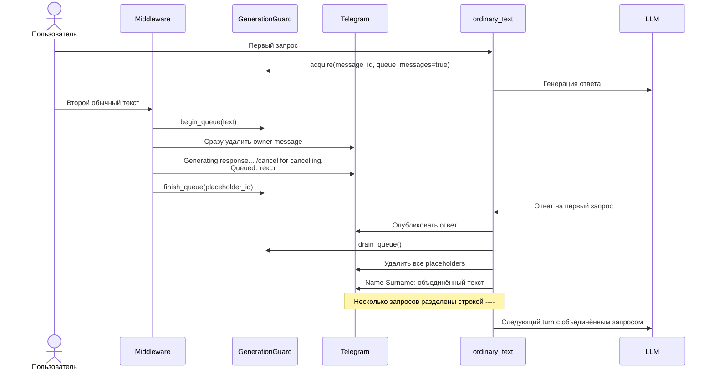
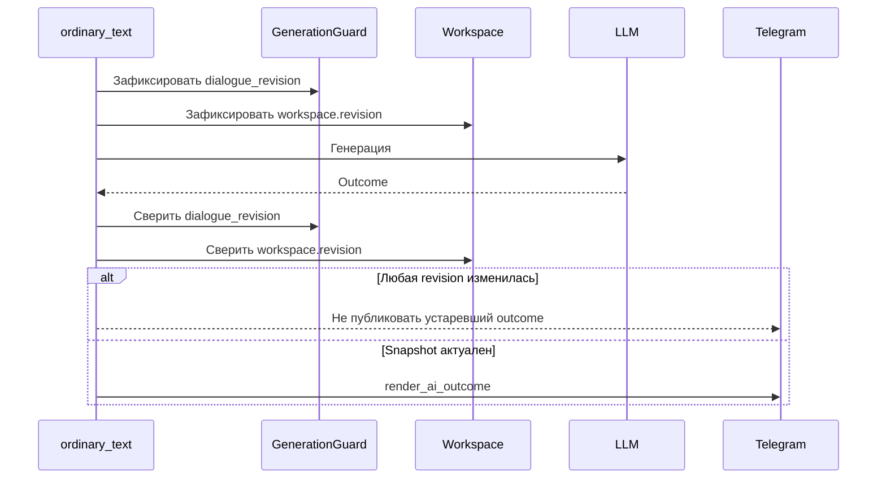
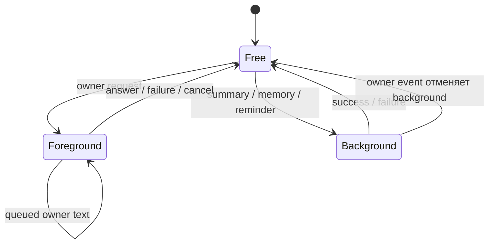

# Guard и очередь во время генерации

`GenerationGuard` выдаёт один lease на AI-работу. Foreground lease принадлежит исходному Telegram
`message_id`; background lease использует `BACKGROUND_SOURCE_ID`. `dialogue_revision` позволяет
отбросить результат уже отменённой работы.

## Новое сообщение во время foreground-ответа

Placeholder имеет `MessageKind.UI_INPUT` и не попадает в LLM-историю. Восстановленный текст
отправляется ботом с `MessageKind.DIALOGUE_USER`, поэтому в истории остаётся ровно один owner-side
turn. Заголовок — `User <отображаемое имя в Telegram>`, либо просто `User`.

Если генерация завершилась ошибкой, очередь всё равно материализуется и placeholders удаляются —
текст не теряется. `/cancel` отменяет текущий lease и также восстанавливает очередь.

## Проверка устаревшего результата

Summary дополнительно перечитывает каноническую историю перед публикацией и сравнивает snapshot.
Memory maintenance проверяет lease после каждого provider-вызова и перед записью.

## Foreground и background

Reminder получает background lease **до** чтения истории и вызова main advisor и держит его до
delivery/settle. Owner event инвалидирует lease: готовый позже результат не публикуется, due row не
продвигается и следующий tick повторяет Reminder уже с актуальной историей и planning context.
Summary и daily memory используют тот же lease вместо независимой одноразовой проверки `busy`.

Код: [_core.py](../../src/safwa/telegram/_core.py),
[dialogue.py](../../src/safwa/telegram/dialogue.py),
[_messaging.py](../../src/safwa/telegram/_messaging.py),
[continuity.py](../../src/safwa/continuity.py),
[scheduler.py](../../src/safwa/scheduler.py),
[escalation.py](../../src/safwa/telegram/escalation.py).
