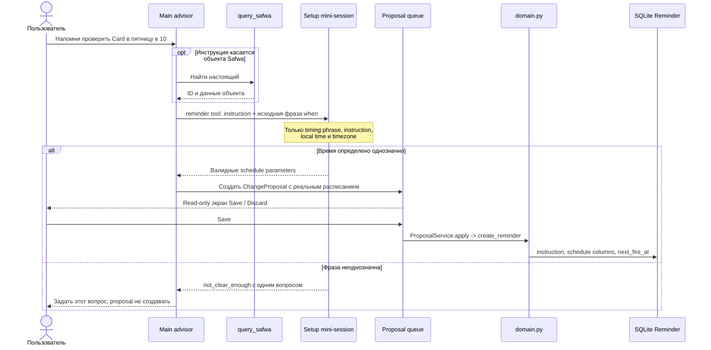
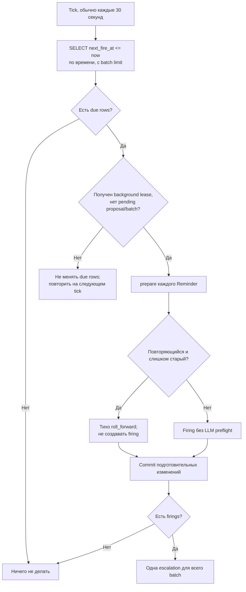

# Reminders

Reminder — это сохранённый пользователем триггер: самостоятельный текст-инструкция и вычислимое
расписание. Он не является автоматически рассчитанным «советом». Когда наступает время, инструкция
передаётся основному advisor как новый запрос.

## Создание и редактирование



Поддерживаемые формы расписания:

- один раз: `date + time` без interval/days;
- повтор по локальному wall clock: weekdays + time;
- интервал в минутах, при необходимости с датой/временем старта и quiet windows.

Дата всегда означает дату старта. В ручном `/reminders` UI можно смотреть список, менять только текст
и удалять Reminder. Создание и изменение расписания проходят через advisor proposal, потому что
свободный текст сначала должен быть разобран mini-session и проверен чистой арифметикой
`reminders.py`.

Собственный Reminder Safwa помечен `system`: его выводит `sync_diary_reminder` из Settings, он скрыт
из `/reminders` и из `ai_reminders`, а edit/delete в `domain.py` его отклоняют. Глобального mute нет —
единственная тишина это quiet windows у interval schedule.

## Один scheduler tick



Scheduler ничего не знает о Card/Check и не делает отдельный LLM preflight. Проверка упомянутых Safwa
items выполняется самим main advisor через `query_safwa` в том же turn, где он формирует ответ или
proposal.

## Доставка и гарантия повторной попытки

```mermaid
sequenceDiagram
    participant S as Scheduler
    participant G as GenerationGuard
    participant A as Main advisor
    participant TG as Telegram
    participant DB as SQLite

    S->>G: reserve_background() до чтения history
    alt Guard уже занят
        G-->>S: false
        Note over S,DB: next_fire_at не меняется; retry позже
    else Lease получен
        S->>A: handle(bounded dialogue + synthetic escalation turn)
        Note over A: Тот же context и те же границы.<br/>Для Safwa items сначала query_safwa
        alt Owner написал во время генерации
            G->>G: cancel background, revision++
            A-->>S: Результат отброшен
            Note over S,DB: Due rows остаются due
        else Outcome готов
            A->>TG: Answer как REMINDER или proposal как APPROVAL
            TG-->>S: Доставка успешна
            S->>DB: settle только доставленные firings
            alt One-shot
                DB->>DB: Удалить Reminder
            else Repeating
                DB->>DB: fire_count++, last_fired_at,<br/>roll_forward
            end
        end
        S->>G: release background lease
    end
```

Критический порядок: обычный `next_fire_at` продвигается только после успешной отправки escalation.
Сбой LLM, Telegram, перезапуск или вмешательство owner оставляют строку просроченной, и следующий tick
попробует снова. Для repeating Reminder новая дата считается от планового `due_at`, а не от момента
доставки. Исключение — слишком старые повторения: они заранее и молча прокручиваются вперёд, чтобы не
создавать шквал пропущенных уведомлений. One-shot не считается устаревшим и будет доставлен с указанием
опоздания.

Код: [reminders.py](../../src/safwa/reminders.py),
[reminder_sessions.py](../../src/safwa/ai/reminder_sessions.py),
[scheduler.py](../../src/safwa/scheduler.py),
[escalation.py](../../src/safwa/telegram/escalation.py),
[telegram/reminders.py](../../src/safwa/telegram/reminders.py).
