# Agent architecture

How the AI side of Safwa is put together: what a session is, how a turn runs, and what each
subsystem around it owns. Sections describe the code as it stands except the explicitly planned
Proposal lifecycle below, agreed 2026-09-13 for the follow-up after Wave 1.

The rules behind these mechanisms live in [CLAUDE.md](../CLAUDE.md); this file is the shape.

## The five packages

`src/` holds five. Four of them import no Safwa at all, so they can be taken to another project:

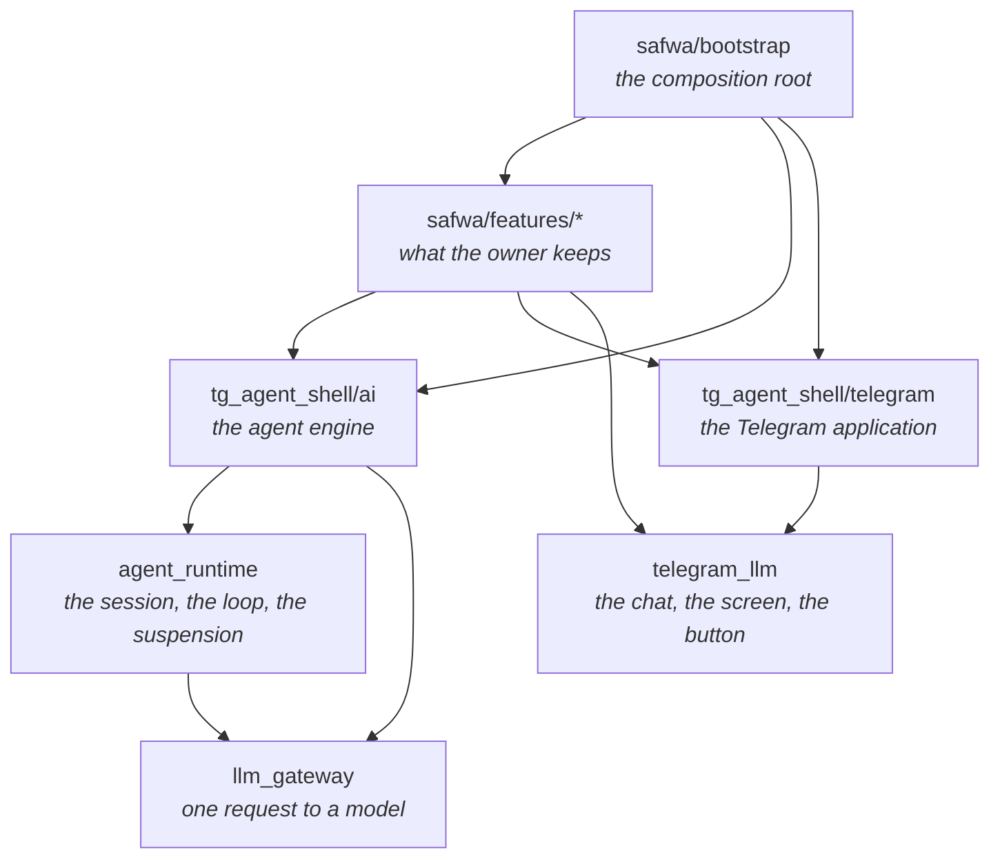

**An arrow down is "imports".** There is not one pointing back, and that is read:

| Rule | What it forbids |
|---|---|
| F | a module of the four upper packages importing `safwa` |
| M | a module of `tg_agent_shell/ai/` importing what is built on it |
| E | a feature module opening a door above its own layer |
| H | a module outside a feature fanning out over entity names |

- **`llm_gateway`** — reaching a model has no state, so the contract is tiny: one completion call,
  neutral messages, an unparsed `arguments_json`, and an adapter holding the SDK, the URL and the key.
- **`agent_runtime`** — the session that can stop on a person and be continued. It knows neither
  what a tool does nor what a proposal is: a suspension hands out an opaque `InteractionRef`, and
  the resume comes back carrying it.
- **`telegram_llm`** — the chat between the bot and the person: every outgoing message sent
  registered and marked, a button used once, a screen replaced or taken down. What each kind means
  the host says once, in a `ChatVocabulary`.
- **`tg_agent_shell`** — `ai/` the engine, `proposals/` the review flow, `telegram/` the
  application, `turn/` the single foreground lease, `cues/`, `hooks/` and `foundation/`; at its root
  `registry.py` derives an application's wiring, `recovery.py` reconciles a restart, and
  `session.py`, `history.py` and `asr.py` are the root session, the chat window and the voice.
- **`safwa/features/*`** — `MODULES` lists seventeen: sixteen Safwa features, each with its rules in
  `tests/brd/`, and the shell's own `proposals`. `advisor` is the seventeenth feature package and is
  in no registry — it is the root session's prompt and the views it is told it may read, wired
  directly by the composition root.

## Assembly

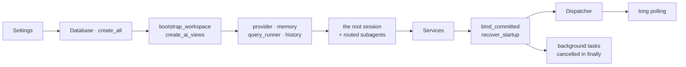

All of it is [bootstrap/main.py](../src/safwa/bootstrap/main.py). Which features exist,
[bootstrap/modules.py](../src/safwa/bootstrap/modules.py) knows — and nobody else. Everything
that *follows* from that list is [registry.py](../src/tg_agent_shell/registry.py), which is the
shell's: `Registry.of(MODULES, world=…, hooks=HOOKS)` derives the view catalogue and its allowlist, the screens,
the commands, the callbacks, the text inputs, the proposal capabilities, the subagent roster, the
hooks and the background tasks, refusing each collision where it happens.

`HOOKS` is the explicit list of automatic reactions, independent of the features themselves.
A hook whose effect reaches the agent — `OfferTool`, `RefuseTool` or `Advise`, its
`agent_related` — is the owner's to turn off in the Profile, and `HookRegistry` asks the
application's policy — `hook_switched_on`, read live — before running its condition or wording
its request; a hook that runs work of its own, `Run`, is always on, and so is a check on the
model's own work, `ReturnProposals` or `HoldAnswer`, which Safwa registers or leaves out by
`featuretoggles.py`. The tool adapter emits `BeforeTool` before a call and `AfterTool` after it;
the materializer emits `BeforeProposals` before a subagent response's calls are prepared and
`AfterRequest` before the answer to the owner's message; the dialogue adapter emits `AfterTurn`
after releasing the owner's turn.
A `Run` after a turn uses one background lease and a publication port that checks currentness;
a `Run` on a tick or on a commit has the session factory and no chat, and says anything it has
to say through a recorded fact and an Advise hook. Summary retains its own window threshold and
history comparison; its manual command calls the same writer directly. The whole of it, batch by
batch, is [HOOK_ARCH.md](HOOK_ARCH.md).

## What an application gives the shell

The shell runs an application it knows nothing about. This is the whole of what it asks for, and
[examples/wallet/app.py](../examples/wallet/app.py) is the second answer to it — a ledger of
wallets and entries, with none of Safwa's nouns in it.

| What the shell asks for | The type that carries it | Safwa's answer |
|---|---|---|
| which features exist | `tuple[FeatureModule, ...]` handed to `Registry.of` | `MODULES` |
| what a proposal is made against | `WorldReader` → `World(revision, timezone)` | the `workspace` row |
| the database | its own `Base`, plus `upgrade_database(url, Base.metadata)` | `safwa/foundation/models.py` |
| durable notes | `Memory` — one `sync()` returning something with `.text` | `MemoryReader`, over `memory_observation` and the last analysed Sprint |
| the state a session reads first | `(session) -> StateBlocks(state, clock)` | `workspace_context` |
| the chat, and where its window ends | `TelegramHistorySource` with `MARKS` and a `WindowEdge` | `SummaryEdge` |
| what the model is told it is | one system prompt, with `Registry.routes` filling the routes in | `SYSTEM_PROMPT` |
| the container every handler reads | `Services`, filled from the registry | `bootstrap/main.py` |
| the home screen | exactly one `ScreenCommand` with `nav=HOME_NAV` | the `home` feature |
| a restart | `recover_startup(session, registry.recovery)` | called once the hooks are bound, before polling starts, so what recovery ends is handed on |
| a shutdown | cancel the background tasks, close the history, the provider and the bot | the polling `finally` |

Everything else is the application's own: the persona, the provider, the product dependencies,
and the startup itself — Safwa's carries ASR, Telethon and OpenRouter headers, and the example's
carries none of them, which is why the shell holds no `run()` of its own.

**A second application declares its tables on a `Base` of its own**, and `upgrade_database` takes
that metadata beside the shell's. Two applications in one process then create their own tables and
never each other's; `tests/shell/` runs the example with `safwa` unimportable and counts what a
fresh database gets.

## The map

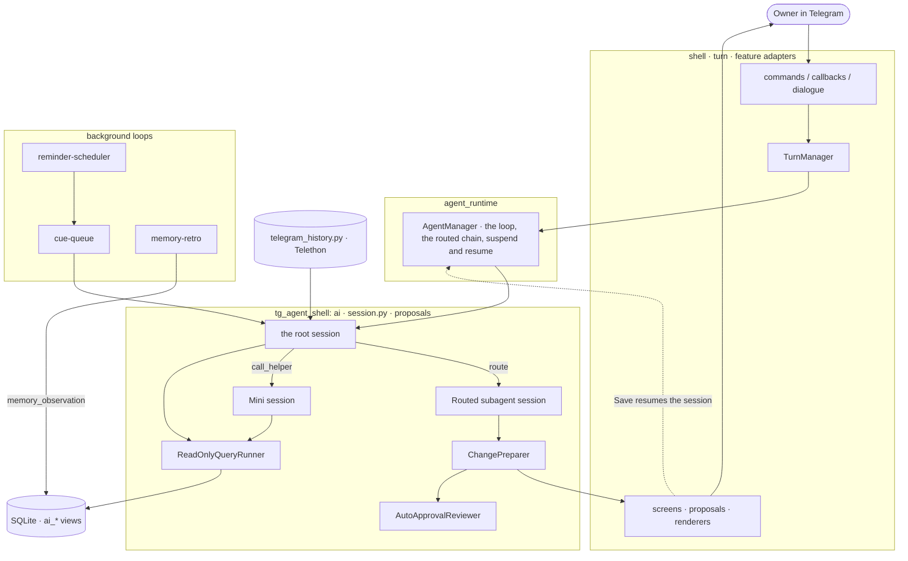

Only the Advisor writes to the chat. Everything else either hands it words or opens a screen,
and words come back either to be retold or to be printed as they are: a subagent declared
`shown_as_is` hands its final words over as a block of the Advisor's own message.

## A session is the unit

Every agent run — the Advisor, a routed subagent — is an `AgentSession` backed by one `agent_runs`
row. The row is what survives a suspension:

| field | what it carries |
|---|---|
| `kind` | `advisor`, or the subagent's name |
| `parent_run_id` | who routed here; null for the Advisor |
| `state_json` | dialogue, transcript, tool count, repair rounds, receipts, the blocks shown as is, `host_state`, `offered_helpers`, `interaction_token` |
| `claimed_at` | the atomic claim that stops two resumes of one session |
| `status` | `running`, `awaiting_approval`, `interrupted`, `completed`, `failed`, `abandoned` |

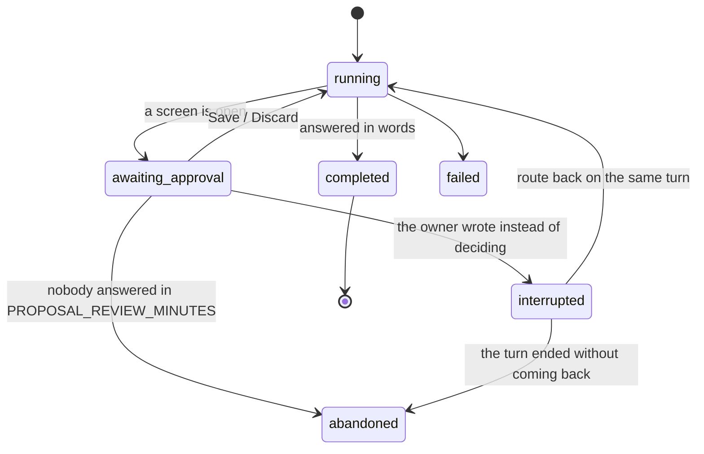

`AgentSession.restore` rebuilds a suspended run from its own row. The context prefix is **not**
restored — it is rebuilt from live state, so the workspace and the clock are current while the session's
own steps come only from its record.

Four things happen to a session that stops on a person, and `AgentManager` owns all four:

| | |
|---|---|
| suspend | checkpoint the session and hand back an `InteractionRef` — its run id and a minted token |
| `resume(ref, value)` | claim by that reference, answer the calls it stopped on, run it on, hand its receipt up the chain |
| `interrupt(ref, results, summary)` | leave it unfinished with those results and the note that the owner wrote instead of deciding |
| `close(ref, results)` | answer the calls it stopped on and end it with every caller above it: nobody answered, and nothing comes back to it |

The reference is opaque: the runtime never learns what the person was shown, and Safwa keeps the
mapping — the approval batch carries the token, so a Save resolves the screen and names the session
in one step. The token is minted at the checkpoint and cleared when it is taken, which is what makes
one answer to one screen resume exactly one turn.

A session runs until it answers in words. A turn that stops with nothing is told so and asked again,
bounded by the repair rounds. A session with no parent is the one that guarantees the owner sees
something: the receipts, or one `⚠️` line.

## One Advisor turn

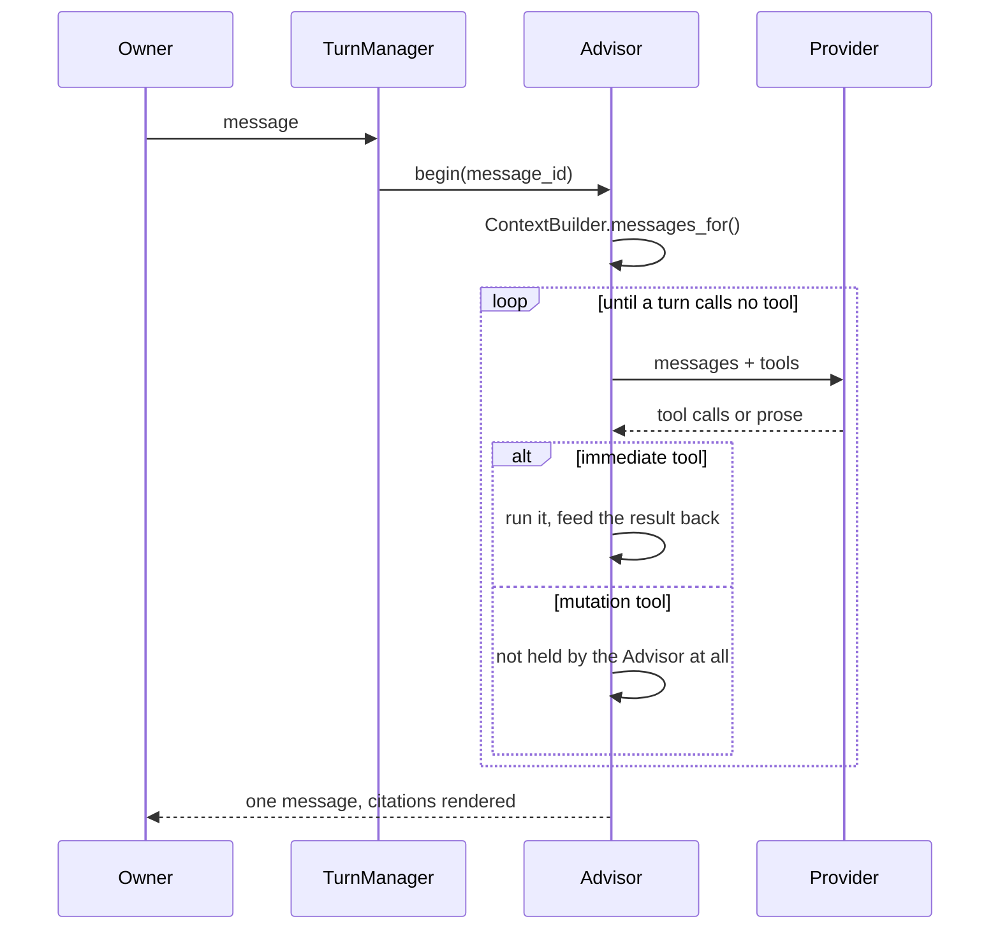

`IMMEDIATE_TOOLS` are `query_data`, `route`, `open` and `call_helper` — the tools `ToolAdapters`
answers itself, and they run inside the turn. `query_data` is published to every session it runs
that has a view to read, the Advisor's and a subagent's alike, so a feature declares only its own
readers; a subagent that declares no view is not handed it.
The Advisor holds no mutation tool: every write is a proposal authored by a subagent.

An immediate tool and mutation tools must not arrive in one provider response; the runtime rejects
the mutations and the model retries them once it has seen the read.

A name that is not on the session's own tool list is refused before any dispatch, so the tools sent
to the model are exactly the tools it can reach: the Advisor cannot prepare a change and a subagent
cannot `route`. Every call is charged to `MAX_TOOL_CALLS`, a refused one included — a session that
only ever sends malformed responses is stopped by the budget rather than running on.

A feature may watch what the model calls: `before_tool` is given the call and refuses it by
answering with a result, `after_tool` is given the call and what it produced. `route` reaches
neither, because the runtime answers it before the adapters are reached. A watcher that raises
ends the turn as `WatcherFailed`, which names it and the call. No feature declares one yet
(`AG-TOOL-031`, `AG-TOOL-032`).

## Context, and why its order is fixed

`ContextBuilder` builds the request in order of how often each block changes, so a remote provider
can cache the stable prefix:

```text
messages[0]  system   SYSTEM_PROMPT                  ← cache breakpoint
messages[1]  user     [System]: memory + workspace state
   …         user/assistant   the dialogue window
messages[-1] user     [System]: the clock            ← volatile, always last
```

Only `messages[0]` is a system message. Every other context block goes through `system_note`, which
sends it as a user message prefixed `[System]: ` — the Qwen3.5 chat template raises on a second
system message.

**New volatile context goes after the dialogue, never into a system block.** One timestamp in
`messages[0]` costs every cache hit and scatters OpenRouter's sticky provider routing.
`tests/snapshots/prompt_prefix.json` is what notices if it moves.

A routed subagent's context is the same order under its own prompt: prompt → workspace state →
`<Conversation>` → this turn's receipts → clock.

## `route` — one turn handed to a subagent

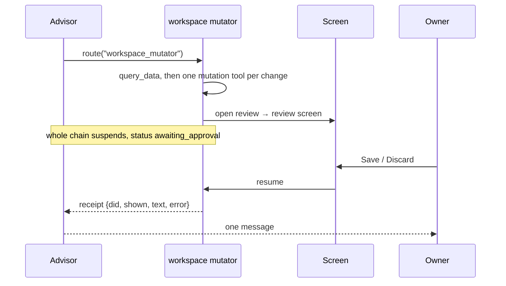

- A subagent reads the conversation as **data**: the newest messages come as one `<Conversation>`
  block, one tag per author, so nothing it did not write reaches it in the `assistant` slot. How
  many is the subagent's own declaration, `AgentSpec.history_messages`, and
  `SUBAGENT_HISTORY_LAST_MESSAGES = 10` unless it says otherwise.
- A routed session must open with a tool call — only its first turn, because the loop ends on a turn
  that calls none — unless it is declared `shown_as_is`: its words are the work.
- A subagent declared `shown_as_is` hands its final words back as `shown`, not as `text`: they
  are not split into receipt lines, not handed to the next subagent as work already saved, kept in
  the session's state across a screen, and printed first in the Advisor's message, whole, above
  the receipts and the Advisor's own words. `text` is then a fixed line telling the Advisor they
  were shown and not to repeat them.
- A routed subagent has no `route`, so there is no recursion.
- A request naming two domains is two routes and one message.
- `SUBAGENT_DEADLINE_SECONDS = 300` bounds a subagent by the clock, not by a call count, because it
  blocks the Advisor's turn. It bounds every active stretch, the one after a Save included; the
  owner's own time deciding is outside it. A subagent the clock stops hands its caller an error
  receipt, so the turn still answers.

**Current behavior, to be replaced by the planned Proposal lifecycle:** words typed over a screen
resume the turn that opened it. Every pending proposal in that batch is
discarded, the screen is frozen into an account of what the request did, and only then is anything
generated: the Advisor's pending `route` is answered with what was proposed, what was refused, what
was already saved, and the owner's words.

The subagent is left `interrupted` — unfinished rather than waiting — so a `route` back on that same
turn resumes it holding its own plan, and a correction reaches the session that wrote the refused
proposal. Its transcript carries one line saying the owner refused *and wrote instead*; on
"rejected" alone it would propose the same thing again. The turn that routed there is the outer
bound: when it answers or fails, `_close_unfinished_children` ends what it left behind.

A review nobody answers ends the chain the other way. After `PROPOSAL_REVIEW_MINUTES` on
screen, `AgentManager.close` answers the subagent's calls as `expired` and records it and the
Advisor that routed there `abandoned`: nothing is regenerated, and the owner's next words are a
new request rather than a correction to this one (`PR-EXPIRE-029`).

The routing rules in `SYSTEM_PROMPT` are generated from the roster, so a subagent is routed to
exactly when its `AgentSpec` is in `MODULES`; its `purpose` **is** the prompt line.

## `call_helper` — one turn that reads and answers with rows

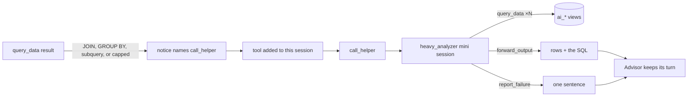

- Nothing about helpers is in `SYSTEM_PROMPT`. **The read that needed one is what offers it**, and
  the tool is added to that session's tools there and then (`offered_helpers`, which survives a
  suspension).
- Which read needs one is the feature's own hook: `complex_read` reads the call before it
  runs, using `is_complex_read` and `OFFER`. `RefuseTool` does not run the read: the notice is
  the whole result, and the named helper is granted. The grant names the helper, so `call_helper`
  runs only a helper this session was offered, and it belongs to that session alone. `HelperSpec`
  holds the helper's capability independently of the offer.
- A read that *failed* offers nothing, whatever the helper would have said: its `hint` already
  says to repair that one SELECT, and that half stays the engine's.
- `heavy_analyzer` is a **mini session** (`ai/mini.py`), not a routed subagent: read tools plus two
  terminal tools, prose is never accepted, and it is in no routing rule and no base tool set.
- It never speaks. The answer is the last read itself — fifty rows cannot be retold, and a small
  model retelling numbers is where numbers get invented.
- `HEAVY_ANALYZER_MAX_TOOL_CALLS = 10` bounds it. It blocks the Advisor exactly as `route` does, and
  `/cancel` cancels the turn and the helper with it.
- A helper that breaks returns an error, not an exception: losing the turn would be worse than the
  answer the Advisor can still give from what it read itself.

| | `route` | `call_helper` |
|---|---|---|
| what it does | hands the turn to a subagent that **writes** | asks one that only **reads** |
| a screen | it may open one | it cannot |
| the caller's turn | suspends | stays with the caller |
| in the tool set | by the roster | only where a read offered it |

## Proposals — the only way anything is written

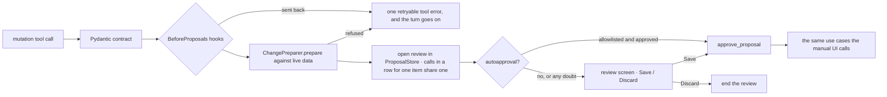

- The model never mutates and never writes mutation SQL.
- **Checks on the model's own work are hooks on two boundaries `ProposalMaterializer`
  raises**, the seam where a `None` already means "run the session again". `BeforeProposals`
  is read once per subagent response, before any of its calls is prepared — preparing a
  Reminder already asks the model — and a `ReturnProposals` hook sends every call back with
  its code (`AG-HOOK-046`). `AfterRequest` is read once per request started by the owner's
  message, before its answer in words is sent, and a `HoldAnswer` hook holds that answer and
  hands its words to the Advisor (`AG-HOOK-047`); one that fails lets the answer through.
  Neither kind is on the Profile: the application registers it or leaves it out, and Safwa
  decides that in `featuretoggles.py`.
- **A response that carries mutation calls carries the subagent's plan as its text**
  (`PR-PLAN-028`): what it will change, in order. `PLAN_HOOK` sends a response with no text
  back as `plan_required`. The text is the model's working record: it stays in the session's
  transcript, so a session picked up after a decision still reads what it meant to do, and it
  never reaches the chat.
- **The answer to the owner's message is read for what was asked and nothing did**
  (`AG-DONE-045`): `REQUEST_REVIEW_HOOK`, one mini session over the conversation, each change the
  request made and the answer. A missing change can be judged only there: before it, the model
  may not have made it yet.
- **Every mutation tool belongs to a subagent**, never to the Advisor. `workspace` owns the workspace,
  `diary` owns the Diary. Preparation runs where the change was authored.
- **Every proposal screen is exactly Save/Discard.** A screen that needs a field control is the
  wrong screen.
- **Autoapproval is the one exception to `PR-WRITE-002`, and `PR-AUTO-024` is where it is
  approved.** It decides only whether a screen is shown: it never bypasses preparation or the
  stored proposal, and any doubt leaves the pending screen untouched. A Save it asked for that is
  refused because the workspace moved on ends the review with it, and the queue moves on the way a
  failed manual Save moves it. Which actions are eligible is each feature's
  `ProposalContribution.autoapprovals`; a create is never one of them. A review holding several
  changes to one item is read in one call, and only when every change is eligible.
- **`PR-TARGET-001` is a shell rule the feature keeps.** The generic walk carries no entity, so
  loading the target, `archived_at` and the closed repeat are the owning feature's
  `ProposalHandler.prepare`, and `target_not_found` is the one refusal `proposals/` raises itself.
- `approve_proposal` is where one Save ends, the manual one and the automatic one alike: it checks
  `workspace.revision` before any handler runs, commits the write itself, and takes the review off
  the screen only once that commit stands. `StaleStateError` is the expected failure, and it is the
  one that ends the review instead — the screen is unanswerable rather than retryable.
- Several mutation calls in one turn queue as screens in the order they were made, and calls in a
  row for one existing item share one (`PR-QUEUE-005`): each is prepared on its own, so its receipt
  stays its own, and `approve_proposal` hands each later change of the item the version the one
  before it left in the same transaction. A presenter's `screen` gets every change of its review.
  The model resumes only after the last screen resolves, each result handed back as a tool result.
- A review and its approval batch are process state, not rows: `ProposalStore` holds both, they
  carry no status, and a batch is over when no screen is still waiting. Nothing
  survives a restart, so startup only clears what pointed at a review — the buttons, and the
  `related_id` of the screens in the chat. Review ids only ever go up, so a screen that still names
  one cannot reach a later review.
- **A review nobody answers is closed by the system** (`PR-EXPIRE-029`). A proposal carries
  `shown_at` from the moment its screen is drawn — a queued one has none — and the Cue poll closes
  the one that has stood `PROPOSAL_REVIEW_MINUTES = 30`: its pending proposals are recorded
  `expired`, never `discarded`, so neither the owner nor the model reads a rejection into it; what
  the request had saved stays saved; the screen is frozen into an account that the system closed
  the request; and the session chain is `abandoned` through `AgentManager.close`, so nothing is
  resumed. It takes the background lease the way a Cue does, so it never runs inside the owner's
  turn, and a Save that lands after it finds the review gone.
- Anything the model must know across an approval belongs in a **tool result**, not in a receipt.

## Cues — what Safwa is given to say when nobody asked

Only the Advisor writes to the chat, so anything the system wants said reaches the owner as one
ordinary Advisor turn. A **Cue** is the finished request for that turn: whoever had the facts wrote
them down, so the Advisor relays rather than goes looking.

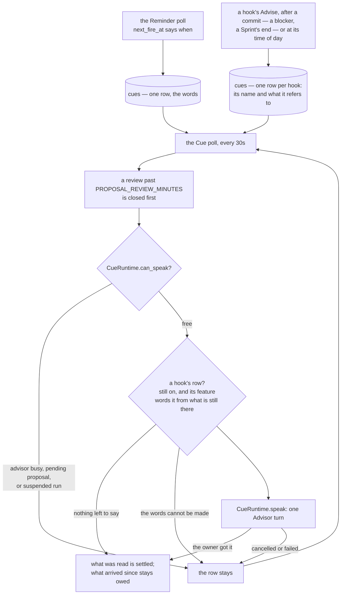

**The `cues` row is the only record of "Safwa still owes the owner these words."** A Reminder's
row is written inside the poll's own transaction, a hook's right after the commit that fired it,
and either is deleted only once the turn landed, so a crash, a shut gate or an owner who
interrupts mid-turn all lose nothing: the row is still there, and the next poll says it again.

`CueRuntime` is the whole delivery mechanism, and there is one of it:

- **The gate** refuses while `turn.active`, while `ProposalStore.busy` — any open review or any
  suspended approval batch — and while any session holds `claimed_at`. An open proposal is an
  unanswered question, and raising a second one on top of it turns the chat into a stack of screens.
  Each tick closes the review that ran out of time before it reads the gate, so the Reminder that
  waited behind that screen is said on the same tick the screen is closed.
- **The lease** is `turn.try_begin_background()`. `still_current` compares `dialogue_revision`
  before and after the turn, so an owner who speaks mid-turn wins and the half-written answer is
  discarded.
- The answer is posted with `MessageKind.CUE`: it stays in dialogue, marked as something Safwa
  volunteered rather than a reply to a message that is not there.
- Everything waiting when the gate opens is said in one turn, as one request, oldest first. A
  Cue row is written once and never edited: the poll stamps the rows the turn says with the
  turn's id (`stamp`) before it starts, the message is registered under that id, and exactly
  those rows are deleted once it landed (`settle`). A turn registered in the chat but not
  settled when the process stopped is settled by the next poll without a word
  (`CueRuntime.delivered`); one whose message never landed loses its stamp and waits again.
- A hook's Cue carries no words. `hook` and `payload` name the hook and what it refers to, one
  row per finding, and `HookRegistry.prepare` asks that hook's feature for the words of all its
  rows at once, each item once, once the gate is open — after checking the switch is still on,
  and never while the chat is busy. Words that cannot be made leave the rows for the next poll.
  A feature may answer with a `Shown` instead: its block opens the answer as it is, before the
  Advisor's words and in the order the requests are said, and the Advisor reads the request
  with `BLOCK_SHOWN` after it (AG-HOOK-048).
  A row written while the turn ran carries no stamp and is the next request. Switching the hook
  off in the Profile drops its rows (`drop_hook_cue`), and switching it on drops whatever a late
  hand-on wrote while it was off.
- The Cue reaches the Advisor as an ordinary request from the system, answered the way the owner's
  own would be. A fired Reminder is the one that names items: the prompt tells the Advisor to read
  their current state with `query_data` before repeating an instruction that may no longer apply.

### Reminders — the poll is the alarm clock and nothing else

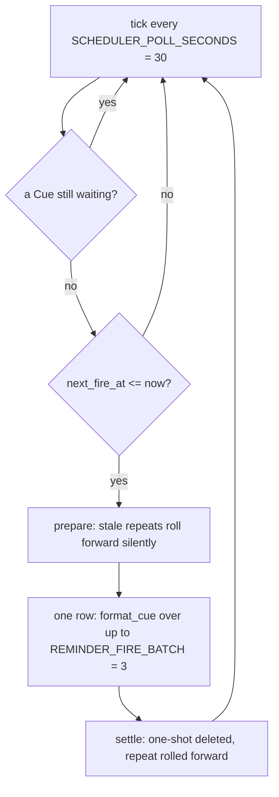

There is no scheduling library and no in-memory timer. `Reminder.next_fire_at` says **when**, and
nothing more: the tick writes the words down and moves the row on in the **same transaction**. It
holds no gate, takes no lease and runs no Advisor turn — what guarantees the owner gets the words is
the Cue row, exactly as for anything else Safwa says first.

- **One thing waits to be said at a time.** A tick that finds a Cue still waiting writes nothing, and
  the Reminders it would have carried stay due for a later tick. That is what stops an hour of a busy
  owner turning into twelve messages the moment they are free.
- `is_stale`: a *repeating* Reminder more than `REMINDER_CATCHUP_GRACE_MINUTES = 120` overdue rolls
  forward silently, so a weekend offline does not produce 32 messages. A one-shot is never stale: it
  always fires, however late, and the Cue says how late.
- A repeat advances from its **scheduled** moment, not from the tick that took it, so a late check
  does not push every later fire late with it.
- Reminders are deterministic first — the poll only does schedule arithmetic, and the Advisor
  composes the message.

### A committed change, or a time of day, writes a hook's Cue

An operation that makes a change a hook follows up on — an Action becoming blocked or entering
Today, a Check answered Missed, a Sprint starting — records it with `record_change` beside its
own transaction (`foundation/changes.py`), and commits nothing itself. The one `after_commit` listener in `cues/initiatives.py` hands the session's `Committed`
facts to `HookRegistry.evaluate`, and each Advise result is written down as a row of that hook
with `add_hook_cue`; a rollback leaves nothing to hand on. The listener is bound to the session
factory by `bind_committed`, so a proposal's Save and a screen's save — the same operation — reach
the hook by the same path, and a proposal the owner discards never calls it. A Run on a commit —
the key Actions classifier, `KeyActions` off `Services.features` — is done once that commit's
facts are handed on, outside the order they are kept in, so the next commit never waits for a
model call.

A hook that runs daily declares `OnTick(at=...)` with a reader of the local time of day
(`TickTime`) — Safwa's are the Profile's Morning time, Diary time and Summary time, and the local
midnight that ends a Sprint. The one tick
poll (`TickPoll`, beside the Cue poll) reads each distinct reader once at every look, keeps its
last look in process memory and hands a `Tick` on by the same `hand_on` for each time that
has passed since — once, however many polls, never for a time that passed while Safwa was down
or the hook was off, and a moved time counts from the next time it passes. Hooks that name the
same reader share its `Tick`. Such a hook's `evaluate` returns one constant marker; the reading
is its `prepare`, at delivery. A daily hook's request not said by the local midnight after its
time is dropped at the next look (`forget_before`): the day it was about is over. A Run's work
that failed is kept and tried again at every later look until it is done — a Sprint's midnight
end is not optional the way a request is — while a Run on a commit gets one attempt.

### A Sprint's end is a fact, and its summary is a hook's words

`finish_sprint` — by hand, or by the Sprint expiry hook at the local midnight after the planned
last day, a `Run` on a tick whose missed midnight `recover_startup` makes up for — records
`sprint.ended` beside its transaction and says nothing itself. The Sprint summary hook keeps
that as its one pending row, and at delivery `sprint_summary` writes six lines from the Sprint's
own record — which Sprint and when, how it ended, its Success criteria, the five effort figures,
how the Actions ended up, the titles of what is still open. Nothing dresses it as a Reminder that
went off: the words are the Sprint's own. Safwa is told how the Sprint went so it does not go
reading tables to find out, and ends its message with `[Sprint retro](retro:12)`.

## History — Telegram is the store, not SQLite

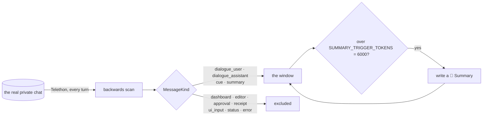

- `history.py` re-reads the real chat on every advisor turn.
  `telegram_messages` stores event metadata, never persona text.
- **Every bot message is sent registered and marked** with a `MessageKind`. An unregistered or
  unmarked message is invisible to the LLM; a wrongly-kinded one leaks UI noise into persona history.
- The window is a **token budget**, not a message count. There is no one budget split between the
  blocks: the dialogue is worth `SUMMARY_TRIGGER_TOKENS = 6000`, which is also what says when a
  Summary is written, and a Summary is asked to stay under `SUMMARY_TOKEN_CEILING = 2000`; memory
  is bounded by its own ceilings, `MEMORY_PATTERNS_MAX` patterns of at most `ITEM_CHARS` each.
  The newest Summary is the far edge of the window,
  and up to `EDGE_CONTEXT_MESSAGE_LIMIT = 20` of the messages just before it come along with it.
- The window itself is [`telegram_llm/window.py`](../src/telegram_llm/window.py) and knows nothing
  of Summaries; which message ends it is answered on every read by
  [`features/summary/window.py`](../src/safwa/features/summary/window.py), and what each
  `MessageKind` means is said once in `history.py`.
- Owner text still in the chat **is** dialogue: commands and typed field values are deleted, so
  survival is the evidence.
- Words that never reached the chat as owner text — a voice transcript — are posted back as a bot
  message of the owner's kind, or the Advisor never sees them.
- A receipt line is replayed as a **tool result** rather than as words Safwa said
  (`RECEIPT_MEANINGS`, beside the decision it reports),
  so `✅ Saved` reads as `applied` rather than as something the persona claimed. A block shown as
  is reads back as Safwa's own words, because it is part of her message.

## Memory

Memory is what the retro analysis of each Sprint left, and only its poll writes it: patterns —
what the Sprints observed of one thing, one `memory_observation` row per Sprint and claim,
counted by the Sprints on either side and left out of the reading when no Sprint confirms it —
and the last analysed Sprint whole. What the Advisor is given before every answer, and what
`/memory` shows, is selected at that moment from the observations of the Sprints taken in and
the last analysed Sprint's row (`MemoryReader`). How a Sprint is taken in, why its own rows are
the only ones it replaces, and why the poll over `Sprint.memory_at` is the whole of its
reliability, is the second half of
[SPRINT_ANALYSE_TO_RETRO_AND_MEM.md](SPRINT_ANALYSE_TO_RETRO_AND_MEM.md).

## Views and prompts

```mermaid
flowchart LR
    F1[cards/views.py] --> CAT
    F2[checks/views.py] --> CAT
    F3[...] --> CAT[SqlView declarations]
    CAT -->|dropped and rebuilt every startup| DB[(ai_* views)]
    CAT --> ALLOW[ALLOWED_VIEWS]
    CAT --> DOC["view_catalogue(views, names)"]
    DOC -->|{views}| P1["SYSTEM_PROMPT · ADVISOR_VIEWS"]
    DOC --> P2["workspace prompt · AgentSpec.views"]
    DOC --> P3["heavy_analyzer prompt · HelperSpec.views"]
```

- The views are dropped and rebuilt on **every startup**. Change a view's shape in the owning
  feature's `views.py`, never with a migration.
- A `SqlView` carries its own `doc`, so the block a model reads about a view lives beside the SELECT.
- **A reader declares its views once, and that list both describes and scopes it**: it fills the
  `{views}` block in the prompt and narrows that reader's own `query_data`, so a view no list names
  is refused rather than merely unmentioned. The Diary writes its block by hand, with columns
  trimmed on purpose, and still declares the four it may read.
- `view_catalogue` refuses a name no feature publishes and a view with no `doc`. A helper that
  declares no views, or a prompt with `{views}` and nothing to fill it, is a wiring error rather
  than a reader of everything; a subagent that declares none reads nothing and has no
  `query_data`.

`query_data` is triple-guarded: regex validation of one `SELECT`/`WITH … SELECT` over the `ai_*`
views, a separate read-only connection with an authorizer allowlist, and result caps
(`DEFAULT_ROW_LIMIT = 50`, `DEFAULT_CHAR_BUDGET = 12000`, `QUERY_TIMEOUT_SECONDS = 2`). The caps
exist because a local model pays for what it reads.

A saved Request shares the validation and nothing else: it runs on the ordinary session, and no cap
applies, because its result is always a list in the interface and never enters the model's history.

## Citations

The model writes `[Go to the market](card:12)`. The host resolves it: `render_citations` looks the id
up, builds a `t.me` deep link from the **validated** id, and names the item itself. An item that is
gone keeps its words and loses its link; a target that is not an id leaves the chat as plain words.

Types: `card`, `check`, `tag`, `value`, `request`, `diary`, `retro`.

**One catalogue answers both questions.** `ScreenCatalogue.types` is what may be cited *and* the
whole enum of the `open` tool, so a feature that publishes a screen is offered by name and a type
nothing publishes is refused rather than answered with an empty screen (`SC-OPEN-006`,
`RT-OPEN-002`).

When the decision is the owner's, the model **cites** the item in its own prose instead of proposing
one.

## Concurrency

`TurnManager` is the single foreground/background lease, and the only writer of `TurnState`.

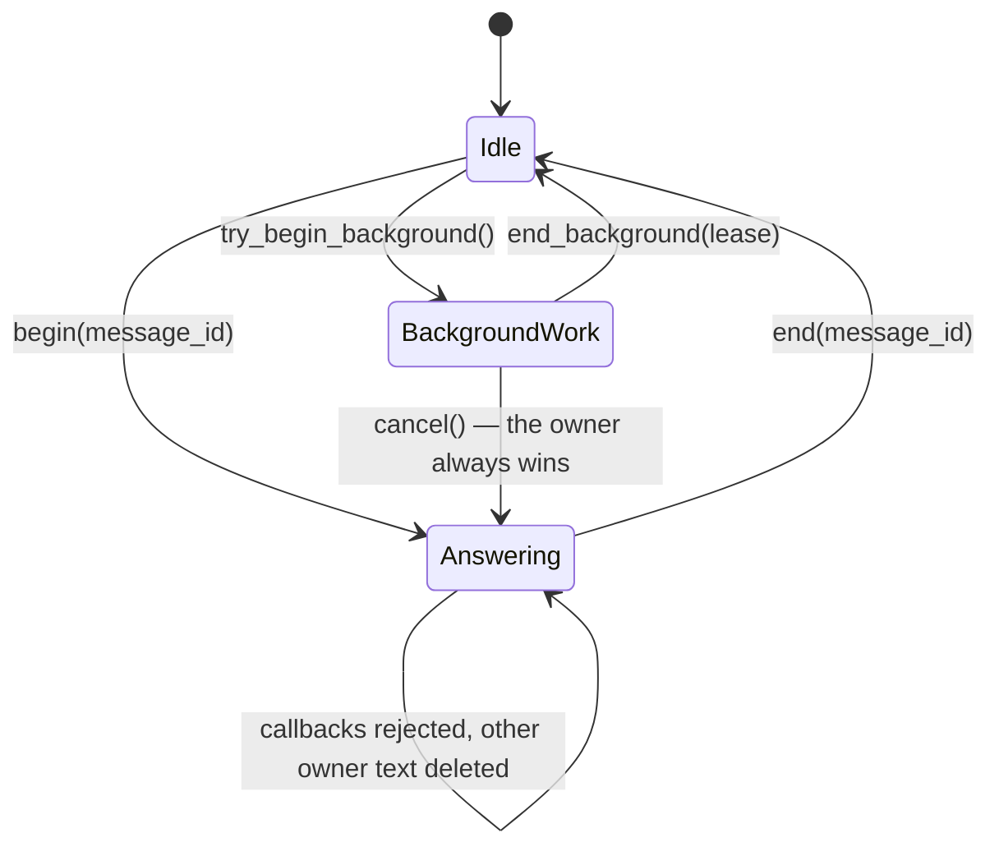

- While an answer runs, callbacks are rejected and any other owner message is taken out of the chat,
  which is what makes it not something the owner said.
- `cancel()` stops the task holding the lease and bumps `dialogue_revision`: the work ends where it
  stands, and anything that still comes back against the old revision is discarded. Only
  `dialogue_revision` invalidates an in-flight answer — the answer's own autoapproved change moves
  `workspace.revision`, which is a different question.
- A lease is named by the revision it was taken at, so work that is cancelled and finishes
  afterwards gives back its own lease and never the one handed to whatever started next.
- Background work verifies the revision before publishing or committing, and a turn that lost the
  chat ends the review it had already opened rather than leaving it with no screen.
- `OwnerAndWritingMiddleware` drops anything that is not the owner in a private chat.
- **An action button is a single-use `CallbackToken` row**, sent as `cb:<token>` and cleared at the
  next start: it names an item and changes something, so it is spent when it is pressed and dead
  after a restart. **Navigation is not a token.** A `nav:<screen>` button carries the name of a
  screen the registry knows, changes nothing and names no item, so it is drawn again however often
  it is pressed and works on a menu older than the run answering it (`SC-BUTTON-003`).

## Background loops

| task | interval | owner |
|---|---|---|
| `cue-queue` | `SCHEDULER_POLL_SECONDS = 30` | `cues/background.py` |
| `hook-ticks` | `SCHEDULER_POLL_SECONDS = 30` | `cues/initiatives.py` |
| `reminder-scheduler` | `SCHEDULER_POLL_SECONDS = 30` | `features/reminders/background.py` |
| `memory-retro` | `MEMORY_RETRO_INTERVAL_SECONDS = 60` | `features/memory/background.py` |

Each is a `BackgroundTask`. All but the Cue poll and the hook tick poll are declared in a
feature's `module.py`; those two belong to no feature, so the registry puts them in front of
theirs. The composition
root starts them and cancels them in the polling `finally`. A feature that needs its own objects takes them off
`services`, the container the whole application already shares.

## Recovery

[`recover_startup`](../src/tg_agent_shell/recovery.py) reconciles interrupted work on every
boot: each feature contributes a `recover` callable through its `FeatureModule`, and everything
after those hooks is the shell's own — the run rows, the buttons and the screens it wrote.

**A restart ends every session.** One left `running` and one left `awaiting_approval` are both
recorded `abandoned`, and their claims are released. Nothing picks either up: a screen is process
state and died with the process, and an unfinished session is only ever adopted by the turn that
routed to it, which died with it. What startup clears is what still pointed at a review — the
buttons, and the `related_id` of the screens in the chat.
