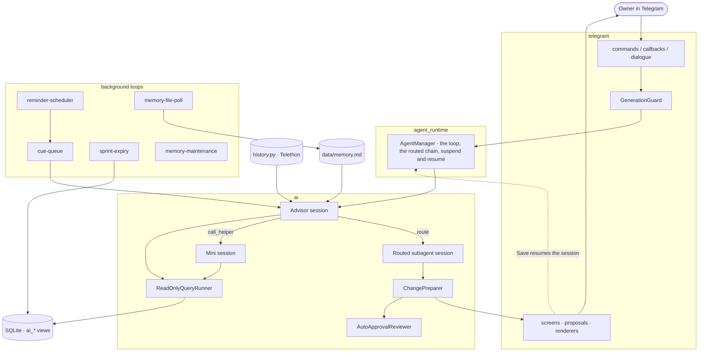
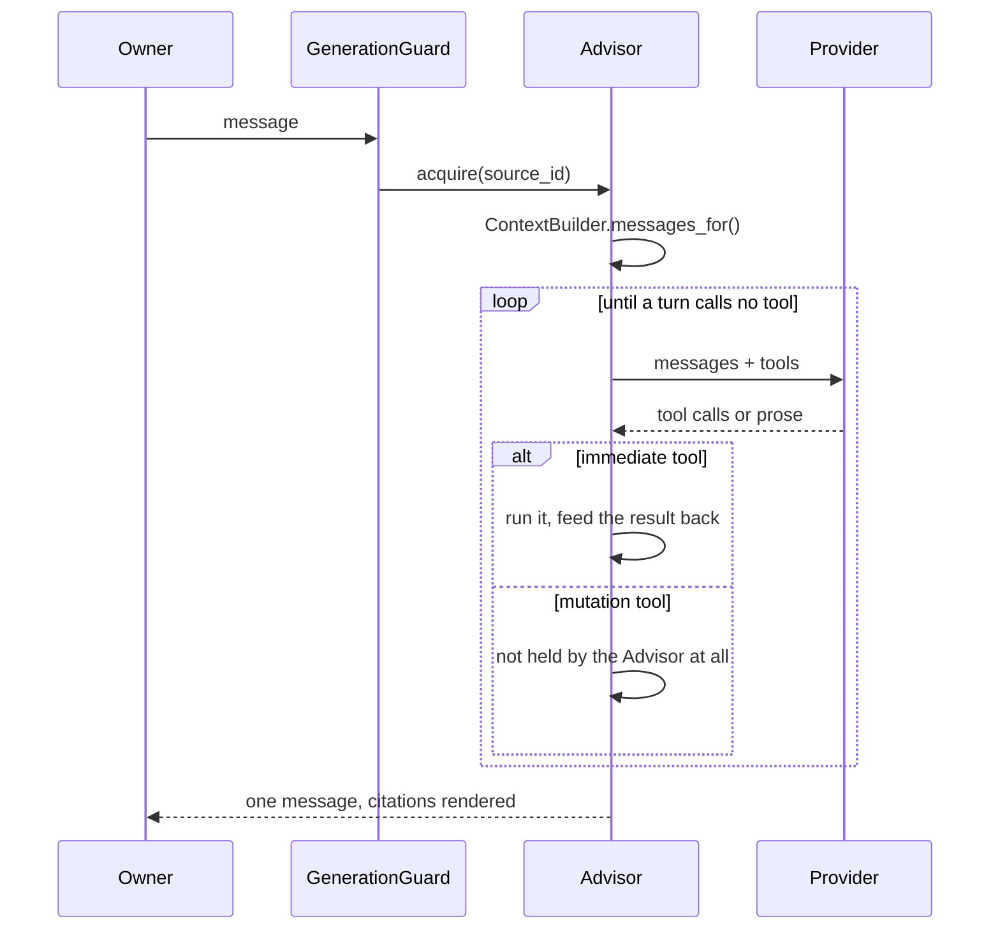
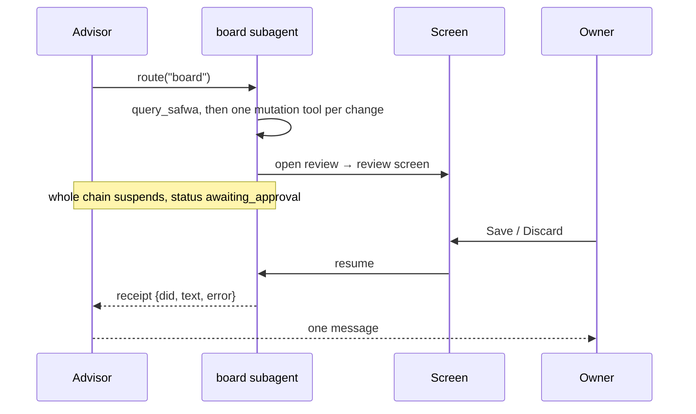
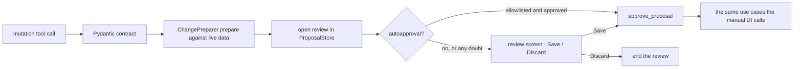
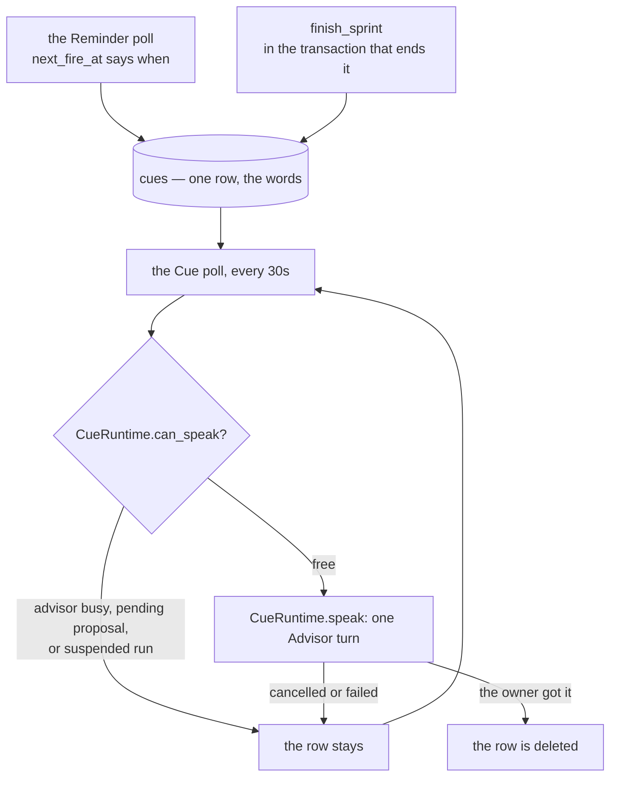
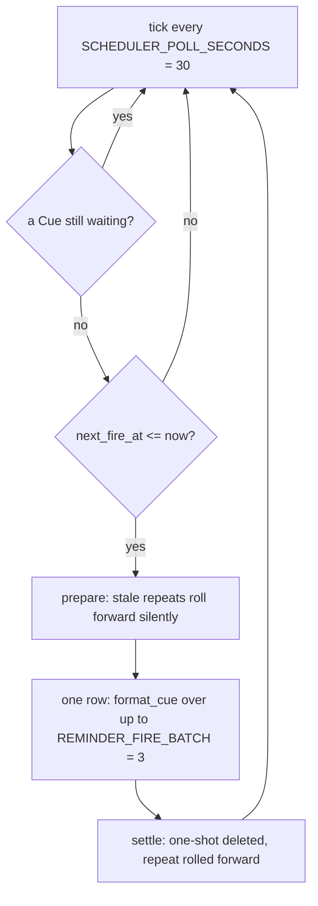
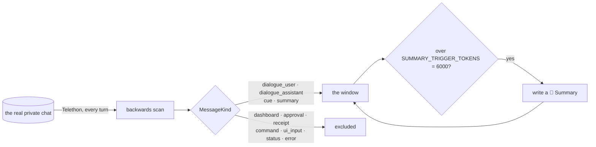
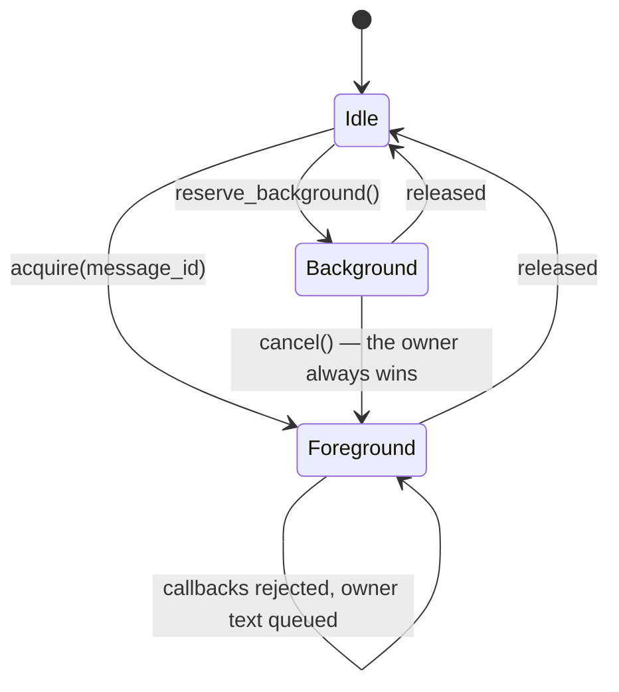

# Agent architecture

How the AI side of Safwa is put together: what a session is, how a turn runs, and what each
subsystem around it owns. Everything here describes the code as it stands.

The rules behind these mechanisms live in [CLAUDE.md](../CLAUDE.md); this file is the shape.

## The map



Only the Advisor writes to the chat. Everything else either hands it words or opens a screen.

## A session is the unit

Every agent run — the Advisor, a routed subagent — is an `AgentSession` backed by one `agent_runs`
row. The row is what survives a suspension:

| field | what it carries |
|---|---|
| `kind` | `advisor`, or the subagent's name |
| `parent_run_id` | who routed here; null for the Advisor |
| `state_json` | dialogue, transcript, tool count, repair rounds, receipts, `host_state`, `helper_offered`, `interaction_token` |
| `claimed_at` | the atomic claim that stops two resumes of one session |
| `status` | `running`, `awaiting_approval`, `interrupted`, `completed`, `failed`, `abandoned` |

`AgentSession.restore` rebuilds a suspended run from its own row. The context prefix is **not**
restored — it is rebuilt from live state, so the board and the clock are current while the session's
own steps come only from its record.

Three things happen to a session that stops on a person, and `AgentManager` owns all three:

| | |
|---|---|
| suspend | checkpoint the session and hand back an `InteractionRef` — its run id and a minted token |
| `resume(ref, value)` | claim by that reference, answer the calls it stopped on, run it on, hand its receipt up the chain |
| `interrupt(ref, results, summary)` | leave it unfinished with those results and the note that the owner wrote instead of deciding |

The reference is opaque: the runtime never learns what the person was shown, and Safwa keeps the
mapping — the approval batch carries the token, so a Save resolves the screen and names the session
in one step. The token is minted at the checkpoint and cleared when it is taken, which is what makes
one answer to one screen resume exactly one turn.

A session runs until it answers in words. A turn that stops with nothing is told so and asked again,
bounded by the repair rounds. A session with no parent is the one that guarantees the owner sees
something: the receipts, or one `⚠️` line.

## One Advisor turn



`IMMEDIATE_TOOLS` are `query_safwa`, `route`, `open` and `call_helper` — the tools `ToolAdapters`
answers itself, and they run inside the turn. `query_safwa` is published to every session it runs,
the Advisor's and a subagent's alike, so a feature declares only its own readers.
The Advisor holds no mutation tool: every write is a proposal authored by a subagent.

An immediate tool and mutation tools must not arrive in one provider response; the runtime rejects
the mutations and the model retries them once it has seen the read.

## Context, and why its order is fixed

`ContextBuilder` builds the request in order of how often each block changes, so a remote provider
can cache the stable prefix:

```text
messages[0]  system   SYSTEM_PROMPT                  ← cache breakpoint
messages[1]  user     [System]: memory + board state
   …         user/assistant   the dialogue window
messages[-1] user     [System]: the clock            ← volatile, always last
```

Only `messages[0]` is a system message. Every other context block goes through `system_note`, which
sends it as a user message prefixed `[System]: ` — the Qwen3.5 chat template raises on a second
system message.

**New volatile context goes after the dialogue, never into a system block.** One timestamp in
`messages[0]` costs every cache hit and scatters OpenRouter's sticky provider routing.
`tests/snapshots/prompt_prefix.json` is what notices if it moves.

A routed subagent's context is the same order under its own prompt: prompt → board state →
`<Conversation>` → this turn's receipts → clock.

## `route` — one turn handed to a subagent



- A subagent reads the conversation as **data**: the newest `SUBAGENT_HISTORY_LAST_MESSAGES = 10`
  come as one `<Conversation>` block, one tag per author, so nothing it did not write reaches it in
  the `assistant` slot.
- A routed session must open with a tool call — only its first turn, because the loop ends on a turn
  that calls none.
- A routed subagent has no `route`, so there is no recursion.
- A request naming two domains is two routes and one message.
- `SUBAGENT_DEADLINE_SECONDS = 300` bounds a subagent by the clock, not by a call count, because it
  blocks the Advisor's turn.

**Words typed over a screen** resume the turn that opened it. Every pending proposal in that batch is
discarded, the screen is frozen into an account of what the request did, and only then is anything
generated: the Advisor's pending `route` is answered with what was proposed, what was refused, what
was already saved, and the owner's words.

The subagent is left `interrupted` — unfinished rather than waiting — so a `route` back on that same
turn resumes it holding its own plan, and a correction reaches the session that wrote the refused
proposal. Its transcript carries one line saying the owner refused *and wrote instead*; on
"rejected" alone it would propose the same thing again. The turn that routed there is the outer
bound: when it answers or fails, `_close_unfinished_children` ends what it left behind.

The routing rules in `SYSTEM_PROMPT` are generated from the roster, so a subagent is routed to
exactly when its `AgentSpec` is in `MODULES`; its `purpose` **is** the prompt line.

## `call_helper` — one turn that reads and answers with rows


- Nothing about helpers is in `SYSTEM_PROMPT`. **The read that needed one is what offers it**, and
  the tool is added to that session's tools there and then (`helper_offered`, which survives a
  suspension).
- A read that *failed* offers nothing: its `hint` already says to repair that one SELECT.
- `heavy_analyzer` is a **mini session** (`ai/mini.py`), not a routed subagent: read tools plus two
  terminal tools, prose is never accepted, and it is in no routing rule and no base tool set.
- It never speaks. The answer is the last read itself — fifty rows cannot be retold, and a small
  model retelling numbers is where numbers get invented.
- `HEAVY_ANALYZER_MAX_TOOL_CALLS = 10` bounds it. It blocks the Advisor exactly as `route` does, and
  `/cancel` cancels the turn and the helper with it.
- A helper that breaks returns an error, not an exception: losing the turn would be worse than the
  answer the Advisor can still give from what it read itself.

## Proposals — the only way anything is written



- The model never mutates and never writes mutation SQL.
- **Every mutation tool belongs to a subagent**, never to the Advisor. `board` owns the board,
  `diary` owns the Diary. Preparation runs where the change was authored.
- **Every proposal screen is exactly Save/Discard.** A screen that needs a field control is the
  wrong screen.
- Autoapproval decides only whether a screen is shown. It never bypasses proposal persistence, and
  any doubt or failure leaves the pending screen untouched.
- `approve_proposal` checks `workspace.revision` before any handler runs; `StaleStateError` is
  the expected failure.
- Several mutation calls in one turn queue as independent screens; the model resumes only after the
  last one resolves, each result handed back as a tool result.
- A review and its approval batch are process state, not rows: `ProposalStore` holds both, they
  carry neither a status nor an age, and a batch is over when no screen is still waiting. Nothing
  survives a restart, so startup only clears what pointed at a review — the buttons, and the
  `related_id` of the screens in the chat. Review ids only ever go up, so a screen that still names
  one cannot reach a later review.
- Anything the model must know across an approval belongs in a **tool result**, not in a receipt.

## Cues — what Safwa is given to say when nobody asked

Only the Advisor writes to the chat, so anything the system wants said reaches the owner as one
ordinary Advisor turn. A **Cue** is the finished request for that turn: whoever had the facts wrote
them down, so the Advisor relays rather than goes looking.



**The `cues` row is the only record of "Safwa still owes the owner these words."** It is written
inside the producer's own transaction and deleted only once the turn landed, so a crash, a shut gate
or an owner who interrupts mid-turn all lose nothing: the row is still there, and the next poll says
it again.

`CueRuntime` is the whole delivery mechanism, and there is one of it:

- **The gate** refuses while `guard.active`, while any `ChangeProposal` is pending, and while any
  session is suspended on an approval batch or holds `claimed_at`. An open proposal is an unanswered
  question, and raising a second one on top of it turns the chat into a stack of screens.
- **The lease** is `guard.reserve_background()`. `still_current` compares `dialogue_revision` before
  and after the turn, so an owner who speaks mid-turn wins and the half-written answer is discarded.
- The answer is posted with `MessageKind.CUE`: it stays in dialogue, marked as something Safwa
  volunteered rather than a reply to a message that is not there.
- One waiting Cue is said per tick, oldest first.

### Reminders — the poll is the alarm clock and nothing else



There is no scheduling library and no in-memory timer. `Reminder.next_fire_at` says **when**, and
nothing more: the tick writes the words down and moves the row on in the **same transaction**. It
holds no gate, takes no lease and runs no Advisor turn — what guarantees the owner gets the words is
the Cue row, exactly as for anything else Safwa says first.

- **One thing waits to be said at a time.** A tick that finds a Cue still waiting writes nothing, and
  the Reminders it would have carried stay due for a later tick. That is what stops an hour of a busy
  owner turning into twelve messages the moment they are free.
- `is_stale`: a *repeating* Reminder more than `REMINDER_CATCHUP_GRACE_MINUTES = 120` overdue rolls
  forward silently, so a weekend offline does not produce 32 messages. A one-shot is never stale: it
  always fires, however late, and the Cue says how late.
- A repeat advances from its **scheduled** moment, not from the tick that took it, so a late check
  does not push every later fire late with it.
- Reminders are deterministic first — the poll only does schedule arithmetic, and the Advisor
  composes the message.

### A Sprint's end writes its own Cue

`finish_sprint` (by hand, or at the local midnight after the planned end date) writes a six-line
summary from the Sprint's own record — which Sprint and when, how it ended, its Success criteria,
the five effort figures, how the Actions ended up, the titles of what is still open — and hands it
over with `cue_advisor`, in the same transaction that ends the Sprint. Nothing dresses it as a
Reminder that went off: the words are the Sprint's own. Safwa is told how the Sprint went so it does
not go reading tables to find out, and ends its message with `[Sprint retro](retro:12)`.

## History — Telegram is the store, not SQLite



- `history.py` re-reads the real chat on every advisor turn. `telegram_messages` stores event
  metadata, never persona text.
- **Every bot message is sent registered and marked** with a `MessageKind`. An unregistered or
  unmarked message is invisible to the LLM; a wrongly-kinded one leaks UI noise into persona history.
- The window is a **token budget**, not a message count: `HISTORY_TOKEN_BUDGET = SUMMARY_TRIGGER_TOKENS
  + SUMMARY_TOKEN_CEILING`. A Summary is written exactly when the window fills, and it becomes the
  far edge of the window.
- Owner text still in the chat **is** dialogue: commands and typed field values are deleted, so
  survival is the evidence.
- Words that never reached the chat as owner text — a voice transcript, a drained queue — are posted
  back as a bot message of the owner's kind, or the Advisor never sees them.
- A receipt line is replayed as a **tool result** rather than as words Safwa said
  (`RECEIPT_MEANINGS`, beside the decision it reports),
  so `✅ Saved` reads as `applied` rather than as something the persona claimed.

## Memory

`data/memory.md` is authoritative, ordinary UTF-8 text: each trimmed non-empty line is a fact, blank
lines are ignored, a missing file means empty memory. `memory_fact_cache` is a rebuildable derived
cache and never the source.

AI replacements write atomically and re-check the file hash, so a concurrent local edit is preserved
rather than overwritten. A file that is not UTF-8, or that is over `MEMORY_TOKEN_BUDGET = 4000`,
injects no memory and records why instead of failing the turn.

Two loops: `memory-file-poll` picks up the owner's own edits; `memory-maintenance` runs the daily
upkeep.

## Views and prompts

```mermaid
flowchart LR
    F1[cards/views.py] --> CAT
    F2[checks/views.py] --> CAT
    F3[...] --> CAT[SqlView declarations]
    CAT -->|dropped and rebuilt every startup| DB[(ai_* views)]
    CAT --> ALLOW[ALLOWED_VIEWS]
    CAT --> DOC["view_catalogue(views, names)"]
    DOC -->|{views}| P1[SYSTEM_PROMPT · 9 views]
    DOC --> P2[board prompt · 7 views]
    DOC --> P3[heavy_analyzer prompt · 10 views]
```

- The views are dropped and rebuilt on **every startup**. Change a view's shape in the owning
  feature's `views.py`, never with a migration.
- A `SqlView` carries its own `doc`, so the block a model reads about a view lives beside the SELECT.
- **The view list in a prompt is what scopes a reader**: a view no list names is one that reader
  never learns exists. The Diary writes its own list by hand, with columns trimmed on purpose.
- `view_catalogue` refuses a name no feature publishes and a view with no `doc`.

`query_safwa` is triple-guarded: regex validation of one `SELECT`/`WITH … SELECT` over the `ai_*`
views, a separate read-only connection with an authorizer allowlist, and result caps
(`DEFAULT_ROW_LIMIT = 50`, `DEFAULT_CHAR_BUDGET = 12000`, `QUERY_TIMEOUT_SECONDS = 2`). The caps
exist because a local model pays for what it reads.

A saved Request shares the validation and nothing else: it runs on the ordinary session, and no cap
applies, because its result is always a list in the interface and never enters the model's history.

## Citations

The model writes `[Go to the market](card:12)`. The host resolves it: `render_citations` looks the id
up, builds a `t.me` deep link from the **validated** id, and names the item itself. An item that is
gone keeps its words and loses its link; a target that is not an id leaves the chat as plain words.

Types: `card`, `check`, `tag`, `value`, `request`, `diary`, `retro`.

When the decision is the owner's, the model **cites** the item in its own prose instead of proposing
one.

## Concurrency

`GenerationGuard` is the single foreground/background lease.



- While an answer runs, callbacks are rejected and owner text is queued, then processed as one turn.
- `dialogue_revision` is bumped by `cancel()`, and is how a generation already in flight learns to
  discard its result. Only `dialogue_revision` invalidates an in-flight answer — the answer's own
  autoapproved change moves `workspace.revision`, which is a different question.
- Background work verifies the revision before publishing or committing.
- `OwnerAndWritingMiddleware` drops anything that is not the owner in a private chat.
- Every inline button is a single-use `CallbackToken` row, cleared at the next start.

## Background loops

| task | interval | owner |
|---|---|---|
| `cue-queue` | `SCHEDULER_POLL_SECONDS = 30` | `cues/background.py` |
| `reminder-scheduler` | `SCHEDULER_POLL_SECONDS = 30` | `features/reminders/background.py` |
| `sprint-expiry` | `SPRINT_EXPIRY_POLL_SECONDS = 300` | `features/planning/background.py` |
| `memory-file-poll` | `MEMORY_POLL_SECONDS = 5` | `features/continuity/background.py` |
| `memory-maintenance` | `MEMORY_MAINTENANCE_INTERVAL_SECONDS = 60` | `features/continuity/background.py` |

Each is a `BackgroundTask`. All but the Cue poll are declared in a feature's `module.py`; the Cue
poll belongs to no feature, so `bootstrap/modules.py` puts it in front of theirs. The composition
root starts them and cancels them in the polling `finally`. A feature that needs its own objects takes them off
`services`, the container the whole application already shares.

## Recovery

`recover_startup` reconciles interrupted work on every boot: each feature contributes a `recover`
callable through its `FeatureModule`.

**A restart ends every session.** One left `running` and one left `awaiting_approval` are both
recorded `abandoned`, and their claims are released. Nothing picks either up: a screen is process
state and died with the process, and an unfinished session is only ever adopted by the turn that
routed to it, which died with it. What startup clears is what still pointed at a review — the
buttons, and the `related_id` of the screens in the chat.
