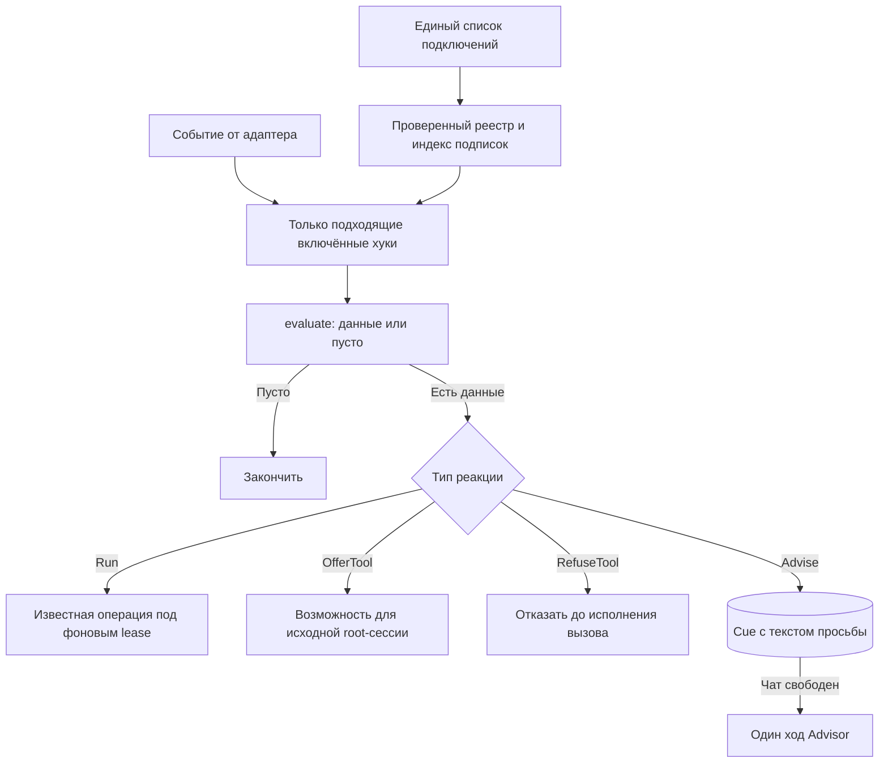

# Архитектура и реализация хуков tg-agent-shell

Начало реализации, 2026-09-15. Этапы 1–2 реализованы: общий реестр, автоматический Summary
и предложение Heavy analyzer. Инициатива — одна просьба к Advisor, доставленная через Cue;
ответ владельца — обычный следующий ход. Основание — [FUTURE_FEATURE.md](FUTURE_FEATURE.md),
[текущая архитектура](AGENT_ARCH.md) и [регистрация модулей](FEATURE_MODULES.md).
Этот документ уточняет порядок работы в [PLAN_FEATURES.md](PLAN_FEATURES.md).

### Что работает сейчас

- [hooks/contracts.py](../src/tg_agent_shell/hooks/contracts.py) определяет данные событий,
  подписки, определения, подключения и две реакции: Run и OfferTool.
- [hooks/registry.py](../src/tg_agent_shell/hooks/registry.py) проверяет подключения, сохраняет
  все регистрации и индексирует включённые определения по типу события. Фильтры применяются до
  evaluate; одно определение проверяется один раз на событие. Отключённое условие не вызывается.
- AfterTurn содержит владельца, чат, исходное сообщение и ревизию диалога. OnAfterTurn
  фильтрует происхождение. Общий адаптер выполняет проверки и Run под одним фоновым lease.
  RunContext передаёт ресурсы приложения, проверку актуальности и публикацию обычного текста;
  операция Summary описывает нужный ей ресурс узким протоколом SummaryResources. Сам evaluate
  получает только событие. Telegram, Services и изменяемая сессия в evaluate не передаются.
- AfterTool содержит сессию-источник, роль и вид агента, вызов, копию результата и исход.
  QueryRead и ToolOutcome передают успех исполнения отдельно от строк результата: колонка
  status со значением error не превращает успешное SQL-чтение в ошибку инструмента.
  OnAfterTool фильтрует инструмент, роль и исход. OfferTool разрешён только после
  успешного root-вызова и выдаёт доступ к названному помощнику в той же сессии.
  Результат evaluate для OfferTool — последовательность текстов уведомления; для Run — данные
  операции. Имена разрешённых помощников сохраняются вместе с сессией при suspend/resume.
- Run после ошибки сообщает, что уже доставленный ответ остаётся в силе; ошибка
  необязательного предложения помощника попадает в журнал приложения и сохраняет результат
  чтения. Отмена не поглощается реестром.

Это две поддержанные пары событие/реакция. Неподдержанное подключение отвергается при сборке,
в том числе после route: этот вызов пока исполняется внутри agent_runtime и не проходит через
адаптер событий. До появления реального потребителя нет заглушек Committed, Tick, Advise и
RefuseTool. Прежние низкоуровневые before_tool/after_tool остаются самостоятельными портами
наблюдения; ими новый реестр не регистрируется. Схема БД и системный префикс не менялись.

## 1. Граница системы

Согласовано с владельцем: буквальный TOOL_USE для каждого хука не требуется. Хук может вызвать
служебную операцию напрямую, предоставить инструмент или обратиться к Advisor.

Уточнено 2026-09-09: **хук — автоматическая реакция на конкретное событие жизненного цикла**:
завершение хода, границу вызова инструмента, сохранённое предметное изменение или наступление
проверки по времени. Нажатие кнопки, которая явно запускает запрошенную работу, вызывает её
workflow напрямую. Наличие внутри промпта, RAG или нескольких шагов не превращает workflow в хук.

«Анализ с ИИ» в ретроспективе — явный workflow. Ручная /summarize тоже вызывает
операцию напрямую; автоматический Summary после хода использует хук. Автоматически предложить
Heavy analyzer после чтения — хук; выполнить выбранный анализ — работа помощника. Запись обычного
запроса и ответа в историю не делает запускающий их workflow реакцией на изменение истории.
Отключение хуков не отключает эти явно запрошенные возможности.

**Инициатива хука заканчивается там, где Advisor задал вопрос.** Хук не знает, что владелец
ответил, и не хранит его решение. Ответ владельца — обычный следующий ход: Advisor видит диалог
и сам ведёт его дальше, например в Reminder через route. Владелец вправе не ответить вовсе.

**Валидатор исполнения — часть архитектуры Proposals.** Он вынесен в
[PROPOSAL_VALIDATION.md](PROPOSAL_VALIDATION.md), не регистрируется здесь и не зависит от
включения хуков. Дальше рассматриваются только хуки.

Основное предложение: **одно явное место подключения, общий контракт проверки события
и небольшой фиксированный набор реакций рантайма**. Универсальность получается из сочетания
этих частей. Условия конкретного хука остаются обычным кодом его фичи; реестр не пытается
описать всю предметную логику набором boolean.

## 2. Одно место, где видно все подключения

Явный список подключений находится в существующем
[bootstrap/modules.py](../src/safwa/bootstrap/modules.py), рядом с MODULES. Определение хука
экспортирует его фича; здесь выбирается, подключён ли он к автоматической работе.

Текущий список содержит только реализованные определения:

```python
# В существующем bootstrap/modules.py.
from ..features.summary.module import SUMMARY_HOOK
from ..features.heavy_analyzer.module import HEAVY_ANALYZER_HOOK
from tg_agent_shell.hooks.contracts import HookRegistration

HOOKS = (
    HookRegistration(SUMMARY_HOOK, enabled=True),
    HookRegistration(HEAVY_ANALYZER_HOOK, enabled=True),
)

REGISTRY = Registry.of(MODULES, world=_world, hooks=HOOKS)
```

**Определение — одно; подключение — одно.** Определение содержит условие и способ реакции.
Центральная строка содержит ссылку на него и enabled. Список MODULES подключает фичи в целом,
а HOOKS — их автоматические реакции; регистрация проверяет, что фича-владелец действительно
входит в MODULES.

Подключение задаётся явным списком, а не автоматическим сбором hooks из каждого FeatureModule:
тогда для ответа «что будет работать?» достаточно открыть этот список. Вторую регистрацию
тех же хуков в FeatureModule нет. Этот список и есть ответ на вопрос «что подключено»; отдельный
вывод в диагностике не нужен.

### Что означает включение

- Зарегистрирован и включён: подписки действуют; условие может дать работу.
- Зарегистрирован и выключен: определение остаётся в списке, но проверка условия не вызывается
  и отложенная инициатива не запускается.
- Не зарегистрирован: хук не существует для этого приложения.
- Запланирован, но ещё не реализован: остаётся в документах, а не представляется заглушкой
  в рабочем реестре.

Для первой версии переключатель задаётся при сборке приложения и применяется после запуска.
Изменяемые на лету настройки не нужны, чтобы получить обозримую регистрацию.

Отключение автоматического Summary не удаляет команду /summarize. Отключение предложения
Heavy analyzer не удаляет саму возможность помощника из его предметного контракта.
Реестр управляет автоматическими реакциями, а не существованием остальных функций фичи.

При сборке реестр отказывает при повторяющемся имени, неизвестной фиче-владельце, недопустимой
паре событие/реакция или ссылке на отсутствующий инструмент. Выключенные определения проходят
те же проверки, чтобы включение не обнаруживало скрытую ошибку регистрации.

## 3. Контракт: событие → проверка → реакция

Ниже описан целевой контракт всех этапов. Сейчас реализованы только пары AfterTurn/Run и
AfterTool/OfferTool из раздела «Что работает сейчас»; подписки называются OnAfterTurn и
OnAfterTool, чтобы данные случившегося события не смешивались с фильтром будущих событий.

Достаточно пяти частей определения. Переключатель enabled принадлежит подключению, а не
дублируется в определении.

| Поле | Что означает |
|---|---|
| name | Стабильное уникальное имя хука |
| owner | Фича, которая отвечает за его поведение |
| on | Одно или несколько типизированных событий с простыми фильтрами |
| evaluate | Асинхронная проверка: получить событие, вернуть подходящие данные или пустой результат |
| effect | Один из поддерживаемых способов исполнения этих данных |

evaluate принимает конкретный тип события и возвращает последовательность данных, которые
умеет исполнить именно этот effect. Пустая последовательность означает «ничего делать
не нужно». Несколько результатов нужны, например, обходу целей по времени.

Не нужен один большой объект контекста с необязательными полями «вдруг тут есть тулз,
сессия, карточка». Содержимое события зависит от его типа.

| Событие | Содержимое | Кто его создаёт |
|---|---|---|
| AfterTurn | Владелец, чат, исходное сообщение и ревизия диалога | Оболочка после ответа |
| AfterTool | Конкретный вызов, копия результата, исход, роль и вид агента | Адаптер результата инструмента |
| Committed | Вид предметного изменения, субъект и эпизод (идентификатор перехода), кто сохранил | Слушатель commit на фабрике сессий |
| Tick | Текущее время и имя наступившей проверки | Один фоновый цикл оболочки |
| BeforeTool | Конкретный ещё не исполненный вызов, агент и исходный запрос | Диспетчер до исполнения |

Committed, Tick и BeforeTool — проектные названия; классов в коде пока нет. Подписка Tick
несёт расписание проверки; имя проверки и расписание объявляются в том же on, а не в отдельном
списке таймеров. Значение «следующий запуск» не хранится в системном промпте.

### Что может делать evaluate

Проверка читает факты через явно переданные зависимости, формирует данные и ничего не отправляет.
Ей не передаётся весь Services, Telegram Bot или изменяемая AgentSession. Зависимости связываются
при запуске: например, чтение истории для Summary или предметный read API для Карточек.
Общая оболочка не импортирует таблицы Safwa.

Дорогая модель не нужна, чтобы узнать «блокер снят», «follow-up уже есть» или «следующая проверка
ещё не наступила». Смысл начинается в реакции — у Advisor, когда Cue доставлен.

### Четыре реакции

Закрытые варианты, а не произвольные сочетания флагов foreground, background, required и
expects_answer.

| Реакция | Что получает от evaluate | Что делает рантайм |
|---|---|---|
| Run | Данные известной служебной операции | Исполняет её под фоновым lease, с проверкой актуальности и отменой |
| OfferTool | Тексты уведомления | Делает названного помощника доступным в исходной root-сессии со следующего обращения к модели |
| Advise | Тексты просьбы к Advisor | Кладёт каждый текст в Cue; существующая очередь доставляет его одним ходом Advisor, когда чат свободен |
| RefuseTool | Причину отказа | Возвращает отказ в этот вызов; исходный вызов не исполняет |

Матрица допустимых подключений: Run — AfterTurn, Tick и Committed; OfferTool — AfterTool
корневого агента; Advise — Committed и Tick; RefuseTool — только BeforeTool. Новый тип события
добавляется адаптером при реальной необходимости, а не имитируется одним из уже существующих.

Run может внутри вызвать модель, как нынешний Summary. OfferTool ничего не требует вызвать.
Advise — это ровно текст просьбы: «Карточка X заблокирована из-за Y; спроси владельца, напомнить
ли ему вернуться к этому». Что сказать владельцу, решает Advisor в этом ходе; что ответить и
отвечать ли — владелец в следующем. RefuseTool действует только на конкретный вызов; это не
альтернативный способ менять пользовательские данные.

### Три примера определения

Синтаксис ниже иллюстрирует контракт. Функции третьего примера проектные.

```python
SUMMARY_HOOK = HookSpec(
    name="summary.window",
    owner="summary",
    on=(OnAfterTurn(source="owner"),),
    evaluate=summary_candidate,
    effect=Run(make_summary),
)

HEAVY_ANALYZER_HOOK = HookSpec(
    name="analyzer.offer",
    owner="heavy_analyzer",
    on=(OnAfterTool(tool="query_data"),),
    evaluate=complex_read_candidate,
    effect=OfferTool(helper="heavy_analyzer"),
)

BLOCKER_HOOK = HookSpec(
    name="blocker.follow-up",
    owner="cards",
    on=(OnCommitted(kind="card.blocked"),),
    evaluate=blocker_request,
    effect=Advise(),
)
```

В первом случае evaluate передаёт подходящий законченный ход, а существующая операция сама
проверяет порог окна и при необходимости строит Summary. Во втором evaluate проверяет форму и
объём уже полученного результата, а рантайм предлагает существующего помощника. В третьем
evaluate читает Карточку: если она всё ещё заблокирована и у неё нет Reminder, возвращает один
текст просьбы; иначе пусто.

Для нового Advise разработчик пишет предметное условие и текст просьбы. Доставку, очередь и
разговор он заново не реализует.

## 4. Почему один контракт работает в разных контекстах

**Событие несёт причину; реакция определяет допустимую работу; очередь выбирает момент.**



Реестр индексирует подписки по типу события и фильтрам. На каждый вызов query_data не нужно
запускать проверку пустых целей или сканировать расписание. Статическое включение и дешёвая
фильтрация проверяются до evaluate.

| Ситуация | Что происходит |
|---|---|
| Закончен пользовательский ход, Run для Summary | Запуск после хода под фоновым lease; при новом сообщении устаревшая попытка отменяется |
| Успешный результат root-чтения, OfferTool | Возможность обновляется в той же сессии перед следующим запросом к модели |
| Исходная сессия OfferTool уже закончилась | Предложение отброшено; отдельный Cue из него не создаётся |
| Advise из сохранения — из Proposal или вручную | Cue ждёт свободного чата: после Save цепочка заканчивается, и очередь отдаёт просьбу Advisor |
| Advise по времени, пока владелец говорит о другом | Cue ждёт; инициатива не внедряется в чужую текущую работу |
| Root ждёт Save или работает субагент | Очередь не говорит поверх этой работы — это уже правило can_speak |
| Сработал RefuseTool | Отказ возвращается синхронно в этот вызов; в очередь ничего не идёт |

Сохранение из AI-запроса и ручное сохранение идут одной дорогой: use case → commit → Committed →
evaluate → Cue. Хук не различает, откуда пришло сохранение: после Save цепочка заканчивается, и
очередь доставляет просьбу первым свободным ходом.

## 5. Адаптеры событий и ограничения

| Сейчас | Как использовать |
|---|---|
| [Summary после хода](../src/safwa/features/summary/hooks.py) | Источник AfterTurn; Run вызывает существующую операцию |
| [Предложение помощника](../src/safwa/features/heavy_analyzer/hooks.py) | AfterTool; OfferTool выдаёт существующего помощника |
| [Наблюдатели тулзов](../src/tg_agent_shell/ai/tools.py) | Создают AfterTool; учитывать, что текущий route обходит этот адаптер |
| [Рантайм](../src/agent_runtime/loop.py) | Управляет допустимыми инструментами, порядком исполнения и возвратом к root |
| [Cue](../src/tg_agent_shell/cues/runtime.py) | Единственный путь отложенной разговорной инициативы; Advise кладёт в него текст |
| [TurnManager](../src/tg_agent_shell/turn/manager.py) | Сохраняет единственное право на foreground/background и отмену |

### Сохранённое изменение

Предметный use case кладёт факт изменения — вид, субъект, эпизод — рядом с сессией БД, не
вызывает Advisor и не коммитит сам. Один слушатель after_commit на фабрике сессий передаёт
накопленные факты адаптеру после commit; при rollback фактов нет. AI и UI вызывают один и тот же
use case, поэтому не приходится угадывать событие по имени тулза, тексту результата или месту
commit — их несколько, и ни одно не правится.

Адаптер запускает evaluate и кладёт Cue вне транзакции сохранения. Сбой процесса между commit
и записью Cue теряет одну подсказку, не данные; восстановление подсказок по истории не строится.

Эпизод — идентификатор перехода, а не состояния: для блокера это запись CardEvent, в которой
blocked стал true. Переименование при неизменном blocked ничего не публикует. Снятие и новая
блокировка — новый эпизод.

### Время

Один фоновый цикл оболочки вызывает только наступившие проверки из подписок; каждый хук
не заводит собственный poll. Расписание назначает фича, расчёт использует часы и часовой пояс
рабочего пространства. Цикл помнит последний запуск каждой проверки, чтобы дневной тик не
исполнялся заново на каждом обороте. На старте проверяются текущие условия, пропущенные тики не
воспроизводятся один за другим.

### До тулза

RefuseTool сохраняет простой смысл: отказ означает, что вызов не произошёл. Ошибка такой
проверки не должна молча разрешать запрещаемую операцию. Для Run и Advise, которые предлагают
необязательную помощь, ошибка изолируется от основного запроса. Политика ошибки выводится из
реакции, а не задаётся флагом у каждого хука.

RAG с вопросом до создания сложнее простого отказа: ему нужен возврат из субагента к root и
привязка согласия к конкретному намерению. Это самостоятельная часть будущей RAG-фичи; реестр
её не скрывает. Это ограничение относится к кандидату 8.

### Привязка зависимостей

При запуске приложения регистрации связываются с небольшими read API своих фич. Система хуков
в tg_agent_shell отвечает за подписки и постановку в очередь. agent_runtime не меняется:
он не импортирует Card, Sprint, Check или реестр фич Safwa.

## 6. Что хук помнит

**Хук на переход не помнит ничего.** Committed — это переход, а не состояние; один переход даёт
одно событие и одну просьбу. «Follow-up уже есть», «блокер уже снят» — чтения в evaluate, а не
записи о прошлых вопросах.

**Хук на состояние помнит, когда спрашивал.** Tick перечитывает состояние каждый день, и без
записи та же Цель без Действий давала бы вопрос каждое утро. Достаточно одной таблицы: хук,
субъект, время просьбы. Запись делается при создании Cue. Правило, через сколько спросить снова,
принадлежит хуку и читается в его evaluate. Три колонки — вся таблица. Cue после доставки
удаляется; эта запись его переживает.

**Доставка — Cue, и только он.** Advisor получает текст просьбы как обычный запрос и отвечает
владельцу своими словами. Ответ владельца — обычный следующий ход, который Advisor читает вместе
с остальным диалогом. Молчание ничего не означает и ничего не запускает. Отказ, отсрочка и
«не предлагай больше» — слова в диалоге, как любые другие.

**Одна инициатива за раз.** Существующая очередь берёт старейший Cue и говорит только когда
can_speak. Несколько Целей без Действий — один текст просьбы, а не пять Cue. Пауза между
инициативами — продуктовая настройка для живой проверки, не константа этого документа.

## 7. Проверка архитектуры на всём наборе кандидатов

Номера соответствуют историческому каталогу POTENTIAL HOOKS, а не означают, что каждый его пункт
является хуком. Проверки пустых Goals читают только Goal/Subgoal.

| Кандидат | Подписка и реакция | Что особенно важно |
|---|---|---|
| Summary | AfterTurn → Run | Актуальный снимок; без повторного запуска от себя |
| Heavy analyzer | AfterTool → OfferTool | Не превращать предложение помощника в обязательный анализ |
| Ручная /summarize, выбранный анализ ретроспективы или помощник | Прямой вызов операции/workflow | Возможность выполнить запрос не зависит от включения хуков |
| Onboarding | Условия автоматического старта не согласованы | Сам диалог не хук |
| 1, 4, 15 | Инструкции Advisor и нужный контекст | Не требуют движка хуков |
| 2. Блокер | Committed → Advise | Один переход — одна просьба; follow-up уже есть — просьбы нет |
| 5. Нет Действий | Tick → Advise | Обход всей ветви; только Goal/Subgoal; запись «когда спрашивал» |
| 6. Часто откладывается | Tick → Advise | Нужна история дневного выбора одного экземпляра, которой пока нет |
| 7. Перегруз Today | Committed или Tick → Advise | Один день — одна просьба; правило учёта выполненных EP не согласовано |
| 8. Похожие сущности | BeforeTool → RefuseTool; интерактивное продолжение — RAG-фича | Сходство не означает идентичность |
| 9. Проверка исполнения | Жизненный цикл Proposals, без регистрации хука | Собственная архитектура в PROPOSAL_VALIDATION.md |
| 10. Ключевые Действия | Committed → служебная классификация; отдельный Advise при пустом остатке | Хранить статус классификации; отличать выполненное от удалённого |
| 11. Повторные Missed | Committed → Advise | Pending не считать Missed; серия Missed — эпизод |
| 13. Hard Time | Tick → Advise | Просьба привязана к наступлению, не к версии плана |
| 14. Память хуков | Одна таблица «когда спрашивал» | Читают только хуки на состояние |
| 3, 12 | Ранее отклонены | В реализацию не включать |

## 8. Последовательность реализации

Каждый этап — одна новая пара событие/реакция, один реальный потребитель и одна строка в HOOKS.
Пара без потребителя не появляется. Этапы 1–2 выполнены.

### Этап 1. Контракт и единственный список подключений — реализован

Оболочка содержит типы определения, подписки и двух работающих реакций, проверку
регистрации и индекс подписок. [Registry](../src/tg_agent_shell/registry.py) принимает список
из [bootstrap/modules.py](../src/safwa/bootstrap/modules.py); этот список и есть ответ на вопрос
«что подключено».

Общий механизм находится внутри src/tg_agent_shell/hooks/; определения — в hooks.py фич,
с экспортом через module.py. Архитектурная проверка относит hooks.py к сборке, запрещает
бизнес-операциям импортировать механизм хуков и удерживает его ниже адаптеров оболочки.

Проверка этапа: дубликат имени и несовместимая подписка отвергаются при сборке; выключенный
хук остаётся в реестре, но evaluate не вызывается; приложение-пример без Safwa собирается с пустым
списком хуков.

### Этап 2. Перенести два существующих случая — реализован

**Summary:** источник AfterTurn вызывает общий диспетчер; evaluate отбирает подходящий ход.
Run вызывает существующую операцию с её порогом окна, проверкой снимка, ревизией диалога и
отменой. Команда /summarize продолжает вызывать ту же операцию напрямую.

**Heavy analyzer:** AfterTool передаёт успешное root-чтение. Условие предложения перенесено из
специальной ветки инструментов в определение хука. OfferTool использует механизм доступности и
сохраняет его при suspend/resume. HelperSpec держит определение помощника, инструкции, сборку и
разрешённые чтения; правило автоматического предложения в нём не дублируется.

Оба прежних автоматических пути удалены. Низкоуровневые наблюдатели инструментов сохранены;
их прежние сценарии продолжают проверяться.

### Этап 3. Committed → Advise на блокере

Первый потребитель — хук 2. [CardEvent](../src/safwa/features/cards/model.py) уже пишет
before/after, а [операции Карточек](../src/safwa/features/cards/use_cases.py) записывают туда
blocked; переход false → true — эпизод. Фича кладёт факт рядом с сессией БД, слушатель
after_commit отдаёт его адаптеру, evaluate перечитывает Карточку и возвращает текст просьбы,
Advise кладёт Cue.

Новых таблиц нет. Новое в оболочке: подписка на Committed, реакция Advise, слушатель commit
и адаптер, который вызывает evaluate и add_cue. Новое в Safwa: hooks.py у Карточек и одна
строка в HOOKS.

Проверка этапа: блокер через Proposal и через UI даёт одну и ту же просьбу; rollback не даёт
Cue; переименование заблокированной Карточки не даёт Cue; Карточка с Reminder не даёт Cue;
Discard блокера не даёт Cue; выключенный хук не даёт Cue, а ручная установка блокера работает
как прежде. Просьба доставляется одним ходом Advisor, когда чат свободен.

### Этап 4. Tick → Advise на Целях без Действий

Второй потребитель — хук 5, и второй вход. Один фоновый цикл оболочки читает расписания из
подписок и вызывает наступившие проверки. Таблица «когда спрашивал» появляется здесь, вместе
с правилом повторения хука 5; это schema-батч со своей проверкой снимка. Льготный срок и час
проверки — константы фичи.

Проверка этапа: хук добавляется определением, предметным чтением и одной строкой; не появляется
ещё один poll, второй путь доставки и разбор ответа. Один дневной тик не исполняется заново на
каждом обороте. Несколько Целей — один текст. Та же Цель на следующий день не даёт второй
просьбы раньше срока хука. Если второй вход потребовал второго пути доставки, чинить нужно
границу, а не хук.

### Этап 5. Остальные по готовности данных

| Фича | Что подготовить прежде всего |
|---|---|
| Повторные Missed | Определение эпизода серии Missed |
| Перегруз Today | Согласованную шкалу и правило учёта завершённых EP |
| Часто откладываемое Действие | Историю дневного выбора одного незавершённого экземпляра |
| Hard Time вне плана | Вычисляемое расписание и идентичность наступления |
| Ключевые Действия Sprint | Связь с критерием успеха и состояние классификации |
| RAG до создания | Проверенное извлечение кандидатов и протокол уточнения до операции |

BeforeTool и RefuseTool можно проверить как контракт адаптера без включения экспериментального
RAG.

### Что не строить

Динамическую загрузку плагинов, язык условий, общую шину всех событий БД, произвольные графы
хуков, отдельные таймеры каждой фичи, память о решениях владельца и разбор его ответов. Для
описанных случаев достаточно обычного кода проверки, центрального списка, четырёх реакций и
очереди Cue.

## 9. Проверки всего механизма

Регистрация и две действующие реакции проверяются в [test_hooks.py](../tests/test_hooks.py),
[test_summary.py](../tests/test_summary.py),
[test_heavy_analyzer_e2e.py](../tests/e2e/test_heavy_analyzer_e2e.py) и приложении-примере
с запрещённым импортом Safwa. Строки о Committed, Tick и Advise — будущие.

| Ситуация | Ожидаемый результат |
|---|---|
| Выключенный хук и подходящее событие | evaluate не вызывается |
| Две регистрации одного имени, даже если одна выключена | Ошибка сборки |
| Несовместимая пара подписка/реакция | Ошибка сборки, а не молчаливый пропуск в рантайме |
| AfterTool с ошибкой или из субагента для root-помощника | Хук помощника не вызывается |
| Конец исходной сессии OfferTool | Не появляется самостоятельный разговор о помощнике |
| Блокер сохранён через UI и через AI | Одна и та же просьба, одна дорога |
| Тулз подготовил блокер, но владелец выбрал Discard | Нет Committed, нет Cue |
| Rollback после записи факта | Нет Committed |
| Переименование заблокированной Карточки | Нет нового эпизода |
| Root ждёт Save или работает субагент | Cue ждёт; can_speak как прежде |
| Хук по времени сработал во время другого запроса | Cue ждёт, не перехватывает текущую задачу |
| Один тик и несколько оборотов poll | Одна проверка |
| Та же Цель без Действий на следующий день | Нет второй просьбы раньше срока хука |
| Сработал RefuseTool | Исходная операция не произошла |
| Summary строился по устаревшей истории | Не публиковать его результат |

## 10. Оставшиеся решения

Пороги EP, число Missed, утренний час, льготный срок и пауза между инициативами решаются при
реализации своих фич и не раздувают базовый контракт.

Запись «когда спрашивал» делается при создании Cue, а не при доставке: Cue долговечен и будет
доставлен. Если очередь окажется способна терять Cue, момент записи пересматривается вместе с ней.

Критерий готовности общего решения: новый обычный хук требует собственного evaluate, нужных
предметных чтений, одной реакции и одной строки подключения. В нём нет управления Telegram,
сессиями, очередью или памяти о решении владельца.
