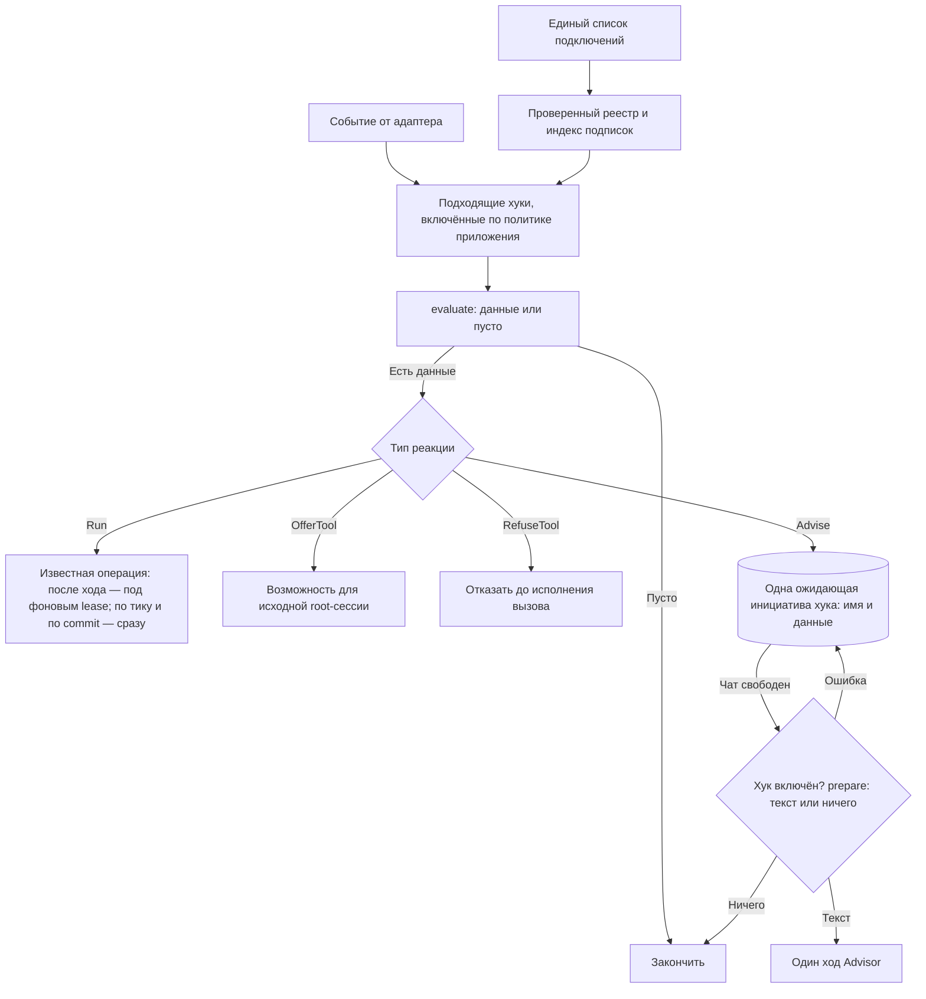

# Архитектура и реализация хуков tg-agent-shell

Начало реализации, 2026-09-15; этапы 1–2 и батчи 1–8 реализованы к 2026-09-18. Один реестр,
пятнадцать хуков в HOOKS: работа своя — автоматический Summary, истечение спринта, утра в Today,
ключевые Действия; отказ до тулза — Heavy analyzer; просьбы к Advisor по факту и по времени —
блокер, перегруз Today, Цели без Действий, Hard Time, баланс энергии, отдых в Today, застрявшее
в Today, повторные Missed, Дневник, дневной итог, итог спринта, недостижимый критерий. Хук, чей
эффект доходит до агента — OfferTool, RefuseTool или Advise, — включается и выключается целиком,
в Профиле, руками владельца; хук, делающий свою работу (Run), всегда включён. Инициатива — одна
просьба к Advisor, доставленная через Cue; ответ владельца — обычный следующий ход. Основание —
[FUTURE_FEATURE.md](FUTURE_FEATURE.md), [текущая архитектура](AGENT_ARCH.md) и
[регистрация модулей](FEATURE_MODULES.md). Этот документ уточняет порядок работы в
[PLAN_FEATURES.md](PLAN_FEATURES.md).

### Что работает сейчас

- [hooks/contracts.py](../src/tg_agent_shell/hooks/contracts.py) определяет данные событий,
  подписки, определения и четыре реакции: Run, OfferTool, RefuseTool и Advise.
- [hooks/registry.py](../src/tg_agent_shell/hooks/registry.py) проверяет подключения и
  индексирует определения по типу события. Фильтры применяются до evaluate; одно определение
  проверяется один раз на событие. Хук, чей эффект доходит до агента (agent_related:
  OfferTool, RefuseTool или Advise), перед evaluate и перед словами спрашивает политику приложения; Safwa
  отдаёт её из [profile/api.py](../src/safwa/features/profile/api.py), где набор выключенных
  хуков лежит в строке Профиля, а экран Профиля показывает каждый такой хук переключателем.
- AfterTurn содержит владельца, чат, исходное сообщение и ревизию диалога. OnAfterTurn
  фильтрует происхождение. Общий адаптер выполняет проверки и Run под одним фоновым lease.
  RunContext передаёт ресурсы приложения, фабрику сессий, проверку актуальности и публикацию
  обычного текста — по тику публикации нет, слова идут через записанный факт и Advise-хук;
  операция Summary описывает нужный ей ресурс узким протоколом SummaryResources. Сам evaluate
  получает только событие. Telegram, Services и изменяемая сессия в evaluate не передаются.
- AfterTool содержит сессию-источник, роль и вид агента, вызов, копию результата и исход.
  QueryRead и ToolOutcome передают успех исполнения отдельно от строк результата: колонка
  status со значением error не превращает успешное SQL-чтение в ошибку инструмента.
  OnAfterTool фильтрует инструмент, роль и исход. OfferTool разрешён только после
  успешного root-вызова и выдаёт доступ к названному помощнику в той же сессии.
  Результат evaluate для OfferTool — последовательность текстов уведомления; для Run — данные
  операции. Имена разрешённых помощников сохраняются вместе с сессией при suspend/resume.
- BeforeTool — вызов инструмента, который ещё не исполнен: агент, инструмент и аргументы.
  OnBeforeTool фильтрует инструмент и роль; RefuseTool разрешён только там. Уведомление
  проверки становится результатом вызова, сам вызов не исполняется, названный помощник
  выдаётся так же, как у OfferTool. Ошибка проверки — не пропуск: ход заканчивается, вызов
  не исполнен. Потребитель — Heavy analyzer: чтение сложнее одного плоского скана не
  исполняется Advisor вовсе.
- Run после ошибки сообщает, что уже доставленный ответ остаётся в силе; ошибка
  необязательного предложения помощника попадает в журнал приложения и сохраняет результат
  чтения. Отмена не поглощается реестром.
- Committed — факт из [foundation/changes.py](../src/tg_agent_shell/foundation/changes.py):
  операция записывает его рядом со своей транзакцией через record_change, слушатель
  after_commit в [cues/initiatives.py](../src/tg_agent_shell/cues/initiatives.py) отдаёт факты
  реестру после commit, а rollback их стирает. OnCommitted фильтрует вид изменения. Advise
  держит одну ожидающую инициативу хука строкой Cue — имя хука и данные, без слов; когда чат
  свободен, очередь спрашивает у реестра слова (prepare фичи), проверив выключатель.
  Первый потребитель — блокер Карточек в [cards/hooks.py](../src/safwa/features/cards/hooks.py).
  Run на Committed делает свою работу, как только факты этого commit переданы, вне очереди,
  в которой они передаются: следующий commit не ждёт вызова модели. Ресурсы приложения
  CommittedSink получает при привязке (bind_committed). Первый потребитель — классификатор
  ключевых Действий в [planning/hooks.py](../src/safwa/features/planning/hooks.py).
- Tick — наступление дневной проверки: подписка OnTick(at=...) называет читателя времени
  (TickTime), и читатель — тождество дневного времени: хуки с одним читателем делят один
  Tick. Safwa отдаёт из [profile/api.py](../src/safwa/features/profile/api.py) поля Профиля:
  «Morning time» (MORNING_TIME_DEFAULT = "09:00") утренним проверкам, «Diary time» —
  напоминанию о Дневнике, «Daily summary» — дневному итогу. Один цикл оболочки — run_ticks в
  [cues/initiatives.py](../src/tg_agent_shell/cues/initiatives.py) над TickSchedule из
  [hooks/ticks.py](../src/tg_agent_shell/hooks/ticks.py) — на каждом обороте читает каждого
  читателя один раз и отдаёт наступившие Tick тем же queue_advice, что и Committed. Последний
  взгляд хранится в памяти процесса, запуск считается первым: время, прошедшее при
  остановленном или выключенном хуке, не догоняется, а перенесённое владельцем время действует
  со следующего наступления без перезапуска. Потребители Advise по времени — Цели и Подцели без
  Действий, Hard Time вне плана и Отдых в Today в том же cards/hooks.py: evaluate возвращает
  одну отметку «пора», а список читает prepare в момент доставки.

Это поддержанные пары событие/реакция. Неподдержанное подключение отвергается при сборке,
в том числе после route: этот вызов пока исполняется внутри agent_runtime и не проходит через
адаптер событий. Прежние низкоуровневые before_tool/after_tool остаются самостоятельными
портами наблюдения; ими новый реестр не регистрируется.

## 1. Граница системы

Согласовано с владельцем: буквальный TOOL_USE для каждого хука не требуется. Хук может вызвать
служебную операцию напрямую, предоставить инструмент или обратиться к Advisor.

Уточнено 2026-09-09: **хук — автоматическая реакция на конкретное событие жизненного цикла**:
завершение хода, границу вызова инструмента, сохранённое предметное изменение или наступление
проверки по времени. Нажатие кнопки, которая явно запускает запрошенную работу, вызывает её
workflow напрямую. Наличие внутри промпта, RAG или нескольких шагов не превращает workflow в хук.

«Анализ с ИИ» в ретроспективе — явный workflow. Ручная /summarize тоже вызывает
операцию напрямую; автоматический Summary после хода использует хук. Не исполнить сложное
чтение и предложить Heavy analyzer — хук; выполнить выбранный анализ — работа помощника. Запись обычного
запроса и ответа в историю не делает запускающий их workflow реакцией на изменение истории.
Выключение хука не отключает эти явно запрошенные возможности.

**Инициатива хука заканчивается там, где Advisor задал вопрос.** Хук не знает, что владелец
ответил, и не хранит его решение. Ответ владельца — обычный следующий ход: Advisor видит диалог
и сам ведёт его дальше, например в Reminder через route. Владелец вправе не ответить вовсе.
«Больше не спрашивай» — это выключить хук в Профиле; Advisor говорит, где выключатель, и не
редактирует его сам.

**Валидатор исполнения — часть архитектуры Proposals.** Он вынесен в
[PROPOSAL_VALIDATION.md](PROPOSAL_VALIDATION.md), не регистрируется здесь и не зависит от
включения хуков. Дальше рассматриваются только хуки.

Основное предложение: **одно явное место подключения, общий контракт проверки события
и небольшой фиксированный набор реакций рантайма**. Универсальность получается из сочетания
этих частей. Условия конкретного хука остаются обычным кодом его фичи; реестр не пытается
описать всю предметную логику набором boolean.

## 2. Каталог и настройки

Явный список подключений находится в существующем
[bootstrap/modules.py](../src/safwa/bootstrap/modules.py), рядом с MODULES. Определение хука
экспортирует его фича; список выбирает, какие определения существуют для этого приложения.

```python
# В существующем bootstrap/modules.py, сокращённо.
from ..features.cards.module import BLOCKER_HOOK, TODAY_OVERLOAD_HOOK
from ..features.heavy_analyzer.module import HEAVY_ANALYZER_HOOK
from ..features.summary.module import SUMMARY_HOOK

HOOKS = (SUMMARY_HOOK, HEAVY_ANALYZER_HOOK, BLOCKER_HOOK, TODAY_OVERLOAD_HOOK, ...)

REGISTRY = Registry.of(MODULES, world=_world, hooks=HOOKS, hook_policy=hook_switched_on)
```

**Определение — одно; строка в списке — одна.** Определение содержит имя, подписку, условие,
способ реакции, название и описание для владельца. Список MODULES подключает фичи в целом, а
HOOKS — их автоматические реакции;
регистрация проверяет, что фича-владелец действительно входит в MODULES. Подключение задаётся
явным списком, а не автоматическим сбором из каждого FeatureModule: чтобы ответить «что
существует», достаточно открыть этот список. Отдельный вывод в диагностике не нужен.

### Включение и выключение

Есть ли у хука выключатель, решает вид его реакции, и ничто больше: хук, чей эффект доходит до
агента — OfferTool и RefuseTool дают сессии помощника, Advise подаёт Advisor просьбу, —
владелец включает и выключает целиком, руками в Профиле, как остальные настройки (свойство
agent_related у определения). Профиль показывает каждый такой хук по названию и описанию —
предложение Heavy analyzer среди них. Хук, делающий свою работу (Run), в Профиле не показан и
всегда включён — автоматический Summary такой: сворачивание окна диалога — нужда самой Safwa,
не помощь владельцу; так же полночь спринта, запись утр в Today и разметка ключевых Действий.
В Профиле хранится набор выключенных хуков; новому хуку своя колонка не нужна.

Оболочка получает от приложения одну политику включения — функцию «включён ли хук с этим
именем» — и ничего не знает о Профиле Safwa. Приложение-пример отдаёт политику, для которой
включено всё. Политика читается для хука с эффектом для агента там, где он собирается работать:
перед evaluate и перед доставкой отложенной инициативы. Копии состояния в памяти нет, поэтому
настройка действует без перезапуска и
сохраняется после него.

Что означает выключенный хук, после сохранения настройки:

- новые срабатывания не начинаются, условие не вычисляется;
- его ожидающие инициативы сняты с очереди — при сохранении настройки;
- результат уже идущей фоновой работы не публикуется;
- повторное включение не восстанавливает снятые инициативы.

Ничего, кроме включения, владелец не настраивает: ни исключений для отдельных Карточек и Целей,
ни журнала согласий и отказов, ни памяти «когда спрашивал». Хук, который по расписанию снова
напоминает о сохраняющейся проблеме, ведёт себя как задумано; не хочется — выключить целиком.
Настройки хуков не меняются через AI, инструменты или Proposal.

Настройка управляет автоматическими реакциями, а не существованием остальных функций фичи:
выключенный блокер не мешает поставить Reminder руками, выключенный Heavy analyzer не мешает
Advisor читать.

При сборке реестр отказывает при повторяющемся имени, неизвестной фиче-владельце, недопустимой
паре событие/реакция или ссылке на отсутствующий инструмент — независимо от того, включён хук в
Профиле или нет, чтобы включение не обнаруживало скрытую ошибку регистрации.

## 3. Контракт: событие → проверка → реакция

Контракт реализован целиком; поддержанные пары — в разделе «Что работает сейчас». Подписки
называются OnAfterTurn, OnAfterTool, OnBeforeTool, OnCommitted и OnTick, чтобы данные
случившегося события не смешивались с фильтром будущих событий.

Шесть частей определения. Включённости среди них нет: она — настройка, не свойство определения.

| Поле | Что означает |
|---|---|
| name | Стабильное уникальное имя хука; им записана настройка и ожидающая инициатива |
| title, description | Название и одно предложение для владельца: строка в Профиле у хука с эффектом для агента, карта фичи у любого |
| owner | Фича, которая отвечает за его поведение |
| on | Одно или несколько типизированных событий с простыми фильтрами |
| evaluate | Асинхронная проверка: получить событие, вернуть подходящие данные или пустой результат |
| effect | Один из поддерживаемых способов исполнения этих данных |

evaluate принимает конкретный тип события и возвращает последовательность данных, которые
умеет исполнить именно этот effect. Пустая последовательность означает «ничего делать
не нужно».

Не нужен один большой объект контекста с необязательными полями «вдруг тут есть тулз,
сессия, карточка». Содержимое события зависит от его типа.

| Событие | Содержимое | Кто его создаёт |
|---|---|---|
| AfterTurn | Владелец, чат, исходное сообщение и ревизия диалога | Оболочка после ответа |
| AfterTool | Конкретный вызов, копия результата, исход, роль и вид агента | Адаптер результата инструмента |
| Committed | Вид предметного изменения и субъект | Слушатель commit на фабрике сессий |
| Tick | Местное время наступившей дневной проверки | Один фоновый цикл оболочки |
| BeforeTool | Конкретный ещё не исполненный вызов, агент и исходный запрос | Диспетчер до исполнения |

Подписка Tick несёт расписание проверки: время объявляется в том же on, а не в отдельном
списке таймеров, и «последний взгляд» цикла живёт в памяти процесса, не в таблице и не в
системном промпте.

### Что может делать evaluate

Проверка читает факты через явно переданные зависимости, формирует данные и ничего не отправляет.
Ей не передаётся весь Services, Telegram Bot или изменяемая AgentSession. Зависимости связываются
при запуске: например, чтение истории для Summary или предметный read API для Карточек.
Общая оболочка не импортирует таблицы Safwa.

Дорогая модель не нужна, чтобы узнать «блокер снят» или «Карточки больше нет». Смысл начинается
в реакции — у Advisor, когда Cue доставлен.

### Четыре реакции

Закрытые варианты, а не произвольные сочетания флагов foreground, background, required и
expects_answer.

| Реакция | Что получает от evaluate | Что делает рантайм |
|---|---|---|
| Run | Данные известной служебной операции | После хода исполняет её под фоновым lease, с проверкой актуальности и отменой; по тику — сразу, с сессиями и без чата; по commit — как только его факты переданы, вне их очереди |
| OfferTool | Тексты уведомления | Делает названного помощника доступным в исходной root-сессии со следующего обращения к модели |
| Advise | Данные будущей просьбы — например, ссылки на Карточки | Держит одну ожидающую инициативу хука в очереди Cue; перед доставкой фича готовит из данных текст просьбы или снимает инициативу |
| RefuseTool | Тексты уведомления | Не исполняет вызов: уведомление — его результат; названного помощника выдаёт, как OfferTool |

Матрица допустимых подключений: Run — AfterTurn, Tick и Committed; OfferTool — AfterTool
корневого агента; Advise — Committed и Tick; RefuseTool — только BeforeTool. Новый тип события
добавляется адаптером при реальной необходимости, а не имитируется одним из уже существующих.

Run может внутри вызвать модель, как нынешний Summary. OfferTool ничего не требует вызвать.
Advise состоит из двух функций фичи: evaluate на событии говорит, что стоит запомнить, а
prepare перед доставкой перечитывает предметные данные и возвращает текст просьбы — «Карточка X
заблокирована из-за Y; спроси владельца, напомнить ли ему вернуться к этому» — или ничего, если
просить больше не о чем. Что сказать владельцу, решает Advisor в этом ходе; что ответить и
отвечать ли — владелец в следующем. RefuseTool действует только на конкретный вызов; это не
альтернативный способ менять пользовательские данные.

### Три примера определения

Три определения из кода, по одному на реакцию с потребителем в Safwa.

```python
SUMMARY_HOOK = HookSpec(
    name="summary.window",
    owner="summary",
    on=(OnAfterTurn(source="owner"),),
    evaluate=summary_candidate,
    effect=Run(make_summary),
    title="Automatic Summary",
    description="After a turn, folds a long dialogue window into a Summary.",
)

HEAVY_ANALYZER_HOOK = HookSpec(
    name="analyzer.offer",
    owner="heavy_analyzer",
    on=(OnBeforeTool(tool="query_data"),),
    evaluate=complex_read,
    effect=RefuseTool(helper="heavy_analyzer"),
    title="Helper offer",
    description="Does not run a read past one flat scan; offers the helper that writes the query instead.",
)

BLOCKER_HOOK = HookSpec(
    name="cards.blocker",
    owner="cards",
    on=(OnCommitted(kind=CARD_BLOCKED),),
    evaluate=blocked_cards,
    effect=Advise(prepare=blocker_request),
    title="Blocker follow-up",
    description="After an Action is blocked, asks whether to set a Reminder to come back to it.",
)
```

В первом случае evaluate передаёт подходящий законченный ход, а существующая операция сама
проверяет порог окна и при необходимости строит Summary. Во втором evaluate читает SQL ещё не
исполненного вызова, и если чтение сложнее одного плоского скана, рантайм не исполняет его, а
отдаёт модели уведомление с существующим помощником; выключатель у этого хука есть, как у
всякого с эффектом для агента. В третьем
evaluate возвращает ссылку на заблокированную Карточку, а prepare перед доставкой перечитывает
Карточки из инициативы: те, что существуют и всё ещё заблокированы, попадают в один текст
просьбы; если таких нет, инициатива снимается.

Для нового Advise разработчик пишет предметное условие, предметную проверку перед доставкой и
текст просьбы. Доставку, очередь, настройку и разговор он заново не реализует.

## 4. Почему один контракт работает в разных контекстах

**Событие несёт причину; реакция определяет допустимую работу; очередь выбирает момент.**



Реестр индексирует подписки по типу события и фильтрам. На каждый вызов query_data не нужно
запускать проверку пустых целей или сканировать расписание. Дешёвая фильтрация и политика
включения проверяются до evaluate.

| Ситуация | Что происходит |
|---|---|
| Закончен пользовательский ход, Run для Summary | Запуск после хода под фоновым lease; при новом сообщении устаревшая попытка отменяется |
| Успешный результат root-чтения, OfferTool | Возможность обновляется в той же сессии перед следующим запросом к модели |
| Исходная сессия OfferTool уже закончилась | Предложение отброшено; отдельный Cue из него не создаётся |
| Advise из сохранения — из Proposal или вручную | Инициатива ждёт свободного чата: после Save цепочка заканчивается, и очередь отдаёт просьбу Advisor |
| Run из сохранения | Работа идёт после передачи фактов этого commit, вне очереди фактов; её ошибка в журнале и ничего не останавливает |
| Второе срабатывание того же хука до доставки | Одна инициатива: её данные дополняются, второй Cue не появляется |
| Advise по времени, пока владелец говорит о другом | Инициатива ждёт; она не внедряется в чужую текущую работу |
| Root ждёт Save или работает субагент | Очередь не говорит поверх этой работы — это уже правило can_speak |
| Хук выключен, пока инициатива ждала | Инициатива снята при сохранении настройки; включение обратно тоже снимает то, что успел записать запоздавший обработчик |
| Блокер снят или Карточка удалена до доставки | prepare перечитывает данные: ни одной актуальной Карточки — инициатива снимается без хода Advisor |
| Сработал RefuseTool | Отказ возвращается синхронно в этот вызов, помощник в списке; в очередь ничего не идёт |
| Проверка RefuseTool упала | Ход заканчивается с именем хука и вызова; вызов не исполнен |

Сохранение из AI-запроса и ручное сохранение идут одной дорогой: use case → commit → Committed →
evaluate → инициатива в очереди. Хук не различает, откуда пришло сохранение: после Save цепочка
заканчивается, и очередь доставляет просьбу первым свободным ходом.

## 5. Адаптеры событий и ограничения

| Сейчас | Как использовать |
|---|---|
| [Summary после хода](../src/safwa/features/summary/hooks.py) | Источник AfterTurn; Run вызывает существующую операцию |
| [Предложение помощника](../src/safwa/features/heavy_analyzer/hooks.py) | BeforeTool; RefuseTool не исполняет сложное чтение и выдаёт существующего помощника |
| [Напоминание о Дневнике](../src/safwa/features/diary/hooks.py) | Tick по «Diary time»; Advise, слова — просьба позвать субагента Дневника с инструкцией владельца |
| [Дневной итог](../src/safwa/features/profile/hooks.py) | Tick по «Daily summary»; Advise, слова — просьба рассказать, что сделано за день |
| [Итог спринта](../src/safwa/features/planning/hooks.py) | Committed(sprint.ended), факт пишет finish_sprint; Advise, слова — итог из записи спринта |
| [Истечение спринта](../src/safwa/features/planning/hooks.py) | Tick по полуночи; Run закрывает спринт, чей последний день прошёл; полночь, проспанную Safwa, добирает recover при старте |
| [Ключевые Действия](../src/safwa/features/planning/hooks.py) | Committed(sprint.started, sprint.joined); Run спрашивает модель батчами по KEY_BATCH = 10 и пишет key_action на commitment, затем факт sprint.key_actions |
| [Недостижимый критерий](../src/safwa/features/planning/hooks.py) | Committed(sprint.key_actions, sprint.left); Advise, слова — что критерий не выглядит достижимым, пока ключевых нет ни открытых, ни завершённых |
| [Баланс энергии](../src/safwa/features/cards/hooks.py) | Committed(sprint.started); Advise, слова — виды энергии и отдых, которых нет в спринте, но есть в Backlog, до трёх кандидатов на вид |
| [Отдых в Today](../src/safwa/features/cards/hooks.py) | Tick по «Morning time»; Advise, слова — открытые Rest-действия спринта, пока в Today отдыха нет и за день он не завершён |
| [Утра в Today](../src/safwa/features/cards/hooks.py) | Tick по «Morning time»; Run записывает локальный день каждому открытому Действию в Today и пишет факт card.today_morning |
| [Застрявшее в Today](../src/safwa/features/cards/hooks.py) | Committed(card.today_morning); Advise, слова — Действия, всё ещё открытые в Today, чей ряд утр кратен TODAY_STALE_DAYS = 3 |
| [Наблюдатели тулзов](../src/tg_agent_shell/ai/tools.py) | Создают AfterTool; учитывать, что текущий route обходит этот адаптер |
| [Рантайм](../src/agent_runtime/loop.py) | Управляет допустимыми инструментами, порядком исполнения и возвратом к root |
| [Cue](../src/tg_agent_shell/cues/runtime.py) | Единственный путь отложенной разговорной инициативы; Advise держит в нём инициативу хука |
| [Профиль](../src/safwa/features/profile/use_cases.py) | Хранит набор выключенных хуков; его сохранение снимает инициативы выключенного хука |
| [TurnManager](../src/tg_agent_shell/turn/manager.py) | Сохраняет единственное право на foreground/background и отмену |

### Ожидающая инициатива

Инициатива от хука — строка Cue, в которой вместо готового текста записаны имя хука и данные
для подготовки актуальной просьбы: например, ссылки на Карточки, чтобы перед доставкой проверить,
существуют ли они и остаются ли заблокированными. Отдельная сущность «повод», журнал эпизодов и
ключи отказов владельца не нужны.

У одного хука одновременно ждёт одна инициатива. Новое срабатывание дополняет её данные —
для блокера это список затронутых Карточек — а не ставит второй Cue. Так несколько изменений
не дают очередь одинаковых вопросов, а снятие и повторная установка блокера до доставки дают
одно актуальное обращение. Что именно объединять и как, знает фича: оболочка хранит список
элементов данных и добавляет новые.

Получив право на фоновый ход, очередь делает три шага: проверяет по политике, что хук включён;
вызывает prepare, который перечитывает предметные данные; получает актуальный текст просьбы
или снимает инициативу с очереди. Пока чат занят, ничего не читается. Ошибка prepare — не
«просить не о чем»: инициатива остаётся, и следующий опрос пробует снова. Подтверждение
доставки относится к тем данным, что были прочитаны: то, что хук добавил в строку, пока
просьба звучала, остаётся в ней как следующая просьба, под новым event id. Предметные проверки
принадлежат фиче; оболочка не содержит условий про Card, Goal или blocked. Защита Cue от
повторной доставки сохраняется как есть — это техника доставки, а не память об ответах
владельца.

### Сохранённое изменение

Предметный use case кладёт факт изменения — вид и субъект — рядом с сессией БД, не вызывает
Advisor и не коммитит сам. Один слушатель after_commit на фабрике сессий передаёт накопленные
факты адаптеру после commit; при rollback фактов нет. AI и UI вызывают один и тот же use case,
поэтому не приходится угадывать событие по имени тулза, тексту результата или месту commit —
их несколько, и ни одно не правится.

Адаптер запускает evaluate и записывает инициативу вне транзакции сохранения. Сбой процесса
между commit и записью теряет одну подсказку, не данные; восстановление подсказок по истории
не строится.

Факт — переход, а не состояние: для блокера это Действие, которое стало заблокированным,
включая созданное сразу заблокированным. Переименование и правка описания блокера при
неизменном blocked факта не дают.

### Время

Один фоновый цикл оболочки вызывает дневные проверки, когда наступает их время; каждый хук
не заводит собственный poll. Время называет подписка — читатель поля Профиля, которое владелец
и двигает; расчёт использует часы и часовой пояс рабочего пространства. Цикл помнит последний
взгляд в памяти процесса, чтобы дневной тик не исполнялся заново на каждом обороте; период,
пропущенный пока Safwa не работала, не воспроизводится пачкой после перезапуска. Хук по
времени — обычная периодическая проверка: в свой период он перечитывает состояние, и
повторить просьбу о том же, что не изменилось, для него нормально.

### До тулза

RefuseTool сохраняет простой смысл: отказ означает, что вызов не произошёл. Ошибка такой
проверки не должна молча разрешать запрещаемую операцию. Для Run и Advise, которые предлагают
необязательную помощь, ошибка изолируется от основного запроса. Политика ошибки выводится из
реакции, а не задаётся флагом у каждого хука.

RAG с вопросом до создания сложнее простого отказа: ему нужен возврат из субагента к root и
привязка согласия к конкретному намерению. Это самостоятельная часть будущей RAG-фичи; реестр
её не скрывает. Это ограничение относится к кандидату 8.

### Привязка зависимостей

При запуске приложения определения связываются с небольшими read API своих фич, а оболочка
получает политику включения. Система хуков в tg_agent_shell отвечает за подписки, очередь и
подготовку перед доставкой. agent_runtime не меняется: он не импортирует Card, Sprint, Check
или реестр фич Safwa.

## 6. Что хук помнит

**Только свою ожидающую инициативу.** Имя хука и данные в очереди Cue — единственное, что
переживает событие, и они исчезают при доставке, при снятии инициативы или при выключении хука.
Записей о прошлых вопросах, субъектах и ответах владельца нет. Таблица today_days — не память
хука, а запись о Карточке, как исход Check: какими утрами открытое Действие стояло в Today. Её
пишет Run, который не выключается, и читать её может кто угодно.

**Актуальность — чтение перед доставкой, а не память.** «Блокер уже снят», «Карточки больше
нет», «Цель уже получила Действие» — prepare перечитывает это в момент доставки. Данные
инициативы говорят, куда смотреть, а не что было.

**Хук по расписанию повторяется по расписанию.** Tick перечитывает состояние в свой период и
готовит одно объединённое обращение; та же Цель без Действий в следующий период — обычное
поведение включённого хука. Отдельного правила «не раньше чем через N дней про тот же субъект»
нет; период хука — и есть его частота. Условие Tick-хука живёт в prepare, не в evaluate:
evaluate возвращает одну постоянную отметку, повторные срабатывания схлопываются в одну
инициативу, а список читается прямо перед обращением — пустой список снимает инициативу без
хода Advisor.

**Доставка — Cue, и только он.** Advisor получает текст просьбы как обычный запрос и отвечает
владельцу своими словами. Ответ владельца — обычный следующий ход, который Advisor читает вместе
с остальным диалогом. Молчание ничего не означает и ничего не запускает. Отказ и отсрочка —
слова в диалоге, как любые другие; «никогда» — выключатель в Профиле.

**Одна инициатива на хук, одна за раз в чате.** Существующая очередь берёт старейший Cue и
говорит только когда can_speak. Несколько Целей без Действий — один текст просьбы, а не пять Cue.

## 7. Проверка архитектуры на всём наборе кандидатов

Номера соответствуют историческому каталогу POTENTIAL HOOKS, а не означают, что каждый его пункт
является хуком. Проверки пустых Goals читают только Goal/Subgoal.

| Кандидат | Подписка и реакция | Что особенно важно |
|---|---|---|
| Summary | AfterTurn → Run | Актуальный снимок; без повторного запуска от себя |
| Heavy analyzer | BeforeTool → RefuseTool | Сложное чтение не исполняется, а не исполняется-и-предлагается; выключатель в Профиле, как у всякого хука с эффектом для агента |
| Ручная /summarize, выбранный анализ ретроспективы или помощник | Прямой вызов операции/workflow | Возможность выполнить запрос не зависит от включения хуков |
| Onboarding | Условия автоматического старта не согласованы | Сам диалог не хук |
| 15 | Инструкция Advisor и нужный контекст | Не требует движка хуков; 1 снята |
| 4. Баланс энергии | Committed → Advise | Реализован: та же отметка «план», что у Hard Time; prepare читает открытые Действия спринта и Backlog заново — вид энергии или отдых, которого в спринте нет, а в Backlog есть; кандидаты Critical первыми, не больше ENERGY_CANDIDATES = 3 |
| 4. Отдых в Today | Tick → Advise | Реализован: утренний тик; prepare спрашивает только когда в Today нет открытого Rest-действия, за локальный день ни одно не завершено, а в спринте открытое есть |
| 2. Блокер | Committed → Advise | Список Карточек в одной инициативе; перед доставкой остаются существующие и всё ещё заблокированные |
| 5. Нет Действий | Tick → Advise | Реализован: обход всей ветви через branch_actions; только Goal/Subgoal старше суток; одно обращение за период с обоими вариантами в одном сообщении |
| 6. Часто откладывается | Tick → Run, затем Committed → Advise | Реализован: утренний Run пишет строку today_days(card_id, day) каждому открытому Действию в Today и факт на каждую; prepare считает ряд утр подряд до последней записи и спрашивает на каждом кратном TODAY_STALE_DAYS = 3; оставленное через полночь — выбрано снова; преемник повторяемого — другой card_id |
| 7. Перегруз Today | Committed → Advise | Реализован: факт card.today при входе Действия в Today; prepare суммирует день заново — открытые в Today и завершённые за локальный день — против TODAY_CAPACITY_EP = 15 |
| 8. Похожие сущности | BeforeTool → RefuseTool; интерактивное продолжение — RAG-фича | Сходство не означает идентичность |
| 9. Проверка исполнения | Жизненный цикл Proposals, без регистрации хука | Собственная архитектура в PROPOSAL_VALIDATION.md |
| 10. Ключевые Действия | Committed → Run; Committed → Advise | Реализован: старт спринта и вход Действия — классификация в фоне, метка key_action на commitment, факт sprint.key_actions; prepare предупреждения перечитывает: ключевое завершено или открыто — молчать; нечитаемый ответ ничего не метит и факта не даёт |
| 11. Повторные Missed | Committed → Advise | Реализован: факт check.missed на каждый сохранённый Missed; prepare считает серию Missed до последнего Passed, Pending не считает и не рвёт; просьба на каждом кратном MISSED_RUN = 3 |
| 13. Hard Time | Committed и Tick → Advise | Реализован: одно определение с двумя подписками — старт спринта и утренний тик; prepare читает весь план заново, а не то одно, что сработало |
| 14. Память хуков | Не нужна: ожидающая инициатива и период хука | Выключатель в Профиле — единственное «больше не надо» |
| 3, 12 | Ранее отклонены | В реализацию не включать |

## 8. Последовательность реализации

Каждый батч — одна новая пара событие/реакция или один новый порт, один реальный потребитель
и одна строка в HOOKS. Пара без потребителя не появляется. Этапы 1–2 выполнены.

### Этап 1. Контракт и единственный список подключений — реализован

Оболочка содержит типы определения, подписки и двух работающих реакций, проверку
регистрации и индекс подписок. [Registry](../src/tg_agent_shell/registry.py) принимает список
из [bootstrap/modules.py](../src/safwa/bootstrap/modules.py); этот список и есть ответ на вопрос
«что существует».

Общий механизм находится внутри src/tg_agent_shell/hooks/; определения — в hooks.py фич,
с экспортом через module.py. Архитектурная проверка относит hooks.py к сборке, запрещает
бизнес-операциям импортировать механизм хуков и удерживает его ниже адаптеров оболочки.

### Этап 2. Перенести два существующих случая — реализован

**Summary:** источник AfterTurn вызывает общий диспетчер; evaluate отбирает подходящий ход.
Run вызывает существующую операцию с её порогом окна, проверкой снимка, ревизией диалога и
отменой. Команда /summarize продолжает вызывать ту же операцию напрямую.

**Heavy analyzer:** AfterTool передаёт успешное root-чтение. Условие предложения перенесено из
специальной ветки инструментов в определение хука. OfferTool использует механизм доступности и
сохраняет его при suspend/resume. HelperSpec держит определение помощника, инструкции, сборку и
разрешённые чтения; правило автоматического предложения в нём не дублируется.

Оба прежних автоматических пути удалены. Низкоуровневые наблюдатели инструментов сохранены;
их прежние сценарии продолжают проверяться.

### Батч 1. Профиль и существующие хуки — реализован

Определение получает название и описание для владельца. Профиль показывает каждый хук с
эффектом для агента и хранит набор выключенных; оболочка получает политику включения и читает
её для таких хуков перед evaluate и перед словами. Список HOOKS — кортеж определений. Одна
колонка в Профиле — это schema-батч с пересборкой базы.

Проверка батча: переключение действует без перезапуска и сохраняется после него; выключенный
хук не вычисляется; хук, делающий свою работу, не показан и включён при любой политике;
приложение без Профиля Safwa собирается со своей политикой.

### Батч 2. Отложенная инициатива по блокеру — реализован

Первый потребитель — хук 2, и первый Advise. [Операции Карточек](../src/safwa/features/cards/use_cases.py)
кладут факт «Действие стало заблокированным» рядом с сессией БД, слушатель after_commit отдаёт
его адаптеру, evaluate возвращает ссылку на Карточку, инициатива хука в очереди Cue получает
её в свой список. Перед доставкой prepare перечитывает Карточки и готовит одну просьбу с
актуальным названием и описанием блокера — или снимает инициативу.

Новое в оболочке: подписка на Committed, реакция Advise, слушатель commit, имя хука и данные в
строке Cue, объединение срабатываний одного хука и три шага перед доставкой. Новое в Safwa:
hooks.py у Карточек, одна строка в HOOKS, снятие инициатив при выключении хука в Профиле и одна
строка в промпте Advisor: такие вопросы выключаются в Профиле — она в постоянных инструкциях,
потому что текст просьбы в историю чата не пишется и к следующему ходу его уже нет.
Связь Card → Reminder не добавляется, и обнаружение уже существующего Reminder не обещается.

Проверка батча: блокер через UI и через Save даёт одну и ту же просьбу; после Discard или
rollback инициативы нет; ожидающая инициатива переживает перезапуск; два блокера до доставки —
одна просьба о двух Карточках; блокер снят или Карточка удалена до доставки — просьбы о ней нет;
хук выключен до доставки — просьбы нет.

### Батч 3. Первый хук по времени — реализован

Второй потребитель Advise — хук 5, и второй вход. Перед ним исправлена очередь: prepare после
ворот, а не на каждом опросе занятого чата; ошибка prepare сохраняет инициативу; подтверждение
доставки снимает только прочитанные данные; включение хука обратно снимает запоздавшую запись.
Затем — расписание ([AG-HOOK-039](../tests/brd/tg_agent_shell/agents.feature)): один цикл
оболочки читает времена из подписок OnTick и отдаёт наступившие Tick в queue_advice; последний
взгляд — в памяти процесса. Затем — проверка Целей без Действий
([CD-EMPTY-035](../tests/brd/cards.feature)): льготные сутки и час проверки — константы
фичи, просьба к Advisor называет каждую и в одном сообщении предлагает оба пути — спланировать
Действия сейчас или создать одно Действие «Запланировать действия для X» — и ждёт выбора.
Таблиц нет, схема не менялась.

Проверка батча: хук добавлен определением, предметным чтением и одной строкой; не появилось
ещё одного пути доставки и разбора ответа. Один дневной тик не исполняется заново на каждом
обороте. Несколько Целей — один текст. Тот же результат в следующий период — новая просьба, а
ожидающие обращения не накапливаются.

### Батч 4. Закрытие Wave 3 — реализован

Утро становится настройкой: поле «Morning time» Профиля
([PS-MORNING-016](../tests/brd/profile.feature)), которое оболочка читает на каждом обороте
цикла тиков. Затем три хука, каждый — определение, предметное чтение и строка подключения:

- Повторные Missed ([CH-MISSED-017](../tests/brd/checks.feature)): apply_check_outcome
  записывает факт check.missed на каждый сохранённый Missed; prepare в
  [checks/hooks.py](../src/safwa/features/checks/hooks.py) считает серию Missed от новейшего
  ответа до последнего Passed — Pending не считает и не рвёт — и просит на каждом кратном
  MISSED_RUN = 3. Памяти о прошлых обращениях нет, переответ учитывается сам.
- Перегруз Today ([CD-TODAY-036](../tests/brd/cards.feature)): факт card.today пишут
  create_card, move_card и открытие следующего экземпляра повторяемого Действия; prepare
  суммирует день заново — открытые в Today и завершённые за локальный день — и молчит, если
  сумма не выше TODAY_CAPACITY_EP = 15.
- Hard Time вне плана ([PL-HARDTIME-021](../tests/brd/planning.feature)): одно определение с
  двумя подписками — OnCommitted(kind=SPRINT_STARTED), факт пишет start_sprint, и утренний OnTick.
  prepare не смотрит, что его вызвало, и читает весь план: Hard Time до конца спринта у
  Действия в Backlog и Hard Time сегодня или завтра (HARD_TIME_NOTICE_DAYS = 1) у Действия
  не в Today, всё в одном сообщении; без активного спринта — ничего.

Ретроспектива ([RT-STATS-003](../tests/brd/retro.feature)) — не хук: экран считает по записи
спринта в [retro/statistics.py](../src/safwa/features/retro/statistics.py). Схема получила одну
колонку user_profile.morning_time.

### Батч 5а. Выключатель следует из реакции — реализован

Хук — одно понятие: действие на событие. Отдельного флага «системный» у определения нет:
название и описание есть у каждого, а показывает ли Профиль хук переключателем, решает его
реакция — agent_related у OfferTool и Advise, чей эффект доходит до агента. Run-хук всегда
включён, и правило «/summarize работает при выключенном Summary» снято вместе с его
выключателем ([PS-HOOKS-015](../tests/brd/profile.feature),
[AG-HOOK-035](../tests/brd/tg_agent_shell/agents.feature)). Run на Committed реестр открыл
в батче 8, с первым потребителем — классификатором ключевых Действий.

### Батч 5б. Время — у подписки; всё ожидающее — одним ходом — реализован

Подписка OnTick(at=читатель) называет своё время, и вчерашний TickTime на реестре оказался
частным случаем: удалён вместе с tick_time в Registry.of. Цикл тиков читает каждого читателя
один раз за оборот, хуки с одним читателем делят один Tick
([AG-HOOK-039](../tests/brd/tg_agent_shell/agents.feature)). На этом ушли два системных
Reminder Профиля: напоминание о Дневнике — хук diary.nudge по «Diary time»
([PS-DIARY-006](../tests/brd/profile.feature)), дневной итог — хук profile.daily_summary по
«Daily summary» ([PS-SUMMARY-014](../tests/brd/profile.feature)); с ними удалены
sync_daily_system_reminder, ключи триггеров, пересчёт на старте и «off» у обоих полей —
выключает хук его переключатель, как у Morning time. Из системных Reminder остались
предупреждения спринта о конце ([RM-SYSTEM-022](../tests/brd/reminders.feature)). Конец
спринта пишет факт sprint.ended, и итог спринта делает хук planning.sprint_summary
([PL-END-015](../tests/brd/planning.feature)) вместо прямой записи Cue из use case.

Истечение спринта — хук planning.sprint_expiry: Run по тику в полночь, для чего реестр
открыл пару Run + OnTick, а RunContext получил фабрику сессий; полночь, которую Safwa
проспала, добирает recover фичи при старте ([PL-END-013](../tests/brd/planning.feature)).
Опрос истечения удалён. Меню команд бота стало одним списком, заданным при старте: Today в
нём и в Planning, и открытый тогда говорит, что спринт не идёт
([PL-MODE-001](../tests/brd/planning.feature)); available_screens и три пересборки меню
по переходам удалены.

Очередь Cue говорит всё, что ждёт к моменту открытых ворот, одним ходом: слова каждого хука
делаются по отдельности, «нечего сказать» гасится без хода, хук с ошибкой prepare остаётся
должен один, сообщение регистрируется под самым старым и всё сказанное с ним гасится с ним
одной транзакцией ([AG-CUE-029](../tests/brd/tg_agent_shell/agents.feature),
[AG-HOOK-038](../tests/brd/tg_agent_shell/agents.feature)). Опрос Reminder откладывает
свою пачку только за собственными несказанными словами, не за просьбой хука
([RM-GATE-017](../tests/brd/reminders.feature)). Схема: diary_time и summary_time стали
непустыми.

### Батч 5в. До тулза — реализован

Событие BeforeTool, подписка OnBeforeTool и реакция RefuseTool(helper): вызов не исполняется,
уведомление проверки — его результат (`status: error, code: refused, notice`), помощник в
списке так же, как у OfferTool; проверка, которая упала, заканчивает ход с именем хука и
вызова ([AG-HOOK-036](../tests/brd/tg_agent_shell/agents.feature)). Точка — тот же
ToolAdapters.run, после низкоуровневых before_tool. Heavy analyzer переехал: чтение сложнее
одного плоского скана Advisor не исполняет, а сразу получает предложение помощника
([HAN-OFFER-001](../tests/brd/heavy_analyzer.feature)); предложение по обрезанному
результату снято вместе с is_capped, OfferTool и AfterTool остались в оболочке без
потребителя в Safwa — они её, не Safwa.

### Батч 6. Энергия спринта и отдых дня — реализован

Два хука на готовых адаптерах, без схемы. Старт спринта — вторая подписка на факт
sprint.started с той же отметкой PLAN_CHECK, что у Hard Time: prepare читает открытые
Действия спринта и Backlog в момент доставки и называет каждый вид энергии и отдых, которого в
спринте нет, а в Backlog есть, до трёх кандидатов на вид, Critical первыми
([PL-ENERGY-022](../tests/brd/planning.feature)). Утренний тик — третий потребитель «Morning
time»: пока в Today нет открытого Rest-действия и за локальный день ни одно не завершено, а в
спринте открытое есть, Advisor просят предложить одно в Today
([CD-REST-037](../tests/brd/cards.feature)). Оба — выключатели в Профиле; ничего не двигается
без ответа владельца. Пункт 4 каталога закрыт ими, пункт 1 снят.

### Батч 7. Утра в Today — реализован

Первая таблица, которую понадобилось хуку: today_days(card_id, day). Утренний тик получил
Run-хук — второй Run на тике после истечения спринта: record_today_morning пишет локальный
день каждому открытому Действию в Today, второй взгляд тем же утром не пишет ничего, и на
каждую запись кладёт факт card.today_morning — тем же путём, каким полночь спринта говорит
через sprint.ended. Advise-хук на этом факте перечитывает в момент доставки: Действие всё ещё
открыто в Today, и его ряд утр подряд до последней записи кратен TODAY_STALE_DAYS = 3 — тогда
оно названо с числом утр ([CD-STALE-038](../tests/brd/cards.feature)). Три открытых вопроса
пункта 6 закрыты одним правилом: выбрано на день — стоит в Today утром; оставленное через
полночь выбрано снова; преемник повторяемого Действия — другой card_id и своими утрами.
Запись ведётся и при выключенном вопросе. Таблица новая, поэтому upgrade_database создаёт её
при старте без пересборки базы.

### Батч 8. Ключевые Действия — реализован

Реестр открыл пару Run + OnCommitted. CommittedSink держит RunContext с ресурсами приложения
(bind_committed получает их после сборки Services, и recover с тех пор идёт после привязки,
чтобы проспанная полночь спринта дошла до хука итога) и делает работу Run после передачи
фактов commit, вне их очереди: hand_on отдаёт работу назад, queue_advice делает её сразу —
для тика ([AG-HOOK-037](../tests/brd/tg_agent_shell/agents.feature)). Потребитель —
planning.key_actions: на sprint.started и на sprint.joined (Действие создано или перенесено в
спринт, или возвращено из Backlog — факт кладёт sync_commitment_for_stage, как и sprint.left
при уходе незавершённым) KeyActions спрашивает модель батчами по KEY_BATCH = 10 разом, читает
«номер: yes/no», пишет key_action на SprintCommitment и кладёт факт sprint.key_actions;
ответ, который не прочитан ни в одном батче, ничего не метит и факта не даёт
([PL-KEY-023](../tests/brd/planning.feature)). Advise planning.key_warning на этом факте и на
sprint.left перечитывает спринт при доставке: ни одного ключевого ни открытым, ни завершённым —
одно сообщение, что критерий не выглядит достижимым, без предложений
([PL-KEY-024](../tests/brd/planning.feature)). Порядок Today — один today_actions в
planning/api.py для экрана и для state-блока Advisor: Hard Time сегодня-завтра, Critical,
ключевые, остальные ([PL-KEY-025](../tests/brd/planning.feature)). Схема: колонка
key_action на sprint_commitments — пересборка базы.

### Этап 5. Остальные по готовности данных

| Фича | Что подготовить прежде всего |
|---|---|
| RAG до создания | Проверенное извлечение кандидатов и протокол уточнения до операции |

BeforeTool и RefuseTool можно проверить как контракт адаптера без включения экспериментального
RAG.

### Что не строить

Динамическую загрузку плагинов, язык условий, общую шину всех событий БД, произвольные графы
хуков, отдельные таймеры каждой фичи, исключения для отдельных сущностей, таблицу «когда
спрашивал», журнал ответов владельца, разбор его ответов и правку настроек хуков из AI. Для
описанных случаев достаточно обычного кода проверки, центрального списка, выключателя в
Профиле, четырёх реакций и очереди Cue.

## 9. Проверки всего механизма

Регистрация, четыре реакции, выключатели, ожидающая инициатива, дневная проверка и работа по
commit проверяются в [test_hooks.py](../tests/test_hooks.py),
[test_initiatives.py](../tests/test_initiatives.py),
[test_tool_watchers.py](../tests/test_tool_watchers.py),
[test_summary.py](../tests/test_summary.py), [test_profile_ui.py](../tests/test_profile_ui.py),
[test_cards.py](../tests/test_cards.py), [test_checks.py](../tests/test_checks.py),
[test_sprint.py](../tests/test_sprint.py), [test_diary.py](../tests/test_diary.py),
[test_heavy_analyzer.py](../tests/test_heavy_analyzer.py),
[test_blocker_hook_e2e.py](../tests/e2e/test_blocker_hook_e2e.py),
[test_empty_parents_hook_e2e.py](../tests/e2e/test_empty_parents_hook_e2e.py) — путь от Cue
до сообщения в чате и следующего хода —
[test_heavy_analyzer_e2e.py](../tests/e2e/test_heavy_analyzer_e2e.py) и приложении-примере
с запрещённым импортом Safwa.

| Ситуация | Ожидаемый результат |
|---|---|
| Хук выключен в Профиле, подходящее событие | evaluate не вызывается |
| Хук без выключателя | В Профиле не показан; включён при любой политике |
| Выключен во время фоновой работы | Её результат не публикуется |
| Выключен, пока инициатива ждала | Инициатива снята; включение обратно её не возвращает |
| Перезапуск | Настройка та же; ожидающая инициатива на месте |
| Две регистрации одного имени | Ошибка сборки |
| Несовместимая пара подписка/реакция | Ошибка сборки, а не молчаливый пропуск в рантайме |
| AfterTool с ошибкой или из субагента для root-помощника | Хук помощника не вызывается |
| Конец исходной сессии OfferTool | Не появляется самостоятельный разговор о помощнике |
| Блокер сохранён через UI и через AI | Одна и та же просьба, одна дорога |
| Тулз подготовил блокер, но владелец выбрал Discard | Нет Committed, нет инициативы |
| Rollback после записи факта | Нет Committed |
| Переименование заблокированной Карточки | Нет нового срабатывания |
| Второй блокер до доставки первого | Одна инициатива, одна просьба о двух Карточках |
| Блокер снят или Карточка удалена до доставки | Просьбы о ней нет; пустая инициатива снята |
| Root ждёт Save или работает субагент | Инициатива ждёт; can_speak как прежде |
| Хук по времени сработал во время другого запроса | Инициатива ждёт, не перехватывает текущую задачу |
| Один тик и несколько оборотов poll | Одна проверка |
| Та же Цель без Действий в следующий период | Новая просьба; ожидающие не накапливаются |
| Morning time перенесено в Профиле | Действует со следующего наступления, без перезапуска |
| Утренний тик без активного спринта | Инициатива Hard Time снята без слов |
| Четвёртый и пятый Missed подряд | Просьбы нет; шестой — снова |
| Переответ на Passed до доставки | Серия оборвана на нём; просьбы нет |
| Today ровно 15 EP | Просьбы нет |
| Сработал RefuseTool | Исходная операция не произошла |
| Summary строился по устаревшей истории | Не публиковать его результат |

## 10. Оставшиеся решения

Порог EP (TODAY_CAPACITY_EP), число Missed (MISSED_RUN), льготный срок
(EMPTY_PARENT_GRACE_DAYS), окно Hard Time (HARD_TIME_NOTICE_DAYS), число кандидатов на вид
энергии (ENERGY_CANDIDATES), ряд утр в Today (TODAY_STALE_DAYS) и размер батча классификатора
(KEY_BATCH) — константы своих фич, час проверки — поле Профиля; базовый контракт их не знает.

Критерий готовности общего решения: новый хук добавляет свою предметную проверку, действие и
одну строку подключения. Он использует готовые настройки и доставку и не строит собственную
память диалога с владельцем: в нём нет управления Telegram, сессиями, очередью или записей о
решении владельца.
