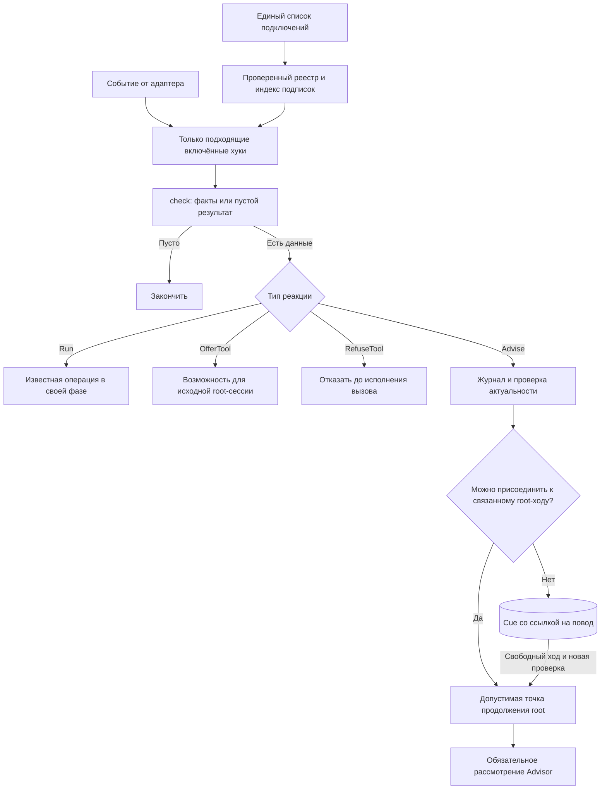
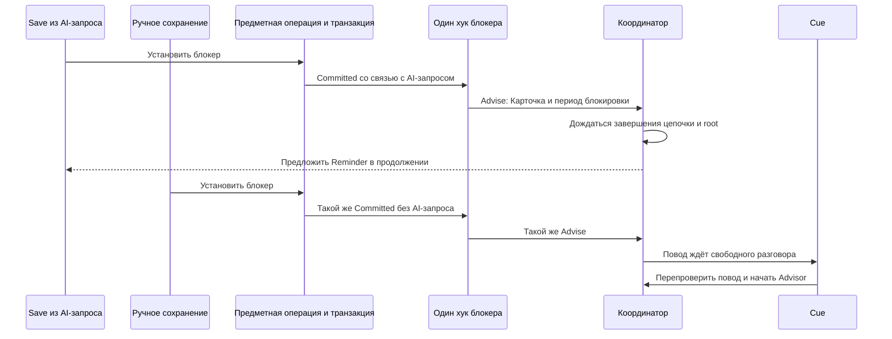
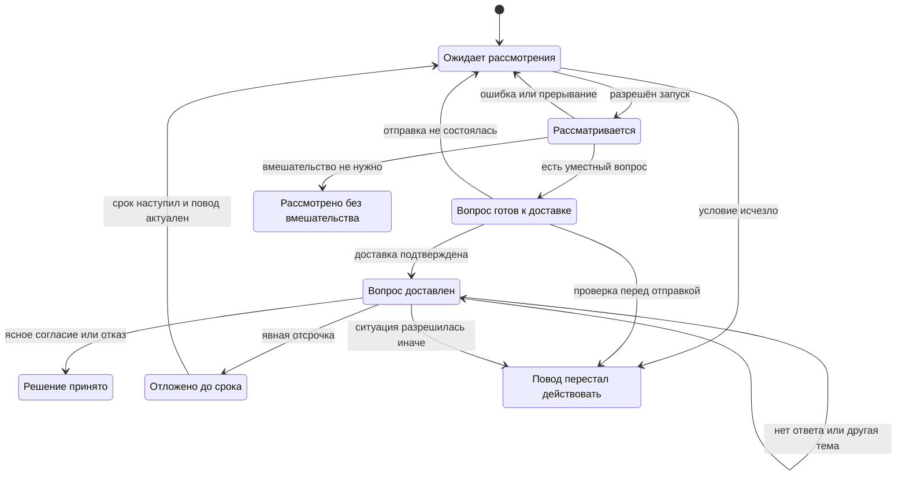
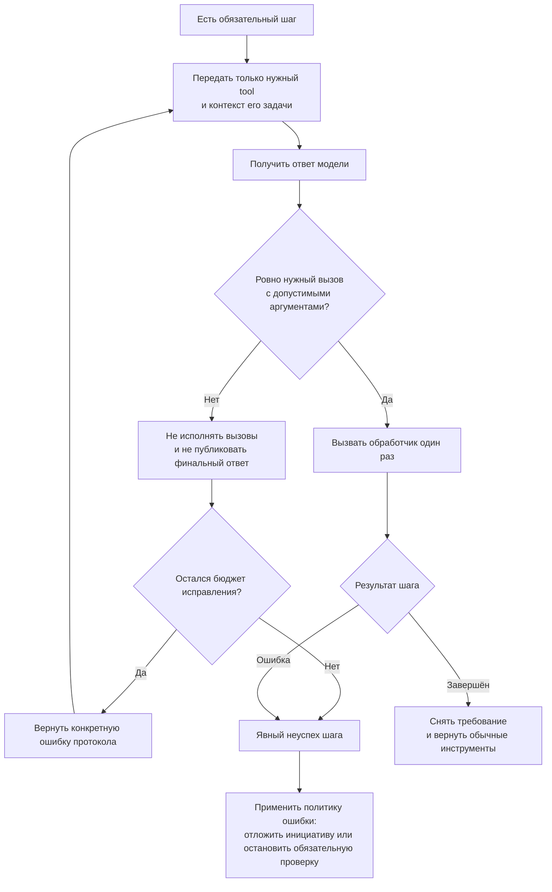

# Архитектура и реализация хуков Safwa

Проект для обсуждения, 2026-09-08. Описывает будущий контракт; приведённые ниже API и примеры
регистрации ещё не реализованы. Основание — [FUTURE_FEATURE.md](FUTURE_FEATURE.md),
[текущая архитектура](AGENT_ARCH.md) и [регистрация модулей](FEATURE_MODULES.md).
Этот документ уточняет порядок работы в [PLAN_FEATURES.md](PLAN_FEATURES.md).

## 1. Граница системы

Согласовано с владельцем: буквальный TOOL_USE для каждого хука не требуется. Хук может вызвать
служебную операцию напрямую, предоставить инструмент или привлечь Advisor.

Уточнено 2026-09-09: **хук — автоматическая реакция на конкретное событие жизненного цикла**:
завершение хода, границу вызова инструмента, сохранённое предметное изменение или наступление
проверки по времени. Нажатие кнопки, которая явно запускает запрошенную работу, вызывает её
workflow напрямую. Наличие внутри промпта, RAG или нескольких шагов не превращает workflow в хук.

«Анализ с ИИ» в ретроспективе — явный workflow. Ручная /summarize тоже вызывает
операцию напрямую; автоматический Summary после хода использует хук. Автоматически предложить
Heavy analyzer после чтения — хук; выполнить выбранный анализ — работа помощника. Запись обычного
запроса и ответа в историю не делает запускающий их workflow реакцией на изменение истории.
Отключение хуков не отключает эти явно запрошенные возможности.

Уточнено 2026-09-13: [план, подготовка и остановка Proposals](AGENT_ARCH.md#planned-proposal-plan-and-preparation-lifecycle)
принадлежат жизненному циклу самого запроса. Два сообщения — план и статус с Cancel — не
регистрируются как хуки. Показ review, удаление статуса, сохранение плана при остановке и его
удаление после успеха выполняет координатор Proposals. Он сохраняет обычную историю агентов.

**Валидатор исполнения — часть архитектуры Proposals.** Он вынесен в
[PROPOSAL_VALIDATION.md](PROPOSAL_VALIDATION.md), не регистрируется здесь и не зависит от
включения хуков. Дальше рассматриваются только хуки.

Основное предложение: **одно явное место подключения, общий контракт проверки события
и небольшой фиксированный набор реакций рантайма**. Универсальность получается из сочетания
этих частей. Условия конкретного хука остаются обычным кодом его фичи; реестр не пытается
описать всю предметную логику набором boolean.

## 2. Одно место, где видно все подключения

Предлагаю разместить явный список подключений в существующем
[bootstrap/modules.py](../src/safwa/bootstrap/modules.py), рядом с MODULES. Определение хука
экспортирует его фича; здесь выбирается, подключён ли он к автоматической работе.

Ниже — пример будущего API после реализации соответствующих хуков. Названия импортируемых
определений и новый аргумент hooks пока проектные.

```python
# В существующем bootstrap/modules.py.
from ..features.summary.module import SUMMARY_HOOK
from ..features.heavy_analyzer.module import HEAVY_ANALYZER_HOOK
from ..features.cards.module import BLOCKER_REMINDER_HOOK
from ..features.cards.module import EMPTY_GOALS_HOOK
from ..features.checks.module import REPEATED_MISSED_HOOK

HOOKS = (
    HookRegistration(SUMMARY_HOOK, enabled=True),
    HookRegistration(HEAVY_ANALYZER_HOOK, enabled=True),
    HookRegistration(BLOCKER_REMINDER_HOOK, enabled=True),
    HookRegistration(EMPTY_GOALS_HOOK, enabled=False),
    HookRegistration(REPEATED_MISSED_HOOK, enabled=False),
)

REGISTRY = Registry.of(MODULES, world=_world, hooks=HOOKS)
```

**Определение — одно; подключение — одно.** Определение содержит условие и способ реакции.
Центральная строка содержит ссылку на него и enabled. Список MODULES подключает фичи в целом,
а HOOKS — их автоматические реакции; регистрация проверяет, что фича-владелец действительно
входит в MODULES.

Я намеренно предлагаю явный список, а не автоматический сбор hooks из каждого FeatureModule:
тогда для ответа «что будет работать?» достаточно открыть этот список. Вторую регистрацию
тех же хуков в FeatureModule добавлять не нужно. Это выбор устройства будущего API, а не
описание уже существующего поля манифеста.

### Что означает включение

- Зарегистрирован и включён: подписки действуют; условие может дать работу.
- Зарегистрирован и выключен: определение видно в каталоге, но проверка условия не вызывается
  и отложенная инициатива не запускается.
- Не зарегистрирован: хук не существует для этого приложения.
- Запланирован, но ещё не реализован: остаётся в документах, а не представляется заглушкой
  в рабочем реестре.

Для первой версии переключатель задаётся при сборке приложения и применяется после запуска.
Изменяемые на лету настройки не нужны, чтобы получить обозримую регистрацию.

Отключение автоматического Summary не удаляет команду /summarize. Отключение предложения
Heavy analyzer не удаляет саму возможность помощника из его предметного контракта.
Реестр управляет автоматическими реакциями, а не существованием остальных функций фичи.

### Каталог получается из регистрации

В диагностике нужен вывод самого реестра, а не второй вручную поддерживаемый список:

| Хук | Подключён | События | Реакция |
|---|---|---|---|
| summary.window | да | окончание пользовательского хода | служебная операция |
| analyzer.offer | да | успешное чтение root | предоставить инструмент |
| blocker.follow-up | да | сохранённая установка блокера | обращение Advisor |
| goals.no-actions | нет | проверка по времени | обращение Advisor |
| checks.missed | нет | сохранённый ответ Check | обращение Advisor |

Это пример будущего вывода, не состояние текущего приложения. «Подключён» отличается от
«сейчас будет запущен»: для конкретного повода диагностика отдельно показывает причину ожидания,
подавления или завершения.

При сборке реестр отказывает при повторяющемся имени, неизвестной фиче-владельце, недопустимой
паре событие/реакция или ссылке на отсутствующий инструмент. Выключенные определения проходят
те же проверки, чтобы включение не обнаруживало скрытую ошибку регистрации.

## 3. Контракт: событие → проверка → реакция

Достаточно пяти частей определения. Переключатель enabled принадлежит подключению, а не
дублируется в определении.

| Поле | Что означает |
|---|---|
| name | Стабильное уникальное имя хука |
| owner | Фича, которая отвечает за его поведение |
| on | Одно или несколько типизированных событий с простыми фильтрами |
| check | Асинхронная проверка: получить событие и доступ к чтению, вернуть подходящие данные или пустой результат |
| effect | Один из поддерживаемых способов исполнения этих данных |

В условной типизации check принимает конкретный тип события E и возвращает последовательность
данных P; effect умеет обработать именно P. Пустая последовательность означает «ничего делать
не нужно». Возможность вернуть несколько результатов нужна, например, обходу целей по времени.

Не нужен один огромный объект контекста с необязательными полями «вдруг тут есть тулз,
сессия, карточка, ответ пользователя». Общими являются метаданные события: владелец/workspace,
время, происхождение и идентификатор причины. Содержимое зависит от типа события.

| Событие | Содержимое | Кто его создаёт |
|---|---|---|
| AfterTurn | Ссылка на закончившийся ход, его происхождение и ревизия диалога | Оболочка после ответа |
| AfterTool | Конкретный вызов, его результат, успех/ошибка, агент и исходный запрос | Адаптер результата инструмента |
| BeforeTool | Конкретный ещё не исполненный вызов, агент и исходный запрос | Диспетчер до исполнения |
| Committed | Вид предметного изменения, затронутые идентификаторы, причина, связь с запросом при её наличии | Общий путь сохранения после commit |
| Tick | Текущее время и имя назначенной проверки | Существующая фоновая работа приложения |

Названия событий в таблице — проектные. Они задают смысл, а не новые классы, которые уже есть
в коде. Для подписки Tick её описание включает правило следующего запуска, связанное с часами
при сборке. Имя проверки и расписание объявляются в том же on, а не в отдельном списке
таймеров. Значение «следующий запуск» не хранится в системном промпте.

У AfterTool есть результат вызова; у Tick его нет и не должно быть. Если один хук
подписан на Committed и Tick, его check явно разбирает эти два варианта. В первом он проверяет
затронутые объекты, во втором — подходящий набор по времени.

### Что может делать check

Проверка читает факты через явно переданные зависимости, формирует данные и ничего не отправляет.
Ей не передаётся весь Services, Telegram Bot или изменяемая AgentSession. Зависимости связываются
при запуске: например, чтение истории для Summary или предметный read API для Карточек.
Общая оболочка не импортирует таблицы Safwa.

Дорогая модель не нужна, чтобы узнать «блокер снят», «вопрос уже задавали» или «следующая проверка
ещё не наступила». Семантическое рассмотрение начинается в реакции, после допуска координатора.

### Четыре понятные реакции

Первые три нужны действующим и согласованным кандидатам. Четвёртая сохраняет конкретный смысл
входа «до тулза», где можно отказать в вызове. Это закрытые варианты, а не произвольные сочетания
флагов foreground, background, required, may_repeat и expects_answer.

| Реакция | Что получает | Что делает рантайм |
|---|---|---|
| Run | Аргументы известной служебной операции и её обработчик | Исполняет под существующим правом на ход, передаёт проверку актуальности и отмену |
| OfferTool | Ссылку на инструмент/помощника и краткое основание | Делает возможность доступной в исходной root-сессии со следующего обращения к модели |
| Advise | Смысловой повод, факты, инструмент рассмотрения и способ перечитать актуальные факты | Проверяет журнал, выбирает допустимый разговорный вход, получает результат Advisor и при необходимости доставляет вопрос |
| RefuseTool | Проверяемую причину отказа для текущего BeforeTool | Возвращает результат отказа; исходный вызов не исполняет |

Матрица допустимых подключений для первой версии: Run — AfterTurn, Tick и Committed;
OfferTool — AfterTool корневого агента; Advise — Committed, Tick и AfterTool корневого агента;
RefuseTool — только BeforeTool. Новый тип события добавляется адаптером при реальной
необходимости, а не имитируется одним из уже существующих.

Run может внутри вызвать модель, как нынешний Summary. OfferTool ничего не требует вызвать.
Advise обязательно выполняет допущенный шаг рассмотрения, но его результат может быть
«поддержать без вопроса» или «не вмешиваться». RefuseTool действует только на конкретный вызов;
это не альтернативный способ менять пользовательские данные.

У Advise есть свой контракт данных: субъект, эпизод, минимальные факты и привязка к причине.
Run не обязан притворяться инициативным вопросом и заводить эпизод отказа. Эта разница
выражена типом реакции, а не десятком пустых полей у каждого хука.

Сохраняемые данные Advise содержат значения и идентификаторы, а не живые объекты сессии,
обработчики или DB-соединения. При возобновлении определение находится по имени хука,
а refresh получает актуальные факты для того же субъекта и эпизода.

### Три примера определения

Синтаксис ниже иллюстрирует контракт. Функции и типы проектные; это не готовый код для вставки.

```python
SUMMARY_HOOK = HookSpec(
    name="summary.window",
    owner="summary",
    on=(AfterTurn(source="owner"),),
    check=summary_candidate,
    effect=Run(run=make_summary),
)

HEAVY_ANALYZER_HOOK = HookSpec(
    name="analyzer.offer",
    owner="heavy_analyzer",
    on=(AfterTool(agent="root", tool="query_data", outcome="success"),),
    check=complex_read_candidate,
    effect=OfferTool(helper="heavy_analyzer"),
)

BLOCKER_REMINDER_HOOK = HookSpec(
    name="blocker.follow-up",
    owner="cards",
    on=(Committed(kind="card.blocked"),),
    check=blocker_candidates,
    effect=Advise(
        tool=consider_blocker_follow_up,
        refresh=refresh_blocker_occasion,
    ),
)
```

В первом случае check передаёт подходящий законченный ход, а существующая операция сама
проверяет порог окна и при необходимости строит Summary. Не нужно дублировать её проверку
и чтение истории ради нового контракта.
Во втором check проверяет форму/объём уже полученного результата, а координатор предлагает
существующего помощника.
В третьем check находит конкретный период блокировки, а refresh перед разговором подтверждает,
что блокер ещё действует и follow-up не появился другим способом.

Текущая логика остаётся внутри соответствующих фич. Для нового Advise разработчик описывает
предметное условие, идентичность повода, получение актуальных фактов и инструмент рассмотрения.
Доставку, очередь, журнал и разбор пользовательского ответа он заново не реализует.

## 4. Почему один контракт работает в разных контекстах

**Событие несёт причину; реакция определяет допустимую работу; координатор выбирает момент.**
Ни один из этих трёх компонентов не обязан знать всё об остальных.



Реестр индексирует подписки по типу события и фильтрам. На каждый вызов query_data не нужно
запускать проверку пустых целей или сканировать расписание. Статическое включение и дешёвая
фильтрация проверяются до check, журнал — до семантической реакции.

### Таблица выбора момента

| Ситуация | Решение координатора |
|---|---|
| Закончен пользовательский ход, Run для Summary | Запустить после хода под фоновым lease; при новом сообщении отменить устаревшую попытку |
| Run возник из Committed | Дождаться устойчивого результата цепочки; выполнить в связанной работе или под фоновым lease, без разговорного Cue |
| Пришёл успешный результат root-чтения, OfferTool | Обновить возможности той же сессии перед следующим запросом к модели |
| Исходная сессия OfferTool уже закончилась | Отбросить предложение помощника; отдельный Cue из него не создавать |
| Advise возник из сохранения в текущем AI-запросе | Дождаться завершения зависимой цепочки и возврата в root; затем можно присоединить рассмотрение |
| Advise возник от ручного сохранения, активного AI-запроса нет | Сохранить повод; обратиться через Cue, когда интерфейс и ход свободны |
| Advise возник по времени, пользователь сейчас говорит о другом | Оставить инициативу до свободного хода; не внедрять её в чужую текущую работу |
| Root ждёт Save или работает субагент | Инициативу не показывать поверх этой работы |
| Сработал RefuseTool | Вернуть отказ синхронно в этот вызов; не отправлять его в очередь |

Для присоединения нужен идентификатор связанного запроса, допустимая фаза и отсутствие открытого
решения. Одной проверки «живая сессия есть» недостаточно. В сериализуемом событии хранится
идентификатор, а не ссылка на объект сессии; её состояние перечитывается при исполнении.

### Один и тот же блокер: AI и ручное сохранение



Сам хук в обоих случаях один и тот же. Он не реализует два обработчика доставки и не решает,
есть ли сейчас root-сессия. Отличается только связь события с выполняемой работой.

## 5. Адаптеры событий и ограничения

Исходных точек в проекте достаточно для начала, но их смысл нужно сохранить.

| Сейчас | Как использовать |
|---|---|
| [Summary после хода](../src/safwa/features/summary/telegram.py) | Существующую точку сделать источником AfterTurn; регистрацию Summary перенести в общий список |
| [Предложение помощника](../src/tg_agent_shell/ai/tools.py) и [его определение](../src/safwa/features/heavy_analyzer/module.py) | Условие предложения вынести в хук; контракт самого помощника и чтение оставить у него |
| [Наблюдатели тулзов](../src/tg_agent_shell/ai/tools.py) | Создают BeforeTool/AfterTool; учитывать, что текущий route обходит этот адаптер |
| [Рантайм](../src/agent_runtime/loop.py) | Управляет допустимыми инструментами, порядком исполнения и возвратом к root |
| [Сохранение Proposals](../src/tg_agent_shell/session.py) | Передаёт факт сохранения и связь с запросом; не выдаёт подготовку за сохранение |
| [Cue](../src/tg_agent_shell/cues/runtime.py) | Остаётся единственным путём отложенной разговорной инициативы |
| [TurnManager](../src/tg_agent_shell/turn/manager.py) | Сохраняет единственное право на foreground/background и отмену |

### Сохранённое изменение

Предметный use case записывает событие рядом с изменением, не вызывает изнутри Advisor и
не коммитит сам. Владелец транзакции публикует событие после commit; при rollback события нет.
AI и UI вызывают общий путь предметного сохранения, поэтому не приходится угадывать событие
по имени тулза или тексту его результата.

Для восстанавливаемых условий достаточно повторного чтения состояния по времени.
Для одноразового факта, который иначе потеряется при сбое после commit, в той же транзакции
нужно сохранить компактную запись для последующей обработки. Это не отдельная универсальная
шина: после обработки факт превращается в нужный повод/Cue. Идентификатор эпизода нельзя
строить из случайного времени каждого повторного чтения.

После каждой записи можно обнаружить кандидата, но рассматривать его следует после завершения
зависимой цепочки. Удаление старого ключевого Действия и добавление нового не должны породить
вопрос между этими двумя записями.

### Время и повторная проверка

Один существующий фоновый цикл вызывает только наступившие проверки из реестра; каждый хук
не заводит собственный бесконечный poll. Расписание назначает фича, расчёт использует часы и
часовой пояс рабочего пространства. Это расписание проверки условия, а не bool повторяемости
пользовательского вопроса.

На старте проверяются текущие условия, но пропущенные тики не воспроизводятся один за другим.
Пауза в работе не должна порождать десятки одинаковых утренних советов. Перед доставкой
перечитываются факты, а не используется старый снимок без проверки.

### До тулза

RefuseTool сохраняет простой уже существующий смысл: отказ означает, что вызов не произошёл.
Ошибка такой проверки не должна молча разрешать запрещаемую операцию. Для Run и Advise,
которые предлагают необязательную помощь, ошибку можно изолировать от основного запроса.
Политика ошибки выводится из реакции, а не задаётся новым флагом у каждого хука.

RAG с вопросом до создания сложнее простого отказа. Ему дополнительно нужен явный результат
«требуется решение», возврат из субагента к root и привязка согласия к конкретному намерению
создания. Это самостоятельная часть будущей RAG-фичи. Её нельзя объявить уже решённой тем, что
реестр принимает BeforeTool. В первой реализации общего контракта достаточно отказа без
исполнения; интерактивное продолжение проектируется вместе с RAG.

Это ограничение относится к перехвату обычного создания из кандидата 8. План и статус подготовки
Proposals не требуют такого перехвата или RAG. Продолжение после уточнения не должно обходить
терминальную остановку цепочки по Cancel, Discard или тексту поверх review.

### Привязка зависимостей

При запуске приложения регистрации связываются с небольшими read API и обработчиками своих
фич. Описания хуков и шаблоны инструментов статичны; факты текущего повода добавляются в
изменяемую часть контекста после диалога. [Порядок контекста](AGENT_ARCH.md#context-and-why-its-order-is-fixed)
уже отделяет его от неизменяемого системного префикса.

Система хуков в tg_agent_shell отвечает за подписки, поводы и доставку. agent_runtime получает
нейтральный обязательный шаг и изменения доступности инструментов; он не импортирует Card,
Sprint, Check или реестр фич Safwa.

## 6. Журнал поводов и ответы пользователя

### Идентичность

Для повода достаточно смыслового ключа: **владелец/workspace + тип хука + субъект + эпизод**.
Для повторной технической попытки используется тот же повод и отдельная запись исполнения.
Хэш допустим как представление ключа; он не должен включать всё содержимое Карточки.

| Хук | Один эпизод | Что не создаёт новый эпизод |
|---|---|---|
| Напоминание после блокера | Один период блокировки Действия; после снятия и новой блокировки период новый | Переименование или редактирование note |
| Повторные Missed | Серия Check и начало текущей последовательности Missed | Четвёртый Missed после предложения на третьем |
| Hard Time вне плана | Конкретное назначенное наступление у Действия/серии | Новое название Карточки или новый Sprint сами по себе |
| Перегруз Today | Календарная дата рабочего пространства | Рост с 16 до 17 EP |
| Цель без Действий | Период отсутствия Действий после льготного срока | Повторный утренний обход того же состояния |
| Откладываемое Действие | Тот же незавершённый экземпляр и его период откладывания | Следующий день без фактического завершения |
| Ключевые Действия Sprint | Первичная завершённая классификация без ключевых либо отдельный переход из непустого остатка в пустой | Каждый повторный SELECT пустого списка |

Хук задаёт правило завершения эпизода и начала следующего. Это часть поведения, которую нужно
протестировать: общий механизм не может вывести её из названий полей. Перенос Hard Time может
создать новый повод, если изменилось само назначенное наступление; простое пересчитывание
ближайшей даты повторения не должно терять идентичность ещё актуального наступления.

«Включить в Sprint» и «включить в Today» описываются самим хуком как один общий повод с разными
предложениями либо как два самостоятельных повода. Общее ядро не устанавливает это правило.
Для первой версии разумно считать отказ от планирования одного наступления общим, а явно узкий
ответ «в спринт да, но не сегодня» сохранить с соответствующим смыслом. Это рекомендация,
не уже утверждённое продуктовое решение.

### Группировка и отключение

Один период блокировки даёт один повод. Несколько целей без Действий дают отдельные поводы,
которые можно показать одним сообщением. Группировка доставки не склеивает их ключи: ответ
«для цели X — да» не считается решением по всем остальным целям.

Перед созданием попытки и перед доставкой проверяется, что хук по-прежнему подключён.
После перезапуска с выключенным хуком его недоставленные Cue не запускают Advisor; журнал
сохраняется, а очередь освобождается от этой инициативы. Повторное включение требует проверки
актуальности. Уже показанный вопрос не становится непоказанным из-за переключателя.

### Что хранить

Минимальная постоянная запись содержит смысловой ключ, актуальное состояние повода, время
следующей допустимой проверки, результат рассмотрения и связь с реально доставленным вопросом.
После ответа — решение и его область действия. Более широкий отказ «не предлагай для этой
Карточки» хранится как правило подавления для субъекта, иначе новый эпизод обойдёт отказ.

Отдельно хранятся результат исполнения принятого решения и техническая диагностика попытки.
Это разные измерения: «согласился» и «Reminder сохранён» могут разойтись.
Не нужно превращать каждый poll в новую строку истории; достаточно обновляемого состояния
повода и записей существенных переходов.



Диаграмма показывает основные переходы; актуальность проверяется при каждом возобновлении.
У «без вмешательства» также есть правило следующего рассмотрения: тот же эпизод не запускает
модель на каждом poll, но фича может назначить срок либо реагировать на значимое новое событие.

### Доставка — отдельная граница

Инструмент, который предложил вопрос, возвращает его как явный результат, связанный с поводом.
Публикуемый ответ несёт эту связь до отправки; вопрос не должен потеряться при свободном
пересказе Advisor. Например, подготовленный моделью текст вопроса можно включать отдельной
частью одного итогового сообщения, а не надеяться, что модель повторит его ещё раз.

Только успешная регистрация доставки отмечает вопрос показанным и сохраняет идентификатор
сообщения. `after_tool` для этого слишком рано. Если Advisor решил лишь поддержать пользователя,
это доставленная поддержка, а не вопрос, ожидающий решения.

Существующий `CueRuntime` уже проверяет зарегистрированный `event_id` перед повторной отправкой.
Эту связь надо использовать и для журнала: при сбое после регистрации сообщения восстанавливать
состояние повода, не задавая вопрос повторно. Между принятием сообщения Telegram и локальной
регистрацией остаётся отдельное окно сбоя. Обещать строго однократную доставку без механизма
сверки нельзя; неопределённую доставку надо отличать от доказанно не состоявшейся.

Очередь Cue хранит «это ещё нужно доставить», журнал — «это уже обсуждали и вот решение».
После доставки Cue удаляется, журнал остаётся. Для новых хуков Cue получает явную ссылку на
повод/задание, а не только текст; извлекать управляющий идентификатор из свободного текста нельзя.

### Обработка ответа

```mermaid
sequenceDiagram
    participant U as Пользователь
    participant R as Координатор
    participant A as Advisor
    participant J as Журнал
    participant P as Обычные Proposals
    R->>U: Доставленный вопрос о блокере
    R->>J: Вопрос показан, сообщение привязано к поводу
    Note over R,J: Ход освобождён; ожидание ответа не удерживает lease
    U->>R: Да, напомни завтра утром
    R->>A: Обязательный tool классификации этого ответа
    A->>R: Согласие, завтра утром
    R->>J: Записать решение для привязанного повода
    R->>A: Результат классификации; продолжай запрос
    A->>P: route и подготовка Reminder
    P->>U: Предложение с Save / Discard
    U->>P: Save
    P->>R: Подтверждение фактического сохранения
    R->>J: Принятое решение исполнено
    R->>U: Напоминание сохранено
```

Модель классифицирует смысл: согласие, отказ по этому поводу, отсрочка, более широкий запрет,
другая тема или неясность. Время переводится в конкретное значение с часовым поясом через
обычные правила расписания. Неясное «потом» не превращается в произвольную дату.

Рантайм заранее связывает вызов с показанным вопросом и конкретным входящим сообщением.
Модель не выбирает свободный идентификатор, который затем без проверки обновляется в БД.
Для кнопочного ответа классификация моделью не требуется: смысл уже задан кнопкой.

Важные ограничения:

- Следующее сообщение **может оказаться другой темой**, а не ответом на вопрос. Тогда ни отказ,
  ни согласие не записываются; обычный запрос пользователя продолжается.
- При нескольких старых вопросах учитывается явный reply и контекст. Голое «да» нельзя
  произвольно привязать к одному из них. Для первой версии достаточно одного текущего
  инициативного вопроса; он не блокирует чат бессрочно и со сменой темы перестаёт быть текущим.
- Отсутствие ответа не равно отказу. Но уже показанный необязательный вопрос обычно не нужно
  повторять без нового основания.
- Согласие не равно Save. Если последующий Proposal отвергнут или не сохранился, пользователь
  получает правдивый результат; журнал не утверждает, что действие выполнено.
- Discard зависимого Proposal останавливает весь неисполненный остаток этой цепочки, но не
  доказывает отказ от исходного намерения навсегда. Сохраняются фактические исходы, план и Receipt.
  Хук не возобновляет эту работу автоматически; дальнейшие изменения требуют нового запроса.
- Если классификация не удалась за отведённые попытки, решение остаётся неизвестным. Это не
  должно блокировать отдельный понятный запрос, пришедший в том же сообщении.

## 7. Как сделать обязательный вызов надёжным

Обязательный шаг означает: **следующее обычное действие не исполняется, пока шаг не завершён
успешно либо не выбран явный путь ошибки.** Это гарантия отсутствия обхода, а не гарантия того,
что любая модель когда-нибудь выдаст правильные аргументы.



Правила, которые должен проверять рантайм:

- Требование проверяется **до диспетчеризации всего ответа**. Если модель прислала нужный
  инструмент вместе с `route` или лишней мутацией, ответ отклоняется целиком без исполнения.
  Недостаточно проверить каждый вызов после уже исполненного соседа.
- Проверяется не только имя, но и схема аргументов. Повод, владелец и исходный запрос привязаны
  рантаймом: модель не выбирает произвольную чужую запись журнала.
- Для отклонённых вызовов сохраняются корректные результаты с их идентификаторами; нельзя
  оставить в истории вызовы без ответов. Текст «готово» не снимает требование.
- Неудачные ответы без тулзов тоже расходуют бюджет. Повторять бесконечно нельзя. Нужен небольшой
  отдельный предел исправления шага внутри существующего общего бюджета запроса.
- Ошибка необязательного совета не ломает успешно выполненный запрос пользователя. Ошибка
  обязательного рассмотрения инициативы оставляет её нерассмотренной и не превращается в отказ
  пользователя.
- Требование и результат переживают текущий suspend/resume. После завершения шага временный
  инструмент убирается; это отличается от нынешнего помощника, доступного до конца сессии.

Именованный `tool_choice` можно поддержать в шлюзе, но этот контроль нужен и при его наличии.
Нельзя рассчитывать, что настройки провайдера или инструкция «ОБЯЗАН» заменяют проверку.

## 8. Как не превратить помощь в поток вмешательств

Дедупликация одного повода не решает всё: утром могут одновременно возникнуть десять разных
поводов. Поэтому перед обращением к модели координатор выбирает уместную инициативу.

Для первой версии предлагается простая политика:

1. Сначала завершить запрос пользователя и необходимые ему операции. Инициатива не
   перехватывает исполнение, открытый Proposal или ввод в редактор.
2. Затем исполнить наступившее явное обязательство перед пользователем, например Reminder.
3. Среди советов сначала рассмотреть ближайший Hard Time, затем остальные актуальные поводы
   по времени ожидания. В один ответ включать не более одного инициативного вопроса.
4. Совместимые факты одного вида объединять: несколько целей без Действий — один список,
   а не пять сообщений. Дневная сводка и вопрос о Дневнике уже имеют согласованное правило
   одного сообщения с учётом двух переключателей.
5. После предложения выдерживать общую паузу перед следующим необязательным советом. Точный
   интервал — продуктовая настройка для проверки на реальном использовании, не техническая
   константа, придуманная в этом документе. Явные напоминания этой паузой не подавляются.

Эта политика — дополнение к нынешней очереди с выбором старейшего Cue. При её реализации нужно
сохранить один механизм доставки, добавив различение обязательства и необязательной инициативы,
а не создавать вторую конкурирующую очередь чата.

Дешёвая проверка условия и журнала предшествует LLM. Отказанный, уже показанный или пока
неактуальный повод не требует повторного семантического анализа. История разговора используется
только там, где действительно нужен смысл: выбор поддержки, формулировка вопроса, разбор ответа.

Каждая попытка сохраняет происхождение — пользовательский запрос, время, изменение данных,
предыдущее действие хука. Повторная обработка того же события не создаёт новую работу.
Результат хука может породить другой законный повод, поэтому запрещать все вложенные реакции
не нужно. Достаточно дедупликации, отложенного рассмотрения и общего бюджета; Summary не
запускается повторно от собственного служебного результата.

## 9. Проверка архитектуры на всём наборе кандидатов

Аудит классификации обновлён 2026-09-13. Номера соответствуют историческому каталогу POTENTIAL
HOOKS, а не означают, что каждый его пункт является хуком. Проверки пустых Goals читают только
Goal/Subgoal. Удаление существующих raw-capture Ideas запланировано отдельным пакетом.

| Кандидат | Подписка и реакция | Что особенно важно |
|---|---|---|
| Summary | AfterTurn → Run | Актуальный снимок; без журнала отказов и без повторного запуска от себя |
| Heavy analyzer | AfterTool → OfferTool | Не превращать нынешнее предложение помощника в безусловно обязательный анализ |
| План и подготовка Proposals | Собственный жизненный цикл запроса, без подписки | Обычная история; отдельный статус с Cancel; план остаётся при остановке и удаляется после успешной цепочки |
| Ручная /summarize, выбранный анализ ретроспективы или помощник | Прямой вызов операции/workflow | Возможность выполнить запрос не зависит от включения автоматических хуков |
| Onboarding | Сценарий знакомства/возвращения; условия автоматического старта ещё не согласованы | Сам диалог не хук. Возможный автоматический старт описывается отдельно своим событием и условием |
| 1, 4, 15 | Инструкции Advisor и нужный контекст | Не требуют общего движка хуков. В memory попадают согласованные выводы |
| 2. Блокер | Committed → Advise | Учесть ручную установку, уже существующий follow-up и снятие блокера до доставки |
| 5. Нет Действий | Tick → Advise | Проверять потомков всей ветви; брать только Goal/Subgoal; исключить завершённые/неактивные цели |
| 6. Часто откладывается | Tick и история Today → Advise | Нужна фактическая история одного незавершённого экземпляра, не его успешно выполненных предшественников |
| 7. Перегруз Today | Committed + Tick → Advise | Один день — один повод; отдельно согласовать учёт уже выполненных EP |
| 8. Похожие сущности | Перехват обычного создания: BeforeTool → отказ; интерактивное продолжение требует RAG-фичи | План Proposals не зависит от RAG. Сходство не означает идентичность |
| 9. Проверка исполнения | Жизненный цикл Proposals, без регистрации хука | Собственная архитектура в PROPOSAL_VALIDATION.md |
| 10. Ключевые Действия | Committed → служебная классификация; отдельный Advise при отсутствии остатка | Хранить статус классификации и связь Sprint–Действие; отличать выполненное от удалённого |
| 10. Порядок Today | Обычная логика экрана | Читает классификацию; открытие экрана не запускает хук сортировки |
| 11. Повторные Missed | Committed → Advise | Применимо и к самостоятельным Checks; Pending не считать Missed; поддержка может быть без вопроса |
| 13. Hard Time | Tick + Committed → Advise | Повод привязан к наступлению, а не к каждой новой версии плана |
| 14. Журнал | Общий учёт поводов, доставки и решений | Инфраструктура для инициатив, а не ещё один говорящий хук |
| 3, 12 | Ранее отклонены | В реализацию не включать |

Для хука 10 нужно разделить две операции: классификацию ключевых Действий и реакцию на отсутствие
оставшихся ключевых Действий. «Ещё не классифицировано» не равно пустому набору. Изменение
Success criteria требует перепроверки классификации. Выполнение всех ключевых Действий — повод
уточнить достижение успеха, а удаление — повод обсудить оставшийся план. Ни одно из этих событий
само по себе не доказывает неуспех Sprint.

Проверять такие переходы нужно по сохранённому состоянию эпизода и итогам цепочки, а не по
краткому промежуточному нулю в таблице. Классификацию можно реализовать до нового Hard Time;
от расписания зависит соответствующая часть порядка показа Today, а не сама связь с критерием.

## 10. Последовательность реализации

Каждый этап должен давать проверяемое поведение. Большой универсальный движок до первого
реального хука не нужен. Ниже перечислены будущие изменения, а не уже выполненная работа.

### Этап 1. Контракт и единственный список подключений

В оболочке добавить типы определения, подключения, подписки и реакций, проверку регистрации
и индекс подписок. В существующем [Registry](../src/tg_agent_shell/registry.py) принять список
подключений из [bootstrap/modules.py](../src/safwa/bootstrap/modules.py). В диагностике вывести
его имя, owner, enabled, события и реакцию.

Новые файлы общего механизма предлагаются внутри src/tg_agent_shell/hooks/.
Определения и предметные проверки — внутри фич, с экспортом через их существующий module.py.
Если добавляется hooks.py, его слой сборки и допустимые зависимости надо включить в проверку
архитектуры; бизнес-операции не должны импортировать координатор хуков.

Проверка этапа: дубликат имени и несовместимая подписка отвергаются при сборке; выключенный
хук виден в каталоге, но check не вызывается; приложение-пример без Safwa собирается с пустым
списком хуков. На этом этапе нет новых таблиц, Cue и вопросов пользователю.

### Этап 2. Перенести два существующих случая

**Summary:** источник AfterTurn вызывает общий диспетчер; check отбирает подходящий ход.
Run вызывает существующую операцию с её порогом окна, текущей проверкой снимка,
ревизией диалога и отменой. Команда /summarize продолжает вызывать ту же операцию напрямую.

**Heavy analyzer:** AfterTool передаёт успешное root-чтение. Условие предложения переносится
из специальной ветки инструментов в определение хука. OfferTool использует механизм
доступности и сохраняет его при suspend/resume. Сам HelperSpec сохраняет определение
помощника, инструкции, сборку и разрешённые чтения; правило автоматического предложения
больше не дублируется в нём.

Оба прежних автоматических пути отключаются в том же этапе. Нельзя одновременно оставить
Summary в after_turn и подключить его через новый реестр либо дважды оценивать предложение
помощника. Удалять следует заменённое специальное подключение, сохраняя нужные другим
потребителям точки оболочки.

Проверка этапа: прежние сценарии Summary и помощника проходят; один исходный факт даёт один
запуск; выключение каждого из двух подключений прекращает только его автоматическую реакцию.
После этого единый контракт уже обслуживает два разных типа работы без журнала решений.

### Этап 3. Добавить события сохранения и проверки по времени

Начать с Карточек. В [CardEvent](../src/safwa/features/cards/model.py) уже есть before/after,
а [операции Карточек](../src/safwa/features/cards/use_cases.py) записывают туда blocked.
Создание заблокированного Действия и переход false → true могут определить начало эпизода.
Переименование при неизменном blocked не начинает новый эпизод.

Фича читает эти переходы и публикует Committed после сохранения. Событие CardEvent можно
использовать как устойчивый идентификатор начала блокировки и как источник восстановления
после сбоя. Связь с текущим AI-запросом передаётся отдельно: существующий correlation_id
предметной операции не следует автоматически считать идентификатором root-сессии.
Восстанавливается только ещё актуальный период; вся старая история не превращается в вопросы.

Добавить адаптер Tick в существующую фоновую работу: расписания проверок читаются из подписок,
запускаются только наступившие включённые проверки. Для пустых целей достаточно состояния
БД, льготного срока и часов; поток всех прежних событий не нужен.

Проверка этапа: одинаковая установка блокера через UI и Proposal даёт одинаковые предметные
факты; rollback не даёт Committed; сбой после commit допускает восстановление из CardEvent.
Один дневной тик не исполняется заново на каждом обороте poll.

### Этап 4. Сделать Advise для одного блокера от начала до конца

1. Добавить постоянный учёт повода и решения с уникальностью по владельцу, хуку, субъекту и
   эпизоду. Начать с одного периода блокировки, без общего хранилища произвольных графов.
2. Связать событие с цепочкой запроса; после её завершения выбрать продолжение root либо Cue.
   Cue получает ссылку на повод. Доставку выполняет существующий механизм.
3. Добавить нейтральный обязательный шаг в agent_runtime для инструмента рассмотрения и
   классификации ответа. Проверка действует перед диспетчеризацией, включая route.
4. Реализовать результат рассмотрения: вопрос, поддержка без вопроса, отсутствие вмешательства
   или отсрочка. Отмечать доставку только после её регистрации.
5. По ответу записывать решение, затем продолжать обычный запрос через Proposals, если нужен
   Reminder. Сохранение Reminder фиксирует исполнение принятого решения.

Схема журнала — отдельная явно выделенная часть этого этапа со своей проверкой снимка.
Общий бюджет, отмена и единственное право на ход переиспользуются.
Проверка этапа: Save → вопрос → согласие → Reminder; Discard блокера → нет вопроса; отказ →
нет повтора; повторная доставка не создаёт второй повод; сбой отправки не считается показом.
Первый самостоятельный пользовательский сценарий хуков закончен именно здесь.

### Этап 5. Проверить другой вход и другой жизненный цикл

Подключить цели без Действий через Tick и повторные Missed через Committed. Здесь проверить
группировку отдельных поводов, паузу между инициативами, самостоятельный Check и новый эпизод
после восстановления. Если для каждого требуется новый способ доставки, значит граница
координатора ещё не выдерживает повторного использования.

Проверка этапа: оба хука добавляются определением, предметными чтениями и одной центральной
строкой; не появляется ещё один poll, редактор журнала ответов или цикл принуждения модели.

### Этап 6. Подключать остальные по готовности данных

| Фича | Что подготовить прежде всего |
|---|---|
| Перегруз Today | Согласованную шкалу и правило учёта завершённых EP |
| Часто откладываемое Действие | Историю дневного выбора одного незавершённого экземпляра |
| Hard Time вне плана | Вычисляемое расписание, идентичность наступления и смысл отказа |
| Ключевые Действия Sprint | Связь с критерием успеха, состояние классификации и причины выхода из остатка |
| RAG до создания | Проверенное извлечение кандидатов и отдельный протокол уточнения до операции |

BeforeTool и RefuseTool можно проверить как контракт адаптера без включения экспериментального
RAG. Для интерактивной RAG-фичи дополнительно понадобится согласованное продолжение после
решения; реестр не скрывает эту зависимость.

План и управляемая подготовка Proposals реализуются после Волны 1 независимо от общего реестра.
Хуки, которые позже приводят к Proposals, используют этот готовый жизненный цикл и уважают
его остановку. [План реализации](PLAN_FEATURES.md#follow-up--proposal-plan-and-cancel-planned)
не ставит RAG или журнал инициатив перед этой работой.

### Что пока не строить

Динамическую загрузку плагинов, язык условий, общую шину всех событий БД, произвольные графы
хуков и отдельные таймеры каждой фичи. Для описанных случаев достаточно обычного кода проверки,
центрального списка и четырёх определённых реакций.

Состояние эпизода и технической попытки не смешиваются. В БД нужна уникальность ключа, а не
неатомарная пара SELECT/INSERT; повтор операции учитывает уже записанный результат. Версия
определения полезна для диагностики, но обновление кода не снимает отказ пользователя.

## 11. Проверки всего механизма

Это будущие проверки поведения, не утверждение о существующих тестах.

| Ситуация | Ожидаемый результат |
|---|---|
| Выключенный хук и подходящее событие | check не вызывается; выключение видно в каталоге |
| Все хуки выключены, началась подготовка Proposals | План, статус с Cancel, review и Receipt работают своим жизненным циклом |
| Цепочка остановлена Cancel, Discard или текстом | Хук не возобновляет её и не удаляет оставленный план |
| Две регистрации одного имени, даже если одна выключена | Ошибка сборки |
| Несовместимая пара подписка/реакция | Ошибка сборки, а не молчаливый пропуск в рантайме |
| AfterTool с ошибкой или из субагента для root-помощника | Хук помощника не вызывается |
| Конец исходной сессии OfferTool | Не появляется самостоятельный разговор о помощнике |
| Данные одного блокера получены через UI и AI | Один смысл повода; разные допустимые входы в разговор |
| Тулз подготовил блокер, но пользователь выбрал Discard | Нет повода сохранённого блокера |
| Root ждёт Save или работает субагент | Инициативный вопрос не показывается поверх работы |
| Хук по времени сработал во время другого запроса | Ждёт, не перехватывает текущую задачу |
| Один факт заметили восстановление и завершение запроса | Один повод и одна активная попытка |
| Модель отвечает текстом вместо обязательного тулза | Нет обхода; ограниченное исправление, затем явный неуспех |
| Нужный tool пришёл вместе с route | Ничего не исполняется; все вызовы получают корректные результаты отказа |
| Сработал RefuseTool | Исходная операция не произошла |
| Вопрос готов, но отправка прервана | Нет ложной записи «показан» |
| Доставка зарегистрирована перед сбоем процесса | Восстановить состояние без повторного вопроса |
| Входящее сообщение оказалось другой темой | Не записывать выдуманное решение по поводу |
| Согласие дано, Reminder не сохранился | Согласие и неуспешное исполнение различаются |
| Переименование после отказа | Отказ остаётся в силе |
| Новый период блокировки / новая серия Missed | Может возникнуть новый повод по правилам фичи |
| Несколько поводов показаны одним сообщением | Решение по одному субъекту не применяется ко всем |
| Ключевое Действие заменяется зависимыми Proposals | Не оценивать промежуточное отсутствие ключевых |
| Summary строился по устаревшей истории | Не публиковать его результат |
| Перезапуск с выключенным хуком и его старым Cue | Не запускать его инициативу и не блокировать очередь |

Проверки регистрации и адаптеров следует дополнить существующими тестами сессий, Cue,
Summary, помощника и приложения-примера. Проверки предметного эпизода живут рядом с фичей.

## 12. Оставшиеся решения

До реализации общего механизма достаточно согласовать центральный список и четыре реакции.
Пороги EP, число Missed, утренний час и конкретная пауза между инициативами решаются при
реализации своих фич и не должны раздувать базовый контракт.

Для Advise нужно уточнить смысл отказа от Hard Time применительно к Sprint/Today и способ
снять более широкий запрет. Эти решения влияют на эпизоды и пользовательский опыт,
но не меняют место регистрации.

Критерий готовности общего решения: новый обычный хук требует собственного check, необходимых
предметных чтений, одной реакции и одной строки подключения. В нём нет самостоятельного
управления Telegram, сессиями, очередью или памятью о решении пользователя.
