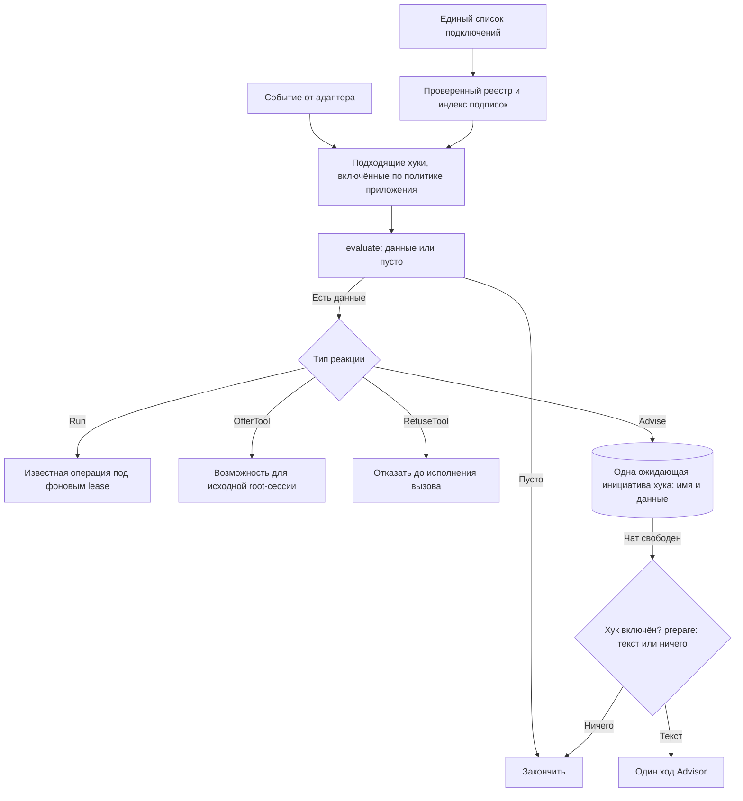

# Архитектура и реализация хуков tg-agent-shell

Начало реализации, 2026-09-15. Этапы 1–2 и батч 1 реализованы: общий реестр, автоматический
Summary, предложение Heavy analyzer и выключатели в Профиле. Хук с выключателем включается и выключается целиком, в Профиле,
руками владельца; хук без выключателя всегда включён. Инициатива — одна просьба к Advisor,
доставленная через Cue; ответ владельца — обычный следующий ход. Основание —
[FUTURE_FEATURE.md](FUTURE_FEATURE.md), [текущая архитектура](AGENT_ARCH.md) и
[регистрация модулей](FEATURE_MODULES.md). Этот документ уточняет порядок работы в
[PLAN_FEATURES.md](PLAN_FEATURES.md).

### Что работает сейчас

- [hooks/contracts.py](../src/tg_agent_shell/hooks/contracts.py) определяет данные событий,
  подписки, определения и две реакции: Run и OfferTool.
- [hooks/registry.py](../src/tg_agent_shell/hooks/registry.py) проверяет подключения и
  индексирует определения по типу события. Фильтры применяются до evaluate; одно определение
  проверяется один раз на событие. Хук с выключателем — HookSwitch в определении — перед
  evaluate и перед публикацией спрашивает политику приложения; Safwa отдаёт её из
  [profile/api.py](../src/safwa/features/profile/api.py), где набор выключенных хуков лежит
  в строке Профиля, а экран Профиля показывает каждый такой хук переключателем.
- AfterTurn содержит владельца, чат, исходное сообщение и ревизию диалога. OnAfterTurn
  фильтрует происхождение. Общий адаптер выполняет проверки и Run под одним фоновым lease.
  RunContext передаёт ресурсы приложения, проверку актуальности и публикацию обычного текста;
  операция Summary описывает нужный ей ресурс узким протоколом SummaryResources. Сам evaluate
  получает только событие. Telegram, Services и изменяемая сессия в evaluate не передаются.
- AfterTool содержит сессию-источник, роль и вид агента, вызов, копию результата и исход.
  QueryRead и ToolOutcome передают успех исполнения отдельно от строк результата: колонка
  status со значением error не превращает успешное SQL-чтение в ошибку инструмента.
  OnAfterTool фильтрует инструмент, роль и исход. OfferTool разрешён только после
  успешного root-вызова и выдаёт доступ к названному помощнику в той же сессии.
  Результат evaluate для OfferTool — последовательность текстов уведомления; для Run — данные
  операции. Имена разрешённых помощников сохраняются вместе с сессией при suspend/resume.
- Run после ошибки сообщает, что уже доставленный ответ остаётся в силе; ошибка
  необязательного предложения помощника попадает в журнал приложения и сохраняет результат
  чтения. Отмена не поглощается реестром.

Это две поддержанные пары событие/реакция. Неподдержанное подключение отвергается при сборке,
в том числе после route: этот вызов пока исполняется внутри agent_runtime и не проходит через
адаптер событий. До появления реального потребителя нет заглушек Committed, Tick, Advise и
RefuseTool. Прежние низкоуровневые before_tool/after_tool остаются самостоятельными портами
наблюдения; ими новый реестр не регистрируется. Схема БД и системный префикс не менялись.

## 1. Граница системы

Согласовано с владельцем: буквальный TOOL_USE для каждого хука не требуется. Хук может вызвать
служебную операцию напрямую, предоставить инструмент или обратиться к Advisor.

Уточнено 2026-09-09: **хук — автоматическая реакция на конкретное событие жизненного цикла**:
завершение хода, границу вызова инструмента, сохранённое предметное изменение или наступление
проверки по времени. Нажатие кнопки, которая явно запускает запрошенную работу, вызывает её
workflow напрямую. Наличие внутри промпта, RAG или нескольких шагов не превращает workflow в хук.

«Анализ с ИИ» в ретроспективе — явный workflow. Ручная /summarize тоже вызывает
операцию напрямую; автоматический Summary после хода использует хук. Автоматически предложить
Heavy analyzer после чтения — хук; выполнить выбранный анализ — работа помощника. Запись обычного
запроса и ответа в историю не делает запускающий их workflow реакцией на изменение истории.
Выключение хука не отключает эти явно запрошенные возможности.

**Инициатива хука заканчивается там, где Advisor задал вопрос.** Хук не знает, что владелец
ответил, и не хранит его решение. Ответ владельца — обычный следующий ход: Advisor видит диалог
и сам ведёт его дальше, например в Reminder через route. Владелец вправе не ответить вовсе.
«Больше не спрашивай» — это выключить хук в Профиле; Advisor говорит, где выключатель, и не
редактирует его сам.

**Валидатор исполнения — часть архитектуры Proposals.** Он вынесен в
[PROPOSAL_VALIDATION.md](PROPOSAL_VALIDATION.md), не регистрируется здесь и не зависит от
включения хуков. Дальше рассматриваются только хуки.

Основное предложение: **одно явное место подключения, общий контракт проверки события
и небольшой фиксированный набор реакций рантайма**. Универсальность получается из сочетания
этих частей. Условия конкретного хука остаются обычным кодом его фичи; реестр не пытается
описать всю предметную логику набором boolean.

## 2. Каталог и настройки

Явный список подключений находится в существующем
[bootstrap/modules.py](../src/safwa/bootstrap/modules.py), рядом с MODULES. Определение хука
экспортирует его фича; список выбирает, какие определения существуют для этого приложения.

```python
# В существующем bootstrap/modules.py.
from ..features.summary.module import SUMMARY_HOOK
from ..features.heavy_analyzer.module import HEAVY_ANALYZER_HOOK

HOOKS = (SUMMARY_HOOK, HEAVY_ANALYZER_HOOK)

REGISTRY = Registry.of(MODULES, world=_world, hooks=HOOKS)
```

**Определение — одно; строка в списке — одна.** Определение содержит имя, подписку, условие,
способ реакции и, если хук можно выключить, его выключатель — название и описание для
владельца. Список MODULES подключает фичи в целом, а HOOKS — их автоматические реакции;
регистрация проверяет, что фича-владелец действительно входит в MODULES. Подключение задаётся
явным списком, а не автоматическим сбором из каждого FeatureModule: чтобы ответить «что
существует», достаточно открыть этот список. Отдельный вывод в диагностике не нужен.

### Включение и выключение

У хука либо есть выключатель, либо нет. Хук с выключателем включён целиком или выключен
целиком; переключает его владелец руками в Профиле, как остальные настройки. Профиль показывает
каждый такой хук по названию и описанию — автоматический Summary среди них. Хук без выключателя
в Профиле не показан и всегда включён — как системный Reminder, который нельзя удалить;
предложение Heavy analyzer такое. Есть ли выключатель, решает определение хука, а не вид его
реакции. В Профиле хранится набор выключенных хуков; новому хуку своя колонка не нужна.

Оболочка получает от приложения одну политику включения — функцию «включён ли хук с этим
именем» — и ничего не знает о Профиле Safwa. Приложение-пример отдаёт политику, для которой
включено всё. Политика читается для хука с выключателем там, где он собирается работать:
перед evaluate, перед доставкой отложенной инициативы и перед публикацией результата фоновой
работы. Копии состояния в памяти нет, поэтому настройка действует без перезапуска и
сохраняется после него.

Что означает выключенный хук, после сохранения настройки:

- новые срабатывания не начинаются, условие не вычисляется;
- его ожидающие инициативы сняты с очереди — при сохранении настройки;
- результат уже идущей фоновой работы не публикуется;
- повторное включение не восстанавливает снятые инициативы.

Ничего, кроме включения, владелец не настраивает: ни исключений для отдельных Карточек и Целей,
ни журнала согласий и отказов, ни памяти «когда спрашивал». Хук, который по расписанию снова
напоминает о сохраняющейся проблеме, ведёт себя как задумано; не хочется — выключить целиком.
Настройки хуков не меняются через AI, инструменты или Proposal.

Выключение автоматического Summary не удаляет команду /summarize. Настройка управляет
автоматическими реакциями, а не существованием остальных функций фичи.

При сборке реестр отказывает при повторяющемся имени, неизвестной фиче-владельце, недопустимой
паре событие/реакция или ссылке на отсутствующий инструмент — независимо от того, включён хук в
Профиле или нет, чтобы включение не обнаруживало скрытую ошибку регистрации.

## 3. Контракт: событие → проверка → реакция

Ниже описан целевой контракт всех этапов. Сейчас реализованы только пары AfterTurn/Run и
AfterTool/OfferTool из раздела «Что работает сейчас»; подписки называются OnAfterTurn и
OnAfterTool, чтобы данные случившегося события не смешивались с фильтром будущих событий.

Шесть частей определения. Включённости среди них нет: она — настройка, не свойство определения.

| Поле | Что означает |
|---|---|
| name | Стабильное уникальное имя хука; им записана настройка и ожидающая инициатива |
| switch | Название и одно предложение для строки в Профиле; без него хук всегда включён и в Профиле не показан |
| owner | Фича, которая отвечает за его поведение |
| on | Одно или несколько типизированных событий с простыми фильтрами |
| evaluate | Асинхронная проверка: получить событие, вернуть подходящие данные или пустой результат |
| effect | Один из поддерживаемых способов исполнения этих данных |

evaluate принимает конкретный тип события и возвращает последовательность данных, которые
умеет исполнить именно этот effect. Пустая последовательность означает «ничего делать
не нужно».

Не нужен один большой объект контекста с необязательными полями «вдруг тут есть тулз,
сессия, карточка». Содержимое события зависит от его типа.

| Событие | Содержимое | Кто его создаёт |
|---|---|---|
| AfterTurn | Владелец, чат, исходное сообщение и ревизия диалога | Оболочка после ответа |
| AfterTool | Конкретный вызов, копия результата, исход, роль и вид агента | Адаптер результата инструмента |
| Committed | Вид предметного изменения и субъект, кто сохранил | Слушатель commit на фабрике сессий |
| Tick | Текущее время и имя наступившей проверки | Один фоновый цикл оболочки |
| BeforeTool | Конкретный ещё не исполненный вызов, агент и исходный запрос | Диспетчер до исполнения |

Committed, Tick и BeforeTool — проектные названия; классов в коде пока нет. Подписка Tick
несёт расписание проверки; имя проверки и расписание объявляются в том же on, а не в отдельном
списке таймеров. Значение «следующий запуск» не хранится в системном промпте.

### Что может делать evaluate

Проверка читает факты через явно переданные зависимости, формирует данные и ничего не отправляет.
Ей не передаётся весь Services, Telegram Bot или изменяемая AgentSession. Зависимости связываются
при запуске: например, чтение истории для Summary или предметный read API для Карточек.
Общая оболочка не импортирует таблицы Safwa.

Дорогая модель не нужна, чтобы узнать «блокер снят» или «Карточки больше нет». Смысл начинается
в реакции — у Advisor, когда Cue доставлен.

### Четыре реакции

Закрытые варианты, а не произвольные сочетания флагов foreground, background, required и
expects_answer.

| Реакция | Что получает от evaluate | Что делает рантайм |
|---|---|---|
| Run | Данные известной служебной операции | Исполняет её под фоновым lease, с проверкой актуальности и отменой |
| OfferTool | Тексты уведомления | Делает названного помощника доступным в исходной root-сессии со следующего обращения к модели |
| Advise | Данные будущей просьбы — например, ссылки на Карточки | Держит одну ожидающую инициативу хука в очереди Cue; перед доставкой фича готовит из данных текст просьбы или снимает инициативу |
| RefuseTool | Причину отказа | Возвращает отказ в этот вызов; исходный вызов не исполняет |

Матрица допустимых подключений: Run — AfterTurn, Tick и Committed; OfferTool — AfterTool
корневого агента; Advise — Committed и Tick; RefuseTool — только BeforeTool. Новый тип события
добавляется адаптером при реальной необходимости, а не имитируется одним из уже существующих.

Run может внутри вызвать модель, как нынешний Summary. OfferTool ничего не требует вызвать.
Advise состоит из двух функций фичи: evaluate на событии говорит, что стоит запомнить, а
prepare перед доставкой перечитывает предметные данные и возвращает текст просьбы — «Карточка X
заблокирована из-за Y; спроси владельца, напомнить ли ему вернуться к этому» — или ничего, если
просить больше не о чем. Что сказать владельцу, решает Advisor в этом ходе; что ответить и
отвечать ли — владелец в следующем. RefuseTool действует только на конкретный вызов; это не
альтернативный способ менять пользовательские данные.

### Три примера определения

Синтаксис ниже иллюстрирует контракт. Функции третьего примера проектные.

```python
SUMMARY_HOOK = HookSpec(
    name="summary.window",
    owner="summary",
    switch=HookSwitch(
        title="Automatic Summary",
        description="After a turn, folds a long dialogue window into a Summary.",
    ),
    on=(OnAfterTurn(source="owner"),),
    evaluate=summary_candidate,
    effect=Run(make_summary),
)

HEAVY_ANALYZER_HOOK = HookSpec(
    name="analyzer.offer",
    owner="heavy_analyzer",
    on=(OnAfterTool(tool="query_data"),),
    evaluate=complex_read_candidate,
    effect=OfferTool(helper="heavy_analyzer"),
)

BLOCKER_HOOK = HookSpec(
    name="blocker.follow-up",
    owner="cards",
    switch=HookSwitch(
        title="Blocker follow-up",
        description="After a Card is blocked, asks whether to set a Reminder to come back to it.",
    ),
    on=(OnCommitted(kind="card.blocked"),),
    evaluate=blocked_cards,
    effect=Advise(prepare=blocker_request),
)
```

В первом случае evaluate передаёт подходящий законченный ход, а существующая операция сама
проверяет порог окна и при необходимости строит Summary. Во втором evaluate проверяет форму и
объём уже полученного результата, а рантайм предлагает существующего помощника; выключателя у
этого хука нет. В третьем
evaluate возвращает ссылку на заблокированную Карточку, а prepare перед доставкой перечитывает
Карточки из инициативы: те, что существуют и всё ещё заблокированы, попадают в один текст
просьбы; если таких нет, инициатива снимается.

Для нового Advise разработчик пишет предметное условие, предметную проверку перед доставкой и
текст просьбы. Доставку, очередь, настройку и разговор он заново не реализует.

## 4. Почему один контракт работает в разных контекстах

**Событие несёт причину; реакция определяет допустимую работу; очередь выбирает момент.**



Реестр индексирует подписки по типу события и фильтрам. На каждый вызов query_data не нужно
запускать проверку пустых целей или сканировать расписание. Дешёвая фильтрация и политика
включения проверяются до evaluate.

| Ситуация | Что происходит |
|---|---|
| Закончен пользовательский ход, Run для Summary | Запуск после хода под фоновым lease; при новом сообщении устаревшая попытка отменяется |
| Успешный результат root-чтения, OfferTool | Возможность обновляется в той же сессии перед следующим запросом к модели |
| Исходная сессия OfferTool уже закончилась | Предложение отброшено; отдельный Cue из него не создаётся |
| Advise из сохранения — из Proposal или вручную | Инициатива ждёт свободного чата: после Save цепочка заканчивается, и очередь отдаёт просьбу Advisor |
| Второе срабатывание того же хука до доставки | Одна инициатива: её данные дополняются, второй Cue не появляется |
| Advise по времени, пока владелец говорит о другом | Инициатива ждёт; она не внедряется в чужую текущую работу |
| Root ждёт Save или работает субагент | Очередь не говорит поверх этой работы — это уже правило can_speak |
| Хук выключен, пока инициатива ждала | Инициатива снята при сохранении настройки; включение обратно ничего не возвращает |
| Блокер снят или Карточка удалена до доставки | prepare перечитывает данные: ни одной актуальной Карточки — инициатива снимается без хода Advisor |
| Сработал RefuseTool | Отказ возвращается синхронно в этот вызов; в очередь ничего не идёт |

Сохранение из AI-запроса и ручное сохранение идут одной дорогой: use case → commit → Committed →
evaluate → инициатива в очереди. Хук не различает, откуда пришло сохранение: после Save цепочка
заканчивается, и очередь доставляет просьбу первым свободным ходом.

## 5. Адаптеры событий и ограничения

| Сейчас | Как использовать |
|---|---|
| [Summary после хода](../src/safwa/features/summary/hooks.py) | Источник AfterTurn; Run вызывает существующую операцию |
| [Предложение помощника](../src/safwa/features/heavy_analyzer/hooks.py) | AfterTool; OfferTool выдаёт существующего помощника |
| [Наблюдатели тулзов](../src/tg_agent_shell/ai/tools.py) | Создают AfterTool; учитывать, что текущий route обходит этот адаптер |
| [Рантайм](../src/agent_runtime/loop.py) | Управляет допустимыми инструментами, порядком исполнения и возвратом к root |
| [Cue](../src/tg_agent_shell/cues/runtime.py) | Единственный путь отложенной разговорной инициативы; Advise держит в нём инициативу хука |
| [Профиль](../src/safwa/features/profile/use_cases.py) | Хранит набор выключенных хуков; его сохранение снимает инициативы выключенного хука |
| [TurnManager](../src/tg_agent_shell/turn/manager.py) | Сохраняет единственное право на foreground/background и отмену |

### Ожидающая инициатива

Инициатива от хука — строка Cue, в которой вместо готового текста записаны имя хука и данные
для подготовки актуальной просьбы: например, ссылки на Карточки, чтобы перед доставкой проверить,
существуют ли они и остаются ли заблокированными. Отдельная сущность «повод», журнал эпизодов и
ключи отказов владельца не нужны.

У одного хука одновременно ждёт одна инициатива. Новое срабатывание дополняет её данные —
для блокера это список затронутых Карточек — а не ставит второй Cue. Так несколько изменений
не дают очередь одинаковых вопросов, а снятие и повторная установка блокера до доставки дают
одно актуальное обращение. Что именно объединять и как, знает фича: оболочка хранит список
элементов данных и добавляет новые.

Перед обращением к Advisor очередь делает три шага: проверяет по политике, что хук включён;
вызывает prepare, который перечитывает предметные данные; получает актуальный текст просьбы
или снимает инициативу с очереди. Предметные проверки принадлежат фиче; оболочка не содержит
условий про Card, Goal или blocked. Защита Cue от повторной доставки сохраняется как есть — это
техника доставки, а не память об ответах владельца.

### Сохранённое изменение

Предметный use case кладёт факт изменения — вид и субъект — рядом с сессией БД, не вызывает
Advisor и не коммитит сам. Один слушатель after_commit на фабрике сессий передаёт накопленные
факты адаптеру после commit; при rollback фактов нет. AI и UI вызывают один и тот же use case,
поэтому не приходится угадывать событие по имени тулза, тексту результата или месту commit —
их несколько, и ни одно не правится.

Адаптер запускает evaluate и записывает инициативу вне транзакции сохранения. Сбой процесса
между commit и записью теряет одну подсказку, не данные; восстановление подсказок по истории
не строится.

Факт — переход, а не состояние: для блокера это Действие, которое стало заблокированным,
включая созданное сразу заблокированным. Переименование и правка описания блокера при
неизменном blocked факта не дают.

### Время

Один фоновый цикл оболочки вызывает только наступившие проверки из подписок; каждый хук
не заводит собственный poll. Расписание назначает фича, расчёт использует часы и часовой пояс
рабочего пространства. Цикл помнит последний запуск каждой проверки в памяти процесса, чтобы
дневной тик не исполнялся заново на каждом обороте; период, пропущенный пока Safwa не работала,
не воспроизводится пачкой после перезапуска. Хук по времени — обычная периодическая проверка:
в свой период он перечитывает состояние, и повторить просьбу о том же, что не изменилось,
для него нормально.

### До тулза

RefuseTool сохраняет простой смысл: отказ означает, что вызов не произошёл. Ошибка такой
проверки не должна молча разрешать запрещаемую операцию. Для Run и Advise, которые предлагают
необязательную помощь, ошибка изолируется от основного запроса. Политика ошибки выводится из
реакции, а не задаётся флагом у каждого хука.

RAG с вопросом до создания сложнее простого отказа: ему нужен возврат из субагента к root и
привязка согласия к конкретному намерению. Это самостоятельная часть будущей RAG-фичи; реестр
её не скрывает. Это ограничение относится к кандидату 8.

### Привязка зависимостей

При запуске приложения определения связываются с небольшими read API своих фич, а оболочка
получает политику включения. Система хуков в tg_agent_shell отвечает за подписки, очередь и
подготовку перед доставкой. agent_runtime не меняется: он не импортирует Card, Sprint, Check
или реестр фич Safwa.

## 6. Что хук помнит

**Только свою ожидающую инициативу.** Имя хука и данные в очереди Cue — единственное, что
переживает событие, и они исчезают при доставке, при снятии инициативы или при выключении хука.
Записей о прошлых вопросах, субъектах и ответах владельца нет.

**Актуальность — чтение перед доставкой, а не память.** «Блокер уже снят», «Карточки больше
нет», «Цель уже получила Действие» — prepare перечитывает это в момент доставки. Данные
инициативы говорят, куда смотреть, а не что было.

**Хук по расписанию повторяется по расписанию.** Tick перечитывает состояние в свой период и
готовит одно объединённое обращение; та же Цель без Действий в следующий период — обычное
поведение включённого хука. Отдельного правила «не раньше чем через N дней про тот же субъект»
нет; период хука — и есть его частота.

**Доставка — Cue, и только он.** Advisor получает текст просьбы как обычный запрос и отвечает
владельцу своими словами. Ответ владельца — обычный следующий ход, который Advisor читает вместе
с остальным диалогом. Молчание ничего не означает и ничего не запускает. Отказ и отсрочка —
слова в диалоге, как любые другие; «никогда» — выключатель в Профиле.

**Одна инициатива на хук, одна за раз в чате.** Существующая очередь берёт старейший Cue и
говорит только когда can_speak. Несколько Целей без Действий — один текст просьбы, а не пять Cue.

## 7. Проверка архитектуры на всём наборе кандидатов

Номера соответствуют историческому каталогу POTENTIAL HOOKS, а не означают, что каждый его пункт
является хуком. Проверки пустых Goals читают только Goal/Subgoal.

| Кандидат | Подписка и реакция | Что особенно важно |
|---|---|---|
| Summary | AfterTurn → Run | Актуальный снимок; без повторного запуска от себя |
| Heavy analyzer | AfterTool → OfferTool | Не превращать предложение помощника в обязательный анализ; выключателя нет |
| Ручная /summarize, выбранный анализ ретроспективы или помощник | Прямой вызов операции/workflow | Возможность выполнить запрос не зависит от включения хуков |
| Onboarding | Условия автоматического старта не согласованы | Сам диалог не хук |
| 1, 4, 15 | Инструкции Advisor и нужный контекст | Не требуют движка хуков |
| 2. Блокер | Committed → Advise | Список Карточек в одной инициативе; перед доставкой остаются существующие и всё ещё заблокированные |
| 5. Нет Действий | Tick → Advise | Обход всей ветви; только Goal/Subgoal; одно обращение за период |
| 6. Часто откладывается | Tick → Advise | Нужна история дневного выбора одного экземпляра, которой пока нет |
| 7. Перегруз Today | Committed или Tick → Advise | Правило учёта выполненных EP не согласовано |
| 8. Похожие сущности | BeforeTool → RefuseTool; интерактивное продолжение — RAG-фича | Сходство не означает идентичность |
| 9. Проверка исполнения | Жизненный цикл Proposals, без регистрации хука | Собственная архитектура в PROPOSAL_VALIDATION.md |
| 10. Ключевые Действия | Committed → служебная классификация; отдельный Advise при пустом остатке | Хранить статус классификации; отличать выполненное от удалённого |
| 11. Повторные Missed | Committed → Advise | Pending не считать Missed; серия Missed — переход |
| 13. Hard Time | Tick → Advise | Просьба привязана к наступлению, не к версии плана |
| 14. Память хуков | Не нужна: ожидающая инициатива и период хука | Выключатель в Профиле — единственное «больше не надо» |
| 3, 12 | Ранее отклонены | В реализацию не включать |

## 8. Последовательность реализации

Каждый батч — одна новая пара событие/реакция или один новый порт, один реальный потребитель
и одна строка в HOOKS. Пара без потребителя не появляется. Этапы 1–2 выполнены.

### Этап 1. Контракт и единственный список подключений — реализован

Оболочка содержит типы определения, подписки и двух работающих реакций, проверку
регистрации и индекс подписок. [Registry](../src/tg_agent_shell/registry.py) принимает список
из [bootstrap/modules.py](../src/safwa/bootstrap/modules.py); этот список и есть ответ на вопрос
«что существует».

Общий механизм находится внутри src/tg_agent_shell/hooks/; определения — в hooks.py фич,
с экспортом через module.py. Архитектурная проверка относит hooks.py к сборке, запрещает
бизнес-операциям импортировать механизм хуков и удерживает его ниже адаптеров оболочки.

### Этап 2. Перенести два существующих случая — реализован

**Summary:** источник AfterTurn вызывает общий диспетчер; evaluate отбирает подходящий ход.
Run вызывает существующую операцию с её порогом окна, проверкой снимка, ревизией диалога и
отменой. Команда /summarize продолжает вызывать ту же операцию напрямую.

**Heavy analyzer:** AfterTool передаёт успешное root-чтение. Условие предложения перенесено из
специальной ветки инструментов в определение хука. OfferTool использует механизм доступности и
сохраняет его при suspend/resume. HelperSpec держит определение помощника, инструкции, сборку и
разрешённые чтения; правило автоматического предложения в нём не дублируется.

Оба прежних автоматических пути удалены. Низкоуровневые наблюдатели инструментов сохранены;
их прежние сценарии продолжают проверяться.

### Батч 1. Профиль и существующие хуки — реализован

Определение получает выключатель — название и описание для владельца — или обходится без
него. Профиль показывает каждый хук с выключателем и хранит набор выключенных; оболочка получает
политику включения и читает её для таких хуков перед evaluate и перед публикацией фоновой
работы. Список HOOKS — кортеж определений. Одна колонка в Профиле — это schema-батч с
пересборкой базы.

Проверка батча: переключение действует без перезапуска и сохраняется после него; выключенный
хук не вычисляется; хук без выключателя не показан и включён при любой политике; /summarize
работает при выключенном автоматическом Summary; приложение без Профиля Safwa собирается со
своей политикой.

### Батч 2. Отложенная инициатива по блокеру

Первый потребитель — хук 2, и первый Advise. [Операции Карточек](../src/safwa/features/cards/use_cases.py)
кладут факт «Действие стало заблокированным» рядом с сессией БД, слушатель after_commit отдаёт
его адаптеру, evaluate возвращает ссылку на Карточку, инициатива хука в очереди Cue получает
её в свой список. Перед доставкой prepare перечитывает Карточки и готовит одну просьбу с
актуальным названием и описанием блокера — или снимает инициативу.

Новое в оболочке: подписка на Committed, реакция Advise, слушатель commit, имя хука и данные в
строке Cue, объединение срабатываний одного хука и три шага перед доставкой. Новое в Safwa:
hooks.py у Карточек, одна строка в HOOKS и снятие инициатив при выключении хука в Профиле.
Связь Card → Reminder не добавляется, и обнаружение уже существующего Reminder не обещается.

Проверка батча: блокер через UI и через Save даёт одну и ту же просьбу; после Discard или
rollback инициативы нет; ожидающая инициатива переживает перезапуск; два блокера до доставки —
одна просьба о двух Карточках; блокер снят или Карточка удалена до доставки — просьбы о ней нет;
хук выключен до доставки — просьбы нет.

### Батч 3. Первый хук по времени

Второй потребитель Advise — хук 5, и второй вход. Сначала фиксируется расписание первого
сценария, затем добавляется проверка Целей без Действий: один фоновый цикл оболочки читает
расписания из подписок и вызывает наступившие проверки; льготный срок и час проверки — константы
фичи. Таблиц нет.

Проверка батча: хук добавляется определением, предметным чтением и одной строкой; не появляется
ещё один poll, второй путь доставки и разбор ответа. Один дневной тик не исполняется заново на
каждом обороте. Несколько Целей — один текст. Тот же результат в следующий период — новая
просьба, а ожидающие обращения не накапливаются. Если второй вход потребовал второго пути
доставки, чинить нужно границу, а не хук.

### Этап 5. Остальные по готовности данных

| Фича | Что подготовить прежде всего |
|---|---|
| Повторные Missed | Определение перехода для серии Missed |
| Перегруз Today | Согласованную шкалу и правило учёта завершённых EP |
| Часто откладываемое Действие | Историю дневного выбора одного незавершённого экземпляра |
| Hard Time вне плана | Вычисляемое расписание и идентичность наступления |
| Ключевые Действия Sprint | Связь с критерием успеха и состояние классификации |
| RAG до создания | Проверенное извлечение кандидатов и протокол уточнения до операции |

BeforeTool и RefuseTool можно проверить как контракт адаптера без включения экспериментального
RAG.

### Что не строить

Динамическую загрузку плагинов, язык условий, общую шину всех событий БД, произвольные графы
хуков, отдельные таймеры каждой фичи, исключения для отдельных сущностей, таблицу «когда
спрашивал», журнал ответов владельца, разбор его ответов и правку настроек хуков из AI. Для
описанных случаев достаточно обычного кода проверки, центрального списка, выключателя в
Профиле, четырёх реакций и очереди Cue.

## 9. Проверки всего механизма

Регистрация, две действующие реакции и выключатели проверяются в
[test_hooks.py](../tests/test_hooks.py), [test_summary.py](../tests/test_summary.py),
[test_profile_ui.py](../tests/test_profile_ui.py),
[test_heavy_analyzer_e2e.py](../tests/e2e/test_heavy_analyzer_e2e.py) и приложении-примере
с запрещённым импортом Safwa. Строки о Committed, Tick и Advise — будущие.

| Ситуация | Ожидаемый результат |
|---|---|
| Хук выключен в Профиле, подходящее событие | evaluate не вызывается |
| Хук без выключателя | В Профиле не показан; включён при любой политике |
| Выключен во время фоновой работы | Её результат не публикуется |
| Выключен, пока инициатива ждала | Инициатива снята; включение обратно её не возвращает |
| Перезапуск | Настройка та же; ожидающая инициатива на месте |
| Две регистрации одного имени | Ошибка сборки |
| Несовместимая пара подписка/реакция | Ошибка сборки, а не молчаливый пропуск в рантайме |
| AfterTool с ошибкой или из субагента для root-помощника | Хук помощника не вызывается |
| Конец исходной сессии OfferTool | Не появляется самостоятельный разговор о помощнике |
| Блокер сохранён через UI и через AI | Одна и та же просьба, одна дорога |
| Тулз подготовил блокер, но владелец выбрал Discard | Нет Committed, нет инициативы |
| Rollback после записи факта | Нет Committed |
| Переименование заблокированной Карточки | Нет нового срабатывания |
| Второй блокер до доставки первого | Одна инициатива, одна просьба о двух Карточках |
| Блокер снят или Карточка удалена до доставки | Просьбы о ней нет; пустая инициатива снята |
| Root ждёт Save или работает субагент | Инициатива ждёт; can_speak как прежде |
| Хук по времени сработал во время другого запроса | Инициатива ждёт, не перехватывает текущую задачу |
| Один тик и несколько оборотов poll | Одна проверка |
| Та же Цель без Действий в следующий период | Новая просьба; ожидающие не накапливаются |
| Сработал RefuseTool | Исходная операция не произошла |
| Summary строился по устаревшей истории | Не публиковать его результат |

## 10. Оставшиеся решения

Пороги EP, число Missed, час проверки и льготный срок решаются при реализации своих фич и не
раздувают базовый контракт.

Критерий готовности общего решения: новый хук добавляет свою предметную проверку, действие и
одну строку подключения. Он использует готовые настройки и доставку и не строит собственную
память диалога с владельцем: в нём нет управления Telegram, сессиями, очередью или записей о
решении владельца.
