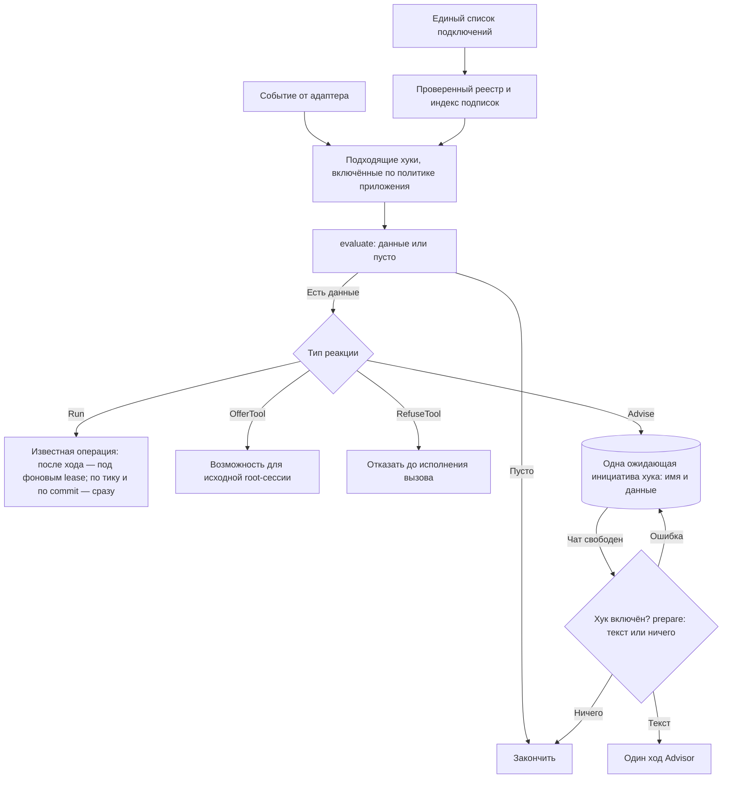

# Хуки tg-agent-shell

Текущий контракт событий, проверок и реакций. Регистрируй подключения в списке HOOKS приложения;
предметная проверка принадлежит фиче.

### Что работает сейчас

- [hooks/contracts.py](../src/tg_agent_shell/hooks/contracts.py) определяет данные событий,
  подписки, определения и семь реакций: Run, OfferTool, RefuseTool, Advise, ReturnProposals,
  HoldAnswer и SaveProposal.
- [hooks/registry.py](../src/tg_agent_shell/hooks/registry.py) проверяет подключения и
  индексирует определения по типу события. Фильтры применяются до evaluate; одно определение
  проверяется один раз на событие. Хук, чей эффект доходит до агента (agent_related:
  OfferTool, RefuseTool или Advise), перед evaluate и перед словами спрашивает политику приложения; Safwa
  отдаёт её из [profile/api.py](../src/safwa/features/profile/api.py), где набор выключенных
  хуков лежит в строке Профиля. Кнопка Hooks в Профиле открывает список; каждый хук имеет свой
  экран с описанием и переключателем. В тексте Профиля списка хуков нет.
  Хук с полем switch — зависимый: своего выключателя у него нет, политику реестр спрашивает по
  имени того хука, которого он называет, и в Профиле его нет.
- BeforeTurn содержит владельца, чат, ревизию диалога и происхождение хода. OnBeforeTurn
  не фильтрует ничего: любой ход — слово владельца или просьба из очереди Cue. Адаптер
  run_before_turn в [telegram/dialogue.py](../src/tg_agent_shell/telegram/dialogue.py)
  исполняет Run внутри отменяемого хода, после чтения диалога и до вызова модели; из хода
  владельца его зовёт run_dialogue_turn, из хода очереди — задача, которую CueRuntime.speak
  запускает через start_background. Ошибка — в журнал, ход идёт дальше.
- AfterTurn содержит владельца, чат, исходное сообщение и ревизию диалога. OnAfterTurn
  фильтрует происхождение. Общий адаптер выполняет проверки и Run под одним фоновым lease.
  RunContext передаёт ресурсы приложения, фабрику сессий, проверку актуальности и публикацию
  обычного текста; по тику публикация уходит, пока чат свободен и владелец не действовал с того
  взгляда, по commit её нет — слова идут через записанный факт и Advise-хук;
  операция Summary описывает нужный ей ресурс узким протоколом SummaryResources. Сам evaluate
  получает только событие. Telegram, Services и изменяемая сессия в evaluate не передаются.
- AfterTool содержит сессию-источник, роль и вид агента, вызов, копию результата и исход.
  QueryRead и ToolOutcome передают успех исполнения отдельно от строк результата: колонка
  status со значением error не превращает успешное SQL-чтение в ошибку инструмента.
  OnAfterTool фильтрует инструмент, роль и исход. OfferTool разрешён только после
  успешного root-вызова и выдаёт доступ к названному помощнику в той же сессии.
  Результат evaluate для OfferTool — последовательность текстов уведомления; для Run — данные
  операции. Имена разрешённых помощников сохраняются вместе с сессией при suspend/resume.
- BeforeTool — вызов инструмента, который ещё не исполнен: агент, инструмент и аргументы.
  OnBeforeTool фильтрует инструмент и роль; RefuseTool разрешён только там. Уведомление
  проверки становится результатом вызова, сам вызов не исполняется, названный помощник
  выдаётся так же, как у OfferTool. Ошибка проверки — не пропуск: ход заканчивается, вызов
  не исполнен. Потребитель — Heavy analyzer: чтение сложнее одного плоского скана не
  исполняется Advisor вовсе.
- Run после ошибки сообщает, что уже доставленный ответ остаётся в силе; ошибка
  необязательного предложения помощника попадает в журнал приложения и сохраняет результат
  чтения. Отмена не поглощается реестром.
- Committed — факт из [foundation/changes.py](../src/tg_agent_shell/foundation/changes.py):
  операция записывает его рядом со своей транзакцией через record_change, слушатель
  after_commit в [cues/initiatives.py](../src/tg_agent_shell/cues/initiatives.py) отдаёт факты
  реестру после commit, а rollback их стирает. OnCommitted фильтрует вид изменения. Advise
  записывает каждую находку хука строкой Cue — имя хука и данные, без слов; когда чат
  свободен, очередь словит все строки хука одной просьбой, спросив слова у реестра (prepare
  фичи) и проверив выключатель.
  Первый потребитель — блокер Карточек в [cards/hooks.py](../src/safwa/features/cards/hooks.py).
  Там же cards.parent_completion получает card.actions_finished после закрытия последнего
  Действия в ветке. Перед доставкой он проверяет открытые Цели и Подцели и предлагает
  закрыть их явно или создать новое Действие; сами родители автоматически в Done не переходят.
  Run на Committed делает свою работу, как только факты этого commit переданы, вне очереди,
  в которой они передаются: следующий commit не ждёт вызова модели. Ресурсы приложения
  CommittedSink получает при привязке (bind_committed). Первый потребитель — классификатор
  ключевых Действий в [planning/hooks.py](../src/safwa/features/planning/hooks.py).
- Tick — наступление дневной проверки: подписка OnTick(at=...) называет читателя времени
  (TickTime), и читатель — тождество дневного времени: хуки с одним читателем делят один
  Tick. Safwa отдаёт из [profile/api.py](../src/safwa/features/profile/api.py) поля Профиля:
  «Morning time» (MORNING_TIME_DEFAULT = "09:00") утренним проверкам, «Diary time» —
  напоминанию о Дневнике, «Daily summary» — дневному итогу. Один цикл оболочки — TickPoll в
  [cues/initiatives.py](../src/tg_agent_shell/cues/initiatives.py) над TickSchedule из
  [hooks/ticks.py](../src/tg_agent_shell/hooks/ticks.py) — на каждом обороте читает каждого
  читателя один раз и отдаёт наступившие Tick тем же hand_on, что и Committed. Последний
  взгляд хранится в памяти процесса, запуск считается первым: время, прошедшее при
  остановленном или выключенном хуке, не догоняется, а перенесённое владельцем время действует
  со следующего наступления без перезапуска. Потребители Advise по времени — Цели и Подцели без
  Действий, Schedule вне плана и Отдых в Today в том же cards/hooks.py: evaluate возвращает
  одну отметку «пора», а список читает prepare в момент доставки. Подписка OnTick(every=...)
  вместо читателя называет интервал от TICK_EVERY_MIN = 30 секунд до TICK_EVERY_MAX = 24 часа:
  такой Tick наступает на первом взгляде после того, как интервал прошёл с прошлого запуска.
  Каждый Tick несёт чат владельца, каким его увидел взгляд, — ChatState. Потребители Run по
  интервалу — Home dashboard, срабатывание Reminders, перенос памяти из ретро и повтор
  несобранных Schedule: своего цикла у фичи нет.
- Schedules в [schedules/hooks.py](../src/safwa/features/schedules/hooks.py): schedules.compile —
  Run на schedule.changed, читает моделью одну новую ревизию после commit и отбрасывает
  результат, если ревизию за это время сменили; schedules.recover — Run на Started и каждый час,
  снова читает ревизии, которые модель не дочитала; schedules.clarify — Advise на
  schedule.unclear, один вопрос на неясную ревизию. Текст, набранный в редакторе, читается до
  записи и хуков не ждёт ([SCHEDULES.md](SCHEDULES.md)).
- Started — запуск приложения: оболочка сверила то, что оставил перезапуск, первое сообщение
  ещё не принято. OnStarted без фильтров, допустим только Run. Композиционный корень отдаёт
  Started один раз через hand_on_start в
  [cues/initiatives.py](../src/tg_agent_shell/cues/initiatives.py) после recover_startup и до
  long polling; ниже, «Старт».
- BeforeProposals, BeforeReview и AfterRequest — три границы Proposals, на которых стоят
  проверки работы модели: ReturnProposals, SaveProposal и HoldAnswer (ниже, «До подготовки»,
  «Перед экраном» и «Перед ответом»).

Это поддержанные пары событие/реакция. Неподдержанное подключение отвергается при сборке,
в том числе после route: этот вызов пока исполняется внутри agent_runtime и не проходит через
адаптер событий. Других портов наблюдения за вызовами у фичи нет.

## 1. Граница системы

Согласовано с владельцем: буквальный TOOL_USE для каждого хука не требуется. Хук может вызвать
служебную операцию напрямую, предоставить инструмент или обратиться к Advisor.

Уточнено 2026-09-09: **хук — автоматическая реакция на конкретное событие жизненного цикла**:
завершение хода, границу вызова инструмента, сохранённое предметное изменение, наступление
проверки по времени или запуск приложения. Нажатие кнопки, которая явно запускает запрошенную работу, вызывает её
workflow напрямую. Наличие внутри промпта, RAG или нескольких шагов не превращает workflow в хук.

«Анализ с ИИ» в ретроспективе — явный workflow. Ручная /summarize тоже вызывает
операцию напрямую; автоматический Summary после хода использует хук. Не исполнить сложное
чтение и предложить Heavy analyzer — хук; выполнить выбранный анализ — работа помощника. Запись обычного
запроса и ответа в историю не делает запускающий их workflow реакцией на изменение истории.
Выключение хука не отключает эти явно запрошенные возможности.

**Инициатива хука заканчивается там, где Advisor задал вопрос.** Хук не знает, что владелец
ответил, и не хранит его решение. Ответ владельца — обычный следующий ход: Advisor видит диалог
и сам ведёт его дальше, например в Reminder через route. Владелец вправе не ответить вовсе.
«Больше не спрашивай» — это выключить хук в Профиле; Advisor говорит, где выключатель, и не
редактирует его сам.

**Проверка исполнения — хуки на трёх границах Proposals.** BeforeProposals читает ответ
субагента до подготовки его вызовов, BeforeReview — предложение в голове очереди до его экрана,
AfterRequest — ответ на сообщение владельца до отправки; все три границы поднимает
`ProposalMaterializer` (ниже, «До подготовки», «Перед экраном» и «Перед ответом»).

Основное предложение: **одно явное место подключения, общий контракт проверки события
и небольшой фиксированный набор реакций рантайма**. Универсальность получается из сочетания
этих частей. Условия конкретного хука остаются обычным кодом его фичи; реестр не пытается
описать всю предметную логику набором boolean.

## 2. Каталог и настройки

Явный список подключений находится в существующем
[bootstrap/modules.py](../src/safwa/bootstrap/modules.py), рядом с MODULES. Определение хука
экспортирует его фича; список выбирает, какие определения существуют для этого приложения.

```python
# В существующем bootstrap/modules.py, сокращённо.
from ..features.cards.module import BLOCKER_HOOK, TODAY_OVERLOAD_HOOK
from ..features.heavy_analyzer.module import HEAVY_ANALYZER_HOOK
from ..features.summary.module import SUMMARY_HOOK

HOOKS = (SUMMARY_HOOK, HEAVY_ANALYZER_HOOK, BLOCKER_HOOK, TODAY_OVERLOAD_HOOK, ...)

REGISTRY = Registry.of(MODULES, world=_world, hooks=HOOKS, hook_policy=hook_switched_on)
```

**Определение — одно; строка в списке — одна.** Определение содержит имя, подписку, условие,
способ реакции, название и описание для владельца. Список MODULES подключает фичи в целом, а
HOOKS — их автоматические реакции;
регистрация проверяет, что фича-владелец действительно входит в MODULES. Подключение задаётся
явным списком, а не автоматическим сбором из каждого FeatureModule: чтобы ответить «что
существует», достаточно открыть этот список. Отдельный вывод в диагностике не нужен.

### Включение и выключение

Есть ли у хука выключатель, решает вид его реакции, и ничто больше: хук, чей эффект доходит до
агента — OfferTool и RefuseTool дают сессии помощника, Advise подаёт Advisor просьбу, —
владелец включает и выключает целиком, руками в Профиле, как остальные настройки (свойство
agent_related у определения). Профиль показывает каждый такой хук по названию и описанию —
предложение Heavy analyzer среди них. Хук, делающий свою работу (Run), в Профиле не показан и
всегда включён — автоматический Summary такой: сворачивание окна диалога — нужда самой Safwa,
не помощь владельцу; так же полночь спринта, запись утр в Today, разметка ключевых Действий,
срабатывание и сверка Reminders и перенос памяти из ретро.
В Профиле хранится набор выключенных хуков; новому хуку своя колонка не нужна.

**Хук, который гасит настройка Профиля.** У Time tracking reminder
([CD-TIME-041](../tests/brd/cards.feature)) свой выключатель, включённый по умолчанию, но
политика отвечает «выключен», пока в Профиле выключен Time tracking
([PS-TIME-017](../tests/brd/profile.feature)), что бы ни стояло в disabled_hooks, и экран
Профиля его тогда не показывает. Реестр об этом не знает: evaluate не зовётся, а строка,
записанная до выключения, при доставке снимается без хода — как у выключенного выключателем.
Правило — одна проверка в `hook_switched_on`, имя хука — `TIME_TRACKING_REMINDER` там же, в
[profile/api.py](../src/safwa/features/profile/api.py): решает Профиль, и он остаётся листом
графа.

Так же Today overload и Effort Points reminder следуют за Effort Points
([PS-EP-021](../tests/brd/profile.feature), [CD-EFFORT-044](../tests/brd/cards.feature)):
проверка в `hook_switched_on`, имена — `TODAY_OVERLOAD` и `EFFORT_TRACKING_REMINDER`.
Напоминание после Done спрашивает об оценке, которой ещё нет, и сохраняет ответ на
завершённом экземпляре Действия, включая повтор. Остальные реакции и Time tracking от
этого переключателя не зависят.

**Зависимый хук следует за чужим выключателем.** Поле switch у определения называет хук, чьим
выключателем этот включается и выключается. Реестр при сборке проверяет, что названный хук
зарегистрирован, выключатель у него свой и сам он ни за кем не следует: цепочка длиной один.
switched_on у зависимого читает политику по имени названного; Профиль его не показывает —
своего состояния у него нет, и строки в disabled_hooks тоже. Выключение главного значит для
зависимого то же, что для него самого: условие не проверяется, ожидающие строки сняты, Run не
запускается. Имена зависимых реестр отдаёт через followers, и сохранение настройки снимает
строки очереди у главного и у каждого из них.

Оболочка получает от приложения одну политику включения — функцию «включён ли хук с этим
именем» — и ничего не знает о Профиле Safwa. Приложение-пример отдаёт политику, для которой
включено всё. Политика читается для хука с эффектом для агента там, где он собирается работать:
перед evaluate и перед доставкой отложенной инициативы. Копии состояния в памяти нет, поэтому
настройка действует без перезапуска и
сохраняется после него.

Что означает выключенный хук, после сохранения настройки:

- новые срабатывания не начинаются, условие не вычисляется;
- его ожидающие инициативы сняты с очереди — при сохранении настройки;
- результат уже идущей фоновой работы не публикуется;
- повторное включение не восстанавливает снятые инициативы.

Ничего, кроме включения, владелец не настраивает: ни исключений для отдельных Карточек и Целей,
ни журнала согласий и отказов, ни памяти «когда спрашивал». Хук, который по расписанию снова
напоминает о сохраняющейся проблеме, ведёт себя как задумано; не хочется — выключить целиком.
Настройки хуков не меняются через AI, инструменты или Proposal — кроме одного выключателя и в
одну сторону: онбординг владелец может выключить словами, предложением субагента onboarding,
которое сохраняет та же операция, что переключатель Профиля. Включить — только в Профиле.

Настройка управляет автоматическими реакциями, а не существованием остальных функций фичи:
выключенный блокер не мешает поставить Reminder руками, выключенный Heavy analyzer не мешает
Advisor читать.

При сборке реестр отказывает при повторяющемся имени, неизвестной фиче-владельце, недопустимой
паре событие/реакция или ссылке на отсутствующий инструмент — независимо от того, включён хук в
Профиле или нет, чтобы включение не обнаруживало скрытую ошибку регистрации.

## 3. Контракт: событие → проверка → реакция

Контракт реализован целиком; поддержанные пары — в разделе «Что работает сейчас». Подписки
называются OnBeforeTurn, OnAfterTurn, OnAfterTool, OnBeforeTool, OnCommitted, OnTick,
OnStarted, OnBeforeProposals, OnBeforeReview и OnAfterRequest, чтобы данные случившегося события не смешивались с фильтром
будущих событий.

Шесть частей определения и одна необязательная. Включённости среди них нет: она — настройка, не
свойство определения.

| Поле | Что означает |
|---|---|
| name | Стабильное уникальное имя хука; им записана настройка и ожидающая инициатива |
| title, description | Название и одно предложение для владельца: отдельный экран в Profile → Hooks у хука с эффектом для агента, карта фичи у любого |
| owner | Фича, которая отвечает за его поведение |
| on | Одно или несколько типизированных событий с простыми фильтрами |
| evaluate | Асинхронная проверка: получить событие, вернуть подходящие данные или пустой результат |
| effect | Один из поддерживаемых способов исполнения этих данных |
| switch | Необязательно: имя хука, чьим выключателем этот хук включается и выключается |

evaluate принимает конкретный тип события и возвращает последовательность данных, которые
умеет исполнить именно этот effect. Пустая последовательность означает «ничего делать
не нужно».

Не нужен один большой объект контекста с необязательными полями «вдруг тут есть тулз,
сессия, карточка». Содержимое события зависит от его типа.

| Событие | Содержимое | Кто его создаёт |
|---|---|---|
| BeforeTurn | Владелец, чат, ревизия диалога и происхождение хода | Оболочка внутри хода, после чтения диалога и до модели |
| AfterTurn | Владелец, чат, исходное сообщение и ревизия диалога | Оболочка после ответа |
| AfterTool | Конкретный вызов, копия результата, исход, роль и вид агента | Адаптер результата инструмента |
| Committed | Вид предметного изменения и субъект | Слушатель commit на фабрике сессий |
| Tick | Местное время наступившей дневной проверки или истёкший интервал, и чат владельца | Один фоновый цикл оболочки |
| Started | Ничего: приложение запущено, первое сообщение ещё не принято | Композиционный корень через hand_on_start, до long polling |
| BeforeTool | Конкретный ещё не исполненный вызов, агент и исходный запрос | Диспетчер до исполнения |
| BeforeProposals | Ответ субагента, его вызовы изменений и то, что сессия прочитала своими тулзами | `ProposalMaterializer` до подготовки вызовов |
| BeforeReview | Слова владельца, начавшие запрос, изменения предложения — у каждого criterion его фичи или None — и как читается его экран | `ProposalMaterializer` перед экраном предложения в голове очереди |
| AfterRequest | Разговор, что стало с каждым изменением запроса, и ответ | `ProposalMaterializer` перед ответом владельцу словами |

Подписка Tick несёт расписание проверки: время объявляется в том же on, а не в отдельном
списке таймеров, и «последний взгляд» цикла живёт в памяти процесса, не в таблице и не в
системном промпте.

### Что может делать evaluate

Проверка читает факты через явно переданные зависимости, формирует данные и ничего не отправляет.
Ей не передаётся весь Services, Telegram Bot или изменяемая AgentSession. Зависимости связываются
при запуске: например, чтение истории для Summary или предметный read API для Карточек.
Общая оболочка не импортирует таблицы Safwa.

Дорогая модель не нужна, чтобы узнать «блокер снят» или «Карточки больше нет». Смысл начинается
в реакции — у Advisor, когда Cue доставлен.

### Семь реакций

Закрытые варианты, а не произвольные сочетания флагов foreground, background, required и
expects_answer.

| Реакция | Что получает от evaluate | Что делает рантайм |
|---|---|---|
| Run | Данные известной служебной операции | Перед ходом — внутри него, с настоящей проверкой актуальности и его отменой; после хода — под фоновым lease, с проверкой актуальности и отменой; по тику — сразу, с сессиями и чатом: публикация уходит, пока чат свободен и владелец не действовал с этого взгляда, под lease на одну отправку; по commit — как только его факты переданы, вне их очереди, без чата; на старте — один раз до первого сообщения, без чата, и ошибка останавливает запуск |
| OfferTool | Тексты уведомления | Делает названного помощника доступным в исходной root-сессии со следующего обращения к модели |
| Advise | Данные будущей просьбы — например, ссылки на Карточки | Пишет находку строкой в очередь Cue; перед доставкой все строки хука — одна просьба: фича готовит из их данных текст, `Shown` — блок к показу как есть и текст просьбы, — или снимает её |
| RefuseTool | Тексты уведомления | Не исполняет вызов: уведомление — его результат; названного помощника выдаёт, как OfferTool |
| ReturnProposals(code) | Тексты возврата | Ни один вызов ответа не готовится: каждый возвращается субагенту с code и этим текстом; решает первый ответивший хук |
| HoldAnswer(review) | Данные для review | review с моделью даёт слова или None; слова задерживают ответ и отдаются Advisor, тот же запрос идёт дальше |
| SaveProposal(review) | Данные для review | review с моделью даёт причину или None; причина сохраняет предложение без экрана, как Save владельца, и следующее в очереди читается так же; None или ошибка — экран |

Матрица допустимых подключений: Run — BeforeTurn, AfterTurn, Tick, Committed и Started; OfferTool — AfterTool
корневого агента; Advise — Committed и Tick; RefuseTool — только BeforeTool; ReturnProposals —
только BeforeProposals; HoldAnswer — только AfterRequest; SaveProposal — только BeforeReview.
Новый тип события
добавляется адаптером при реальной необходимости, а не имитируется одним из уже существующих.

Run может внутри вызвать модель, как нынешний Summary. OfferTool ничего не требует вызвать.
Advise состоит из двух функций фичи: evaluate на событии говорит, что стоит запомнить, а
prepare перед доставкой перечитывает предметные данные и возвращает текст просьбы — «Карточка X
заблокирована из-за Y; спроси владельца, напомнить ли ему вернуться к этому» — или ничего, если
просить больше не о чем. Вместо текста prepare может вернуть `Shown(block, request)`: блок,
написанный фичей, открывает сообщение Advisor как есть, а Advisor читает только request и
строку о том, что блок уже показан (AG-HOOK-048). Что сказать владельцу, решает Advisor в этом ходе; что ответить и
отвечать ли — владелец в следующем. RefuseTool действует только на конкретный вызов; это не
альтернативный способ менять пользовательские данные.

### Три примера определения

Три определения из кода, по одному на реакцию с потребителем в Safwa.

```python
SUMMARY_HOOK = HookSpec(
    name="summary.window",
    owner="summary",
    on=(OnAfterTurn(source="owner"),),
    evaluate=summary_candidate,
    effect=Run(make_summary),
    title="Automatic Summary",
    description="After a turn, folds a long dialogue window into a Summary.",
)

HEAVY_ANALYZER_HOOK = HookSpec(
    name="analyzer.offer",
    owner="heavy_analyzer",
    on=(OnBeforeTool(tool="query_data"),),
    evaluate=complex_read,
    effect=RefuseTool(helper="heavy_analyzer"),
    title="Helper offer",
    description="Does not run a read past one flat scan; offers the helper that writes the query instead.",
)

BLOCKER_HOOK = HookSpec(
    name="cards.blocker",
    owner="cards",
    on=(OnCommitted(kind=CARD_BLOCKED),),
    evaluate=blocked_cards,
    effect=Advise(prepare=blocker_request),
    title="Blocker follow-up",
    description="After an Action is blocked, asks whether to set a Reminder to come back to it.",
)
```

В первом случае evaluate передаёт подходящий законченный ход, а существующая операция сама
проверяет порог окна и при необходимости строит Summary. Во втором evaluate читает SQL ещё не
исполненного вызова, и если чтение сложнее одного плоского скана, рантайм не исполняет его, а
отдаёт модели уведомление с существующим помощником; выключатель у этого хука есть, как у
всякого с эффектом для агента. В третьем
evaluate возвращает ссылку на заблокированную Карточку, а prepare перед доставкой перечитывает
Карточки из инициативы: те, что существуют и всё ещё заблокированы, попадают в один текст
просьбы; если таких нет, инициатива снимается.

Для нового Advise разработчик пишет предметное условие, предметную проверку перед доставкой и
текст просьбы. Доставку, очередь, настройку и разговор он заново не реализует.

## 4. Почему один контракт работает в разных контекстах

**Событие несёт причину; реакция определяет допустимую работу; очередь выбирает момент.**


```mermaid
flowchart TD
    A["Единый список подключений"] --> B["Проверенный реестр и индекс подписок"]
    C["Событие от адаптера"] --> D["Подходящие хуки, включённые по политике приложения"]
    B --> D
    D --> E["evaluate: данные или пусто"]
    E -->|Пусто| Z["Закончить"]
    E -->|Есть данные| F{"Тип реакции"}
    F -->|Run| G["Известная операция: после хода — под фоновым lease; по тику и по commit — сразу"]
    F -->|OfferTool| H["Возможность для исходной root-сессии"]
    F -->|RefuseTool| I["Отказать до исполнения вызова"]
    F -->|Advise| J[("Одна ожидающая инициатива хука: имя и данные")]
    J -->|Чат свободен| K{"Хук включён? prepare: текст или ничего"}
    K -->|Текст| L["Один ход Advisor"]
    K -->|Ничего| Z
    K -->|Ошибка| J
```

Реестр индексирует подписки по типу события и фильтрам. На каждый вызов query_data не нужно
запускать проверку пустых целей или сканировать расписание. Дешёвая фильтрация и политика
включения проверяются до evaluate.

| Ситуация | Что происходит |
|---|---|
| Закончен пользовательский ход, Run для Summary | Запуск после хода под фоновым lease; при новом сообщении устаревшая попытка отменяется |
| Успешный результат root-чтения, OfferTool | Возможность обновляется в той же сессии перед следующим запросом к модели |
| Исходная сессия OfferTool уже закончилась | Предложение отброшено; отдельный Cue из него не создаётся |
| Advise из сохранения — из Proposal или вручную | Инициатива ждёт свободного чата: после Save цепочка заканчивается, и очередь отдаёт просьбу Advisor |
| Run из сохранения | Работа идёт после передачи фактов этого commit, вне очереди фактов; её ошибка в журнале и ничего не останавливает |
| Второе срабатывание того же хука до доставки | Ещё одна строка; при доставке строки хука словятся одной просьбой, каждый элемент один раз |
| Advise по времени, пока владелец говорит о другом | Инициатива ждёт; она не внедряется в чужую текущую работу |
| Root ждёт Save или работает субагент | Очередь не говорит поверх этой работы — это уже правило can_speak |
| Хук выключен, пока инициатива ждала | Инициатива снята при сохранении настройки; включение обратно тоже снимает то, что успел записать запоздавший обработчик |
| Блокер снят или Карточка удалена до доставки | prepare перечитывает данные: ни одной актуальной Карточки — инициатива снимается без хода Advisor |
| Сработал RefuseTool | Отказ возвращается синхронно в этот вызов, помощник в списке; в очередь ничего не идёт |
| Проверка RefuseTool упала | Ход заканчивается с именем хука и вызова; вызов не исполнен |

Сохранение из AI-запроса и ручное сохранение идут одной дорогой: use case → commit → Committed →
evaluate → инициатива в очереди. Хук не различает, откуда пришло сохранение: после Save цепочка
заканчивается, и очередь доставляет просьбу первым свободным ходом.

## 5. Адаптеры событий и ограничения

| Сейчас | Как использовать |
|---|---|
| [Summary после хода](../src/safwa/features/summary/hooks.py) | Источник AfterTurn; Run вызывает существующую операцию |
| [Предложение помощника](../src/safwa/features/heavy_analyzer/hooks.py) | BeforeTool; RefuseTool не исполняет сложное чтение и выдаёт существующего помощника |
| [Напоминание о Дневнике](../src/safwa/features/diary/hooks.py) | Tick по «Diary time»; Advise, слова — просьба позвать субагента Дневника с инструкцией владельца |
| [Дневной итог](../src/safwa/features/profile/hooks.py) | Tick по «Daily summary»; Advise, слова — просьба рассказать, что сделано за день |
| [Предупреждение о конце спринта](../src/safwa/features/planning/hooks.py) | Tick по часу старта идущего спринта (sprint_clock); Advise, слова — что спринт кончается завтра или сегодня; в день старта и в другие дни — молчать |
| [Итог спринта](../src/safwa/features/planning/hooks.py) | Committed(sprint.ended), факт пишет finish_sprint; Advise, слова — итог из записи спринта |
| [Истечение спринта](../src/safwa/features/planning/hooks.py) | Tick по полуночи и Started; Run закрывает спринт, чей последний день прошёл; полночь, проспанную Safwa, добирает Started |
| [Reminders](../src/safwa/features/reminders/hooks.py) | Tick каждые SCHEDULER_POLL_SECONDS = 30 → Run: наступившие Reminders записываются строкой Cue; Started → Run: сверка после простоя, reconcile_reminders |
| [Память из ретро](../src/safwa/features/memory/hooks.py) | Tick каждые MEMORY_RETRO_INTERVAL_SECONDS = 60 → Run: absorb_due под фоновым lease, который Run берёт сам, из SafwaFeatures.run_background |
| [Ключевые Действия](../src/safwa/features/planning/hooks.py) | Committed(sprint.started, sprint.joined); Run спрашивает модель батчами по KEY_BATCH = 10 одним вызовом mark_key_actions на батч и пишет key_action на commitment — только в строку, что всё ещё открыта под прочитанным названием, — затем факт sprint.key_actions |
| [Недостижимый критерий](../src/safwa/features/planning/hooks.py) | Committed(sprint.key_actions, sprint.left); Advise, слова — что критерий не выглядит достижимым, пока ключевых нет ни открытых, ни завершённых; открытое без метки — молчать |
| [Баланс энергии](../src/safwa/features/cards/hooks.py) | Committed(sprint.started); Advise, слова — виды энергии и отдых, которых нет в спринте, но есть в Backlog, до трёх кандидатов на вид |
| [Отдых в Today](../src/safwa/features/cards/hooks.py) | Tick по «Morning time»; Advise, слова — открытые Rest-действия спринта, пока в Today отдыха нет и за день он не завершён |
| [Утра в Today](../src/safwa/features/cards/hooks.py) | Tick по «Morning time»; Run записывает локальный день каждому открытому Действию в Today и пишет факт card.today_morning |
| [Застрявшее в Today](../src/safwa/features/cards/hooks.py) | Committed(card.today_morning); Advise, слова — Действия, всё ещё открытые в Today, чей ряд утр кратен TODAY_STALE_DAYS = 3 |
| [Время законченного Действия](../src/safwa/features/cards/hooks.py) | Committed(card.done), факт пишет finish_action; Advise, слова — Действия, всё ещё Done, не в архиве и без времени, и просьба записать ответ на ту же Карточку; молчит, пока в Профиле выключен Time tracking |
| [Адаптер тулзов](../src/tg_agent_shell/ai/tools.py) | Создаёт BeforeTool и AfterTool; учитывать, что текущий route обходит этот адаптер |
| [Рантайм](../src/agent_runtime/loop.py) | Управляет допустимыми инструментами, порядком исполнения и возвратом к root |
| [Cue](../src/tg_agent_shell/cues/runtime.py) | Единственный путь отложенной разговорной инициативы; Advise держит в нём инициативу хука; задача хода очереди — BeforeTurn, затем root.handle |
| [Проверки работы модели](../src/tg_agent_shell/proposals/hooks.py) | BeforeProposals → ReturnProposals: план перед изменениями; BeforeReview → SaveProposal: автоодобрение, один вызов модели на предложение, чьи изменения все в списке своих фич; AfterRequest → HoldAnswer: ревью запроса, один вызов модели |
| [Чтение дня перед записью](../src/safwa/features/diary/hooks.py) | BeforeProposals → ReturnProposals(day_not_read): вызов diary с pov за день, который сессия не прочитала read_day, возвращается Дневнику |
| [Онбординг](../src/safwa/features/onboarding/hooks.py) | Committed по факту создания или завершения (TIP_FACTS); Advise, слова — просьба отдать предметы с их состоянием субагенту onboarding; BeforeTurn → Run, зависимый: уведомление один раз, отметка — строка onboarding_notice |
| [Возвращение после перерыва](../src/safwa/features/onboarding/hooks.py) | BeforeTurn хода владельца → Run: время его сообщения в owner_presence и факт owner.returned после RETURN_AFTER_DAYS = 14 дней; Committed(owner.returned) → Advise, `Shown` — что стоит в Today и спринте, блоком как есть, и просьба спросить, что ещё важно |
| [Профиль](../src/safwa/features/profile/api.py) | Хранит набор выключенных хуков и Time tracking; set_hook_switch снимает инициативы выключенного хука и зависимых от него, hook_switched_on гасит Time tracking reminder, пока Time tracking выключен |
| [TurnManager](../src/tg_agent_shell/turn/manager.py) | Сохраняет единственное право на foreground/background и отмену |

### Ожидающая инициатива

Инициатива от хука — строка Cue, в которой вместо готового текста записаны имя хука и данные
для подготовки актуальной просьбы: например, ссылки на Карточки, чтобы перед доставкой проверить,
существуют ли они и остаются ли заблокированными. Отдельная сущность «повод», журнал эпизодов и
ключи отказов владельца не нужны.

Каждое срабатывание — своя строка, и строки не редактируются. При доставке очередь берёт все
строки хука, склеивает их данные — каждый элемент один раз, в порядке записи — и словит одной
просьбой. Так несколько изменений не дают очередь одинаковых вопросов, а снятие и повторная
установка блокера до доставки дают одно актуальное обращение. Что означают данные, знает
фича; оболочка хранит список элементов и не знает, что в нём.

Получив право на фоновый ход, очередь делает три шага: проверяет по политике, что хук включён;
вызывает prepare, который перечитывает предметные данные; получает актуальный текст просьбы
или снимает инициативу с очереди. Пока чат занят, ничего не читается. Ошибка prepare — не
«просить не о чем»: инициатива остаётся, и следующий опрос пробует снова. Перед ходом очередь
штампует строки, которые он скажет, id этого хода; сообщение регистрируется под ним, и после
доставки удаляются ровно эти строки. Строка, записанная пока ход шёл, штампа не несёт и
остаётся следующей просьбой. Ход, чьё сообщение зарегистрировано, а строки не удалены —
процесс остановился между ними, — следующий опрос гасит без слов, по зарегистрированному
сообщению; ход, чьё сообщение не дошло, теряет штамп, и строки ждут снова. Предметные проверки
принадлежат фиче; оболочка не содержит условий про Card, Goal или blocked. Защита Cue от
повторной доставки — это техника доставки, а не память об ответах владельца.

### Сохранённое изменение

Предметный use case кладёт факт изменения — вид и субъект — рядом с сессией БД, не вызывает
Advisor и не коммитит сам. Один слушатель after_commit на фабрике сессий передаёт накопленные
факты адаптеру после commit; при rollback фактов нет. AI и UI вызывают один и тот же use case,
поэтому не приходится угадывать событие по имени тулза, тексту результата или месту commit —
их несколько, и ни одно не правится.

Адаптер запускает evaluate и записывает инициативу вне транзакции сохранения. Сбой процесса
между commit и записью теряет одну подсказку, не данные; восстановление подсказок по истории
не строится. Второе окно того же рода — между проверкой выключателя и записью строки, то есть
длительность evaluate, два SELECT: хук, выключенный и снова включённый внутри него, получил бы
строку от evaluate, начатого до выключения. Принято как есть; поколения переключателя нет.

Факт — переход, а не состояние: для блокера это Действие, которое стало заблокированным,
включая созданное сразу заблокированным. Переименование и правка описания блокера при
неизменном blocked факта не дают.

### Перед ходом

BeforeTurn — пара к AfterTurn с двумя точками возникновения: ход владельца и ход по Cue.
Адаптер один, и стоит он **внутри отменяемого хода**: в ходе владельца — между чтением диалога
и root.handle, под его lease; в ходе очереди — в той же задаче, что root.handle, одной
корутиной. Второго lease нет. Проверка хука — await; пока она идёт, владелец может написать, и
cancel у TurnManager отменяет зарегистрированную задачу вместе с проверкой. Хук вне задачи
отмены не получил бы и опубликовал бы из хода, которого уже нет. Поэтому still_current
настоящий — в ходе очереди это CueRuntime.still_current, в ходе владельца «ревизия диалога не
изменилась», — и Run проверяет его перед publish, как Summary.

**После чтения диалога, а не до.** Окно истории читает чат до самого нового сообщения, и то,
что бот отправил после слов владельца, стоит в диалоге после них. Опубликованное до чтения
стало бы последней репликой — словами Safwa после слов владельца, — и модель получила бы ход,
в котором ей будто уже ответили. Опубликованное после чтения в этот ход не попадает, а в
следующих стоит на своём месте, между словами владельца и ответом. Ошибка хука — в журнал, ход
идёт дальше: это необязательная помощь. Отмена — не ошибка: она заканчивает ход.

### Время

Один фоновый цикл оболочки вызывает дневные проверки, когда наступает их время; каждый хук
не заводит собственный poll. Время называет подписка — читатель поля Профиля, которое владелец
и двигает; расчёт использует часы и часовой пояс рабочего пространства. Цикл помнит последний
взгляд в памяти процесса, чтобы дневной тик не исполнялся заново на каждом обороте; период,
пропущенный пока Safwa не работала, не воспроизводится пачкой после перезапуска. Хук по
времени — обычная периодическая проверка: в свой период он перечитывает состояние, и
повторить просьбу о том же, что не изменилось, для него нормально. Хук, которому нужен не час
дня, а интервал, называет его в OnTick(every=...), и его отсчитывает тот же цикл.

Взгляд делает работу своих тиков по очереди, в порядке HOOKS: работа, которая ждёт модель, —
Home dashboard и перенос памяти, — задерживает следующий взгляд, поэтому срабатывание Reminders
стоит в HOOKS раньше них. Run по тику идёт при любом состоянии чата
([AG-HOOK-050](../tests/brd/tg_agent_shell/agents.feature)); работа, которой нужен свободный
чат, берёт фоновый lease сама — перенос памяти так ждёт, пока Advisor отвечает
([MEM-RETRO-012](../tests/brd/memory.feature)).

### Старт

Started — один раз за запуск, после того как recover_startup сверил работу оболочки и
привязка commit на месте: что закрыла работа старта, доходит до хуков, как любой commit.
Допустим только Run: без чата, с фабрикой сессий и ресурсами приложения. Ошибка работы
останавливает запуск — то, что перезапуск задолжал, не необязательно. Потребители — истечение
спринта, второй подпиской на ту же работу, что и в полночь
([PL-END-013](../tests/brd/planning.feature)), и сверка Reminders
([RM-START-020](../tests/brd/reminders.feature)). Порядок хуков на старте ничего не решает:
после батча 15 ни один не трогает строки другого.

### До тулза

RefuseTool сохраняет простой смысл: отказ означает, что вызов не произошёл. Ошибка такой
проверки не должна молча разрешать запрещаемую операцию — ни исключение в evaluate, ни
уведомление, которое не слова: и то и другое заканчивает ход. Отказ стоит и в сессии, которой
помощника выдать нельзя: выдача помощника — добавка к отказу, не его условие. Для Run и
Advise, которые предлагают необязательную помощь, ошибка изолируется от основного запроса.
Политика ошибки выводится из реакции, а не задаётся флагом у каждого хука.

### До подготовки

BeforeProposals — один раз на ответ субагента, несущий вызовы изменений, до того как хоть один
подготовлен: подготовка Reminder сама спрашивает модель; Schedule разбирается после Commit, и тратить этот вызов на
ответ, который вернётся, незачем. Событие несёт текст ответа и вызовы: инструмент, сущность,
действие, id и значения, — и `reads`: каждый вызов собственных тулзов чтения сессии до этого
ответа с результатом, как его прочла модель. ReturnProposals возвращает все вызовы ответа, а не один: план и
вызовы — одно целое. Возврат считается в MAX_REPAIR_ROUNDS, как ошибка подготовки. Ошибка
проверки, как у RefuseTool, не пропускает: вызовы не готовятся, сессия субагента падает, и
Advisor получает квитанцию об ошибке
([AG-HOOK-046](../tests/brd/tg_agent_shell/agents.feature)).

### Перед экраном

BeforeReview — один раз на предложение, которое стало головой своей очереди, до того как его
экран нарисован: после хода, остановленного на экране, и после решения по предыдущему в
очереди. Событие несёт слова владельца, начавшие запрос, изменения предложения и то, как
читается его экран; у каждого изменения — criterion, которым его фича велит судить такое
действие без экрана (`ProposalContribution.autoapprovals`), или None, если действия нет в
списке или изменение ставит поле вне разрешённых. Правило — факт каталога, и его несёт событие:
пакет hooks не импортирует объявление фич. SaveProposal сохраняет предложение той же дорогой,
что Save владельца; сохранение, которому отказано, заканчивает ревью, и очередь идёт дальше, как
после неудачного ручного Save. Ошибка проверки или review показывает экран — владелец всё равно
решает его ([PR-AUTO-026](../tests/brd/tg_agent_shell/proposals.feature)).

### Перед ответом

AfterRequest — один раз за запрос, начатый сообщением владельца, когда Advisor собирается
ответить словами после всех экранов запроса; ход Cue сообщения владельца не имеет, и события у
него нет. Событие несёт разговор, каждую строку «что стало с изменением» и ответ. HoldAnswer не
отправляет ответ: он остаётся в сессии как её собственный, слова хука идут следом системной
заметкой, и сессия работает дальше; её следующий ответ уходит без события. Ошибка review
ответ пропускает — это необязательная помощь, владелец всё равно решает каждый экран
([AG-HOOK-047](../tests/brd/tg_agent_shell/agents.feature)).

### Привязка зависимостей

При запуске приложения определения связываются с небольшими read API своих фич, а оболочка
получает политику включения. Система хуков в tg_agent_shell отвечает за подписки, очередь и
подготовку перед доставкой. agent_runtime не меняется: он не импортирует Card, Sprint, Check
или реестр фич Safwa.

## 6. Что хук помнит

**Только свою ожидающую инициативу.** Имя хука и данные в очереди Cue — единственное, что
переживает событие, и они исчезают при доставке, при снятии инициативы или при выключении хука.
Записей о прошлых вопросах, субъектах и ответах владельца нет. Таблица today_days — не память
хука, а запись о Карточке, как исход Check: какими утрами открытое Действие стояло в Today. Её
пишет Run, который не выключается, и читать её может кто угодно.

**Актуальность — чтение перед доставкой, а не память.** «Блокер уже снят», «Карточки больше
нет», «Цель уже получила Действие» — prepare перечитывает это в момент доставки. Данные
инициативы говорят, куда смотреть, а не что было.

**Хук по расписанию повторяется по расписанию.** Tick перечитывает состояние в свой период и
готовит одно объединённое обращение; та же Цель без Действий в следующий период — обычное
поведение включённого хука. Отдельного правила «не раньше чем через N дней про тот же субъект»
нет; период хука — и есть его частота. Условие Tick-хука живёт в prepare, не в evaluate:
evaluate возвращает одну постоянную отметку, повторные срабатывания схлопываются в одну
инициативу, а список читается прямо перед обращением — пустой список снимает инициативу без
хода Advisor.

**Доставка — Cue, и только он.** Advisor получает текст просьбы как обычный запрос и отвечает
владельцу своими словами. Ответ владельца — обычный следующий ход, который Advisor читает вместе
с остальным диалогом. Молчание ничего не означает и ничего не запускает. Отказ и отсрочка —
слова в диалоге, как любые другие; «никогда» — выключатель в Профиле.

**Одна просьба на хук, одна за раз в чате.** Очередь говорит только когда can_speak и словит
все строки хука одной просьбой. Несколько Целей без Действий — один текст просьбы, а не пять.

## 7. Подключения Safwa

Актуальный состав определяется [bootstrap/modules.py](../src/safwa/bootstrap/modules.py): список HOOKS содержит подключения, а featuretoggles.py выбирает проверки работы модели. Предметные правила живут в сценариях соответствующей фичи. Отдельного списка подключений в документации нет.

## 8. Что не строить

Динамическую загрузку плагинов, язык условий, общую шину всех событий БД, произвольные графы
хуков, отдельные таймеры каждой фичи, исключения для отдельных сущностей, таблицу «когда
спрашивал», журнал ответов владельца, разбор его ответов и правку настроек хуков из AI. Для
описанных случаев достаточно обычного кода проверки, центрального списка, выключателя в
Профиле, семи реакций и очереди Cue.

## 9. Проверки всего механизма

Регистрация, семь реакций, выключатели, ожидающая инициатива, дневная проверка, работа по
commit и на старте проверяются в [test_hooks.py](../tests/test_hooks.py),
[test_onboarding.py](../tests/test_onboarding.py),
[test_review_e2e.py](../tests/e2e/test_review_e2e.py),
[test_initiatives.py](../tests/test_initiatives.py),
[test_tool_watchers.py](../tests/test_tool_watchers.py),
[test_summary.py](../tests/test_summary.py), [test_profile_ui.py](../tests/test_profile_ui.py),
[test_cards.py](../tests/test_cards.py), [test_checks.py](../tests/test_checks.py),
[test_sprint.py](../tests/test_sprint.py), [test_diary.py](../tests/test_diary.py),
[test_memory.py](../tests/test_memory.py), [test_scheduler.py](../tests/test_scheduler.py),
[test_reminder_flow.py](../tests/test_reminder_flow.py),
[test_heavy_analyzer.py](../tests/test_heavy_analyzer.py),
[test_proposals.py](../tests/test_proposals.py),
[test_autoapproval_e2e.py](../tests/e2e/test_autoapproval_e2e.py),
[test_blocker_hook_e2e.py](../tests/e2e/test_blocker_hook_e2e.py),
[test_empty_parents_hook_e2e.py](../tests/e2e/test_empty_parents_hook_e2e.py) — путь от Cue
до сообщения в чате и следующего хода —
[test_heavy_analyzer_e2e.py](../tests/e2e/test_heavy_analyzer_e2e.py) и приложении-примере
с запрещённым импортом Safwa.

| Ситуация | Ожидаемый результат |
|---|---|
| Хук выключен в Профиле, подходящее событие | evaluate не вызывается |
| Хук без выключателя | В Профиле не показан; включён при любой политике |
| Выключен во время фоновой работы | Её результат не публикуется |
| Выключен, пока инициатива ждала | Инициатива снята; включение обратно её не возвращает |
| Перезапуск | Настройка та же; ожидающая инициатива на месте |
| Две регистрации одного имени | Ошибка сборки |
| Несовместимая пара подписка/реакция | Ошибка сборки, а не молчаливый пропуск в рантайме |
| AfterTool с ошибкой или из субагента для root-помощника | Хук помощника не вызывается |
| Конец исходной сессии OfferTool | Не появляется самостоятельный разговор о помощнике |
| Блокер сохранён через UI и через AI | Одна и та же просьба, одна дорога |
| Тулз подготовил блокер, но владелец выбрал Discard | Нет Committed, нет инициативы |
| Rollback после записи факта | Нет Committed |
| Переименование заблокированной Карточки | Нет нового срабатывания |
| Второй блокер до доставки первого | Одна инициатива, одна просьба о двух Карточках |
| Блокер снят или Карточка удалена до доставки | Просьбы о ней нет; пустая инициатива снята |
| Root ждёт Save или работает субагент | Инициатива ждёт; can_speak как прежде |
| Хук по времени сработал во время другого запроса | Инициатива ждёт, не перехватывает текущую задачу |
| Один тик и несколько оборотов poll | Одна проверка |
| Та же Цель без Действий в следующий период | Новая просьба; ожидающие не накапливаются |
| Morning time перенесено в Профиле | Действует со следующего наступления, без перезапуска |
| Commit Schedule | Scheduler разбирает новую версию; уточнение идет через Advisor |
| Четвёртый и пятый Missed подряд | Просьбы нет; шестой — снова |
| Переответ на Passed до доставки | Серия оборвана на нём; просьбы нет |
| Today ровно 15 EP | Просьбы нет |
| Сработал RefuseTool | Исходная операция не произошла |
| Summary строился по устаревшей истории | Не публиковать его результат |
| Проверка перед ходом, владелец написал | Ход и проверка отменены, ничего не опубликовано |
| Главный хук выключен | Зависимый не проверяется, его строки сняты |
| Работа по интервалу упала | Следующий интервал — следующая попытка |
| Работа на старте упала | Запуск остановлен |

## 10. Оставшиеся решения

Порог EP (TODAY_CAPACITY_EP), число Missed (MISSED_RUN), льготный срок
(EMPTY_PARENT_GRACE_DAYS), число кандидатов на вид
энергии (ENERGY_CANDIDATES), ряд утр в Today (TODAY_STALE_DAYS) и размер батча классификатора
(KEY_BATCH) — константы своих фич, час проверки — поле Профиля; базовый контракт их не знает.

Критерий готовности общего решения: новый хук добавляет свою предметную проверку, действие и
одну строку подключения. Он использует готовые настройки и доставку и не строит собственную
память диалога с владельцем: в нём нет управления Telegram, сессиями, очередью или записей о
решении владельца.
