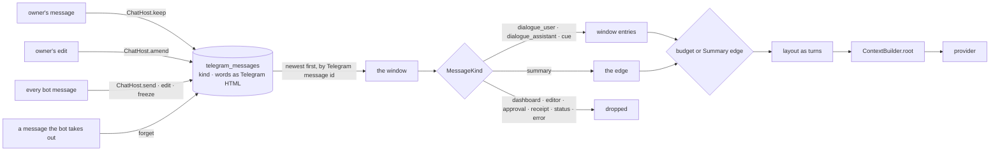
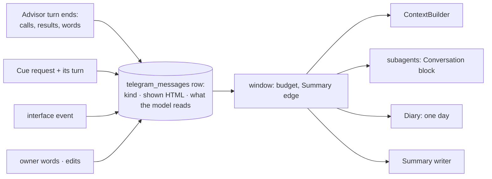

# LLM history

What the model is given as the conversation before each answer: where it comes from, what shape
it has, and why.

> **Status: approved 2026-09-26; Batch 1 is done, Batch 2 is next.** Sections 1–2 describe the
> system as it is and how models learn; section 3 is what Batch 2 and Batch 3 change; section 4
> lists the scenarios, section 5 the plan, section 6 the questions and the answers taken.
>
> **When the plan is done, this document is rewritten.** From then on it describes only how
> history works at that moment, in the present tense, as if it had been designed that way from
> the start: the account of today's design, the comparisons, the decisions, the plan and this
> note are deleted, and nothing in it mentions how history used to be read.

## 1. How it works today

### 1.1 The chat is kept as it passes, and read back out of what was kept



- Every message the bot sends leaves through `ChatHost`, which keeps it in `telegram_messages`:
  its kind, its words as the Telegram HTML it was sent in, and when it was put in the chat. A
  rewrite in place replaces the words and keeps the moment, so an answer drawn over a review
  screen stands where the screen stood. A message the bot takes out of the chat goes from the
  table with it.
- The owner's words are kept by `ordinary_text` as they arrive, before the turn reads the
  window, so the message being answered is in it exactly once. An edit the owner makes to such
  a message replaces its words (`ChatHost.amend`, on the Bot API's edited-message update).
  Commands never reach `ordinary_text`, and a value typed into a field is kept without words.
  A message the owner deletes is not seen, and stays in the conversation.
- In a private chat Telegram numbers both sides' messages in one sequence, so the message id is
  the order of the chat. [`telegram_llm/window.py`](../src/telegram_llm/window.py) walks the kept
  messages newest first and stops at the first of: `SUMMARY_TRIGGER_TOKENS = 6000` spent, the
  newest Summary (`SummaryEdge`, plus up to `EDGE_CONTEXT_MESSAGE_LIMIT = 20` messages before it),
  or `SCAN_LIMIT = 2000` messages.
- `telegram_html_to_text` reads each message's HTML back as the words it shows, and writes a link
  to one of Safwa's items back as the `[text](card:12)` citation it was rendered from.
- A receipt line is cut out of the answer and replayed on the owner's side as a `[Tool result]:`
  line (`split_receipts`, `RECEIPT_MEANINGS`): the kept chat holds no tool call.

### 1.2 What the model receives

Taken from a run through the real code — the Advisor, the workspace mutator and the window, with
only the provider scripted and the chat faked. Two requests that saved something, then a question.
What the chat shows (review screens and "Saved. Continuing…" lines are there too, off the record):

```text
owner  14:05  Добавь задачу купить молоко
Safwa  14:07  ✅ Saved — New Action “Купить молоко” (1 EP)

              Готово — [Купить молоко](card:1) в Backlog.
owner  14:20  Добавь ещё купить яйца, а молоко переименуй в «Купить молоко 2,5%»
Safwa  14:23  ✅ Saved — New Action “Купить яйца” (1 EP)
              ✅ Saved — Edit Action “Купить молоко 2,5%” (Title: Купить молоко → Купить молоко 2,5%)

              Добавила [Купить яйца](card:2), а [Купить молоко 2,5%](card:1) переименовала.
owner  15:02  Спасибо! Что у меня осталось в Backlog?
```

The third request, as the model receives it:

```text
[0] system     SYSTEM_PROMPT                                          ← cache breakpoint
[1] user       [System]: Persistent memory: …
               Current workspace state: …
               [2026-09-26 14:05] [User]: Добавь задачу купить молоко
               [Tool result]: New Action “Купить молоко” (1 EP) — applied
[2] assistant  Готово — [Купить молоко](card:1) в Backlog.
[3] user       [User]: Добавь ещё купить яйца, а молоко переименуй в «Купить молоко 2,5%»
               [Tool result]: New Action “Купить яйца” (1 EP) — applied
               [Tool result]: Edit Action “Купить молоко 2,5%” (Title: Купить молоко → Купить молоко 2,5%) — applied
[4] assistant  Добавила [Купить яйца](card:2), а [Купить молоко 2,5%](card:1) переименовала.
[5] user       [2026-09-26 15:02] [User]: Спасибо! Что у меня осталось в Backlog?
               [System]: Current local time: 2026-09-26 15:02 (Europe/Istanbul)   ← volatile, always last
```

What the Advisor actually did in the second request, as the provider received it then — none of it
is shown again:

```text
assistant  tool_calls: query_data {"sql": "SELECT id, title FROM ai_cards WHERE title LIKE '%молок%'"}
tool       [{"id": 1, "title": "Купить молоко"}]
assistant  tool_calls: route {"name": "workspace_mutator"}
tool       {"subagent": "workspace_mutator", "outcome": "done",
            "did": ["✅ Saved — New Action “Купить яйца” (1 EP)",
                    "✅ Saved — Edit Action “Купить молоко 2,5%” (Title: Купить молоко → Купить молоко 2,5%)"],
            "text": "Готово."}
assistant  Добавила [Купить яйца](card:2), а [Купить молоко 2,5%](card:1) переименовала.
```

### 1.3 Where today's history departs from what the model saw

1. **No earlier tool call is ever shown.** Every past answer that reports a change arrives with no
   call before it. The only record of the work is a `[Tool result]:` line inside the owner's own
   message, *before* the answer, with no call it answers.
2. **Labels the model was never trained on.** `[User]:` inside a user message, `[Tool result]:`
   inside a user message, and a timestamp at the start of an *assistant* message — which a small
   model can learn to write at the start of its own answers.
3. **Interface lines in the assistant slot.** Kind `DIALOGUE_ASSISTANT` is also used for words the
   interface wrote, not the model: "✅ Created **Buy milk**." after a Card is made by hand,
   a review frozen by `freeze_screen` as "Request interrupted" or by `expire_review`, the
   `proposal_outcome_text` of a Save with no session waiting, the deferred follow-up line, and
   `ONBOARDING_NOTICE`. Read back, each one is the model reporting a change it never made.
4. **A Cue has no cause.** A Cue's request is appended to the dialogue for its own turn only. A
   turn later the Cue reads as the assistant speaking unprompted, and when no owner message sits
   between, it is merged into the previous answer as one turn.
5. **The model's own formatting is lost.** An answer is read back as the plain words its HTML
   shows, so bold, italics and code are gone and every earlier answer reads as unformatted — a
   different style from the one the prompt asks for.

## 2. How models learn, and what history is native to them

### 2.1 Three stages, one format

1. **Pretraining** — next-token prediction on raw text. No roles yet.
2. **Supervised fine-tuning** — conversations rendered through the model's chat template, with the
   loss taken on the assistant's tokens only. The model learns one thing: given everything before
   it, rendered exactly this way, produce the next assistant turn.
3. **Preference and reinforcement learning** — the model is run as an agent inside the same
   template: it calls tools, the environment appends the results, it answers, the next user turn
   follows. Tool-use and multi-turn datasets are whole trajectories of this kind.

The chat template is the format all of this happened in. A request that renders into the same
shape is in distribution; anything else the model has to guess at.

### 2.2 What a trained multi-turn trajectory looks like

Qwen3's template (ChatML; Qwen3.5 differs only in details) renders the example of 1.2 like this:

```text
<|im_start|>system
SYSTEM_PROMPT … # Tools … <tools>{route, query_data, open}</tools><|im_end|>
<|im_start|>user
Add a card to buy milk<|im_end|>
<|im_start|>assistant
<tool_call>
{"name": "route", "arguments": {"name": "workspace_mutator"}}
</tool_call><|im_end|>
<|im_start|>user
<tool_response>
{"subagent": "workspace_mutator", "outcome": "done", "did": ["✅ Saved — …"]}
</tool_response><|im_end|>
<|im_start|>assistant
Done — [Buy milk](card:12) is in your Backlog.<|im_end|>
<|im_start|>user
And eggs too<|im_end|>
<|im_start|>assistant
```

The template renders the tool calls and results of **every** earlier turn. What it removes by
itself is the reasoning of assistant turns before the last user message: the think block is kept
only within the current turn's tool loop.

### 2.3 What follows for a 4–12B model

1. **The history is the strongest few-shot the model gets.** A small model follows the pattern of
   its own earlier turns more closely than it follows the system prompt. Whatever the history
   shows the assistant doing is what it does next.
2. **An action must look like an action:** a call, its result, then words. An answer that reports
   a change without a call before it teaches the model to report without calling — the very
   failure the `split_receipts` docstring describes. Today's history contains only that shape.
3. **Roles mean what they meant in training.** `user` is the person, `assistant` is only the
   model's own tokens, `tool` is a result paired to its call by `tool_call_id`. Labels written into
   the text are conventions a large model reads past and a small one may start producing.
4. **Old tool output is the first thing to cut, and the call stays.** Replacing an old result with
   a short placeholder while keeping the call is how production agents trim history: the model
   knows it looked, and re-reads when it needs the rows again. Stale rows then cannot pass for
   current ones — the workspace state block already carries the current picture.
5. **Earlier turns' reasoning is not replayed.** Inside one turn's tool loop some models expect
   their reasoning back: Qwen3.5's interleaved thinking leaks into the answer text without it, and
   OpenRouter asks for the reasoning details to be returned on tool-call messages.
6. **Append-only history is what caching needs.** A remote provider caches the longest identical
   prefix, and a local llama.cpp-based server reuses its KV cache the same way. A history that
   only grows at the end, serialized deterministically, keeps every earlier byte reusable.
7. **Compaction goes on the user side, at the start.** A Summary read as a user-side message
   that opens the window is the common shape — today's Summary edge already is.
8. **A delegated agent reads the conversation as data.** Handing a subagent the conversation as one
   tagged block, so none of it sits in its own `assistant` slot, is what agent frameworks do on
   handoff — today's `<Conversation>` block already is.

Sources:
[Qwen3 chat template](https://huggingface.co/Qwen/Qwen3-8B/blob/main/tokenizer_config.json) ·
[The 4 things Qwen-3's chat template teaches us](https://huggingface.co/blog/qwen-3-chat-template-deep-dive) ·
[Qwen3.5: reasoning lost in tool calling](https://github.com/QwenLM/Qwen3.5/issues/26) ·
[Anthropic: context editing](https://platform.claude.com/docs/en/build-with-claude/context-editing) ·
[Claude cookbook: memory, compaction and tool clearing](https://platform.claude.com/cookbook/tool-use-context-engineering-context-engineering-tools) ·
[OpenRouter: reasoning tokens](https://openrouter.ai/docs/guides/best-practices/reasoning-tokens) ·
[Manus: context engineering for AI agents](https://manus.im/blog/Context-Engineering-for-AI-Agents-Lessons-from-Building-Manus)

## 3. What Batch 2 and Batch 3 change

### 3.1 The decisions

| # | Today | Proposed | Why |
|---|---|---|---|
| D1 | *Done in Batch 1:* the chat is kept in `telegram_messages` as it passes, edits included | — | One writer and one reader; no user session to authorize |
| D2 | The owner's words are kept as typed; an answer, a transcript and a Summary are read back from the HTML they were shown in | An answer reads back as the model's own Markdown with its citations, a transcript without the name heading, and one message however many Telegram messages it took | The model sees exactly what it wrote |
| D3 | Earlier tool calls are never shown | An Advisor turn is recorded **as it ran**: its tool calls, their results, its final words. A subagent's own trajectory stays in `agent_runs` — the Advisor never saw it, only the receipt | 2.3.1, 2.3.2 |
| D4 | — | When a turn is recorded, the results of its **reads** (`query_data`, `call_helper`) are replaced by a one-line placeholder that says to read again. `route` and `open` results are kept whole: a receipt is the record of what was done | 2.3.4, 2.3.6; a read can return up to `DEFAULT_CHAR_BUDGET = 12000` characters |
| D5 | `[User]:` and `[Tool result]:` labels; timestamps on either side | Roles carry no labels. The hourly timestamp stays and is written on the owner's side only | 2.3.3 |
| D6 | A Cue's request lives for its own turn only | A Cue's request is recorded as a system event before the Cue's own turn | The model never sees itself speaking without a cause, and two answers never merge |
| D7 | Interface lines use `DIALOGUE_ASSISTANT` | Words the interface wrote are recorded as system events on the owner's side, never as the assistant | 1.3.3, 2.3.2 |
| D8 | — | Unchanged on purpose: one system message; context blocks as `[System]:` user text; the order prompt → memory and state → dialogue → clock; the Summary edge and its 20 entries; the 6000-token window; subagents reading a `<Conversation>` block | 2.3.7, 2.3.8, and the prompt prefix stays byte-stable |
| D9 | Reasoning is dropped at the gateway | *Optional, a batch of its own:* within one turn's tool loop, reasoning is handed back to models that need it, and never kept past the turn | 2.3.5 |

### 3.2 What an answer carries



The kept chat stays the one record. Batch 2 adds one thing to a kept message: what the model
reads for it, in the provider's shape, when that is not simply the words the chat shows.

```text
telegram_messages row, after Batch 2
  kind, text, created_at   as today: what the chat shows, and when
  model view               the messages the model reads for this one, in the provider's shape:
                             an answer   its turn — calls, results with reads cleared, its own words
                             a Cue       the request that caused it, then its turn
                             an event    one owner-side [System]: line
                             a transcript the owner's words, without the name heading
                           empty for everything read from its words and its kind alone
```

A message long enough to take several Telegram messages is kept on the first of them and read
back once; the others keep no words.

**When a turn is written.** Once its answer has reached the chat, onto the answer's first message:
a session suspended on a screen is written when it finishes after the decision. Words the owner
typed over a screen are therefore kept before the turn they interrupted — the order the resumed
session reads them in today.

**Where the window may be cut.** Between kept messages, as today: an answer's turn is read whole or
not at all, so a tool result is never separated from its call.

### 3.3 The same request, proposed

The third request of 1.2, from the same run:

```text
[0]  system     SYSTEM_PROMPT                                          ← cache breakpoint
[1]  user       [System]: Persistent memory: …
                Current workspace state: …
                [2026-09-26 14:05] Добавь задачу купить молоко
[2]  assistant  tool_calls: route {"name": "workspace_mutator"}
[3]  tool       {"subagent": "workspace_mutator", "outcome": "done",
                 "did": ["✅ Saved — New Action “Купить молоко” (1 EP)"], "text": "Создала действие."}
[4]  assistant  Готово — [Купить молоко](card:1) в Backlog.
[5]  user       Добавь ещё купить яйца, а молоко переименуй в «Купить молоко 2,5%»
[6]  assistant  tool_calls: query_data {"sql": "SELECT id, title FROM ai_cards WHERE title LIKE '%молок%'"}
[7]  tool       {"status": "cleared", "next": "Read again if you need these rows."}
[8]  assistant  tool_calls: route {"name": "workspace_mutator"}
[9]  tool       {"subagent": "workspace_mutator", "outcome": "done",
                 "did": ["✅ Saved — New Action “Купить яйца” (1 EP)",
                         "✅ Saved — Edit Action “Купить молоко 2,5%” (Title: Купить молоко → Купить молоко 2,5%)"],
                 "text": "Готово."}
[10] assistant  Добавила [Купить яйца](card:2), а [Купить молоко 2,5%](card:1) переименовала.
[11] user       [2026-09-26 15:02] Спасибо! Что у меня осталось в Backlog?
                [System]: Current local time: 2026-09-26 15:02 (Europe/Istanbul)   ← volatile, always last
```

The answers keep their citations, so a follow-up about "the milk" is still answerable without the
rows the read returned.

### 3.4 What goes away

- `split_receipts`, and `RECEIPT_MEANINGS` as a vocabulary for reading the chat back — the receipt
  prefixes stay for display.
- The Summary parts reassembly: a Summary is one kept message.
- The `[User]:` and `[Tool result]:` labels, and the merging of two answers with nothing between
  them: after D6 and D7 an answer always follows an owner-side entry or a tool result.

### 3.5 What the owner accepts with it

- *In force since Batch 1:* **deleting a message in Telegram does not take it out of the
  history**, and clearing the chat does not reset the conversation; rebuilding the database does.
  The history lives in `data/safwa.db`, and `uv run safwa-backup` keeps it.
- *With Batch 2:* the 6000-token window pays for tool steps too, so fewer requests fit in it and a Summary is
  written sooner. Measured on the run of 1.2 with `estimate_tokens`, the unit the window budget is
  counted in:

  | | today | proposed |
  |---|---|---|
  | request 1 — one `route` | 64 | 117 |
  | request 2 — one read, one `route` | 125 | 238 |
  | a `route` call · its receipt | — | 25 · 55–86 |
  | a read call · its placeholder | — | 42 · 27 |
  | the same read kept whole, 1 row · 50 rows | — | 15 · 2716 |

  A request that calls no tool costs what it costs today; one that routes costs about 1.8 times
  as much, so a window of such requests holds about half as many and a Summary comes about twice
  as often. The ceiling does not move: the dialogue stays within `SUMMARY_TRIGGER_TOKENS = 6000`
  beside a system prompt of about 4450, so no request is longer than the longest one today. A
  read kept whole could take 45% of the window at once, which is why D4 is part of this and not
  an option.

### 3.6 What to tune when the window runs short

Each lever is one number or one string, and none changes the shape of the history:

| Lever | Where | What it trades |
|---|---|---|
| The window, and when a Summary is written — one number for both | `SUMMARY_TRIGGER_TOKENS = 6000` in [constants.py](../src/safwa/constants.py), overridden by the `summary_trigger_tokens` setting | more turns kept word for word, for a longer request; 8000 keeps the longest request under about 14000 tokens |
| How long a Summary may be | `SUMMARY_TOKEN_CEILING = 2000`, the same file | how much of the older conversation survives, against room for recent turns |
| The messages kept beside the Summary | `EDGE_CONTEXT_MESSAGE_LIMIT = 20` in [history.py](../src/tg_agent_shell/history.py) | continuity across a Summary, against its cost |
| The placeholder a cleared read leaves | written where a turn is recorded | about 27 tokens per read as proposed; a bare cleared status is about 9, with one line in the Advisor prompt saying to read again |
| What a `route` receipt carries | `route_receipt` | 55–86 tokens per request that routed; the words and the `did` lines are what the Advisor needs, the rest is framing |
| The system prompt | `SYSTEM_PROMPT` | about 4450 tokens, the largest block of every request: a line cut there is a line gained in every turn |

A change to a prompt, a tool result's shape or the placeholder is read by the model, so it
updates `tests/snapshots/prompt_prefix.json` where it touches the prefix, and it is worth one live
run against the local model before it stays.

## 4. Scenario changes

Approved with the plan. Those marked *done* are in `telegram_history.feature` and
`summary.feature` as of Batch 1, opening paragraphs included; the rest land with Batch 2.

| Scenario | Proposal |
|---|---|
| `TG-MARK-001` | *Done:* a message Safwa sends is kept with its kind; a screen is not in the conversation, and rewritten in place into an account it is, once, where the screen stood |
| `TG-KIND-002` | Keep |
| `TG-OWNER-003` | *Done:* the owner's words are kept as they arrive; a value typed into a field never is; text opening with "/" never is |
| `TG-RELAY-004` | **Reword:** a transcript is recorded as the owner's words, and still shown in the chat under their name |
| `TG-WINDOW-005` | **Change:** the 6000 tokens count tool calls and results too, and the cut falls between two turns |
| `TG-SUMMARY-006` | Keep; the 20 before the edge are entries of words, not tool steps |
| `TG-NOTES-007` | *Done:* the conversation is what Safwa kept, not what the chat shows: a message the owner deleted is still in it, one Safwa took out is not |
| `TG-CURRENT-008` | Keep |
| `TG-RECEIPT-009` | **Replace:** the outcome of work is the result of the call that did it, placed right after that call and before the words that report it |
| `TG-SHAPE-010` | **Replace:** the owner's words and system events gather into one user turn; an answer is the assistant's own words only; the time is written once per hour, on the owner's side |
| `TG-CITE-011` | **Reword:** an answer is recorded with the citations as the model wrote them |
| `summary.feature` | *Done:* opening paragraph reworded — Safwa keeps the conversation as it happens |

New:

- TG-EDIT-012 — *done:* the owner edits a message, and the conversation reads the edited words
  where the message always stood; an edit to a field value changes nothing.
- TG-TOOLS-013 — a turn later, the model reads the calls its answer made and their results before
  the answer.
- TG-READS-014 — a read from an earlier turn comes back as its call and a placeholder; a receipt
  comes back whole.
- TG-CUE-015 — a Cue reads back after the request that caused it, never merged into the answer
  before it.
- TG-SYSTEM-016 — a line the interface wrote reads back as a system event, never as the assistant.

## 5. Plan

One declared batch at a time. Each batch updates the documents it makes untrue in the same
commit, and the onboarding manual is checked for anything it names.

### Batch 1 — the conversation is kept, not read back (D1) — done

`telegram_messages` keeps every message's words as the Telegram HTML it was sent in, beside its
kind; `ChatHost` writes them on every send, edit and freeze, `ChatHost.keep` takes in the owner's
words in `ordinary_text`, and `ChatHost.amend` takes in their edits through a handler for the
Bot API's edited-message update. The window reads the kept messages in Telegram's own order, and
`telegram_html_to_text` reads a message's HTML back as its words and citations. The Telethon
reader, `safwa-auth` and the invisible kind mark are gone; Telethon remains for the live QA tests
alone. The schema changed by one column, so a database from before it is rebuilt.

### Batch 2 — the window is laid out the way the model was trained (D3–D7)

1. An answer's message carries its turn (3.2), reads cleared (D4), and the model's own words, so
   receipts and shown blocks live in the `route` result only; a message long enough to split is
   kept once (D2).
2. A Cue's message carries its request; interface lines are read as system events (D6, D7).
3. The window returns messages in the provider's shape, tool calls included; `ContextBuilder.root`
   appends them as they are; the `<Conversation>` block and the Summary writer read words and
   receipts, never reads.
4. Delete everything in 3.4.

**Done when:** the new scenarios of section 4 have tests; an E2E test shows turn 2's request
carrying turn 1's `route` call and receipt; and a live run against the local model — "add a Card",
then "and another one" — routes on the second turn instead of answering "Saved" without a call.

### Batch 3 — optional: reasoning inside one turn (D9)

The gateway reads a turn's reasoning and the loop hands it back on that session's tool-call
messages; the recorded turn never carries it. **Done when:** a multi-call turn on Qwen3.5 in LM
Studio shows no reasoning in the answer text, and `openai/gpt-5.6-luna` keeps its reasoning
across the calls of one turn.

### Last

This document is rewritten as its own header says.

## 6. Questions, and the answers taken

Taken as recommended when the plan was approved:

1. **Two batches, or one?** Two: Batch 1 made the system simpler and more reliable before the
   layout changes.
2. **Read results:** cleared once their turn is written, which keeps the kept chat append-only and
   every earlier byte cacheable.
3. **Resetting the conversation before 1.0:** rebuilding the database; no command.
4. **An edit to a message the Summary already covers** changes nothing the model reads.
5. **Timestamps:** the hourly stamp stays, on the owner's side.
