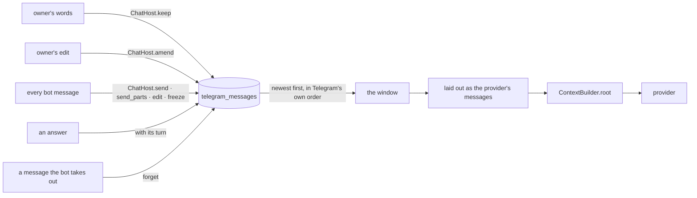

# LLM history

What the model is given as the conversation before each answer: where it comes from, what shape
it has, and why.

## 1. The chat is kept as it passes



- Every message the bot sends leaves through `ChatHost`, which keeps it in `telegram_messages`:
  its kind, the words it carries as the Telegram HTML it was sent in, and when it was put in the
  chat. A rewrite in place replaces the words and keeps the moment, so an answer drawn over a
  review screen stands where the screen stood. A message the bot takes out of the chat goes from
  the table with it.
- Something too long for one Telegram message is kept once: `send_parts` puts all of its words on
  the first part and none on the rest, so a long answer or Summary reads back as one message.
- The owner's words are kept by `ordinary_text` as they arrive, before the turn reads the window,
  so the message being answered is in it exactly once. An edit they make replaces those words
  (`ChatHost.amend`, reached by `edited_text` on the Bot API's edited-message update). Commands
  never reach `ordinary_text`, and a value typed into a field is kept without words. A message the
  owner deletes is not seen, and stays in the conversation.
- A message can carry `reads_as`: what the model reads for it, in the provider's own shape, when
  that is not simply its words — an answer's turn (section 2.2), a voice transcript without the
  name heading the owner sees above it, or a photo's label before its caption:
  `[Анна с дочкой в парке](media:14) вот я с дочкой`. The photo itself is never in the history
  ([AGENT_ARCH.md](AGENT_ARCH.md#photos)).

## 2. What the model reads

### 2.1 The window

In a private chat Telegram numbers both sides' messages in one sequence, so the message id is the
order of the chat. [`telegram_llm/window.py`](../src/telegram_llm/window.py) walks the kept messages
newest first and stops at the first of: `SUMMARY_TRIGGER_TOKENS = 6000` spent, the newest Summary
(`SummaryEdge`, plus up to `EDGE_CONTEXT_MESSAGE_LIMIT = 20` messages before it, as their words
alone), or `SCAN_LIMIT = 2000` messages. The budget counts everything a message puts in front of
the model, an answer's calls and their results included, and an answer is taken whole or not at
all, so a tool result is never cut away from its call.

What each kind is to the conversation is said once, in the window's vocabulary: the owner's words,
Safwa's answers and Cues, and `MessageKind.EVENT` — a line the interface wrote about what happened:
a review interrupted or closed, a Card created by hand, words no turn of the model produced. Screens,
receipts, progress lines and errors are not the conversation. `telegram_html_to_text` reads a
message's HTML back as the words it shows, and writes a link to one of Safwa's items back as the
`[text](card:12)` citation it was rendered from.

### 2.2 What an answer carries

When the Advisor's turn ends, `ProposalMaterializer.answer` hands the answer on with its turn,
built by `kept_turn`: the calls the session made and what came back for each, in order, then the
model's own words. `render_ai_outcome` keeps that turn on the answer's message. The owner reads
the receipts and any shown block above the answer; the model reads the `route` result that carried
them.

- **A read's rows are cleared.** The results of `query_data` and `call_helper` (`CLEARED_READS`)
  are kept as `CLEARED_READ` — the call stays, the rows go, and the result says to read again.
  Rows go stale by the next turn, the workspace state is read fresh every turn, and one read can
  return up to `DEFAULT_CHAR_BUDGET = 12000` characters. A `route` result — the receipt of what was
  done — and an `open` result are kept whole. Because the turn is written once, when its answer
  reaches the chat, the kept chat only ever grows at the end, and every earlier byte of a request
  stays the same from one turn to the next.
- **A Cue opens with its cause.** A turn nobody asked for keeps the request that caused it
  (`CUE_REQUEST`) as its first message, on the owner's side, so the model never reads itself
  speaking without a reason and two answers never run together.
- **Words the interface wrote are never the assistant's.** An outcome no turn produced, a review
  that closed or was interrupted, a Card created by hand and the onboarding notice are kept as
  `MessageKind.EVENT` and read on the owner's side after `EVENT_LABEL`.
- **Reasoning goes back between calls and is never kept.** Whatever the provider put on a
  response beyond the standard keys — LM Studio's `reasoning_content`, OpenRouter's `reasoning`
  and `reasoning_details`, Gemini's signature on each call — goes back unchanged on that
  response's assistant message (`CompletionTurn.as_message`) for every later request of the same
  session. `kept_turn` keeps the standard keys alone (`standard_message`), so no later request
  reads it, and a turn one model wrote reads the same to the next
  ([LLM_GATEWAY.md](LLM_GATEWAY.md#what-goes-back-and-what-is-kept)).
- A turn that suspends on a review screen is written when it finishes after the decision. Words
  the owner typed over the screen are therefore kept before the turn they interrupted — the order
  the resumed session read them in.

### 2.3 The request, laid out

`dialogue` lays the window out as the provider's messages. An answer is its calls, their results and
its words, in the assistant's and the tool's own roles. Everything on the owner's side — their
words, an event, the Summary — gathers into one user message up to the next answer, with no label
on the owner's own words. The time is written once for each hour of conversation, on the owner's
side only. `ContextBuilder.root` puts the messages after the prompt and the state, and the clock
last.

Two requests that saved something, then a question, as the model receives the third:

```text
[0]  system     SYSTEM_PROMPT                                          ← cache breakpoint
[1]  user       [System]: Persistent memory: …
                Current workspace state: …
                [2026-09-26 14:05] Добавь задачу купить молоко
[2]  assistant  tool_calls: route {"name": "workspace_mutator"}
[3]  tool       {"subagent": "workspace_mutator", "outcome": "done",
                 "did": ["✅ Saved — New Action “Купить молоко” (1 EP)"], "text": "Создала действие."}
[4]  assistant  Готово — [Купить молоко](card:1) в Backlog.
[5]  user       Добавь ещё купить яйца, а молоко переименуй в «Купить молоко 2,5%»
[6]  assistant  tool_calls: query_data {"sql": "SELECT id, title FROM ai_cards WHERE title LIKE '%молок%'"}
[7]  tool       {"status": "cleared", "next": "Read again if you need these rows."}
[8]  assistant  tool_calls: route {"name": "workspace_mutator"}
[9]  tool       {"subagent": "workspace_mutator", "outcome": "done",
                 "did": ["✅ Saved — New Action “Купить яйца” (1 EP)",
                         "✅ Saved — Edit Action “Купить молоко 2,5%” (Title: Купить молоко → Купить молоко 2,5%)"],
                 "text": "Готово."}
[10] assistant  Добавила [Купить яйца](card:2), а [Купить молоко 2,5%](card:1) переименовала.
[11] user       [2026-09-26 15:02] Спасибо! Что у меня осталось в Backlog?
                [System]: Current local time: 2026-09-26 15:02 (Europe/Istanbul)   ← volatile, always last
```

The answers keep their citations, so a follow-up about "the milk" is answerable without the rows
the read returned.

## 3. Why this shape

### 3.1 Three stages, one format

1. **Pretraining** — next-token prediction on raw text. No roles yet.
2. **Supervised fine-tuning** — conversations rendered through the model's chat template, with the
   loss taken on the assistant's tokens only. The model learns one thing: given everything before
   it, rendered exactly this way, produce the next assistant turn.
3. **Preference and reinforcement learning** — the model is run as an agent inside the same
   template: it calls tools, the environment appends the results, it answers, the next user turn
   follows. Tool-use and multi-turn datasets are whole trajectories of this kind.

The chat template is the format all of this happened in. A request that renders into the same
shape is in distribution; anything else the model has to guess at. Qwen3's template (ChatML;
Qwen3.5 differs only in details) renders the request of 2.3 as:

```text
<|im_start|>system
SYSTEM_PROMPT … # Tools … <tools>{route, query_data, open}</tools><|im_end|>
<|im_start|>user
Добавь задачу купить молоко<|im_end|>
<|im_start|>assistant
<tool_call>
{"name": "route", "arguments": {"name": "workspace_mutator"}}
</tool_call><|im_end|>
<|im_start|>user
<tool_response>
{"subagent": "workspace_mutator", "outcome": "done", "did": ["✅ Saved — …"]}
</tool_response><|im_end|>
<|im_start|>assistant
Готово — [Купить молоко](card:1) в Backlog.<|im_end|>
<|im_start|>user
…<|im_end|>
<|im_start|>assistant
```

The template renders the tool calls and results of every earlier turn. What it removes by itself is
the reasoning of assistant turns before the last user message.

Every other family has its own template, and a hosted model its own native format; the endpoint
renders the same roles into it, so the argument holds for any model trained on tool trajectories.
What differs is the reasoning: Qwen's template drops it before the last user message, Gemini 3
refuses the next step of a turn without its signature, and DeepSeek V4 thinking with tools wants
the reasoning of every earlier turn back ([LLM_GATEWAY.md](LLM_GATEWAY.md#models)).

### 3.2 What follows for a 4–12B model

1. **The history is the strongest few-shot the model gets.** A small model follows the pattern of
   its own earlier turns more closely than it follows the system prompt. Whatever the history
   shows the assistant doing is what it does next.
2. **An action must look like an action:** a call, its result, then words. An answer that reported
   a change with no call before it would teach the model to report without calling.
3. **Roles mean what they meant in training.** `user` is the person, `assistant` is only the
   model's own tokens, `tool` is a result paired to its call by `tool_call_id`. Labels written into
   the text are conventions a large model reads past and a small one may start producing — which
   is why the owner's words carry none and an answer never carries a timestamp.
4. **Old tool output is the first thing to cut, and the call stays.** Replacing an old result with
   a short placeholder while keeping the call is how production agents trim history: the model
   knows it looked, and re-reads when it needs the rows again.
5. **Reasoning goes back inside a turn and never past it.** The template renders the reasoning
   of the assistant messages after the last user message and drops the rest. Qwen3.5 thinks
   between its calls: without that reasoning it can write its thinking into the answer, and
   a 4B one in LM Studio stops thinking by its third call and batches fewer calls. OpenRouter
   asks for it back unchanged on the message that made the calls, and Gemini 3 refuses the step
   without it. Past the turn nothing of it is kept: a model switch must never replay what
   another model signed.
6. **Append-only history is what caching needs.** A remote provider caches the longest identical
   prefix, and a local llama.cpp-based server reuses its KV cache the same way. OpenAI, xAI,
   Gemini and DeepSeek find the prefix themselves; Anthropic caches only up to a marked block,
   which the gateway marks when its row says so.
7. **Compaction goes on the user side, at the start** — which is where the Summary is read.
8. **A delegated agent reads the conversation as data** — which is how a subagent reads it
   (section 4).

### 3.3 Portable by construction

What keeps the same history readable by every endpoint, and by the next model after a switch:

- **Only `messages[0]` is a system message.** Anthropic hoists every system message to the top,
  and a chat template raises on a second one; everything else the interface says is user text
  after `[System]:`.
- **The roles alternate.** The owner's side is one user message up to the next answer, which is
  what Anthropic, Gemini and a strict template expect.
- **A tool result follows its call directly**, paired by an id every endpoint takes back, and its
  content is a JSON string.
- **No photo is in the history**, only its label, so a model without vision reads it too. The one
  request that carries an image is the look itself, in the base64 `image_url` form every
  OpenAI-compatible endpoint takes; a JPEG at `PHOTO_MAX_SIDE = 1280` is inside every provider's
  limit.
- **Nothing one provider added is kept**, so a model switch changes nothing the next model reads.
- **A tool schema keeps to the keywords every provider reads.** `tool_json_schema` turns `gt=0`
  into `minimum: 1` and gives an enum its type, and
  `test_every_tool_schema_keeps_to_the_keywords_every_provider_reads` holds the rest.

One case is left: a turn that ended without words ends on a tool result, and Mistral refuses a
user message after one.

Sources:
[Qwen3 chat template](https://huggingface.co/Qwen/Qwen3-8B/blob/main/tokenizer_config.json) ·
[The 4 things Qwen-3's chat template teaches us](https://huggingface.co/blog/qwen-3-chat-template-deep-dive) ·
[Qwen3.5: reasoning lost in tool calling](https://github.com/QwenLM/Qwen3.5/issues/26) ·
[Anthropic: context editing](https://platform.claude.com/docs/en/build-with-claude/context-editing) ·
[Claude cookbook: memory, compaction and tool clearing](https://platform.claude.com/cookbook/tool-use-context-engineering-context-engineering-tools) ·
[OpenRouter: reasoning tokens](https://openrouter.ai/docs/guides/best-practices/reasoning-tokens) ·
[Manus: context engineering for AI agents](https://manus.im/blog/Context-Engineering-for-AI-Agents-Lessons-from-Building-Manus) ·
[Anthropic: OpenAI SDK compatibility](https://platform.claude.com/docs/en/api/openai-sdk) ·
[Gemini: OpenAI compatibility](https://ai.google.dev/gemini-api/docs/openai) ·
[DeepSeek: thinking mode](https://api-docs.deepseek.com/guides/thinking_mode/) ·
[OpenAI: reasoning](https://developers.openai.com/api/docs/guides/reasoning)

## 4. Other readers of the kept chat

**A routed subagent** reads the conversation as one `<Conversation>` block (`conversation_block`),
one tag per author, so nothing it did not write reaches it in the `assistant` slot. Of the
Advisor's calls only what `route` did comes along (`receipt_lines`): a read is how the Advisor
answered, not what. It takes the newest `SUBAGENT_HISTORY_LAST_MESSAGES = 10` things said, or what
its `AgentSpec` declares.

When the Advisor routes the second request of 2.3, `workspace_mutator` receives:

```text
[0]  system     the subagent's own prompt
[1]  user       [System]: Current workspace state: …
                [System]: The conversation so far, newest last. None of it is yours: read it for what the owner wants changed.
                <Conversation>
                <User at="2026-09-26 14:05">Добавь задачу купить молоко</User>
                <ToolResult>✅ Saved — New Action “Купить молоко” (1 EP)</ToolResult>
                <Advisor>Готово — [Купить молоко](card:1) в Backlog.</Advisor>
                <User>Добавь ещё купить яйца, а молоко переименуй в «Купить молоко 2,5%»</User>
                </Conversation>
```

The Advisor's read in this turn, the arguments of its calls and the words a subagent returned to
it stay with the Advisor. A system line reads as `<System>`, a Summary as `<Summary>`, and a Cue's
request as the owner's `<User>`.

**The Summary writer** folds the window into a Summary from the words said and what each answer's
calls did, never from the rows a read returned; a Summary stays under
`SUMMARY_TOKEN_CEILING = 2000`. The first request of 2.3 reaches it as:

```text
[user]: Добавь задачу купить молоко
[tool]: ✅ Saved — New Action “Купить молоко” (1 EP)
[assistant]: Готово — [Купить молоко](card:1) в Backlog.
```

**The Diary** reads one day with `day_transcript`: the words, each stamped to the minute and
labelled with who said it.

## 5. What the owner accepts with it

- **Deleting a message in Telegram does not take it out of the history**, and clearing the chat does
  not reset the conversation; rebuilding the database does. The history lives in `data/safwa.db`,
  and `uv run safwa-backup` keeps it.
- **A turn's steps cost room in the window.** Measured with `estimate_tokens`, the unit the budget
  is counted in: a `route` call is about 25, its receipt 55–86, a read's call about 42 and its
  cleared result 27. An answer that routes costs about 1.8 times as much as one that calls
  nothing, so a window of such answers holds about half as many and a Summary comes about twice as
  often. The longest request does not grow: the dialogue stays within `SUMMARY_TRIGGER_TOKENS`,
  beside a system prompt of about 4450. A read kept whole — 15 tokens for one row, 2716 for fifty —
  could take 45% of the window at once, which is why its rows are cleared.
- **The window is counted in estimated tokens.** `estimate_tokens` divides characters by
  `TOKEN_CHARS_ESTIMATE`, and every model's tokenizer counts differently, Cyrillic most of all.
  The longest request is the system prompt (about 4450), the window (6000), a turn's reads before
  they are cleared (up to `DEFAULT_CHAR_BUDGET = 12000` characters each) and the output (4096):
  a model with less than a 32k context runs out.

## 6. What to tune when the window runs short

Each lever is one number or one string, and none changes the shape of the history:

| Lever | Where | What it trades |
|---|---|---|
| The window, and when a Summary is written — one number for both | `SUMMARY_TRIGGER_TOKENS = 6000` in [constants.py](../src/safwa/constants.py), overridden by the `summary_trigger_tokens` setting | more turns kept word for word, for a longer request; 8000 keeps the longest request under about 14000 tokens |
| How long a Summary may be | `SUMMARY_TOKEN_CEILING = 2000`, the same file | how much of the older conversation survives, against room for recent turns |
| The messages kept beside the Summary | `EDGE_CONTEXT_MESSAGE_LIMIT = 20` in [history.py](../src/tg_agent_shell/history.py) | continuity across a Summary, against its cost |
| What a cleared read leaves | `CLEARED_READ` in [conversation.py](../src/tg_agent_shell/ai/conversation.py) | about 27 tokens per read; a bare cleared status is about 9, with one line in the Advisor prompt saying to read again |
| What a `route` receipt carries | `route_receipt` | 55–86 tokens per request that routed; the words and the `did` lines are what the Advisor needs, the rest is framing |
| The system prompt | `SYSTEM_PROMPT` | about 4450 tokens, the largest block of every request: a line cut there is a line gained in every turn |

A change to a prompt, a tool result's shape or the placeholder is read by the model, so it
updates `tests/snapshots/prompt_prefix.json` where it touches the prefix, and it is worth one live
run against the local model before it stays.
