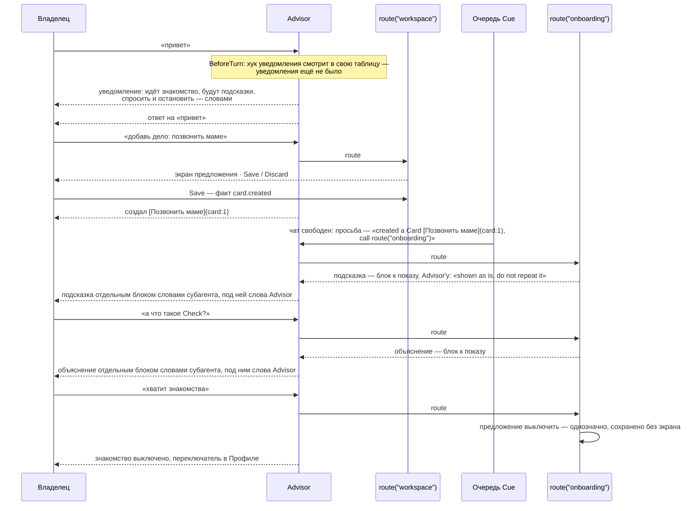

# Онбординг: подсказки по факту и субагент-проводник

Проект от 2026-09-21 по решениям владельца; реализован 2026-09-24 батчами 1 и 2 (ниже, «Что
меняется в репозитории»), сценарии — [onboarding.feature](../tests/brd/onboarding.feature) и
AG-HOOK-042, AG-HOOK-043, AG-RECEIPT-044 в
[agents.feature](../tests/brd/tg_agent_shell/agents.feature). Не сделан один пункт: прогон на
живой модели владельца, по которому закрепляется окно в 100. Заменяет проект от
2026-09-19 — четырнадцать шагов с вычисляемыми отметками и блок в контексте каждого хода. Тот
проект снят: он заставлял модель 4B исполнять алгоритм, выводил «пройдено» из немонотонных
признаков и спорил с настоящим запросом владельца в каждом ходе. Здесь ничего из этого нет.
Замечания внешнего ревью от 2026-09-21 учтены там, где код подтверждает их; где ревью предлагало новый механизм ради случая, который и так
заканчивается экраном или строкой в доке, механизма нет — см. «Что не делается».
Закрыл первую половину записи «Onboarding covers the first start and a return after an
absence» из [FUTURE_FEATURE.md](FUTURE_FEATURE.md) и строки Wave 5 в
[PLAN_FEATURES.md](PLAN_FEATURES.md); вторая половина — возвращение после перерыва — сделана
2026-09-25 отдельно (OB-RETURN-007, AG-HOOK-048), и запись оттуда ушла. Основание — [HOOK_ARCH.md](HOOK_ARCH.md), [AGENT_ARCH.md](AGENT_ARCH.md) и
[FEATURE_MODULES.md](FEATURE_MODULES.md).

## Что это

Перед первым ходом Advisor — по слову владельца или по своей инициативе — приходит одно
сообщение: идёт знакомство; после того, как владелец что-то создал или завершил, будет короткая
подсказка; спросить о Safwa можно в любой момент; сказать «хватит» — тоже. Дальше Safwa никуда
не ведёт. Владелец делает что хочет — руками в экранах или словами через Advisor, — и после
созданного или завершённого предмета приходит подсказка от субагента-проводника: что произошло
и что с этим теперь можно. Спросил «а что такое Check?» или «что умеет Safwa?» — отвечает тот
же субагент, у которого в промпте лежит справочник Safwa. Сказал «не надо знакомства» —
субагент предлагает выключить, и, если просьба однозначна, это сохраняется без экрана. Включить
снова — в Профиле.

Три решения, на которых всё держится:

1. **Подсказки — это хук `Advise` на сохранённом изменении, а слова пишет субагент.** Создание
   и завершение доходят до хуков как факт `Committed`, одинаково от экрана и от предложения.
   Один хук с именем onboarding; его просьба к Advisor — «отдай это субагенту onboarding», как
   вечерняя просьба о Дневнике отдаёт день субагенту diary. Выключатель хука в Профиле — и есть
   выключатель знакомства.
2. **Уведомление — хук `Run` перед любым ходом Advisor, зависимый от первого.** Новое событие
   BeforeTurn и новое понятие — зависимый хук: он не имеет своего выключателя и следует за
   чужим. Публикуется один раз; «сказано ли уже» — отметка в таблице самой фичи.
3. **Субагент onboarding — справочник, ответ как есть и один инструмент.** `route("onboarding")`
   стоит в промпте всегда: объяснять Safwa полезно и после знакомства. Субагент объявлен как
   тот, чьи слова показываются владельцу дословно — без пересказа Advisor и без инструмента
   «скажи». Инструмент выключения — предложение, которое при однозначной просьбе сохраняется
   само, а при сомнении показывает Save/Discard.

Ни таблицы прогресса, ни списка шагов, ни блока в контексте, ни одной записи мимо предложения.

## Как это выглядит для владельца



## Понятие: зависимый хук

Сегодня у хука либо свой выключатель в Профиле — если его эффект доходит до агента
(`agent_related`: `OfferTool`, `RefuseTool`, `Advise`), — либо никакого: `Run` всегда включён.
Уведомление — `Run`, но включённым оно должно быть ровно тогда, когда включены подсказки. Значит,
хук может **следовать за чужим выключателем**:

| Часть | Что добавляется |
|---|---|
| `HookSpec` | поле `switch: str | None = None` — имя хука, чьим выключателем этот хук включается и выключается; None — свой выключатель или его нет, как сейчас |
| Реестр | `switched_on` сначала смотрит `switch`: есть — читает политику по имени того хука; нет — как прежде. При сборке: `switch` называет зарегистрированный хук, у которого выключатель свой; цепочка зависимостей длиной один |
| Профиль | показывает хуки с `agent_related` и без `switch`; зависимый хук на экране не появляется — у него нет своего состояния |
| `set_hook_switch` | выключение снимает строки очереди у хука и у каждого, кто от него зависит (`drop_hook_cue` по списку имён, который экран и предложение берут у реестра); включение — так же |

Что означает зависимый хук после выключения главного: его условие не проверяется, его ожидающие
строки сняты, его `Run` не запускается. Ничего сверх этого: ни своей записи в `disabled_hooks`,
ни отдельной строки в Профиле.

## Механизм 1 — хук onboarding: после сохранения субагент говорит, что произошло

Одно определение в hooks.py фичи, по подписке на каждый факт, о котором субагенту есть что
сказать:

```python
TIP_FACTS = (
    CARD_CREATED, CHECK_CREATED, CHECK_ANSWERED, VALUE_CREATED, TAG_CREATED,
    REQUEST_CREATED, REMINDER_CREATED, DIARY_WRITTEN, SPRINT_STARTED, CARD_TODAY,
    CARD_DONE, SPRINT_ANALYSED,
)

ONBOARDING_HOOK = HookSpec(
    name="onboarding",
    owner="onboarding",
    on=tuple(OnCommitted(kind=kind) for kind in TIP_FACTS),
    evaluate=what_changed,            # (event.kind, event.subject_id) — ссылка, не слова
    effect=Advise(prepare=onboarding_request),
    title="Onboarding",
    description="After you create or finish something, explains what happened and what it makes possible.",
)
```

Это в точности форма блокера и итога Спринта — [HOOK_ARCH.md](HOOK_ARCH.md), «Сохранённое
изменение»: `evaluate` возвращает ссылку, строка ложится в очередь `Cue`, `prepare` пишет
просьбу, когда чат свободен, и проверяет выключатель. Реестр индексирует одно определение один
раз и зовёт его `evaluate` один раз на каждое подходящее событие, сколько бы подписок ни было —
так уже работает хук Hard Time с двумя.

**Каждый факт — подсказка, пакетом.** Ни правила «первый», ни памяти о сказанном. Сохранил —
субагент получает факт с состоянием предмета и сам решает, что в нём стоит объяснить, по
`workspace_state` и последним сообщениям диалога. Что склеивает очередь, а не хук: все строки, накопившиеся пока чат был занят,
уходят одной просьбой — пять Карточек одним предложением дают одну подсказку про пять Карточек;
две одинаковые пары «вид + предмет» (дважды ответили на один Check) — один пункт. Пока открыт
экран предложения, фактов может накопиться десятки, поэтому `prepare` цитирует не больше пяти
предметов — константа ONBOARDING_TIP_ITEMS = 5 в начале hooks.py фичи — и добавляет «and N
more»; остальные в подсказку не попадают, и это нарочно:
знакомство не должно превращаться в хвост из сообщений. Кому и этого много — выключатель в
Профиле.

**Какие факты есть, каких нет.** Хуки не видят строк базы; они видят **факты**, которые
операция записала рядом со своей транзакцией через `record_change` — вид и предмет. Общего
события «что-то записано» нет, и заводить его не стоит: оно срабатывало бы на служебные строки
— очередь, реестр сообщений, утра в Today, память — и не говорило бы, *что* случилось. Список
подписок и есть список фактов, по которым субагент говорит; новый факт — одна строка в нём.
Сегодня записаны `SPRINT_STARTED`, `SPRINT_ENDED`, `CARD_TODAY`, `CARD_BLOCKED`, `CHECK_MISSED`
и несколько других; остальные факты списка добавляются по одной строке `record_change` в
операции, через которую проходят и экран, и Save предложения. Где именно — по таблице, потому
что «рядом с `bump_workspace`» покрывает не все дороги:

| Факт | Операция | Что покрыто и что нарочно нет |
|---|---|---|
| card.created | `create_card` | экран и предложение. Карточка, созданная сразу в Today, даёт и `CARD_TODAY` — в просьбе это одна строка «created a Card, now in Today». Копия повторяемой Карточки (`_copy_repeat_successor`) факта «создана» не получает: её сделала система |
| check.created | `create_check` | экран и предложение; преемник повторяемого Check (`_spawn_check_successor`) — нет |
| check.answered | `apply_check_outcome` | обе дороги ответа: прямой (`resolve_check`) и с экрана Done Карточки (`finish_action` → `settle_checks`). Решение владельца: ответы с экрана Done — тоже повод, одной строкой вместе с «finished a Card» |
| card.today | уже есть: `create_card`, `move_card`, `_copy_repeat_successor` | последний путь — система ставит в Today копию повторяемой Карточки. Поэтому фраза в просьбе — состояние, не действие: «Card [X] is now in Today»; субагент видит, что Карточка повторяемая, и может это сказать. Решение владельца: факт остаётся в списке |
| card.done | `finish_action` | экран и предложение |
| value.created, tag.created, request.created | `create_value`, `create_tag`, `create_saved_request` | экран и предложение |
| reminder.created | `create_reminder` | только Reminder владельца. Предупреждение Спринта делает `create_sprint_reminder` — другая операция, факта нет: «вы создали Reminder» про системный — ложь (RM-SYSTEM-022). Обе хранят строку через общий `_store_reminder`, и факт ставит только `create_reminder` |
| diary.written | `create_diary_entry`, `update_diary_entry` | день записан или переписан; только через предложение |
| sprint.started | уже есть | — |
| sprint.analysed | `record_analysis` | здесь нет `bump_workspace` — факт ставится в саму операцию. Содержание анализа подсказке не нужно: просьба цитирует экран ретро, субагент объясняет из справочника, где его читать |

Переименования, правки полей, связи Тегов и Ценностей фактов не дают — подсказки после них нет.
Так и говорит уведомление: «after you create or finish something», не «after you save». Конец
Спринта в списке отсутствует нарочно: о нём уже говорит `SPRINT_SUMMARY_HOOK` со ссылкой на
ретро; блокировка — тоже, о ней спрашивает блокер.

**Просьба к Advisor — отдать факт субагенту.** `prepare` знает вид факта, поэтому говорит
глаголом, а не «saved»: created a Card, created a Check, answered a Check, finished a Card,
is now in Today, started a Sprint, wrote the Diary for a day, analysed a Sprint. Предметы
перечитываются (исчезнувший — выброшен), цитируются; один предмет под несколькими фактами —
одной строкой. У каждого предмета — его короткое состояние, прочитанное из `model.py`
фичи-владельца — словаря, который открыт каждому слою: у Карточки — вид, стадия, повтор, сколько
у неё Checks и Ценностей; у Check — на какой Карточке, повторяется ли и каков ответ; у
остального состояние — само имя. Это единственные данные о
предметах, которые получает субагент: читать базу сам он не может (механизм 3), и то, что
раньше было бы его SQL, здесь пишет код. Просьба говорит только, что сделать, и ничего о форме
всего ответа — в том же ходе могут стоять просьбы других хуков (очередь склеивает всё
ожидающее в один текст), и «ничего не спрашивай» спорило бы с вопросом блокера:

```text
Onboarding. The user just:
- created a Value [Health](value:3);
- created a Check [Milk](check:14) — on no Card, repeats;
- finished a Card [Call mom](card:1) — an Action that repeats: its copy is now in Today, with
  no Value.
Call route("onboarding") with these.
```

Advisor делает `route("onboarding")`; субагент читает эту просьбу в разговоре — `route` несёт
только имя, и последнее сообщение разговора в ходе по `Cue` — сама просьба, — и пишет
подсказку по состояниям из просьбы и workspace. Она уходит владельцу как есть, отдельным блоком (механизм 3), а
Advisor получает в ответе `route` указание её не повторять. Итог — одно сообщение вида `Cue`:
сверху блок подсказки словами субагента, под ним слова Advisor — короткая строка, если в ходе
больше ничего нет, или ответ на остальные просьбы того же хода, если они есть. Подсказка
отделена от них кодом, а не словами модели.

**Очередь и порядок.** Подсказка — строка `Cue`: ждёт, пока чат свободен, и говорится
следующим тиком после ответа Advisor или после ручного сохранения, старые вперёд. Экран
предложения открыт — подсказка ждёт за ним, и это правильно: сначала владелец заканчивает своё,
потом слышит про это.

**Best effort, по решению владельца.** Очередь снимает свои строки, когда ответ Advisor дошёл
до чата — не когда `route("onboarding")` был вызван. Advisor, проигнорировавший просьбу,
теряет подсказку, и она не повторяется; факт, записанный за миг до падения процесса, может не
дойти до очереди — это тот же уровень, что у моста после commit в
[cues/initiatives.py](../src/tg_agent_shell/cues/initiatives.py). Подсказка — помощь, не
обязательство.

## Механизм 2 — уведомление: `Run` перед любым ходом, один раз

### Событие BeforeTurn

Сегодня хук может сработать только *после* хода владельца — `AfterTurn`, из `run_dialogue_turn`
в [telegram/dialogue.py](../src/tg_agent_shell/telegram/dialogue.py), под фоновым lease.
Уведомление должно прийти *до* первого ответа Safwa, каким бы он ни был — на слово владельца или
по своей инициативе из очереди `Cue`. Значит, второе событие — пара к первому, с двумя точками
возникновения:

| Часть | Что добавляется |
|---|---|
| Событие BeforeTurn | владелец, чат, ревизия диалога, `source` — как у `AfterTurn` |
| Подписка OnBeforeTurn | без фильтра — любой ход; `source` есть в событии для хуков, которым он понадобится |
| Матрица | OnBeforeTurn → `Run`, и только он |
| Адаптер | одна функция с `publish`, вызванная из двух мест, **внутри отменяемого хода**, **после чтения диалога и до вызова модели**. В `run_dialogue_turn` — между `services.history.dialogue` и `root.handle`, под lease владельца. В `CueRuntime.speak` — внутри задачи, которую запускает `start_background`: сегодня та задача — только `root.handle`, станет «BeforeTurn, затем `root.handle`» одной корутиной; чтение диалога остаётся, где стоит. `RunContext` тот же, второго lease нет; `still_current` — настоящий, не константа: в фоновом ходе это `CueRuntime.still_current`, в ходе владельца — «ревизия диалога не изменилась» |
| Ошибка | в журнал, ход идёт дальше: это необязательная помощь, как `OfferTool`. Отмена задачи — не ошибка: она завершает ход, а не «падает и продолжаем» |

Почему внутри задачи: проверка отметки — это `await`. Пока она идёт, владелец может прислать
сообщение; `cancel` у `TurnManager` поднимает ревизию и отменяет зарегистрированную задачу.
Хук, стоящий вне задачи, отмены не получил бы, дождался бы ответа базы и опубликовал бы
уведомление из хода, которого уже нет, — а ход владельца опубликовал бы второе. Поэтому `Run`
проверяет `still_current` перед `publish`, как это делает Summary.

Почему после чтения диалога, а не до. Окно истории читает чат до самого нового сообщения, и
то, что бот отправил *после* слов владельца, попадает в диалог *после* них. Уведомление,
опубликованное до чтения, стало бы последней репликой диалога — словами Safwa после слов
владельца, — и модель получила бы ход, в котором ей будто бы уже ответили. Опубликованное
после чтения, оно в этот ход модели не попадает, а в следующих ходах стоит в истории на своём
месте: между словами владельца и ответом. В ходе по `Cue` порядок ничего не меняет — просьба
очереди добавляется в конец диалога сама, — но правило одно для обоих мест.

### Хук уведомления

```python
NOTICE_HOOK = HookSpec(
    name="onboarding.notice",
    owner="onboarding",
    switch="onboarding",                    # зависимый: выключатель — у подсказок
    on=(OnBeforeTurn(),),
    evaluate=always,                        # одна метка; проверка — в Run
    effect=Run(say_once),
    title="Onboarding notice",
    description="Before Safwa's first answer, says that onboarding is on and how to stop it.",
)
```

Функция `Run` смотрит в таблицу фичи — одна строка «уведомление отправлено», модель в model.py
пакета onboarding — и, если строки нет и ход ещё текущий, публикует текст через `publish` с
видом `DIALOGUE_ASSISTANT`, а затем записывает строку. Второй ход — строка есть, `Run`
молчит; так же после перезапуска: это таблица, не память процесса. Включённый заново хук
уведомление не повторяет — владелец сам его включил.

Почему своя таблица, а не история и не реестр сообщений. История сворачивается в Summary, и
уведомление из неё уходит. Реестр `telegram_messages` отличает сообщения только по виду, а
свой вид для уведомления пришлось бы добавить в `MessageKind` — список оболочки, который
приложение не расширяет: оболочка назвала бы фичу Safwa, бот-пример wallet носил бы вид про
её онбординг, а код в `MARKS` остался бы навсегда — он записан в сообщениях, уже лежащих в
чате. «Уведомление отправлено» — состояние фичи onboarding, и хранит его она.

**Чего отметка не обещает.** `Run` сначала публикует уведомление, потом записывает строку;
процесс, упавший между этими двумя действиями, оставит уведомление в чате без отметки, и
следующий ход пошлёт второе. Окно — миллисекунды, повтор — одно лишнее сообщение; по решению
владельца это принято, механизма против него нет. И второе: в своём ходе Advisor уведомление не
читает — оно публикуется после чтения диалога, см. выше. Это не нужно: уведомление — для
владельца, а строка `route("onboarding")` у Advisor в промпте.

### Текст

Фиксированный, модель его не пишет:

```text
Onboarding is on. After you create or finish something, a short tip will explain what happened
and what it makes possible. Ask me anything about Safwa at any time — for example, "what can
Safwa do?". If you do not want onboarding, say so and it stops.
```

Уведомление не задаёт вопроса «хотите тур?», а показывает, *что написать*. Ответ «да» на вопрос
Advisor пришлось бы толковать — для 4B слабое место; вопрос «что умеет Safwa?», набранный
владельцем, — обычный запрос, и Advisor делает `route("onboarding")` по строке маршрута.

Вид сообщения — существующий `DIALOGUE_ASSISTANT`: в следующих ходах модель читает
уведомление как реплику Safwa, а не как текст владельца. Нового вида, кода в `MARKS` и
батча маркеров нет.

## Механизм 3 — субагент onboarding

`AgentSpec` в agent.py фичи: имя onboarding; purpose — «the user asks what Safwa is, what a
feature is for or how to do something in it, wants a tour, or asks to stop onboarding; and an
onboarding request names what the user just created or finished»; ни одного представления;
`workspace_state` — Ценности, Теги, Спринт, режим, «обо мне»; окно разговора в 100 сообщений;
объявление «его слова показываются как есть»; один мутационный инструмент — выключение.

**Проводник не читает базу и отвечает словами сразу.** Его работа — объяснить Safwa, а не
выбрать данные: справочник у него в промпте, состояние предметов подсказки пишет в просьбу
`prepare`, общее — `workspace_state`. Вопрос о собственных данных владельца («какие мои
Карточки без Check?») — работа Advisor, который их читает. Отсюда две правки оболочки, обе
общие, без слов Safwa:

- **Без представлений — без `query_data`.** Сегодня `query_data` выдаётся каждому субагенту,
  хотя читать он может только объявленные им представления. Субагент, не объявивший ни
  одного, получал бы инструмент, который отказывает на любой запрос; теперь он его не
  получает. Все сегодняшние субагенты — workspace, diary и бухгалтер примера wallet —
  представления объявляют, для них ничего не меняется. Пропадает и блок `{views}` с описанием
  схем — самая длинная часть промпта читателя.
- **Показанный как есть — не обязан начинать с инструмента.** Сегодня `first_call_required`
  ставит `tool_choice` в required, пока субагент не сделал ни одного вызова (AG-ANSWER-014):
  его позвали работать, и первый шаг — работа. У субагента, чьи слова показываются как есть,
  работа — это и есть слова. Без этой правки у проводника остался бы один инструмент, и
  модель на вопрос «что такое Check?» была бы вынуждена вызвать выключение знакомства. Для
  workspace и diary обязательный первый вызов остаётся: без него 4B отвечает «сейчас
  создам» и заканчивает, ничего не сделав.

Выигрыш: на подсказку три генерации вместо четырёх, ни одного SQL, написанного моделью 4B,
короче промпт и запрос. Цена: проводник называет из собственных предметов владельца только
те, что пришли в просьбе, и Ценности, Теги и Спринт из `workspace_state`.

### Окно разговора — своё у каждого субагента

Сегодня всякий субагент читает последние `SUBAGENT_HISTORY_LAST_MESSAGES = 10` сообщений
разговора — константа в [ai/tools.py](../src/tg_agent_shell/ai/tools.py), одна на всех. Для
workspace и diary этого хватает: им нужен запрос владельца, не история. Проводнику нужно больше:
чтобы не объяснить про пятую Карточку то, что он объяснял про вторую, он должен видеть свои
прежние подсказки, а они за десять сообщений уходят.

Поэтому окно становится объявлением субагента: поле в `AgentSpec` — сколько последних сообщений
разговора он читает, по умолчанию те же 10, — переносится в `RoutedSubagent` и читается в
`conversation_for` вместо константы. Субагент onboarding объявляет 100; workspace и diary не
меняются. AG-ROUTE-002 — «the newest 10 messages» — становится «the newest N the subagent
declared, 10 unless it says otherwise», и это правка сценария за владельцем.

Что окно даёт и чего нет — честно:

- **Это не память о подсказках.** Разговор, который получает субагент, — диалог Advisor, а он
  уже обрезан бюджетом: `SUMMARY_TRIGGER_TOKENS` = 6 000 токенов сообщений плюс Summary до
  `SUMMARY_TOKEN_CEILING` = 2 000 ([constants.py](../src/safwa/constants.py)). Всё старше —
  свёрнуто в Summary, и подсказки оттуда пропали. Сто сообщений чаще всего означают «всё окно
  целиком», и подсказка старше окна может прозвучать снова. Повторы возможны; отсутствие
  подсказки в окне не значит, что её не было, и промпт не велит из этого выводить «вы ещё не
  знакомились».
- **Бюджет запроса — в токенах, не в сообщениях.** Справочник в системном промпте, схема
  инструмента выключения, `workspace_state`, до ~8 000 токенов разговора и место под ответ; ни схем
  представлений, ни результатов чтения. У владельца контекст модели 32k и больше — влезает с запасом; число 100 всё равно
  проверяется одним прогоном на живом сервере до того, как закрепить его в `AgentSpec`.

### Промпт: справочник и две работы

Один системный промпт, две части. Первая — **справочник Safwa** для модели 4B–12B: по разделу
на предмет, каждый — что это, где живёт, что делается словами, что кнопкой и чего *этим способом*
нельзя. Последнее — обязательная часть строки: тест ниже ловит несуществующее имя, но не
неверное действие, и единственная защита от «сделайте руками» там, где руками нельзя, — сама
строка, написанная по её источнику. Ни один раздел не описывает того, чего нет, и кнопки
называются как в меню. Источники — [DOMAIN.md](DOMAIN.md), `.feature` каждой фичи и экраны.

| Раздел | Что сказать | Откуда |
|---|---|---|
| Что такое Safwa | личный agile-советник: workspace из Карточек, Спринт как обязательство на срок, ретро как урок; Advisor читает и советует, пишет только владелец | [DOMAIN.md](DOMAIN.md) |
| Как происходит изменение | словами → экран предложения Save/Discard; правка словами поверх экрана переделывает предложение; мелкие правки могут сохраниться без экрана; экраны — те же операции | [proposals.feature](../tests/brd/tg_agent_shell/proposals.feature) |
| Карточки | Цель, Подцель, Действие; стадии Backlog, Sprint, Today, Done — куда Карточка попадает, когда владелец за неё берётся, а не обязательный маршрут каждой; приоритет; effort как цена, не время; категории и энергия; Hard Time; Blocked; повтор; архив. Словами и кнопками — всё | [cards.feature](../tests/brd/cards.feature) |
| Check | наблюдение «держится ли», на Карточке или само по себе; Passed/Missed; повторяемый Check рождает следующий; Карточка закрывается, когда отвечены её открытые Checks — экран Done спрашивает их. Словами — всё; кнопками — ответить, повтор, Ценности, удалить; создать и повесить на Карточку — только словами (CH-WRITE-002) | [checks.feature](../tests/brd/checks.feature) |
| Ценности и Теги | Ценность — фокус, активные в контексте; Тег — свободная метка; словами и кнопками — всё | [values.feature](../tests/brd/values.feature), [tags.feature](../tests/brd/tags.feature) |
| Запросы | сохранённый запрос по Карточкам; Safwa пишет, владелец сохраняет; /requests; фильтр при планировании. Словами — создать; кнопками — открыть и удалить | [saved_requests.feature](../tests/brd/saved_requests.feature) |
| Спринт | Planning и Sprint; критерии успеха; старт и завершение — только экран 🏃 Sprint, словами нельзя; ☀️ Today; предупреждения перед концом; конец закрывает Спринт сам | [planning.feature](../tests/brd/planning.feature) |
| Ретро и память | экран ретро: цифры, отметка критерия, «Analyse with AI»; память — то, что оставил анализ; /memory. Только кнопки | [retro.feature](../tests/brd/retro.feature), [memory.feature](../tests/brd/memory.feature) |
| Дневник | одна запись в день, своим голосом; оценка дня; только словами через Advisor; ретро читает Дневник | [diary.feature](../tests/brd/diary.feature) |
| Reminder | слова плюс расписание; создать и перенести — только словами через Advisor; кнопками — изменить текст и удалить; что придёт, когда сработает (RM-UI-023) | [reminders.feature](../tests/brd/reminders.feature) |
| Автоматические реакции | что Safwa говорит сама: блокер, утро, перегруз, Дневник, итог дня, итог Спринта — и что каждое выключается в Профиле | [profile.feature](../tests/brd/profile.feature), `HOOKS` |
| Профиль | обо мне, инструкции Advisor, длина и ёмкость Спринта, время утра, Дневника и итога, переключатели — только кнопки | [profile.feature](../tests/brd/profile.feature) |
| Экраны и команды | меню /start и его кнопки; /today, /sprint, /reminders, /requests, /tags, /values, /memory, /status, /summarize, /cancel; голосовые сообщения | `MODULES`, README |

Вторая часть — **две работы** и остановка, каждая в несколько строк:

```text
# A question about Safwa
Answer what was asked, about one thing, from the manual above. A tour is one short paragraph:
what Safwa is and three first things to do; offer to go on. When it helps, name the user's
own Values, Tags or Sprint from the workspace state, with citations. Offer one concrete next
thing to do. Promise nothing the manual does not have. Name a button exactly as the menu does. Your answer goes to the
user as you wrote it.

# An onboarding request: the user just created or finished something
The newest message starts with "Onboarding." and lists what the user just did, each item
cited with its state. Other requests in it are not yours.
Write the tip as its own section. Start it with the words "Onboarding tip:", then write in
the user's language:
- what happened, in their words, not the system's — one line;
- what this makes possible now, on these very items: the screen it lives on, the button, or
  the words to say — one to three lines. Prefer what is not done yet: a Card with no Check,
  a Goal with no Value, Actions waiting with no Sprint.
If the conversation already shows a tip about this kind of item, write one short line only.
Ask nothing. Your answer goes to the user as you wrote it.

# Stopping
Only when the user's newest message asks to stop onboarding; an onboarding request never does.
Write one line saying you turn it off, and call `stop_onboarding` in that same response.
```

Подсказка не привязана к сценарию: субагент знает справочник целиком, видит workspace и
последние сообщения и сам находит, что здесь стоит объяснить. Это и есть «универсальный
промпт»: он говорит, *как* подсказывать, а *о чём* — решается по данным в момент подсказки.

### Ответ как есть — текст доходит до владельца словами субагента

Сегодня слова субагента идут тому, кто его вызвал, и Advisor пересказывает. Для справки и
подсказки это плохо: модель 4B теряет половину. Обходить Advisor вторым писателем в чат нельзя
— AG-RECEIPT-006 и «только Advisor пишет в чат» держат порядок сообщений и одну регистрацию.
Канал квитанций — `display_result_summaries`, по которому интерфейс печатает «Saved …», —
тоже не подходит, и это проверено по коду: `route_receipt` режет каждую квитанцию на строки,
выбрасывает пустые и повторяющиеся, а всё, что накопил родитель, уходит *следующему* субагенту
того же хода как `prior_receipts` с подписью «Already saved in this request». Подсказка из двух
абзацев пришла бы без абзацев, а «объясни Checks и добавь один» отдало бы объяснение
workspace-субагенту как список сохранённого.

Поэтому — **свой канал, без инструмента**. Субагент объявлен в `AgentSpec` как тот, чей
финальный текст показывается владельцу как есть. Что это значит в оболочке:

| Часть | Что добавляется |
|---|---|
| `AgentSpec`, `RoutedSubagent` | флаг «shown as is» |
| `AgentSession` | список блоков к показу рядом с `display_result_summaries`, но отдельно: не режется на строки, не дедуплицируется, следующему субагенту не передаётся. Сохраняется в state сессии вместе с квитанциями — экран посередине его не теряет |
| `ProposalMaterializer.answer`, `route_receipt` | финальный текст такого субагента хост кладёт в его список блоков, а вместо текста отдаёт фиксированную строку; `route_receipt` несёт блоки как «shown». Оболочке агентов не нужно знать, какие субагенты показываются: она только передаёт блоки. Строка: «Shown to the user as is. Do not repeat it. If nothing else was asked, add one short line.» Строка говорит только о блоке, поэтому не спорит с просьбами других хуков того же хода |
| Менеджер | блок переходит родителю так же, как переходят строки `did` |
| `compose_display_outcome` | блоки печатаются первыми, дословно, с абзацами; затем квитанции; затем тело |

Итоговое сообщение владельцу — текст субагента, затем слова Advisor. Блок ждёт вместе с
ответом: если тот же запрос открыл экран предложения — «объясни Checks и добавь один», —
владелец сначала видит экран, а объяснение приходит в ответе после Save или Discard. Так
экран остаётся последним сообщением, а ответ — одним. Разметка — та же
дорога, что у ответа: `markdown_to_telegram_html`, цитаты `[…](card:12)` работают. Чего в
этом нет: инструмента tell и вопроса, позвал ли его субагент, — ответ субагента *и есть*
показ; проверки «уже показано» до отправки — до отправки блок только подготовлен, и
отправляет его сессия Advisor одним сообщением, как всегда; лишней генерации — три на
подсказку: `route`, текст субагента, слова Advisor.

Слова Advisor остаются: оболочка заканчивает сессию только словами, и в ходе без других
просьб это одна короткая генерация.

**Что гарантирует код, а что — только просьба к модели.** Отделение подсказки гарантирует код:
блок печатается первым, целиком и отдельно от слов Advisor и от ответов на просьбы других
хуков, склеенные очередью в тот же ход. Поэтому ответ на вопрос блокера никогда не окажется
«под» подсказкой. Заголовок «Onboarding tip:» внутри блока — только просьба в промпте: модель
4B может его пропустить или написать по-своему. Он не обязателен и ничего не гарантирует; его
не читает ни код, ни тест, ни сценарий, и без него подсказка остаётся тем же отдельным блоком.
Ставить его кодом значило бы научить оболочку отличать подсказку от ответа на вопрос — у
одного субагента, по одной и той же дороге, — ради оформления.

### Выключение — предложение, обычно без экрана

Мутационный инструмент субагента `onboarding` — `stop_onboarding`, без параметров, с одним
действием — закончить знакомство. Форма
Дневника без сущности: `MutationToolSpec` в agent.py, `ProposalHandler` в proposal.py,
presenter в telegram.py. `prepare` отказывает с `hint` «Tell the user onboarding is already off;
the switch is in Profile. Propose nothing.», если хук уже выключен — так вызов при выключенном
хуке безвреден, модель не пробует снова, и строка `route("onboarding")` стоит в промпте всегда.
`apply` зовёт `set_hook_switch(session, "onboarding", on=False)` с именем зависимого хука
уведомления — своего же, объявленного рядом в hooks.py фичи: обработчик предложения реестра не
видит, а экран Профиля берёт те же имена у реестра, — ту же операцию, что переключатель Профиля; она же снимает недосказанные
подсказки из очереди и безвредна, если
владелец успел выключить руками между `prepare` и `apply`. Сегодня эта операция в
[profile/use_cases.py](../src/safwa/features/profile/use_cases.py), и батч 2 выводит её в
`api.py` Профиля: фичи читают друг друга только через двери. Только «выключить»:
включение — в Профиле, руками.

Действие объявлено в `ProposalContribution.autoapprovals` с `AutoApprovalRule`: это изменение,
не создание, критерий — «Approve only when the user asked in words to stop the onboarding».
По PR-AUTO-024 проверяющий — отдельный вызов модели — читает слова владельца и предложение:
«хватит знакомства» — сохранено без экрана, Advisor говорит, что знакомство выключено и
переключатель в Профиле; «на сегодня хватит» — сомнение, и появляется экран «Turn onboarding
off» с Save/Discard. Проверяющий недоступен или упал — экран, как уже делает
`AutoApprovalReviewer`.

Откуда проверяющий берёт слова владельца — из кода, и это важно для хода-подсказки:
`_owner_request` берёт последнее сообщение с ролью user в диалоге сессии. В ходе по слову
владельца это его слова. В ходе по `Cue` это текст просьбы «Onboarding. The user just…», потому
что очередь ставит просьбу как сообщение владельца, — и в нём никто не просит остановить.
Значит, субагент, ошибочно предложивший выключение в ходе-подсказке (например, по старому
«хватит» из истории), получит экран, а не тихое выключение. Ради этого случая источник хода в
runtime не проводится: он уже заканчивается экраном, который владелец сбрасывает.

Что здесь гарантировано, а что нет: два независимых прочтения — субагента и проверяющего —
должны совпасть, иначе экран. Совпасть в ошибке они могут, как у любого автосохранения в
Safwa; тогда Advisor скажет «выключено, переключатель в Профиле», и владелец включит обратно.
Абсолютной гарантии нет и не обещается.

Ни одного исключения из правил записи: PR-WRITE-002 и AG-ROUTE-001 стоят как есть. Одно
уточнение в HOOK_ARCH — «настройки хуков не меняются через AI, инструменты или Proposal» —
получает исключение для этого одного переключателя, в одну сторону. Строка промпта Advisor
«say the switch is in Profile; you have no tool for it» получает хвост «— except onboarding:
`route("onboarding")`».

### Справочник держится в шаге с продуктом

Промпт называет экраны, команды, правила и реакции. Что меняет одно из них — меняет и промпт,
тем же батчем; что добавляет заметное владельцу — добавляет абзац. Две опоры:

- строка в CLAUDE.md, раздел «Conventions»: *«The onboarding subagent's manual names screens,
  commands, rules and reactions. A batch that changes one it names, or adds something the owner
  should meet, updates the manual in the same batch.»*;
- тест в tests/test_onboarding.py: каждая /команда, каждая кнопка меню и каждый `route("…")`,
  которые справочник называет, есть в реестре — по образцу проверки имён в
  [tests/test_docs.py](../tests/test_docs.py). Промпт субагента входит в
  `tests/snapshots/prompt_prefix.json`, так что его изменение видно и там.

Тест смысла — «Reminder создаётся только словами» как утверждение о прозе промпта — не пишется:
это snapshot под другим именем. Смысл держат колонка «откуда» в таблице и строка в CLAUDE.md.

## Профиль

Хук onboarding — `Advise`, значит `agent_related`: Профиль показывает его сам, по названию и
описанию. Хук уведомления на экране не появляется: это `Run`, а Профиль показывает только
хуки, чей эффект доходит до агента. Включён из коробки: новая строка Профиля с пустым
`disabled_hooks`. Выключение — `set_hook_switch` — снимает строки очереди подсказок:
подсказка, которую не успели сказать, не приходит. У уведомления строк в очереди нет — `Run`
очередью не пользуется. Включение заново ничего не
восстанавливает: следующий факт — следующая подсказка.

## Что не делается

- **Ни состояния, ни шагов, ни блока в контексте.** Advisor о знакомстве не знает ничего, кроме
  строки `route("onboarding")` в промпте и уведомления в диалоге.
- **Ни правила «первый», ни памяти о сказанном.** Что стоит объяснить — решает субагент по
  workspace и последним сообщениям; сколько сообщений — решает очередь, склеивая накопившееся.
  Окно в 100 — не память: повторы после Summary приняты.
- **Ни SQL у проводника.** Состояние предметов подсказки пишет в просьбу код; вопросы о
  данных владельца — Advisor'у.
- **Ни нового вида сообщения.** Уведомление — `DIALOGUE_ASSISTANT`; «отправлено ли» — в
  таблице фичи. `MessageKind` оболочки о фичах Safwa не знает.
- **Ни второго писателя в чат, ни инструмента tell.** Текст субагента — блок к показу в сессии
  Advisor, напечатанный интерфейсом в его единственном сообщении; уведомление — через `publish`,
  которым уже пользуется Summary.
- **Ни источника хода в runtime.** Ошибочное выключение в ходе-подсказке и так заканчивается
  экраном: проверяющий читает текст просьбы, в котором остановки никто не просил.
- **Ни нового представления для ретро.** Подсказка по анализу говорит, *где* его читать, а не
  что в нём.
- **Ни гарантированной доставки.** Потерянная подсказка не повторяется; уведомление при падении
  между отправкой и записью может прийти дважды.
- **Триггер подсказок не `route` и не строки базы.** `route` не проходит через адаптер
  инструментов (AGENT_ARCH); строки базы хуки не видят — только записанные факты, и это
  правильно.
- **Метка «Onboarding tip:» не ставится кодом и не обещается.** Её просит промпт; отделение
  подсказки от остального сообщения держит код — блок к показу.
- **Конца нет.** Справочник полезен всегда; хук стоит включённым, пока владелец не выключит.
  Ничто не решает за него, что знакомство окончено.
- **Возвращение после перерыва** — не здесь; если будет решено, это ещё одна просьба к Advisor
  по факту или по времени, тем же путём.

## Реализуемо ли и надёжно ли

Реализуемо на том, что есть: хук подсказок — точная форма блокера, а просьба «позови субагента»
— форма вечерней просьбы о Дневнике; факты — по строке в операциях по таблице; уведомление —
`Run` с `publish`, как Summary, на событии-паре к `AfterTurn`, внутри отменяемого хода;
зависимый хук — одно поле и одна ветка в `switched_on`; субагент — обычный `AgentSpec` с
флагом показа и без представлений; блок к показу — второй список рядом с квитанциями, с тем же путём к родителю и
в интерфейс; выключение — предложение формы Дневника над существующей операцией, с
автосохранением по PR-AUTO-024.

Что делает это надёжным на 4B:

- Когда говорить — решает код: факт записан → строка в очереди → чат свободен. Модель решает,
  *что* сказать, и делает это субагент с одной работой и справочником под рукой; из протокола
  на ней остаются выбор `route` у Advisor и текст. SQL модель не пишет: состояние предметов
  в просьбу кладёт код.
- Текст доходит словами субагента, без пересказа и без инструмента, который можно не позвать,
  и отдельным блоком — его отделяет код, а не заголовок, который пишет модель.
- Выключение проходит через проверяющего или Save; в ходе-подсказке — только через Save.
- Очередь склеивает накопившееся, режет пакет до пяти предметов и ждёт, пока открыт экран.

Где риск остаётся:

- **Подсказка после каждого создания и завершения** — много для того, кто уже освоился. Это
  выбор владельца: режим знакомства нарочно разговорчив, и выключается одним тапом.
- **Повторы.** Субагент видит окно разговора, не всё сказанное: подсказка старше Summary может
  прозвучать снова. Инструкция «если в разговоре уже была подсказка об этом — одна строка»
  делает это реже, не невозможным.
- **Ошибочное выключение** в ходе владельца, если и проверяющий прочёл «на сегодня хватит» как
  «хватит знакомства»: Advisor скажет, что выключено, владелец включит в Профиле.
- **Потерянная подсказка**, если Advisor не позвал `route`: не повторяется.
- **Заголовок «Onboarding tip:»** модель может пропустить или написать иначе. Подсказка от
  этого не смешивается с остальным сообщением, а просьба «если подсказка об этом уже была —
  одна строка» узнаёт прежние подсказки хуже.
- **Существующий владелец** после обновления увидит уведомление перед следующим ответом и, если
  не хочет, выключит. До релиза база и чат всё равно пересоздаются.

## Что меняется в репозитории

**Батч 1 — оболочка (M, с одной настоящей работой — блоком к показу).** Событие BeforeTurn,
подписка OnBeforeTurn и поле `switch` в [hooks/contracts.py](../src/tg_agent_shell/hooks/contracts.py);
строка матрицы, проверка `switch` при сборке, ветка в `switched_on` и список зависимых в
[hooks/registry.py](../src/tg_agent_shell/hooks/registry.py); адаптер BeforeTurn с настоящим
`still_current`, после чтения диалога, в [telegram/dialogue.py](../src/tg_agent_shell/telegram/dialogue.py)
и внутри фоновой задачи в [cues/runtime.py](../src/tg_agent_shell/cues/runtime.py); флаг показа в
`AgentSpec` и `RoutedSubagent`; список блоков в `AgentSession` и его сохранение в state; ветка
в `ProposalMaterializer.answer`, поле `shown` в `route_receipt`, передача родителю в
[agent_runtime/manager.py](../src/agent_runtime/manager.py),
печать в `compose_display_outcome`; окно разговора как поле `AgentSpec` и `RoutedSubagent`,
читаемое в `conversation_for`; `query_data` только у субагента с представлениями — в
`ToolAdapters.definition`; первый вызов не обязателен у показанного как есть — в
`routed_kinds`, которые [session.py](../src/tg_agent_shell/session.py) отдаёт менеджеру.
Сценарии в
[agents.feature](../tests/brd/tg_agent_shell/agents.feature): AG-HOOK-042 — `Run` перед ходом,
AG-HOOK-043 — зависимый хук, AG-RECEIPT-044 — субагент, чьи слова показываются как есть. Три
правки сценариев, все за владельцем: AG-ROUTE-002 — окно объявляет субагент;
AG-ANSWER-014 — «it has to do something, not answer in words» получает исключение: «unless it
is declared shown as is, whose words are the work, by AG-RECEIPT-044»; AG-RECEIPT-006 — строка
«its words went back to
the part answering in the chat, never into the chat themselves» становится «its words went
back to the part answering in the chat, and reach the chat only inside the message that part
writes: retold, or printed as they are when the subagent is declared so, by AG-RECEIPT-044».
Заголовок сценария — «Only Safwa writes to the chat» — остаётся верным. Проверки границ: два
абзаца с одинаковой строкой и список — блок цел и не ушёл следующему субагенту как «Already
saved»; отмена фонового хода во время проверки отметки — уведомления нет; выключение в
Профиле во время ожидания — нет; onboarding и блокер в одном `Cue` — оба выполнены. Три части
зависимого хука — фильтр Профиля, снятие строк очереди у зависимых и их имена в
`set_hook_switch` — делаются сразу, по решению владельца, хотя у уведомления, хука `Run`, они
не срабатывают: `Run` в Профиле не показывается и очередью не пользуется. Поэтому их
проверяет тест с искусственным зависимым хуком `Advise`: его нет в Профиле, а его строки
очереди снимаются вместе с выключением главного.

Документы батча 1 — после кода, не раньше: они описывают то, что есть. В
[HOOK_ARCH.md](HOOK_ARCH.md) — шестое событие, поле `switch`, строка матрицы. В
[AGENT_ARCH.md](AGENT_ARCH.md) пять мест: «Only the Advisor writes to the chat. Everything
else either hands it words or opens a screen» — слова отдаются либо на пересказ, либо на показ
как есть; квитанция на схеме `route` — `{did, shown, text, error}`; пункт «the newest
`SUBAGENT_HISTORY_LAST_MESSAGES = 10`» — окно объявляет субагент, по умолчанию 10; пункт «A
routed session must open with a tool call» — кроме показанного как есть; пункт о том,
что строка квитанции читается обратно как результат инструмента, — блок к показу читается
обратно как слова Safwa, потому что он часть её сообщения. Докстринги `route_receipt`,
`compose_display_outcome` и `Materializer.answer` говорят о блоке рядом с квитанциями;
докстринг `ToolAdapters.definition` — о `query_data` только при объявленных представлениях.
В
CLAUDE.md правка не нужна: правило «only the Advisor writes to the chat» — ровно то, что блок
к показу сохраняет.

**Батч 2 — фича (M).** Пакет onboarding — module.py, hooks.py, agent.py, proposal.py,
telegram.py; модель отметки уведомления в model.py пакета; `set_hook_switch` в `api.py`
Профиля; строки `record_change` по таблице фактов;
строки в `MODULES` и `HOOKS`; зависимые имена в вызовах `set_hook_switch` из Профиля; хвост в
промпте Advisor и строка `route("onboarding")` — `tests/snapshots/prompt_prefix.json` двигается
тем же батчем; строка в CLAUDE.md; tests/test_onboarding.py; tests/brd/onboarding.feature и
префикс OB в таблице [tests/brd/README.md](../tests/brd/README.md); исключение для одного
переключателя в [HOOK_ARCH.md](HOOK_ARCH.md); правка PS-HOOKS-015 — зависимого хука на экране
нет — за владельцем; записи в [PLAN_FEATURES.md](PLAN_FEATURES.md) и
[FUTURE_FEATURE.md](FUTURE_FEATURE.md). Первым проводится один факт — Ценность — руками и через
предложение до подсказки в чате; остальные факты — по таблице. Один прогон на живой модели
владельца: подсказка, вопрос, тур, остановка — с записью числа генераций и входных токенов;
по нему закрепляется окно в 100.

Схема: одна новая таблица фичи onboarding — отметка уведомления. `upgrade_database` создаёт
её при старте, пересоздавать базу не нужно. Снимок схемы в `tests/snapshots/` меняется
отдельно объявленным батчем, по правилу CLAUDE.md.

## Предлагаемые сценарии

Черновик для tests/brd/onboarding.feature; утверждает владелец.

```gherkin
Feature: Onboarding
  Safwa explains itself as the owner works: one notice, a tip from the onboarding subagent
  after each created or finished item, and the same subagent answering questions about Safwa
  and proposing to stop the onboarding.

  Scenario: OB-NOTICE-001 — Safwa's first turn is preceded by the notice, and only the first
    Given onboarding is on and no onboarding notice was ever sent to this chat
    When Safwa's first turn begins — on the owner's word or on its own initiative
    Then before the answer comes one notice: tips will come, ask anything, say stop to end it
    And it is registered as Safwa's own words, and the model reads it so in later turns
    When any later turn begins, or Safwa restarts, or onboarding is switched off and on
    Then no second notice comes
    When the owner's message arrives while a background turn is still checking whether the
      notice was sent
    Then that turn publishes nothing, and the owner's own turn is what carries the notice
    When onboarding is off
    Then no notice comes at all

  Scenario: OB-TIP-002 — A created or finished item earns a tip from the onboarding subagent, however it was saved
    Given onboarding is on
    When a Value is saved — from a proposal or by hand on the Values screen
    Then once the chat is free, the Advisor is asked to route to onboarding, told that a Value
      was created, with that Value cited
    And the tip reaches the owner as the subagent wrote it, as a block of its own at the top
      of a Cue, with the Advisor's words after it, which do not repeat it
    When several items are saved while the chat is busy
    Then they are handed to the subagent together — at most 5 cited, the rest counted
      (ONBOARDING_TIP_ITEMS = 5) —
      and one message comes
    When the Advisor answers the Cue without routing to onboarding
    Then the tip is lost and not asked for again

  Scenario: OB-TIP-003 — Tips wait behind the owner's own work, and beside other reactions
    Given a tip is owed and a proposal screen is open
    Then the tip waits until the screen is answered
    Given a tip and a blocker question are owed in the same Cue
    Then the tip comes as its own block and the blocker's question is still asked, below it

  Scenario: OB-ASK-004 — Questions about Safwa are answered in the subagent's own words
    Given the owner asks what a Check is, or what Safwa can do
    When the Advisor routes to onboarding
    Then the explanation reaches the owner as the subagent wrote it, paragraphs intact,
      with the Advisor's words after it, which do not repeat it
    And it is answered whether onboarding is on or off
    Given the owner asks to explain Checks and to add one
    Then the Check is proposed on its screen, and the explanation comes in the answer once the
      screen is answered
    And the explanation is not handed to the workspace subagent as something already saved

  Scenario: OB-STOP-005 — Stopping onboarding is a proposal that an unambiguous request saves itself
    Given onboarding is on
    When the owner's newest message says they do not want it
    Then the onboarding subagent proposes to turn it off, and autoapproval saves it with no
      screen when the reviewer is available and agrees, by PR-AUTO-024
    And the hook is off through the same operation as the Profile switch, the tips still owed
      are dropped, and nothing on the workspace changed
    When the words leave any doubt, or the reviewer is unavailable
    Then the proposal takes the Save/Discard screen instead
    When the proposal is made in a Cue turn, where no owner message asked for it
    Then it takes the Save/Discard screen, never the automatic save
    When the hook is already off
    Then the proposal is refused, and the Advisor says the switch is in the Profile

  Scenario: OB-MANUAL-006 — The manual names only what exists
    Given the subagent's instructions name commands, menu buttons and routes
    Then each of them is registered by the application
```

Для оболочки, в agents.feature:

```gherkin
  Scenario: AG-HOOK-042 — A hook may run before any Advisor turn, inside it
    Given a Run hook subscribed to the start of a turn
    When a turn begins — on the owner's word or from the Cue queue
    Then the hook runs inside that turn's own cancellable task, after the dialogue is read and
      before the model is asked, and may publish a registered message that stands in the chat
      before the answer
    And what it published is not in the dialogue of that turn, so the turn still ends on the
      owner's words
    When the owner's message takes the turn while the hook is still running
    Then the hook is cancelled with the turn and publishes nothing
    When the hook fails
    Then the turn runs on, and the failure is logged

  Scenario: AG-HOOK-043 — A hook may follow another hook's switch
    Given a hook that names another hook as its switch
    Then it has no switch of its own and is not on the Profile
    And it is on exactly when the hook it names is on
    When that hook is switched off
    Then this one's condition is not checked and its owed requests are dropped with it
    And a hook naming an unknown hook, or one without a switch of its own, is refused at assembly

  Scenario: AG-RECEIPT-044 — A subagent may be shown as is, through the message Safwa writes
    Given a subagent declared as one whose words are shown as is
    When it finishes with words
    Then those words are a block of the single message Safwa writes, printed before it,
      paragraphs and repeated lines intact, and Safwa is told they are shown and not to repeat
      them
    And the block is not a receipt: it is not handed to the next subagent of the request as
      work already saved
    And it is not made to open with a tool call: its words are the work
    When a screen suspends the request between the subagent's answer and Safwa's
    Then the block is still there when the request resumes
```
