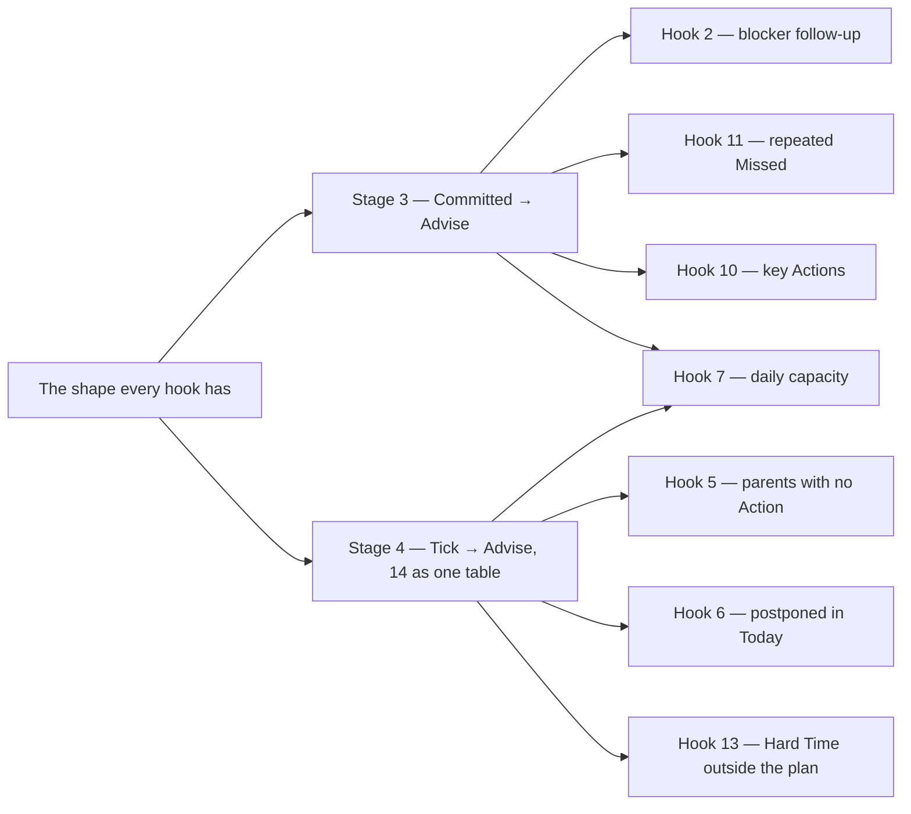

# Which entry to build first

[FUTURE_FEATURE.md](FUTURE_FEATURE.md) records candidates without ordering them. This file sets
their implementation order, costs and dependencies.

**This approves nothing.** An entry still leaves FUTURE_FEATURE.md only by becoming a scenario
package under [tests/brd/](../tests/brd/README.md) or by being dropped, and the owner still decides
which. Usage scenarios here describe future behavior; they do not claim implemented BRD coverage.

## How the order was chosen

Four rules, applied in this order.

1. **The pre-release window closes once.** There are no migrations: a schema change costs a rebuild
   of a database the owner already treats as disposable, and costs a migration forever after v1.
   Every entry that changes a column or a stored word is worth more now than it will ever be again.
2. **A prerequisite before whatever waits on it.** The Committed adapter comes before a hook on a
   saved transition; the Tick adapter and table 14 before a hook that checks state on a
   schedule. Service operations, tool availability and Advisor instructions need neither.
   Proposal fulfillment validation belongs to its own architecture.
3. **Agreed before undecided.** An entry marked *Agreed* needs a scenario package and a batch. One
   marked *Noticed* or *Discussed* needs an owner decision first — that is a question, not an
   implementation, and several questions cost one conversation rather than several.
4. **Then cost.** Among entries of equal standing, the pure-screen ones go first: one adapter, no
   schema, no prompt, and they improve every day of ordinary use.

## The complexity scale

| | What it means |
|---|---|
| **S** | One or two files inside one feature. No schema, no snapshot, no new mechanism. |
| **M** | One feature end to end — model, use cases, adapter — or a mechanical change across many files. Usually moves the prompt-prefix snapshot. |
| **L** | Crosses features, or adds a mechanism, or changes a column and everything that reads it. Moves the prompt snapshot, and often the schema one. |
| **XL** | A new mechanism with reliability questions still open. The design is a batch of its own before any code exists. |

A schema entry carries one extra cost the scale does not show: the schema snapshot is its own
declared batch, and the database is rebuilt. Group the schema entries so that happens a few times,
not once per entry.

## Wave 0 — the questions that block, asked together

None of these is code. Each decides what a later batch builds, so asking them in one conversation
is cheaper than discovering them one wave at a time.

Answered 2026-09-08, and written into the entries themselves:

- **The middle kind became Subgoal.** Wave 1 also introduced raw capture as Idea, and the
  owner's 2026-09-13 decision retired that fourth kind again, in the follow-up below;
  Subgoal keeps its meaning.
- **The effort rungs are approved as written**, 0.5 included.
- **The daily summary and the Diary nudge are two switches, and neither replaces the other.** Both
  on, one message carries both; one on, only that one appears.
- **Hooks need an explicit, inspectable registration contract.** A literal model tool call is
  not required for every reaction. [HOOK_ARCH.md](HOOK_ARCH.md) proposes typed event inputs,
  a central connection list, runtime reactions and staged implementation.
- **Proposal fulfillment validation is not a hook.** Its separate architecture is proposed in
  [PROPOSAL_VALIDATION.md](PROPOSAL_VALIDATION.md); it is not gated by hook registration.

## Wave 1 — the schema and vocabulary window, shipped

Shipped 2026-09-09, in five batches: Cancelled removed, the middle kind renamed to Subgoal
and required under a Goal, Idea reborn as raw capture, the effort rungs with 0.5, and the
Sprint number as `yy.MM-xx`. Their entries are out of FUTURE_FEATURE.md and their rules are
in [cards.feature](../tests/brd/cards.feature), [planning.feature](../tests/brd/planning.feature)
and [profile.feature](../tests/brd/profile.feature). The database is rebuilt for them once,
not five times.

### Follow-up — retire raw-capture Ideas, shipped

Owner decision 2026-09-13, shipped the same day: the fourth Card kind, its list and Expand,
its creation choice, its view and every prompt line naming it, and the default «Все идеи»
Request are gone; Goal, Subgoal and Action keep their rules. No column changed, but a
pre-release row with `kind = 'idea'` is orphaned, so the database is rebuilt. The same day
a subagent started saying what it will change before its calls become proposals
([PR-PLAN-028](../tests/brd/tg_agent_shell/proposals.feature)).

### Follow-up — a kind changes in two places and by no proposal, shipped

Owner decision 2026-09-13, shipped the same day: no proposal changes a Card's kind, and the
entry that would have allowed conversion is dropped. A kind changes in exactly two places,
each written as an `edit_kind` event: a Subgoal whose Goal is deleted alone becomes a Goal
(Wave 2), and a Goal a proposal places under a Goal becomes a Subgoal
([CD-TREE-002](../tests/brd/cards.feature)). No column changed.

### Follow-up — the daily summary, shipped

Owner decision 2026-09-13, shipped the same day: the summary is a second Reminder Safwa
sets for itself, at a Profile time of its own — 20:00 out of the box, `off` to stop it
([PS-SUMMARY-014](../tests/brd/profile.feature)). Two columns changed, `summary_time` on
the Profile and `system_key` on a Reminder, so the database is rebuilt.

### Follow-up — Hard Time is a Reminder's schedule, shipped

Shipped 2026-09-14: a Hard Time is when a Card must happen, resolved the way a Reminder's
timing is — typed by hand as `Mon Wed 09:00`, or by the model in plain words through the
same setup session — and stored as the same schedule payload, with its next occurrence and
what fixes the time ([CD-HARDTIME-033](../tests/brd/cards.feature)). `reminders/api.py`
is the door Cards reads it through. Three columns replaced one, so the database is rebuilt.

### Follow-up — a review nobody answers is closed after 30 minutes, shipped

Shipped 2026-09-14, at 30 minutes rather than the hour the entry named: a review screen
that stands `PROPOSAL_REVIEW_MINUTES` without an answer is closed by the Cue poll — its
pending proposals recorded as expired, what was saved kept, the screen frozen into an
account that the system closed the request, and the whole session chain ended so the
owner's next words start afresh ([PR-EXPIRE-029](../tests/brd/tg_agent_shell/proposals.feature)).
The Reminders that waited behind it are said on that same tick. The entry's second
mechanism, an expiry for manual editors, is dropped: a manual screen holds no lease and
shuts no gate, so there is nothing for one to release. No column changed.

## Wave 2 — screens that cost almost nothing, shipped

Shipped 2026-09-09, in five batches: deleting a Card is now the branch or that Card alone
(a Wave 1 debt: a Subgoal that loses its Goal becomes one), a Goal says when it carries no
Value and every Value on a Card is a button, the Card opens compact with full editing one
button away, a repeating Action carries `[🔄✓]` when its series was already done today, and
a new workspace starts with «Все цели» beside a screen explaining Requests.
Their rules are in [cards.feature](../tests/brd/cards.feature),
[values.feature](../tests/brd/values.feature) and
[saved_requests.feature](../tests/brd/saved_requests.feature). No column changed.

## Wave 3 — the mechanisms other entries wait on, in progress

Started 2026-09-15 with hook stages 1 and 2: one checked connection list, and the existing
Summary and Heavy analyzer offer moved onto it. Their former automatic paths are removed. The
shell works with an empty hook list; no table or prompt prefix changed.

An initiative is one request to the Advisor, delivered through the existing `Cue` queue; the
owner's reply is an ordinary next turn, and the hook reads neither. The next two batches are
stage 3 (Committed → Advise on the blocker, no new table) and stage 4 (Tick → Advise on Goals
without Actions, with one small "when asked" table). Retrospective statistics remain separate.

| Entry | | What it unlocks, and what to watch |
|---|---|---|
| **POTENTIAL HOOKS — the shape every hook has** | M per stage | Stages 1–2 implemented; stages 3–4 in [HOOK_ARCH.md](HOOK_ARCH.md). Each stage is one new event/reaction pair, one real consumer and one line in `HOOKS`. |
| **POTENTIAL HOOKS 14 — Remember when a hook asked** | S | One table: hook, subject, when asked. Only hooks that check state on a schedule read it; a hook on a transition, such as the blocker, remembers nothing. Built with stage 4, not before. |
| **The retrospective — the statistics half only** | M | RT-OPEN-001 currently promises a screen that says there is nothing there yet. Code-calculated statistics fill it and are useful with no model involved. The AI analysis half is Wave 5. |

## Wave 4 — the hooks, in dependency order

Hooks on a committed transition need only the Committed adapter from stage 3. Hooks that poll
state on a schedule need the Tick adapter and the "when asked" table from stage 4. Instructions
1, 4 and 15 need neither. Explicit retrospective workflows do not depend on hook registration.
The classification audit and implementation stages are in [HOOK_ARCH.md](HOOK_ARCH.md).

| Entry | | Depends on |
|---|---|---|
| **1, 4 and 15 — Advisor instructions, not hooks** | S each | Nothing. A prompt line and the snapshot. Note for 4: the Today Actions are already in the state block; the Sprint list is not, and adding it has a cost named below. |
| **2 — After setting a blocker, offer a Reminder** | S | Stage 3; it is stage 3's consumer |
| **5 — Goals and Subgoals with no Actions** | M | Stage 4; it is stage 4's consumer |
| **11 — Repeated Missed observations** | S | Stage 3 and an episode rule for a run of Missed |
| **7 — Today's work exceeds the daily capacity** | M | Stage 3 or 4. The rungs now say what a day's load is, so 15 EP means something; the counting rule is still the entry's own open question. |
| **13 — An approaching Hard Time is outside the plan** | M | Stage 4 and an identity for one occurrence |
| **6 — An unfinished Action repeatedly selected for Today** | L | Stage 4, plus a record of each day's selection into Today that nothing writes yet |
| **10 — Key Actions tied to Sprint Success criteria** | XL | Stage 3 and a Sprint-and-Action relationship with classification history |

## Wave 5 — deliberately later

| Entry | | Why it waits |
|---|---|---|
| **The retrospective — the AI analysis half** | XL | Four questions open in its own entry, and it is also where memory upkeep is removed from `memory/upkeep.py`. Two batches, not one. |
| **Onboarding covers the first start and a return after an absence** | L | Undecided in both halves, and it puts changing state next to the byte-stable prefix. |
| **Proposal fulfillment validation** | XL | A separate part of Proposal architecture; see [PROPOSAL_VALIDATION.md](PROPOSAL_VALIDATION.md). It coordinates request completion, actual outcomes and interruptions. It does not depend on hooks. |
| **8 — Retrieve similar existing entities before creating another** | XL | The general BeforeTool interception, retrieval thresholds and clarification/resume contract remain experimental. |
| **The Advisor cannot read the conversation by date** | L | A recorded limitation. Nothing else waits on it. |

**3** and **12** are already rejected in their entries. They stay written so the reasoning is not
repeated, and they are not scheduled.

## What blocks what

## Where to look hardest

**The blocker as the first initiative.** Ship it as one request to the Advisor through a `Cue`
and nothing more. The second initiative, on a timed check, then has to reuse that path unchanged:
a second delivery path or a second poll loop means the shared part was fitted to the blocker.

**The pre-release window.** Declare a schema batch only if an implementation changes stored
structure.

**What reaches the cacheable prefix.** Onboarding's changing guidance and instruction 4's Sprint
list belong outside `messages[0]`.

**The rungs are the unit now.** Hook 7's 15 EP, the Sprint's committed and capacity figures and
the Advisor's judgement of a day's load all count in a scale that says what work costs the owner.
Recovery does not add up, so a total is a load signal of the right order and never something to
take a percentage of.
