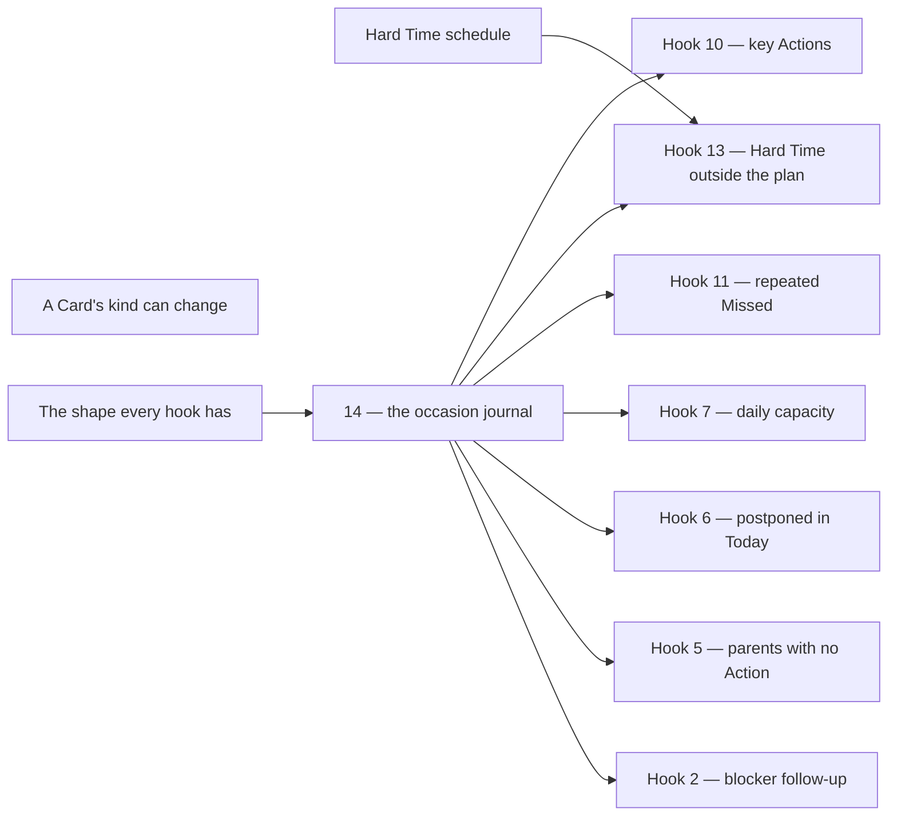

# Which entry to build first

[FUTURE_FEATURE.md](FUTURE_FEATURE.md) records candidates without ordering them. This file sets
their implementation order, costs and dependencies.

**This approves nothing.** An entry still leaves FUTURE_FEATURE.md only by becoming a scenario
package under [tests/brd/](../tests/brd/README.md) or by being dropped, and the owner still decides
which. Usage scenarios here describe future behavior; they do not claim implemented BRD coverage.

## How the order was chosen

Four rules, applied in this order.

1. **The pre-release window closes once.** There are no migrations: a schema change costs a rebuild
   of a database the owner already treats as disposable, and costs a migration forever after v1.
   Every entry that changes a column or a stored word is worth more now than it will ever be again.
2. **A prerequisite before whatever waits on it.** Journal 14 is needed before shipping an
   initiative that must remember an offer or an owner's decision. Service operations,
   tool availability and Advisor instructions do not need that decision journal.
   Proposal fulfillment validation belongs to its own architecture.
3. **Agreed before undecided.** An entry marked *Agreed* needs a scenario package and a batch. One
   marked *Noticed* or *Discussed* needs an owner decision first — that is a question, not an
   implementation, and several questions cost one conversation rather than several.
4. **Then cost.** Among entries of equal standing, the pure-screen ones go first: one adapter, no
   schema, no prompt, and they improve every day of ordinary use.

## The complexity scale

| | What it means |
|---|---|
| **S** | One or two files inside one feature. No schema, no snapshot, no new mechanism. |
| **M** | One feature end to end — model, use cases, adapter — or a mechanical change across many files. Usually moves the prompt-prefix snapshot. |
| **L** | Crosses features, or adds a mechanism, or changes a column and everything that reads it. Moves the prompt snapshot, and often the schema one. |
| **XL** | A new mechanism with reliability questions still open. The design is a batch of its own before any code exists. |

A schema entry carries one extra cost the scale does not show: the schema snapshot is its own
declared batch, and the database is rebuilt. Group the schema entries so that happens a few times,
not once per entry.

## Wave 0 — the questions that block, asked together

None of these is code. Each decides what a later batch builds, so asking them in one conversation
is cheaper than discovering them one wave at a time.

Answered 2026-09-08, and written into the entries themselves:

- **The middle kind became Subgoal.** Wave 1 also introduced raw capture as Idea, and the
  owner's 2026-09-13 decision retired that fourth kind again, in the follow-up below;
  Subgoal keeps its meaning.
- **The effort rungs are approved as written**, 0.5 included.
- **The daily summary and the Diary nudge are two switches, and neither replaces the other.** Both
  on, one message carries both; one on, only that one appears.
- **Hooks need an explicit, inspectable registration contract.** A literal model tool call is
  not required for every reaction. [HOOK_ARCH.md](HOOK_ARCH.md) proposes typed event inputs,
  a central connection list, runtime reactions and staged implementation.
- **Proposal fulfillment validation is not a hook.** Its separate architecture is proposed in
  [PROPOSAL_VALIDATION.md](PROPOSAL_VALIDATION.md); it is not gated by hook registration.

Still open:

| Question | What it blocks |
|---|---|
| What time the daily summary arrives | the daily summary |

## Wave 1 — the schema and vocabulary window, shipped

Shipped 2026-09-09, in five batches: Cancelled removed, the middle kind renamed to Subgoal
and required under a Goal, Idea reborn as raw capture, the effort rungs with 0.5, and the
Sprint number as `yy.MM-xx`. Their entries are out of FUTURE_FEATURE.md and their rules are
in [cards.feature](../tests/brd/cards.feature), [planning.feature](../tests/brd/planning.feature)
and [profile.feature](../tests/brd/profile.feature). The database is rebuilt for them once,
not five times.

### Follow-up — retire raw-capture Ideas, shipped

Owner decision 2026-09-13, shipped the same day: the fourth Card kind, its list and Expand,
its creation choice, its view and every prompt line naming it, and the default «Все идеи»
Request are gone; Goal, Subgoal and Action keep their rules. No column changed, but a
pre-release row with `kind = 'idea'` is orphaned, so the database is rebuilt. The same day
a subagent started saying what it will change before its calls become proposals
([PR-PLAN-028](../tests/brd/tg_agent_shell/proposals.feature)).

## Wave 2 — screens that cost almost nothing, shipped

Shipped 2026-09-09, in five batches: deleting a Card is now the branch or that Card alone
(a Wave 1 debt: a Subgoal that loses its Goal becomes one), a Goal says when it carries no
Value and every Value on a Card is a button, the Card opens compact with full editing one
button away, a repeating Action carries `[🔄✓]` when its series was already done today, and
a new workspace starts with «Все цели» beside a screen explaining Requests.
Their rules are in [cards.feature](../tests/brd/cards.feature),
[values.feature](../tests/brd/values.feature) and
[saved_requests.feature](../tests/brd/saved_requests.feature). No column changed.

## Wave 3 — the mechanisms other entries wait on

| Entry | | What it unlocks, and what to watch |
|---|---|---|
| **POTENTIAL HOOKS — the shape every hook has** | L per implementation stage; design first | Follow the concrete stages in [HOOK_ARCH.md](HOOK_ARCH.md): registration and event adapters, existing Summary and helper behavior, then a complete initiative. Required tool calls need runtime enforcement; named provider selection alone is insufficient. |
| **POTENTIAL HOOKS 14 — Remember hook occasions and the owner's decisions** | L | Build with the first initiative, hook 2. The record must outlive its delivered `Cue`. Summary and helper availability can move to the registry before it; Proposal fulfillment validation is independent. |
| **Hard Time carries a computed time and an explanation** *(Agreed)* | L | Hook 13 and the timed sorting part of 10. `hard_time` stops being a Boolean and reuses `reminders/schedule.py` — `Schedule`, `next_fire`, the payload round trip. Watch which module owns that vocabulary once two features read it: `reminders/api.py` today carries only `parse_clock_or_off`. |
| **An unanswered proposal expires after one hour** *(Agreed)* | L | Touches the proposal store, the turn lease, Reminder delivery order and the single-screen rule at the same time. The entry's last sentence names a *second* mechanism — an expiry for manual editors' live screens. Scope it in or defer it explicitly; do not let it arrive by accident. |
| **The retrospective — the statistics half only** | M | RT-OPEN-001 currently promises a screen that says there is nothing there yet. Code-calculated statistics fill it and are useful with no model involved. The AI analysis half is Wave 5. |
| **The daily summary is a second system Reminder** | M | Reuses the RM-SYSTEM-022 shape and the `Cue` path; the work is the content, the second Profile switch, and the one message that carries both when both are on. Only its hour is still open. |
| **A Card's kind can change while its structure and work history allow it** *(Agreed)* | L | The Subgoal rename and its tree rule have landed, so its four bullets are ready to become scenarios. It concerns Goal/Subgoal/Action only. |

## Wave 4 — the hooks, in dependency order

The initiative hooks below need journal 14, which is shared infrastructure rather than a hook.
Instructions 1, 4 and 15 do not. Explicit retrospective workflows do not depend on hook
registration. The classification audit and implementation stages are in [HOOK_ARCH.md](HOOK_ARCH.md).

| Entry | | Depends on |
|---|---|---|
| **1, 4 and 15 — Advisor instructions, not hooks** | S each | Nothing. A prompt line and the snapshot. Note for 4: the Today Actions are already in the state block; the Sprint list is not, and adding it has a cost named below. |
| **2 — After setting a blocker, offer a Reminder** | M | 14 |
| **11 — Repeated Missed observations** | M | 14 |
| **5 — Goals and Subgoals with no Actions** | M | 14 |
| **7 — Today's work exceeds the daily capacity** | M | 14. The rungs now say what a day's load is, so 15 EP means something; the counting rule is still the entry's own open question. |
| **13 — An approaching Hard Time is outside the plan** | M | 14, and Hard Time |
| **6 — An unfinished Action repeatedly selected for Today** | L | 14, plus a record of each day's selection into Today that nothing writes yet |
| **10 — Key Actions tied to Sprint Success criteria** | XL | 14 and a Sprint-and-Action relationship with classification history. Hard Time is needed for timed sorting, not for the classification itself |

## Wave 5 — deliberately later

| Entry | | Why it waits |
|---|---|---|
| **The retrospective — the AI analysis half** | XL | Four questions open in its own entry, and it is also where memory upkeep is removed from `memory/upkeep.py`. Two batches, not one. |
| **Onboarding covers the first start and a return after an absence** | L | Undecided in both halves, and it puts changing state next to the byte-stable prefix. |
| **Proposal fulfillment validation** | XL | A separate part of Proposal architecture; see [PROPOSAL_VALIDATION.md](PROPOSAL_VALIDATION.md). It coordinates request completion, actual outcomes and interruptions. It does not depend on hooks. |
| **8 — Retrieve similar existing entities before creating another** | XL | The general BeforeTool interception, retrieval thresholds and clarification/resume contract remain experimental. |
| **The Advisor cannot read the conversation by date** | L | A recorded limitation. Nothing else waits on it. |

**3** and **12** are already rejected in their entries. They stay written so the reasoning is not
repeated, and they are not scheduled.

## What blocks what

## Where to look hardest

**The occasion journal with the first initiative.** Ship the blocker follow-up with durable
occasion identity, confirmed delivery and decision handling. A second initiative then reuses a
complete path. Existing Summary and helper availability exercise registration before this stage;
they do not need artificial owner-decision records.

**The pre-release window.** Declare a schema batch only if an implementation changes stored
structure. Hard Time keeps its own schema scope.

**What reaches the cacheable prefix.** Onboarding's changing guidance and instruction 4's Sprint
list belong outside `messages[0]`.

**The rungs are the unit now.** Hook 7's 15 EP, the Sprint's committed and capacity figures and
the Advisor's judgement of a day's load all count in a scale that says what work costs the owner.
Recovery does not add up, so a total is a load signal of the right order and never something to
take a percentage of.
