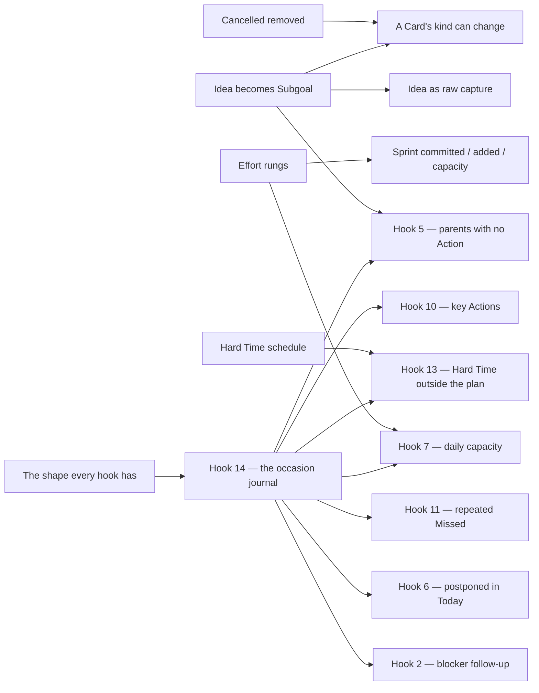

# Which entry to build first

[FUTURE_FEATURE.md](FUTURE_FEATURE.md) records thirty-odd entries and deliberately orders none of
them. This file is the reading order over that one and nothing else: which entry to turn into an
approved scenario package first, what it costs, and what waits on it.

**This approves nothing.** An entry still leaves FUTURE_FEATURE.md only by becoming a scenario
package under [tests/brd/](../tests/brd/README.md) or by being dropped, and the owner still decides
which. Every heading quoted below is that entry's own heading, so the two files read side by side.

## How the order was chosen

Four rules, applied in this order.

1. **The pre-release window closes once.** There are no migrations: a schema change costs a rebuild
   of a database the owner already treats as disposable, and costs a migration forever after v1.
   Every entry that changes a column or a stored word is worth more now than it will ever be again.
2. **A prerequisite before whatever waits on it.** Hook 14 is needed before shipping an
   initiative that must remember an offer or an owner's decision. Service operations,
   tool availability and Advisor instructions do not need that decision journal.
   Proposal fulfillment validation belongs to its own architecture.
3. **Agreed before undecided.** An entry marked *Agreed* needs a scenario package and a batch. One
   marked *Noticed* or *Discussed* needs an owner decision first — that is a question, not an
   implementation, and several questions cost one conversation rather than several.
4. **Then cost.** Among entries of equal standing, the pure-screen ones go first: one adapter, no
   schema, no prompt, and they improve every day of ordinary use.

## The complexity scale

| | What it means |
|---|---|
| **S** | One or two files inside one feature. No schema, no snapshot, no new mechanism. |
| **M** | One feature end to end — model, use cases, adapter — or a mechanical change across many files. Usually moves the prompt-prefix snapshot. |
| **L** | Crosses features, or adds a mechanism, or changes a column and everything that reads it. Moves the prompt snapshot, and often the schema one. |
| **XL** | A new mechanism with reliability questions still open. The design is a batch of its own before any code exists. |

A schema entry carries one extra cost the scale does not show: the schema snapshot is its own
declared batch, and the database is rebuilt. Group the schema entries so that happens a few times,
not once per entry.

## Wave 0 — the questions that block, asked together

None of these is code. Each decides what a later batch builds, so asking them in one conversation
is cheaper than discovering them one wave at a time.

Answered 2026-09-08, and written into the entries themselves:

- **The middle kind becomes Subgoal, and Idea keeps its word for raw capture.** An Idea is a title
  and a note, outside the stage system, in a list of its own, created by the owner and the Advisor
  alike, and converted into the tree by one button. This is what the loose thought had been missing
  a home for; the Diary gains nothing and no stage is added.
- **The effort rungs are approved as written**, 0.5 included.
- **The daily summary and the Diary nudge are two switches, and neither replaces the other.** Both
  on, one message carries both; one on, only that one appears.
- **Hooks need an explicit, inspectable registration contract.** A literal model tool call is
  not required for every reaction. [HOOK_ARCH.md](HOOK_ARCH.md) proposes typed event inputs,
  a central connection list, runtime reactions and staged implementation.
- **Proposal fulfillment validation is not a hook.** Its separate architecture is proposed in
  [PROPOSAL_VALIDATION.md](PROPOSAL_VALIDATION.md); it is not gated by hook registration.

Still open, and none of it blocks Wave 1:

| Question | What it blocks |
|---|---|
| Which kinds the Idea's conversion button offers, and whether the note survives the conversion | the Idea capture kind |
| What time the daily summary arrives | the daily summary |
| Which fields and buttons the compact Card view shows | the compact view |
| The symbol for "this series was already done today" | the repeating-Action marker |

## Wave 1 — the schema and vocabulary window

| Entry | | Why now |
|---|---|---|
| **Cancelled is removed** *(Agreed)* | M | Pure deletion, and deletion is the cheapest batch there is: `CardStage.CANCELLED`, `TERMINAL_STAGES` down to one member, `cancelled_at`, the derivation branch in `cards/hierarchy.py`, the `cancel` mode and the stage `Literal` in `cards/agent.py`, the Advisor's stage line. `remove` already gives the model the deletion route that replaces it. Do it before kind conversion, which would otherwise write rules for a stage that is leaving. |
| **The middle Card kind is named for the one thing it cannot be** — the rename and the tree rule | M | Idea becomes Subgoal in a stored word, in every prompt line and in every scenario, and a Subgoal comes to require a Goal. It gets more expensive with each new scenario written meanwhile. Splitting the capture kind out of this batch keeps it a rename. |
| **The same entry — Idea as raw capture** | L | A fourth kind that is in no board and no Sprint: its own list, its own screen, one conversion button, and a place in the Card tool the Advisor can reach. `effective_stage` is not nullable and carries an index, so the batch decides what an Idea stores there. Do it after the rename, or it is written twice. |
| **Effort is offered in points one owner cannot calibrate** | L | `effort_points` and `capacity_effort_points` turn numeric, `EFFORT_POINTS` gains 0.5, plus the `Literal` in `cards/agent.py`, the whole-number check in `profile/use_cases.py`, the `EP` labels in the Card screens and the sums in `cards/hierarchy.py`. See "Where to look hardest". |
| **A Sprint number says nothing about when it ran** | M | Integer to text, and every place that prints a number: the retro screen, the Sprint messages, the state block the Advisor reads. Both open questions are answered inside the entry. |

## Wave 2 — screens that cost almost nothing

| Entry | | Note |
|---|---|---|
| **A Goal with no Value is not visible as one** | S | One screen. The cheapest entry in the file. |
| **A repeating Action shows when it has already been done today** *(Agreed)* | M | A query over `repeat_series_id` inside the owner's `Workspace` day; the marker lands in the board list, the Card screen and the citation label. No schema. Only the symbol is undecided. |
| **A Card opens in a compact view with full editing one button away** *(Agreed)* | M | The Card adapter alone. Highest everyday value per line changed. |
| **One ready-made Request explains Saved Requests** | M | Its one open question — how an existing installation receives the default — has no answer today and needs none: before release there is no existing installation. Shipping it now deletes the question instead of answering it. |

## Wave 3 — the mechanisms other entries wait on

| Entry | | What it unlocks, and what to watch |
|---|---|---|
| **POTENTIAL HOOKS — the shape every hook has** | L per implementation stage; design first | Follow the concrete stages in [HOOK_ARCH.md](HOOK_ARCH.md): registration and event adapters, existing Summary and helper behavior, then a complete initiative. Required tool calls need runtime enforcement; named provider selection alone is insufficient. |
| **POTENTIAL HOOKS 14 — Remember hook occasions and the owner's decisions** | L | Build with the first initiative, hook 2. The record must outlive its delivered `Cue`. Summary and helper availability can move to the registry before it; Proposal fulfillment validation is independent. |
| **Hard Time carries a computed time and an explanation** *(Agreed)* | L | Hook 13 and the timed sorting part of 10. `hard_time` stops being a Boolean and reuses `reminders/schedule.py` — `Schedule`, `next_fire`, the payload round trip. Watch which module owns that vocabulary once two features read it: `reminders/api.py` today carries only `parse_clock_or_off`. |
| **An unanswered proposal expires after one hour** *(Agreed)* | L | Touches the proposal store, the turn lease, Reminder delivery order and the single-screen rule at the same time. The entry's last sentence names a *second* mechanism — an expiry for manual editors' live screens. Scope it in or defer it explicitly; do not let it arrive by accident. |
| **The retrospective — the statistics half only** | M | RT-OPEN-001 currently promises a screen that says there is nothing there yet. Code-calculated statistics fill it and are useful with no model involved. The AI analysis half is Wave 5. |
| **The daily summary is a second system Reminder** | M | Reuses the RM-SYSTEM-022 shape and the `Cue` path; the work is the content, the second Profile switch, and the one message that carries both when both are on. Only its hour is still open. |
| **A Card's kind can change while its structure and work history allow it** *(Agreed)* | L | Downstream of Cancelled and of the Direction rename, and of the tree rule that Wave 0 decides. Its four bullets are complete enough to become scenarios the day those land. |

## Wave 4 — the hooks, in dependency order

The initiative hooks below need hook 14. Instructions 1, 4 and 15 do not. The hook-specific
implementation stages are detailed in [HOOK_ARCH.md](HOOK_ARCH.md).

| Entry | | Depends on |
|---|---|---|
| **1, 4 and 15 — Advisor instructions, not hooks** | S each | Nothing. A prompt line and the snapshot. Note for 4: the Today Actions are already in the state block; the Sprint list is not, and adding it has a cost named below. |
| **2 — After setting a blocker, offer a Reminder** | M | 14 |
| **11 — Repeated Missed observations** | M | 14 |
| **5 — Goals and Directions with no Actions** | M | 14, and the Direction rename |
| **7 — Today's work exceeds the daily capacity** | M | 14, and the effort rungs. A warning at 15 EP means nothing while EP means nothing. |
| **13 — An approaching Hard Time is outside the plan** | M | 14, and Hard Time |
| **6 — An unfinished Action repeatedly selected for Today** | L | 14, plus a record of each day's selection into Today that nothing writes yet |
| **10 — Key Actions tied to Sprint Success criteria** | XL | 14 and a Sprint-and-Action relationship with classification history. Hard Time is needed for timed sorting, not for the classification itself |

## Wave 5 — deliberately later

| Entry | | Why it waits |
|---|---|---|
| **The retrospective — the AI analysis half** | XL | Four questions open in its own entry, and it is also where memory upkeep is removed from `memory/upkeep.py`. Two batches, not one. |
| **Onboarding covers the first start and a return after an absence** | L | Undecided in both halves, and it puts changing state next to the byte-stable prefix. |
| **Proposal fulfillment validation** | XL | A separate part of Proposal architecture; see [PROPOSAL_VALIDATION.md](PROPOSAL_VALIDATION.md). It coordinates request completion, actual outcomes and interruptions. It does not depend on the hook registry or occasion journal. |
| **8 — Retrieve similar existing entities before creating another** | XL | New retrieval infrastructure and a threshold the entry itself calls experimental. |
| **The Advisor cannot read the conversation by date** | L | A recorded limitation. Nothing else waits on it. |

**3** and **12** are already rejected in their entries. They stay written so the reasoning is not
repeated, and they are not scheduled.

## What blocks what

## Where to look hardest

**The effort scale, because everything downstream is denominated in it.** The Sprint's committed,
added and capacity figures, hook 7's 15 EP, and the Advisor's judgement of a day's load all count in
a unit one owner cannot calibrate today. Fix the unit and those numbers start meaning something;
build them first and they are decoration. The entry also carries a constraint the screens must
respect: recovery does not add up, so a sprint total is a load signal of the right order and never
something to take a percentage of. `EnergyType` already says which kind of load it is, so the scale
does not have to.

**The occasion journal with the first initiative.** Ship the blocker follow-up with durable
occasion identity, confirmed delivery and decision handling. A second initiative then reuses a
complete path. Existing Summary and helper availability exercise registration before this stage;
they do not need artificial owner-decision records.

**The pre-release window.** Four Wave 1 entries change a column. They are cheap today because the
owner rebuilds the database anyway, and they are the only entries whose cost rises permanently at
v1. Everything in Waves 2 and 4 will cost the same next month; these will not.

**What reaches the cacheable prefix.** Two entries push volatile content toward `messages[0]`:
onboarding's changing guidance, and hook 4's Sprint list. The Today Actions already sit in the state
block and already pay this; a Sprint list changes on every Card edit, which is a different order of
churn. Decide where that content goes before writing either.

**Vocabulary before volume.** Idea becomes Subgoal touches a stored word, the prompts and every
scenario that spells it — and the freed word is then reused for a different kind, so a scenario
written in between says something that will be false twice. Each wave written before the rename
adds to what the rename has to rewrite.
