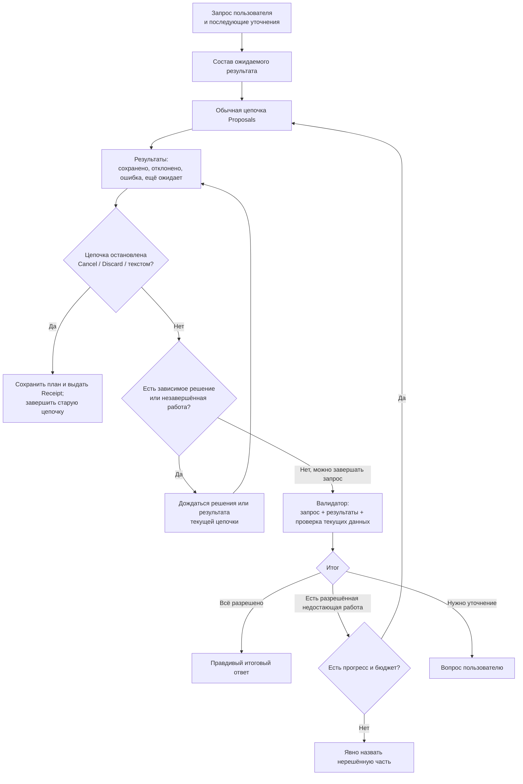

# Проверка исполнения запроса в архитектуре Proposals

Проект для обсуждения, 2026-09-08. По решению владельца проверка выполнения относится к
архитектуре Proposals и рассматривается отдельно от системы хуков. Этот документ сохраняет
предложение по её устройству; регистрация хуков не является его предпосылкой.
Уточнено 2026-09-13: проверка подчиняется остановке всей цепочки по Cancel, Discard или тексту
поверх review. [План и подготовка Proposals](AGENT_ARCH.md#planned-proposal-plan-and-preparation-lifecycle)
реализуются раньше валидатора и не требуют его для правильного завершения или остановки.

## Граница проверки

Формулировка «у каждого Proposal свой валидатор с полным запросом» опасна.
Если запрос содержит Карточку и Reminder, валидатор Карточки не должен создавать Reminder,
пока другой Proposal уже ждёт его сохранения.

**Предлагается один валидатор исполнения на исходный запрос.** Каждый Proposal отдаёт ему
фактический результат, а предметные проверки конкретной операции остаются у её use case.
Проверку запускает жизненный цикл Proposals перед завершением обслуживаемого запроса.
Она не регистрируется в каталоге хуков, не имеет переключателя хука и не зависит от Cue,
журнала инициатив или отказа от инициативных советов.

Ожидаемый результат — короткий список намерений из запроса и уточнений, связанный с полученными
результатами. Он не требует отдельного универсального планировщика. Подтверждённое сохранение
проверяется по receipt и при необходимости текущим данным, а не по фразе модели «готово».
Для изменения связи проверяется связь; наличие похожего заголовка не доказывает успех.
Показанный пользователю план не сужает историю Advisor, субагентов или валидатора. Обычные
контекст, данные и результаты инструментов остаются доступны.

**Терминальная остановка проверяется до поиска недостающей работы.** Cancel прекращает подготовку,
Discard закрывает выбранный Proposal и весь неисполненный остаток, а текст поверх review закрывает
старую цепочку перед обычной обработкой нового запроса. Сохраняются уже применённые изменения,
план остаётся, активный экран сменяется Receipt. Валидатор не запускает исправляющий цикл и не
возобновляет остановленную сессию. Это правило продолжает действовать при позднем результате
модели, восстановлении или повторном вызове проверки.

Остановка не означает, что пользователь навсегда отказался от исходной цели. Она прекращает
разрешение продолжать эту цепочку. Новый запрос может разрешить переработанный план; сохранённый
на экране старый план и незавершённые пункты сами такого разрешения не дают.

Семантическая проверка моделью остаётся дополнительным контролем, а не доказательством:
валидатор может повторить ошибку интерпретации основного агента. Поэтому он получает исходные
слова пользователя и уточнения, а не только пересказ плана; предметные инварианты проверяет код.
Качество обнаружения пропусков следует измерять на запросах с несколькими намерениями,
коррекциями и отказами, прежде чем полагаться на этот контроль в повседневной работе.

Различаются четыре исхода по каждой части запроса:

- выполнена и подтверждена;
- сознательно исключена пользователем;
- ещё ждёт решения/уточнения;
- не выполнена из-за ошибки или ограничения.

Отдельно учитывается терминальная остановка цепочки: оставшаяся работа не исполняется и не
объявляется поэлементно отклонённой пользователем. Receipt отличает выбранный Discard от остатка,
остановленного вместе с цепочкой.

Только первый исход является исполнением. Первые два могут означать, что запрос разрешён
с учётом решений пользователя. Оставшиеся части нельзя скрыть словом «готово».
Сам валидатор не может автоматически объявить пропущенное требование ненужным.

Пример: «Создай Действие и напомни в пятницу». Действие уже сохранено, Reminder не был предложен.
Валидатор возвращает только недостающий Reminder. Если Reminder ещё ждёт Save, новая копия не
создаётся. Если пользователь написал «напоминание не нужно», эта часть исключается. Если он
нажал Discard из-за неточного времени, текущая цепочка всё равно заканчивается. Дальнейшее
уточнение времени рассматривается как новый запрос; валидатор не переоткрывает старый Proposal.

Исправления идут через обычные Proposals с тем же режимом разрешения изменений. Валидатор
не получает прямой записи в Карточки и не отменяет Save. После каждой исправляющей цепочки
проверяется прогресс. Повтор одинакового нерешённого результата останавливает цикл после
ограниченного числа попыток; существующий общий бюджет запроса остаётся верхней границей.
Фраза «работает до полного исполнения» означает последовательное стремление к результату,
а не бесконечную генерацию.
Эти исправления допустимы только пока цепочка активна: явная остановка не является ошибкой,
которую валидатору поручено исправить. План удаляется только после успешного завершения всей
цепочки; остановка, пустая очередь после Discard или неустранённая ошибка его не удаляют.

## Foreground и прерывание

В [текущих сценариях](../tests/brd/tg_agent_shell/agents.feature) AG-TURN-010 и AG-HELPER-025
новое сообщение во время foreground обычно не принимается. AG-TURN-024 отдаёт приоритет
пользователю при фоновой работе. Применить второе правило к foreground-валидатору автоматически
нельзя.

Для первой версии предлагаю сохранить текущую политику: статус «Проверяю сохранение», доступный
`/cancel`, без второго одновременного запроса. При отмене сохраняются уже применённые изменения
и факт незавершённой проверки, видимый план остаётся и выдаётся Receipt. Следующий запрос
использует обычную историю и фактические результаты; завершённая остановкой цепочка не возобновляется.

Если желаемое поведение — **новый текст отменяет проверку и сразу становится новым запросом**,
это отдельное изменение утверждённого поведения. Тогда нужно явно отменить старую генерацию,
запретить публикацию её запоздавшего результата, принять сообщение и передать новой работе
подтверждённые сохранения вместе с фактом прерванной проверки. Старые сохранения не откатываются.
Архитектура допускает обе политики; по умолчанию документ выбирает существующую.

## Место в реализации

Точка интеграции — продолжение запроса после результатов Proposals и перед его финальным
ответом. Подготовка, применение и receipts уже разделены в
[архитектуре модулей](FEATURE_MODULES.md#the-three-proposal-responsibilities) и
[сессии](../src/tg_agent_shell/session.py). Проверка не подменяет предметные проверки
подготовки и сохранения: она ищет недостающие части исходного намерения.

Общими с остальным приложением остаются существующие сессия, бюджет и отмена. Новый контракт
регистрации хуков, его события и способы доставки проверке не нужны. Хук может предложить
Reminder, а пользователь — принять предложение; с момента создания обычного запроса на
Reminder работу контролирует архитектура Proposals тем же способом, что и любой такой запрос.

## Проверки будущей реализации

| Ситуация | Ожидаемый результат |
|---|---|
| Одна часть сохранена, другая ждёт Save | Проверка не создаёт дубликаты и не объявляет всё выполненным |
| Пользователь явно исключил часть запроса | Она не восстанавливается как пропущенная |
| Пользователь нажал Discard на одном Proposal | Весь неисполненный остаток закрывается, план остаётся, Receipt завершает цепочку; валидатор ничего не восстанавливает |
| Пользователь написал поверх review | Старая цепочка закрывается с Receipt до обычной обработки нового текста; её сессия не возобновляется |
| Новый запрос уточняет отклонённое предложение | Можно подготовить новый план, учитывая прежние фактические сохранения; старая цепочка остаётся остановленной |
| Исправление не даёт прогресса | Ограниченная остановка с перечислением нерешённого |
| Проверка прервана после Save | Сохранённое и план остаются, Receipt отражает остановку; непроверенная часть не объявляется проверенной |
| После Cancel пришёл запоздалый результат проверки | Он не создаёт Proposals и не удаляет оставленный план |
| Вся цепочка успешно завершена | План удаляется; Receipt отражает действительные результаты |
| Все инициативные хуки отключены | Проверка Proposals продолжает работать |

Отдельно предстоит согласовать политику входящего сообщения во время проверки, предел
исправлений и способ представить ожидаемый результат. Эти вопросы не блокируют систему хуков.
