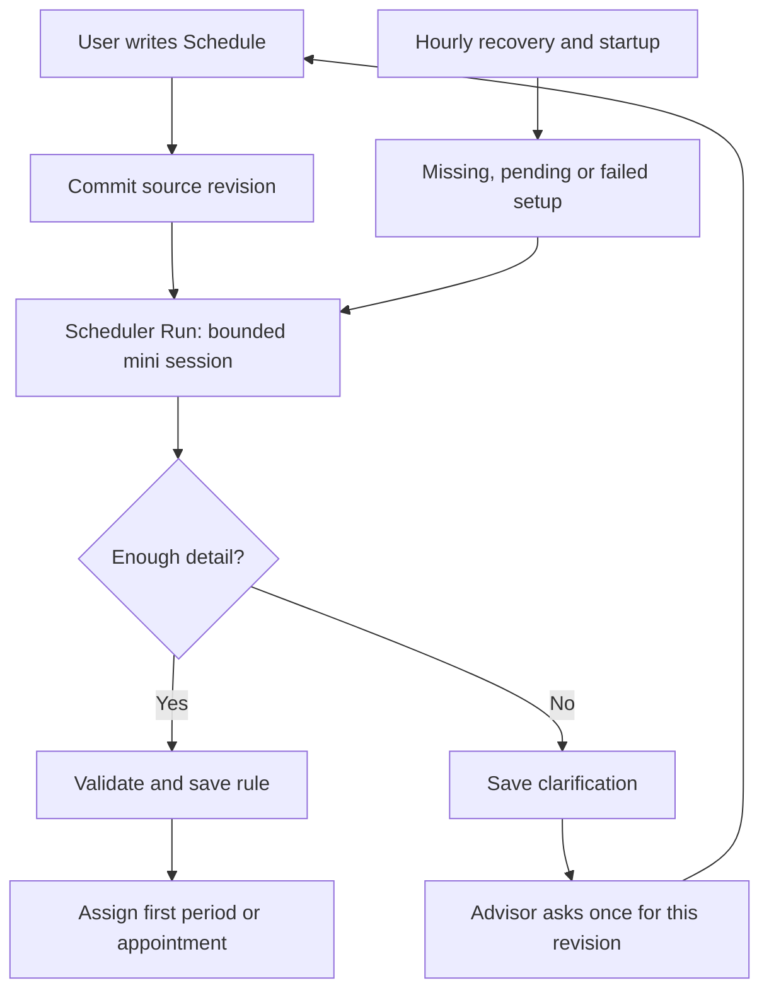
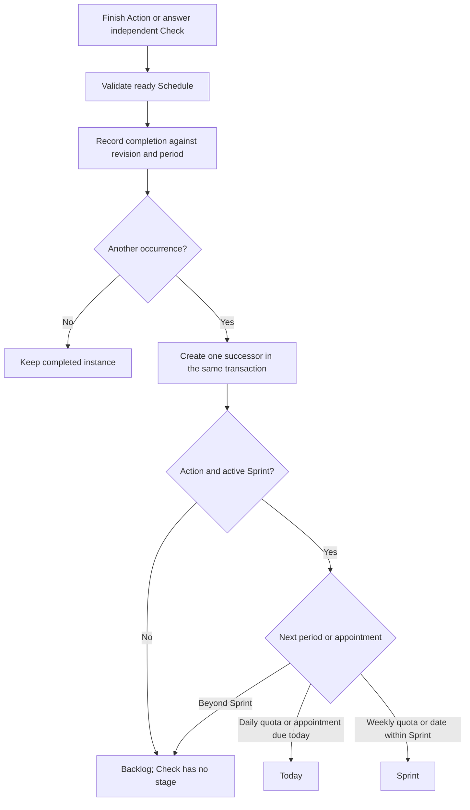

# Schedule

This schema/domain batch replaces the Repeat and Hard Time controls with one `schedule`
text field on an Action or independent Check. Reminders remain separate messages to Safwa.

The text expresses intent. `schedules` stores a revision of that text and its validated rule.
The compiler runs after the source edit commits; completion, counting and the next occurrence
use ordinary code. Editing a title, answering a Check or completing an Action never reparses
the text. Relative dates use the source submission time, including after a retry.



The forms are calendar quotas (N per day/week), appointments (once, selected weekdays and
clock, or a clock interval), and repetition after completion. Days and Monday-based weeks
use the workspace timezone. A quota does not invent a clock. Unused quota does not carry
forward. Every quota answer belongs to the current calendar period, including extra answers;
a late appointment answer remains attached to its appointment. One instance stays open at a time.



The original Action keeps its chosen stage. Generated successors use the plan above.
An after-completion rule has no date: with a Sprint it keeps Today/Sprint, otherwise Backlog.
Plain linked Checks follow the Action cycle, gate Done and reset when that Action is reopened.
A Check with its own Schedule cannot be linked to a Card; answering it never alters a Card.
Passed and Missed both count as observations. An unanswered Check is not implicitly Missed.

`get_scheduled(start_date, end_date, type="card"|"check", after_id=null)` is a read-only
Advisor tool. Dates are inclusive local dates, with a maximum span of 93 days. It returns
one item per series that has scheduled work or observations in the range, aggregating its
source revisions. There is no list of individual occurrences. The envelope carries the
timezone, query time and active Sprint dates; `sprint` is null when none is active.

An item identifies the latest instance (`id`) and stable series (`series_id`), with its title,
Schedule and setup status. `next` is a local timestamp for an appointment, an inclusive
date window and remaining quota for day/week repetition, or `after_completion: true` for
undated repetition. Ended or unconfigured plans have `next: null`.

`range` and `sprint` each contain `planned`, `done` and `remaining`. These are totals for the
selected range and the active Sprint. `total` contains lifetime `done` and `remaining`;
the remainder is null for unlimited repetition, and zero/one for an ended/open one-time
appointment. For Checks, `done` means answered; each block also contains `passed` and `missed`.

For example, one Check answered Missed today, with a daily quota of five and no active Sprint:

```json
{
  "id": 12, "series_id": 11, "title": "Posture?", "schedule": "five times a day",
  "status": "ready",
  "next": {"start_date": "2026-10-03", "end_date": "2026-10-03", "remaining": 4},
  "range": {"planned": 5, "done": 1, "remaining": 4, "passed": 0, "missed": 1},
  "sprint": null,
  "total": {"done": 1, "remaining": null, "passed": 0, "missed": 1}
}
```

Range/Sprint `remaining` means plan shortfall, not carried-over work. `next.remaining`
is the quota still available in its next window. Partial weeks keep the whole weekly
quota and set `partial: true`; no quota is allocated to a chosen day. The same flag marks
a source revision that begins/ends inside a quota period. A rule change starts a new quota
for that revision, while earlier facts and quotas keep their meaning in the summary.
After-completion repetition and unfinished setup have unknown `planned` and `remaining`.

The reply uses the shared read limits of 12,000 characters and 50 items
(`DEFAULT_CHAR_BUDGET`, `DEFAULT_ROW_LIMIT`). If more series remain, it returns
`next_after_id`; repeat the same query with that `after_id` before reporting complete totals.
Long text fields are clipped to fit the shared cell limit (`DEFAULT_CELL_LIMIT`), including
JSON escaping, with
`text_truncated: true`; stored Schedule text is unchanged. Invalid arguments return a
retryable error so the Advisor can repair the request within its turn.

Source revisions are retained so changing a rule cannot reinterpret historical completions.
Schedule can be edited only on an open Action or Pending Check. Historical revisions point
to the current series instance, and appointments are counted only while their revision is active.
An in-flight result is discarded when its revision was superseded. Needs-clarification rows
are not reparsed hourly; pending and failed rows are retried. Clearing Schedule disables its
plan and allows ordinary completion and reopening of the final Action. Earlier repeating
instances remain closed. Deleting the last open instance ends its active plan while retaining
the history of surviving instances. Finish is refused while a nonempty Schedule lacks a
ready rule, before any completion fact is written. An early interval completion advances
past the consumed appointment.

## Planned load

The EP estimate on an Action is the cost of one execution. Planning counts the remaining
calendar executions from today through the Profile's Sprint length. A running Sprint uses
its own fixed dates. A 5 EP daily Action in a three-day plan consumes three Actions and
15 EP, including when estimates are hidden. Ordinary Actions consume one execution.

`remaining_occurrences` reuses the same calendar windows as `get_scheduled` and subtracts
completion facts for the current revision. A partial week keeps its whole quota; choosing
a weekly Action for Today offers that remaining weekly quota, without inventing daily
allocations. An overdue current appointment counts once alongside the future appointments.
Unfinished setup and undated after-completion repetition have unknown quantities: totals
are marked as lower bounds, with no completion percentage or planned distribution shares.
Unknown quantities contribute no invented executions or EP to those known totals.

The existing Sprint commitment stores `planned_count` beside its frozen unit EP estimate.
Done consumes one reserved execution; its successor inherits the remaining quantity,
scope and estimate. Creating that copy does not add the series to the Sprint again.
An actual execution beyond the reservation counts as added. Removing an open copy removes
its remaining reservation; returning it restores it. When the next copy belongs outside
the Sprint, unused reservations on the completed copy count as removed.
Editing Schedule refreshes the open copy's future quantity, while completed copies and
the commitment's unit EP estimate stay fixed. Thus committed/added volume reflects the
current schedule forecast; it is not a separate history of every schedule edit.

Plan screens, capacity warnings, Sprint metrics, finish previews, Home and AI context use
these execution counts. Today uses only the remaining work in today's local window,
plus actual completions for the overload check. The existing `today_days` row snapshots
that morning's execution count once per series and day. Retro weights planned, remaining,
blocked, key and Category/Energy quantities, and keeps actual Done and time once per copy.
Card/Goal estimates without a calendar horizon remain per-instance estimates, not Sprint load.
