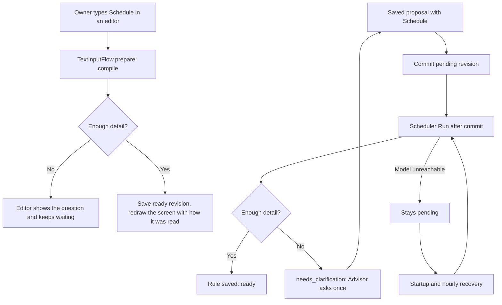
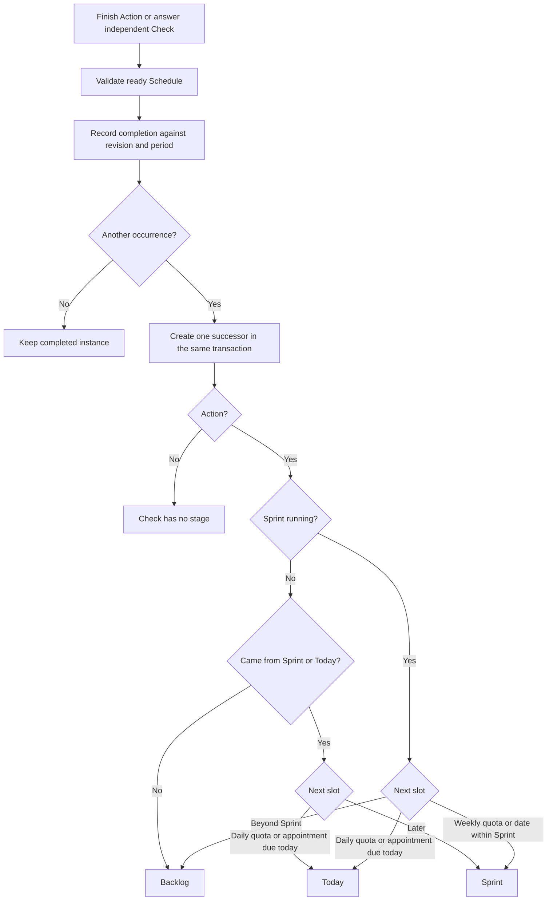

# Schedule

An Action or an independent Check carries one `schedule` text field: when it repeats or
happens, in the owner's words. On a Goal or a Subgoal the same field is its Deadline.
Reminders are separate messages to Safwa and do not use it.

The text expresses intent. `schedules` stores a revision of that text and its validated rule.
The model reads the text once per revision; completion, counting and the next occurrence use
ordinary code. Editing a title, answering a Check or completing an Action never reparses the
text. Relative dates use the source submission time, including after a retry.

## Where the text is read

A revision is `pending`, `ready` or `needs_clarification`. Clearing the text ends the current
revision and leaves the entity with none.



A typed Schedule is compiled before anything is written, outside the transaction, so a
question never leaves a half-set Schedule and the screen shows the result at once. A
proposal only carries the text: the workspace mutator, a small model, never has to settle
the timing before the Card exists, and the Scheduler reads it after the commit. An in-flight
result is discarded when its revision was superseded. A `needs_clarification` revision is not
reparsed hourly; a `pending` one is retried at startup and each hour until it is read.
Finishing an Action or answering a Check is refused, before any fact is written, while its
Schedule is not `ready`; the refusal carries the Scheduler's question or says the Schedule is
still being set up, and names `off` as the way out.

The compiler receives a target. `action` and `check` use one prompt; an Action planning more
than `ACTION_DAILY_EXECUTIONS_MAX` (10) executions a day — a daily quota above it, a weekly
quota above 70, an interval under 144 minutes — becomes a question suggesting a Check.
`deadline` uses its own prompt and one terminal: a date, and a time only when given.
Repeating text there is a question.

## Rules

The forms are calendar quotas (N per day/week), appointments (once, selected weekdays and
clock, or a clock interval), repetition after completion, and a Deadline. Days and
Monday-based weeks use the workspace timezone. A quota does not invent a clock. Unused quota
does not carry forward. Every quota answer belongs to the current calendar period, including
extra answers; a late appointment answer remains attached to its appointment. One instance
stays open at a time.

A Deadline (`{"kind": "deadline", "date", "time"}`) is due at its time, or by 23:59 of its
date. Its moment is the Goal's `period_start`, so Card lists sort it with appointments. It never
gates Done, plans no executions, is left out of `get_scheduled`, and is not compared with the
Actions under its Goal.



The original Action keeps its chosen stage. An after-completion rule has no date: it keeps
Today/Sprint, and with a Sprint it moves a Backlog copy into the Sprint. In Planning Today
works as in a Sprint, while a copy from Backlog stays there; a dated copy of planned work opens
in Today when due today and in Sprint otherwise. A copy left in Sprint while its slot comes due
is brought up by the morning hook below rather than moved.

Plain linked Checks follow the Action cycle, gate Done and reset when that Action is reopened.
A Check with its own Schedule cannot be linked to a Card; answering it never alters a Card.
Passed and Missed both count as observations. An unanswered Check is not implicitly Missed.

## Planned load

The EP estimate on an Action is the cost of one execution. `planned_executions` counts, for a
list of Actions at once, the executions left from today — or a later window start — through
the window's last day. An Action without a Schedule is 1; unknown setup and after-completion
repetition are `None`; every other Action on the plan is at least 1, including when its
appointment falls outside the window. A running Sprint's window is today to its planned last
day, so an Action joining mid-Sprint counts only the days left. Planning uses the Profile's
Sprint length from today.

Each quota period the window covers in part gets its share by local days covered:
`round(count × days covered / days in period)`. A period's facts reduce it only beyond the
rest of the quota: `min(share, count − done in that period)`. Three a week over a
Wednesday-to-Tuesday Sprint is 2 + 1; in Today alone it is `round(3/7) = 0`, so 1 for the
Action itself. Over a window split at any weekday the two shares add up to the quota. An
overdue current appointment counts once alongside the future appointments. Unknown
quantities contribute no invented executions or EP: totals are marked as lower bounds, with
no completion percentage or planned distribution shares.

The Sprint commitment stores `planned_count` beside its frozen unit EP estimate. Done consumes
one reserved execution; its successor inherits the remaining quantity, scope and estimate, so
creating that copy does not add the series again. An actual execution beyond the reservation
counts as added. Removing an open copy from the Sprint removes its remaining reservation;
returning it restores it. Executions taken and not done stay taken and undone — the honest
shortfall — and only removal counts as removed. Editing Schedule refreshes the open copy's
quantity, while completed copies and the unit EP estimate stay fixed.

Plan screens, capacity warnings, Sprint metrics, finish previews, Home and AI context use these
execution counts. Today uses the work left in today's local window, plus actual completions for
the overload check. `today_days` snapshots that morning's execution count once per series and
day. Retro weights planned, remaining, blocked, key and Category/Energy quantities, and keeps
actual Done and time once per copy.

## The morning hook

`cards.schedule_plan` ("Schedule outside the plan", PL-HARDTIME-021) runs when a Sprint starts
and at the Morning time while one runs. It asks once about open Actions with an appointment
today or tomorrow outside Today, an appointment by the Sprint's end still in Backlog, or a
daily quota with executions left today outside Today. It moves nothing itself.

## Reading the plan

`get_scheduled(start_date, end_date, type="card"|"check", after_id=null)` is a read-only Advisor
tool. Dates are inclusive local dates, at most `SCHEDULED_RANGE_DAYS_MAX` (93) days. It returns
one item per Action or Check series that has planned work or observations in the range,
aggregating its source revisions. There is no list of individual occurrences. The envelope
carries the timezone, query time and active Sprint dates; `sprint` is null when none is active.

An item identifies the latest instance (`id`) and stable series (`series_id`), with its title,
Schedule and setup status. `next` is a local timestamp for an appointment, an inclusive date
window and remaining quota for day/week repetition, or `after_completion: true` for undated
repetition. Ended or unconfigured plans have `next: null`.

`range` and `sprint` each contain `planned`, `done` and `remaining`. `planned` uses the same
prorated windows as the load; an appointment's fact counts on its date and any other fact when
it happened. `total` contains lifetime `done` and `remaining`; the remainder is null for
unlimited repetition, and zero/one for an ended/open one-time appointment. For Checks, `done`
means answered; each block also contains `passed` and `missed`.

For example, one Check answered Missed today, with a daily quota of five and no active Sprint:

```json
{
  "id": 12, "series_id": 11, "title": "Posture?", "schedule": "five times a day",
  "status": "ready",
  "next": {"start_date": "2026-10-03", "end_date": "2026-10-03", "remaining": 4},
  "range": {"planned": 5, "done": 1, "remaining": 4, "passed": 0, "missed": 1},
  "sprint": null,
  "total": {"done": 1, "remaining": null, "passed": 0, "missed": 1}
}
```

Range/Sprint `remaining` means plan shortfall, not carried-over work. `next.remaining` is the
quota still available in its next window. A rule change starts a new quota for that revision,
while earlier facts and quotas keep their meaning in the summary. After-completion repetition
and unfinished setup have unknown `planned` and `remaining`.

The reply uses the shared read limits of 12,000 characters and 50 items (`DEFAULT_CHAR_BUDGET`,
`DEFAULT_ROW_LIMIT`). If more series remain, it returns `next_after_id` with a notice to call
again with that `after_id`. Long text fields are clipped to fit the shared cell limit
(`DEFAULT_CELL_LIMIT`), including JSON escaping, with `text_truncated: true`; stored Schedule
text is unchanged. Invalid arguments return a retryable error so the Advisor can repair the
request within its turn.

## History

Source revisions are retained so changing a rule cannot reinterpret historical completions.
Schedule can be edited only on an open Card or Pending Check. Historical revisions point to
the current series instance, and appointments are counted only while their revision is active.
Clearing Schedule ends its plan and allows ordinary completion and reopening of the final
Action; earlier repeating instances remain closed. Deleting the last open instance ends its
active plan while retaining the history of surviving instances. An early interval completion
advances past the consumed appointment.

## Where it lives

The `schedules` package owns the revisions, the period arithmetic in `rules.py`, the Scheduler
hooks, the compiler and the Advisor read tool. Cards and Checks ask its `api.py` to change a
source or calculate an occurrence; their editors compile typed text through its `telegram.py`.
Bootstrap binds the compiler to the provider in `SafwaFeatures`, which hooks reach as
`resources` and Telegram adapters as `services.features`.
