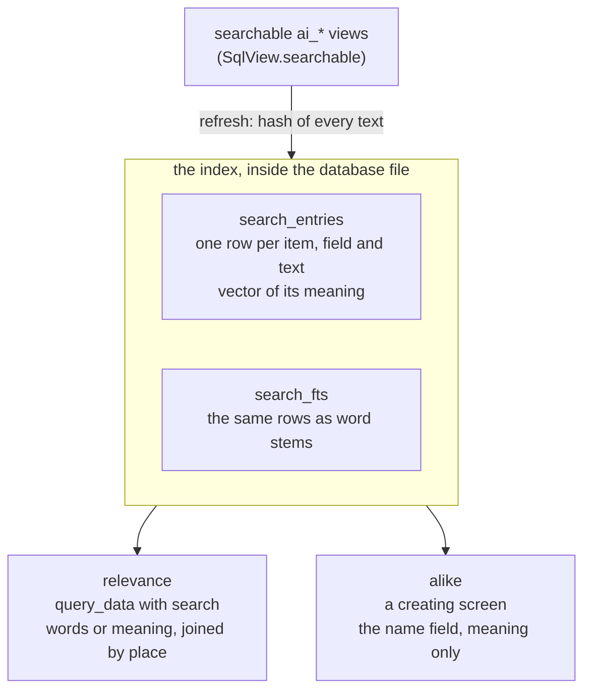

# Search

How a reader finds items by what they say, and how a creating screen finds the items a new one
repeats. One index serves both: it lives in the encrypted database file, it ranks by words
(BM25) and by meaning (a local text model), and it is kept current from the `ai_*` views
themselves. The shell owns the mechanism; an application chooses the model, the language and
what is searched.

The rules are AG-SEARCH-058 to AG-SEARCH-060 in
[agents.feature](../tests/brd/tg_agent_shell/agents.feature), PR-SIMILAR-030 in
[proposals.feature](../tests/brd/tg_agent_shell/proposals.feature), DI-FIND-025 in
[diary.feature](../tests/brd/diary.feature) and WS-FIND-009 in
[workspace_mutator.feature](../tests/brd/workspace_mutator.feature).

## How it works

### One index, two questions



The two consumers ask different questions of the same rows:

- **`relevance` — "which rows are about these words?"** It wants recall. A row qualifies by
  sharing a word stem with the search, or by being at least `TextModel.related` close in meaning.
- **`alike` — "is this new item already here?"** It wants precision. Only the item's name field is
  compared with the new item's name, by meaning alone, at `TextModel.alike` or closer.

One cut-off cannot serve both. On the probe's fixed pairs, a search and a text it is about
scored from 0.51 to 0.90 and an unrelated pair up to 0.46, while six of seven pairs that name
one thing twice scored 0.70 or more: the screen's cut-off would hide much of what a search
should find, and the search's would list items that only share a subject as repeats.

### The index (shell)

`search_entries` holds one row per item, field and text: `item_type`, `item_id`, `field`,
`text_hash` and `vector`, the text's unit vector as little-endian float32. `search_fts` is a
contentless FTS5 table whose `rowid` is the entry's `id` and whose one column is the text's word
stems, tokenized `unicode61 remove_diacritics 2`. The FTS5 table is created with its companion
by a DDL listener on `search_entries`, so `upgrade_database` builds both; an application that
never builds a `SearchIndex` never imports them, and its database has neither.

An item is found by **the best of its texts**. Today a text is a field: a Card has up to three
(title, note, blocked description), a Diary day one (its body). Nothing in the index, the ranking
or the query surface assumes one text per field, so an application that later splits a long field
into several texts changes only what it declares.

Both tables are ordinary pages of the SQLCipher file, so they are encrypted, backed up and
restored with everything else. A vector is treated as the text it came from: it can be inverted
into much of that text, so no vector is ever written outside the database file. No `ai_*` view
names either table, so no reader's SQL reaches them; the shell reads them on its own.

### Keeping it current (shell)

`SearchIndex.refresh` compares, per searchable view, the set of `(item_id, field, text_hash)` the
view yields now with the set stored:

1. `SELECT id, <searchable fields> FROM <view>`; each non-empty field is one text, and its hash is
   taken over the text model's name, the word forms' name and the text. SQLite resolves every
   column of a view it reads, so the refresh's connection gets every function a view calls
   (`add_view_functions`), as the runner's does.
2. A stored row the view no longer yields is deleted, with its FTS row.
3. A text the index does not hold is inserted: its stems at once, its vector once the text model
   has loaded. A row whose vector is still missing is filled by the next refresh after loading.

It runs in the background once the text model has loaded at start, and again before every read
that searches and every creating screen, where it usually finds nothing or one changed text.
Because it reads the views rather than listening to writes, every path that changes an item — a
proposal, a screen, a hook — is covered without one line in a use case. A different text model or
word forms changes every hash, so the next refresh rebuilds the whole index; nothing is migrated.

The index is derived data, not the owner's: a refresh writes it from inside a read, and the
`TurnManager` rules about committing owner data do not apply to it.

### `relevance`: `query_data` with `search` (shell)

```json
{"search": "поход к зубному",
 "sql": "SELECT id, title, stage FROM ai_cards WHERE relevance IS NOT NULL AND stage = 'today' ORDER BY relevance DESC LIMIT 5"}
```

A searchable view publishes a `relevance` column, written in its SELECT as
`relevance('<item_type>', <id>)`. Every connection `DatabaseFile.connect` opens registers a
`relevance` that answers NULL, so the view reads the same from the ORM, a saved Request or a
plain `query_data`. A read that carries `search` gets real values instead:

1. `validated_read` names the views the statement reads; only their item types are ranked, so a
   reader ranks only what its own list lets it read.
2. `refresh` brings those item types up to date.
3. **Words:** the search is reduced to stems, the stems are OR-ed in an FTS5 `MATCH`, and each
   item takes the best `bm25()` of its rows.
4. **Meaning:** the search is encoded once; each item takes the highest cosine of its rows, and an
   item below `TextModel.related` drops out.
5. The two orders are joined by place, reciprocal rank fusion:
   `1/(RRF_K + place by words) + 1/(RRF_K + place by meaning)`, `RRF_K = 60`. Places need no common
   scale, so BM25 and cosine are never weighed against each other.
6. The runner registers `relevance` over those scores on its own connection, before it installs
   the authorizer, and runs the model's SQL as before.

The runner asks through `Ranking`, the port [sql.py](../src/tg_agent_shell/ai/sql.py) declares
beside `SqlView` and `Searchable`, so the agent engine imports nothing of the index above it. A
searchable view that does not select `relevance` or one of its fields fails loudly rather than
ranking nothing: its refresh raises "no such column", and a read that orders by it is a
retryable error.

A row close by neither is NULL, which `ORDER BY relevance DESC` puts last. Every filter — type,
id, stage, date — stays in the same SELECT, and only rows that pass it are ranked, so nothing
relevant is lost to a top-k taken before the filter. Until the text model has loaded, or once it
failed, the meaning half is empty and a search ranks by words alone. An application with no index
answers a read with `search` as a retryable error that tells the model to filter with WHERE.

The rule a model needs — what `search` does and how to order by it — is written once, in the
description of `QueryToolInput.search`; a view's `doc` only lists `relevance` among its columns.

### `alike`: the creating screen (shell)

A feature's `SimilarItems` names the create value that holds a new item's name and reads its open
items. When a proposal creates one, the review screen asks `SearchIndex.alike` for the open items
of that item type whose name field is at least `TextModel.alike` close in meaning, closest first,
and lists the first `SIMILAR_ITEMS_SHOWN` of them. Words are not used: a shared common word is not
a repeat. Until the text model has loaded, or once it failed, the screen goes without the list.
At startup the registry refuses a `SimilarItems.field` that is not a searchable field of a view
with that item type, since the index would hold nothing to compare.

### Ports and adapters (shell)

- `TextModel(name, alike, related)` — one embedding model and the two cut-offs read off it.
- `TextEncoder`, texts in and one vector each out, and `FastEmbedEncoder`, its adapter: an ONNX
  model that `fastembed` downloads once into the directory it is given and runs on the CPU, one
  call at a time, off the event loop.
- `WordForms`, a text in and its word stems out, and `SnowballWordForms`, its adapter: it picks a
  Snowball stemmer by each word's script from the languages it is given, and keeps a word in any
  other script as written. Given no scripts it keeps every word as written, which works for any
  language and is weaker for one with rich morphology.

`SearchIndex` takes the database file, a `TextModel`, a way to load its `TextEncoder`, a
`WordForms` and the views, of which it keeps the searchable ones. `SearchIndex.load` loads the encoder and refreshes everything, in the
background, so the first start's download blocks nothing.

### What an application decides

Safwa's choices sit in [modules.py](../src/safwa/bootstrap/modules.py):

- `TEXT_MODEL` — the multilingual MiniLM, with `alike = 0.70` and `related = 0.50`, both read
  off with the probe below. Changing the model is changing this one declaration and calibrating both numbers
  again.
- `WORD_FORMS` — Cyrillic as Russian, Latin as English.
- What is searched, declared by each feature on its own view as
  `SqlView.searchable = Searchable(item_type, fields)`:

  | View | Item type | Fields |
  |---|---|---|
  | `ai_cards` | `card` | title, note, blocked_description |
  | `ai_checks` | `check` | title |
  | `ai_values` | `value` | name, description |
  | `ai_tags` | `tag` | name, description |
  | `ai_requests` | `request` | name, description |
  | `ai_reminders` | `reminder` | instruction |
  | `ai_diary` | `diary` | body |

- What the creating screen compares and which items are open: each feature's `SimilarItems`.
- Who searches: every reader whose views include a searchable one. The Advisor and
  `workspace_mutator` already do; the Diary declares `ai_diary` so it can find a day by what
  happened on it.

### Calibrating the cut-offs

[search_probe.py](../scripts/search_probe.py) loads `TEXT_MODEL` and prints, against the owner's
own database (it asks for the passphrase):

- for `alike`: the closest pairs of open items per creating screen, then fixed pairs that are
  the same thing said twice and pairs that only share words, each marked listed or not;
- for `related`: fixed searches with the items they should and should not find, each marked
  found or not.

Change a number, run the probe, read what moves. The scenarios state each number and name its
constant, and the tests read the constant.

### Why it is built this way

- **No separate vector database.** Chroma, Qdrant, LanceDB or pgvector would keep vectors in
  files or a server outside the encryption, and a backup would no longer be one database and one
  key.
- **No sqlite-vec.** It loads into SQLCipher and its tables are encrypted, but its `vec0` KNN
  returns a top-k, while `relevance` is needed for every row a filter lets through; its shadow
  tables also fail the `query_data` authorizer. A brute-force cosine over a few thousand vectors
  takes milliseconds. The row shape keeps a move to `vec0` open once an approximate index pays.
- **One door, not a `search` tool beside `query_data`.** A separate tool ranks before the filter
  and puts two read doors in front of a small model; a column ranks after it, in one SELECT.
- **No helper for searching.** Searching is one argument and one column; the heavy analyzer reads
  through the same `query_data`, so a hard read that searches already reaches it.
- **No chunking in the shell.** Splitting a long text is the application's choice of texts, not a
  mechanism of the index.

### Limits

- The meaning half is a brute-force cosine and `refresh` reads every searchable text: both are
  linear in the number of items. Tens of thousands are fine; beyond that the index needs an
  approximate nearest-neighbour structure and a refresh driven by writes.
- One search per read. Two different searches are two reads.
- The text model reads about 128 tokens of a text; a longer Diary body is ranked by its start
  until a model with a longer reach is chosen.
