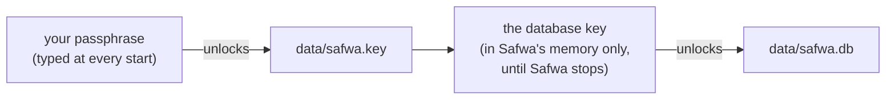

# Security

How Safwa's database is encrypted, how it is unlocked, and how to back it up, move it and
restore it without ever leaving your data readable.

## What is protected, and from whom

Everything Safwa keeps is in one SQLite file, `data/safwa.db`: your Cards, the Diary, the
photos you sent, the conversation, the memory. That file is encrypted, and so is every backup of
it, and the only thing that opens them is the passphrase you type when Safwa starts.

| Someone has… | Can they read your data? |
|---|---|
| a copy of `data/safwa.db`, or of the whole `data/` folder | No. |
| one of your backup ZIPs — in the cloud, on a USB stick, in an email | No. |
| your stolen disk or laptop, switched off | No. |
| another Windows account on the same computer | No. |
| a virus that copies files and saved passwords from your computer | No. Nothing on the computer opens the database. |
| a program spying on your session **while Safwa runs** — recording keys, reading memory | **Yes.** See below. |
| a program running with administrator rights | **Yes.** Nothing on this computer can stop it. |

Every "No" assumes your passphrase is not known and not guessable.

### Why a spying program can still read it

When Safwa starts, you type the passphrase, and Safwa unlocks the database key with it. From that
moment until Safwa stops, the key is in Safwa's memory: SQLite needs it to read every page. On
Windows, any program started under your account may read the memory of your other programs
without administrator rights, and may record what you type. So a program spying on your session
while Safwa runs can catch the passphrase as you type it, or take the key — and the data itself —
out of Safwa's memory.

**Why the key is not hidden in memory.** Scrambling Safwa's own copy of the key and unscrambling
it with a special function would change nothing:

- the encryption library keeps its own working copy of the key, plain, for as long as the database
  is open. It has to, to read every page, and tools that find such keys in a memory dump by their
  shape already exist;
- the decrypted data is in memory too;
- the special function is in Safwa's code, and a program that reads memory can read code;
- a keylogger does not want the key at all: it takes the passphrase, before any function runs.

Hiding the key would look like protection without being one, so Safwa does not do it. The real
answers to a spying program are the two under "Stronger protection".

### What is not in the database, and not covered here

- `.env` holds the Telegram bot token and the AI API key in plain text. Protecting them is a
  separate, later step.
- Messages the bot sent are also kept by Telegram on its servers.
- Whatever Safwa sends to the AI provider is read by that provider. With LM Studio that stays on
  your computer; with OpenRouter it does not.
- `data/models/` is a public model download and holds nothing of yours.

## How it works

There is one secret: **your passphrase**. Everything else can be copied anywhere.

- **The database key** — 32 random bytes that lock `data/safwa.db`. It is never written anywhere
  as it is, and it is replaced by a new one every time you change your passphrase.
- **The key file** `data/safwa.key` — the database key, locked with your passphrase. Without the
  passphrase it is useless, which is why it can sit next to the database and inside every backup.
- **Your passphrase** — words you choose once. You keep them in your password manager or on
  paper. Nothing on the computer stores them.



At every start Safwa asks for the passphrase before it does anything else. It unlocks the key,
forgets the passphrase, and keeps the key in memory until it stops. While Safwa is stopped,
nothing on your computer can open the database — not a virus, not you.

### What a backup contains

```text
safwa-20260927T101500Z.zip
├── safwa.db        the database, encrypted with the database key
├── safwa.key       the database key, locked with your passphrase
└── manifest.json   the format version and a checksum of each file
```

A backup carries its own key, locked. The passphrase it was made with opens it anywhere, and
nothing else does.

### Your passphrase is what guards every copy

Anyone who holds a backup can try passphrases on it, on their own machine, as long as they like.
Each try is made deliberately slow and memory-hungry, but a short or reused passphrase will still
fall. Five or more random words from a password manager's generator will not. Safwa refuses a
passphrase shorter than 16 characters.

## How to

All commands run from the project folder. Every one of them asks for a passphrase; it is never
passed on the command line or in an environment variable, where other programs could read it.

### First start

Create the database key and set your passphrase (you type it twice):

```powershell
uv run safwa-key new
```

Save the passphrase in your password manager **now**. Then start Safwa:

```powershell
uv run safwa
```

`safwa-key new` makes a key only for a database that does not exist yet. A `data/safwa.db` left
from before the database was encrypted is plain, and no key opens it: move it out of `data/`
first.

### Every start

`uv run safwa` asks for the passphrase. Three wrong tries and it stops. It cannot start by
itself after a reboot or a crash: someone has to type the passphrase. One Safwa runs on the
database at a time: a second one, or one started during a restore or a passphrase change, stops
before it asks anything.

### Make a backup

Safwa may keep running while you do this.

```powershell
uv run safwa-backup
```

It asks for the passphrase and writes the ZIP to `data/backups/`. Copy it somewhere off this
computer — a cloud drive, a USB stick. It is encrypted, so any place is fine. A backup that only
lives on the same disk dies with that disk.

### Restore

Stop Safwa, then:

```powershell
uv run safwa-restore data\backups\safwa-YYYYMMDDTHHMMSSZ.zip --yes
```

It asks for the passphrase **that backup was made with**, and checks that it opens the backup
before it touches anything. Then it copies what is there now, as it is, into a folder such as
`data/backups/safwa-before-restore-20260927T101500Z/`, and puts the backup in its place. From then
on Safwa starts with the backup's passphrase. While Safwa is still running, the command says so
before it asks anything, and changes nothing.

### Move to a new computer, or after reinstalling Windows

- **You have a backup ZIP:** install Safwa, copy the ZIP over, restore it as above.
- **The `data/` folder survived** (for example, the project is on `E:` and only `C:` was
  reinstalled): nothing to do. Start Safwa and type your passphrase.

### Change your passphrase

Stop Safwa, then:

```powershell
uv run safwa-key passphrase
```

It asks for the current passphrase, then the new one twice. It does not only re-lock the key: it
makes **a new database key**, encrypts the whole database again with it, and locks the new key with
the new passphrase. The old key then opens nothing Safwa writes from now on. It takes about as long
as copying the database twice. While Safwa is still running, the command says so before it asks
anything, and changes nothing.

In the same step it writes a backup made with the new passphrase to `data/backups/` and prints
where; copy it off this computer. The backup comes first: if it cannot be written, nothing is
changed. **Older backups keep the passphrase and the key they were made with**: they still open
with the old passphrase, and only with the old one.

### If your passphrase leaked

Change it at once. Someone who had the old passphrase and any old backup has the old database key
too; because changing the passphrase replaces that key, it opens no copy of the database made
after the change. Keep the backup the change wrote, and delete every older one from every place
someone else could reach — they still open with the leaked passphrase, and nothing can change
that. That includes the folder a restore set aside, if there is one.

The same goes if you suspect a program took the key out of Safwa's memory: change the passphrase,
and the key it took is worth only the copies made before.

### If you forgot your passphrase

The data is gone: on this computer and in every backup made with it. No one — not you, not a
developer — can open it. That is exactly what encryption promises, and why the passphrase goes
into a password manager the moment you set it.

### If `data/safwa.key` is lost

Without it the database cannot be opened, even with the passphrase. Restore your latest backup, or
copy `safwa.key` out of any backup ZIP into `data/` — Safwa then asks for the passphrase that
backup was made with. The key in an older backup opens the database only if the passphrase has not
been changed since that backup was made.

### If a restore or a passphrase change was interrupted

Nothing to do. Either the old database and key file are still in place, or the new ones are
finished at the next start; you type the passphrase of whichever it is. A passphrase change that
stopped after writing its backup leaves that backup in `data/backups/`, and it opens with the
new passphrase even when the old one is still in place.

### Never

- Never write the passphrase into `.env`, the repository, a chat, or a file next to the backups.
- Never send a backup and its passphrase through the same channel.
- Never send the passphrase to the bot in Telegram: a chat with a bot is not end-to-end
  encrypted, and the message stays on Telegram's servers.

### When Safwa refuses to start

Safwa refuses to run on a database it cannot prove is encrypted with the right key, and says why:

| What Safwa says | What happened | What to do |
|---|---|---|
| There is no database yet | first start | `uv run safwa-key new` |
| `data\safwa.db` is here, but its key file `data\safwa.key` is not | the key file was deleted, or the database is an old plain one | see "If `data/safwa.key` is lost", or "First start" |
| The key does not open `safwa.db` | the key file and the database came from different places | restore them together from one backup |
| The SQLite driver cannot encrypt | a broken install | `uv sync` |
| 3 wrong passphrases | the passphrase was mistyped, or it is another one | start again |
| `safwa.db` is in use by another process | Safwa is already running, or a restore or a passphrase change is | stop it, or let it finish |

None of these touches the database file.

### Stronger protection

Both are settings of Windows, not of Safwa, and both work with everything above.

- **Run Safwa under its own Windows account.** A program running as you then cannot read Safwa's
  memory or its files without administrator rights. This is the one thing that stops a program
  spying on your session from taking the key out of Safwa's memory. The cost: Safwa, its backups
  and restores are started as that user (with `runas`), and `data/` is made readable by that user
  alone.
- **BitLocker on the disk that holds the project**, or hibernation turned off
  (`powercfg /h off`). Hibernation writes everything in memory — the key included — to a file on
  disk. BitLocker encrypts that file along with everything else, including `.env`.

## For a developer

- **Cipher.** SQLCipher 4, through the `sqlcipher3` module from the `sqlcipher3-wheels` package
  (prebuilt for Windows and Python 3.12). Every 4 KB page is encrypted with AES-256 and
  authenticated with HMAC-SHA512, so a changed byte is detected, not read as data. The WAL file is
  encrypted the same way.
- **Raw key.** The key is handed to SQLCipher as 32 raw bytes (the `x'…'` form of `PRAGMA key`),
  so opening a connection runs no password derivation: about a millisecond, against a tenth of
  one unencrypted. That matters because `ReadOnlyQueryRunner` opens a connection for every
  `query_data`, and it is why the key has to stay in memory while Safwa runs.
- **One way in.** Every connection is opened by `DatabaseFile.connect` in
  [database.py](../src/tg_agent_shell/foundation/database.py): the async engine behind
  `Database`, the sync one `upgrade_database` takes from `sync_engine`, `ReadOnlyQueryRunner`,
  and `DatabaseFile.copy_to`, which backups and passphrase changes copy through. It sets the key,
  then the busy timeout — before the first read, so a file another connection holds locked is
  waited for rather than taken for one the key does not open — then refuses a driver whose cipher
  version is empty (a plain SQLite driver ignores `PRAGMA key` without a word and would write a
  plain file), then reads once and turns `SQLITE_NOTADB` into `DatabaseRefused`. Only then come
  temporary storage in memory, so a sort never spills to a file outside the encryption, and, for a
  writer, foreign keys and WAL. Rule S of `scripts/architecture_metrics.py` fails on an import of
  `sqlite3`, `sqlcipher3` or `aiosqlite`, or an engine built, anywhere else in `src/`; a module
  that needs the driver's names — `Row`, `Error`, the authorizer codes — takes them as `driver`
  from database.py, because the standard `sqlite3` names error classes SQLCipher never raises.
- **The async driver.** `Database` runs sqlcipher3 under aiosqlite through SQLAlchemy's
  async_creator. SQLAlchemy's aiosqlite adapter takes its error classes from aiosqlite, which
  re-exports the standard `sqlite3` ones, so a driver error would pass through unwrapped;
  `_AsyncDriver` hands the adapter SQLCipher's instead. A connection made through async_creator is
  also one SQLAlchemy does not mark as a daemon thread, so `Database` marks each one itself, and
  `dispose` waits for them all: a task cancelled while its connection is still opening leaves that
  connection's thread running, and unwaited it would finish after the event loop had closed. That
  race exists with the plain driver too; a keyed open is slower, which widens it enough for the
  startup tests to hit.
- **The read-only runner** sets the key before it installs its authorizer, because the authorizer
  refuses every `PRAGMA`. It keeps refusing ATTACH, which is also how SQLCipher would export a
  plain copy.
- **The key file.** [key_file.py](../src/tg_agent_shell/foundation/key_file.py) keeps the key
  encrypted with AES-256-GCM under a key derived from the passphrase with scrypt (N = 2^17, r = 8,
  p = 1: about 128 MB and a third of a second per try), as JSON with the salt and the nonce. The
  format version and the scrypt parameters are the GCM's associated data, so a file edited to
  weaken them no longer unlocks, and the passphrase is NFC-normalized first, so the same words
  typed on another console unlock it. A key file that unlocks but belongs to another database is
  caught by the key failing to open the database, so it needs no fingerprint. A second factor —
  a hardware key, Windows Hello — is not built; the format version is where it would go.
- **A pair only ever replaces a pair.** A restore and a passphrase change both end in
  `replace_pair`. Windows cannot swap two files in one step, so the new database is first moved
  beside the live one as `safwa.db.new`, then the new key file is published whole as
  `safwa.key.new`, and only then are the two moved into place. Publishing the key file is the
  moment of the change: whoever takes the hold next drops a lone `safwa.db.new` and completes a
  replacement whose key file is already published. A stop at any step therefore leaves a pair
  that opens, and the tests stop one at each.
- **One holder at a time.** Safwa holds its database from before the passphrase prompt until it
  stops, and `restore_backup` and `change_passphrase` hold it for as long as they run: `hold` in
  key_file.py takes an operating-system lock on `safwa.db.lock` (msvcrt on Windows, flock
  elsewhere) and raises `DatabaseBusy` when another process has it. Without it, a replacement made
  while Safwa ran would fail to move files Safwa keeps open only after its key file was published,
  and the next start would complete it — putting back a copy taken before everything Safwa wrote
  in between. The check is the lock and not a search for a process by name: the lock belongs to
  this database, so a QA bot on its own database does not count, a Safwa started some other way
  does, and nothing can start between the check and the change. The system drops the lock when
  its process ends, however it ends, so a crash leaves nothing to clear. A hold inside a hold of
  the same process is that hold, so the commands take it before their first prompt and the shell
  functions they call take it again. A backup only reads, so it takes no hold; every open tries
  one, just long enough to complete a stopped replacement when nothing holds the database.
- **Changing the passphrase replaces the key, and backs it up first.** `change_passphrase` copies
  the database into a new file under a new key with SQLite's backup API — the same copy a backup
  makes, which takes what still sits in the WAL — writes that file and the new key file as a
  backup, and only then replaces the live pair with them. A backup that fails therefore changes
  nothing, and a change that finishes always has a backup made with the new passphrase: the owner
  never has to remember a second command. SQLCipher's rekey would re-encrypt the file in place,
  but in place there is no old pair left to fall back on. Nothing is set aside, because an old key
  file kept on disk would still open with the old passphrase.
- **A backup** ([backup.py](../src/tg_agent_shell/backup.py)) is format 3: the database copied
  through the backup API and the key file as it is, under the live files' own names, stored
  uncompressed because encrypted bytes do not compress. A restore reads the archive, checks every
  checksum, unlocks the key and runs an integrity check on the database it is about to put in
  place — all before it touches a live file — then copies the live files, WAL included, into a
  folder of their own and replaces the pair.
- **The passphrase** is read with `getpass` by [security.py](../src/safwa/security.py), before
  anything else starts, and dropped as soon as the key is unlocked. The shell takes a key and never
  asks where it came from; asking for the passphrase is the application's, and the example bot
  asks its own.
- **Nothing hides the key in memory**, for the reasons in "Why the key is not hidden in memory".
- **Tests** open every database with `TEST_KEY` from `tests/database_key.py` and never prompt; the
  tests of the key file and the pair lower `SCRYPT_N`, because what they check is the file and
  the order, not the cost of a try. `held_elsewhere` there holds a database from a second process,
  which it kills at the end, as a crash would end it.
