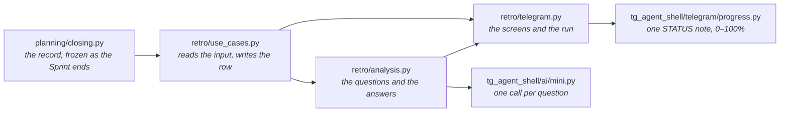
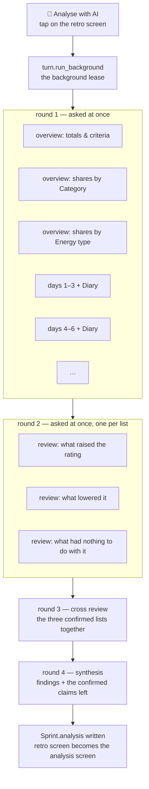

# The retro analysis

What "Analyse with AI" on the retro screen does: what it reads, the questions it asks the model,
what it writes on the Sprint, and how the owner sees it. The rules are
[retro.feature](../tests/brd/retro.feature) (RT-CRIT-004, RT-AI-005 … RT-AI-008); this is the map
of the mechanism that keeps them.

## The pieces



Nothing in `analysis.py` opens the database: `analysis_input` hands it an `AnalysisInput` and
gets a dict back. Nothing in the run is an agent session — no dialogue, no `query_data`, no
Proposal. Every question is a `run_mini_session` with one terminal tool, so prose is repaired
and the call *is* the answer.

## What is read

| Read | From | When frozen |
|---|---|---|
| Effort and Actions taken in and finished, blocked, removed | `Sprint.retro` — `RetroStatistics` | at the Sprint's end |
| Shares by Category and Energy type (`Bucket`: effort and count, taken in and finished) | `Sprint.retro` | at the Sprint's end |
| One row per local day (`DayTally`: in Today that morning, finished that day, how those fell), from the day it started to the day it ended or its planned end, whichever came first — the Sprint's own calendar, there even when every Action was deleted | `Sprint.retro` | at the Sprint's end |
| Key Actions: how many, how many finished, and how many Actions the model never told key or not (`key_unknown`), so "0 of 0" is never read as "none" | `Sprint.retro` | at the Sprint's end |
| Success criteria and the owner's mark | `Sprint.success_criteria`, `Sprint.criterion_met` | the mark is the owner's, set on the retro screen, `None` reads as "?" |
| The two Sprints that ended before this one | `sprints_before` (`RETRO_SPRINTS_BEFORE = 2`) | each its own record |
| The Diary of the Sprint's days: rating and text, whole | `diary_between` | never — read as it stands today |

An Action with two Categories is in both buckets whole, and one with none is in `none`, so a
share is read against the buckets' own sum and each Sprint's shares add up to 1.00. The effort
sums are `effort_sums` in `planning/api.py`, the same four the Sprint screen shows while it runs.

## The run



- **Round 1.** Three overview questions over the three Sprints, oldest first, this one last —
  `OverviewVerdict`, at most 6 `Finding`s each (metric, trend, the numbers). Beside them the days
  in threes (`ANALYSIS_DAY_BATCH = 3`), each batch with its day rows and Diary — `DayBatchFindings`:
  claims about what likely raised the day's rating, lowered it, or had nothing to do with it, each
  with the dates it rests on.
- **Round 2.** The claims of every batch are pooled by list and each list is reviewed alone —
  `ClaimReview`: a claim said twice, backed by another, or resting on two or more days is
  *confirmed* (so a three-day Sprint, one batch, still confirms what two of its days show), one
  whose opposite is in the same list is *contradicted*, one resting on one day alone is
  *single*. An empty list is not asked about; it still counts as a step.
- **Round 3.** The three confirmed lists, numbered across, are read together once —
  `CrossReview`: the model names the pairs of numbers that are one and the same thing standing
  in two different lists, in the same or other words, and `without_same` takes both out and
  keeps their wording as `dropped`. A pair inside one list, or off the numbers, changes nothing.
  Fewer than two lists with a claim are not asked about; it still counts as a step.
- **Round 4.** One call, `SprintAnalysis`, from the overview findings and the confirmed claims
  left.

Every answer's first field is `verbose_analyse`: the model thinks over what it was given before
it fills anything else, "at most 500 tokens" by instruction alone — a hard cut would tear the
call's JSON. Everything the screen shows has a limit the call refuses to exceed, in the schema
the model reads up front: `TRENDS_MAX = 6`, `ITEMS_MAX = 3` per list, `SENTENCE_CHARS = 200`
for the headline and the experiment, `ITEM_CHARS = 140`, `METRIC_CHARS = 40`,
`NOTE_CHARS = 120`, `FACT_CHARS = 120` — so the screen at every limit is one Telegram message,
and a call over one is repaired by `run_mini_session` rather than cut by the screen. The
prompts are English; the model writes in the language the Diary and the criteria are written
in.

One step per question, `3 + batches + 3 + 1 + 1`; a fourteen-day Sprint is thirteen steps,
reported on the progress note as each answer arrives. One question that fails ends the others and is raised
once they have ended (`_at_once`); the note is taken down, one error message names the Sprint,
the row is untouched, and the retro screen comes back with its buttons.

## The lease

The run holds the background lease the way a hook's request does, and everything it does to
the chat and the row it does under that lease: its first move is to redraw the retro screen
without its buttons, so there is nothing on it to tap while it runs; its last, once
`still_current()` says the lease is still its own, is to write `Sprint.analysis` and draw the
analysis screen in the retro's place. The middleware ends background work on the owner's next
event — a message *or* a tap, before any handler runs — so any action of the owner's cancels
the run: the note is taken down in `finally`, nothing is written, and the buttonless screen is
left where it stands, because the owner's message takes every dashboard down anyway
(SC-LIVE-001) and the retro is reopened from the message that announced the Sprint's end. The
Advisor and the analysis never share the model at the same time.

## What is written

`Sprint.analysis` is the `SprintAnalysis` payload without `verbose_analyse`, plus what the run
and the row add:

```json
{
  "headline": "one sentence",
  "dynamics": [{"metric": "Actions finished", "trend": "up", "note": "15 of 17 against 9 of 15"}],
  "helped": ["…"], "hurt": ["…"], "noise": ["…"],
  "experiment": "one thing to try in the next Sprint",
  "memory_fact": "one durable fact about the owner, or null",
  "dropped": ["a claim that stood in two lists at once"],
  "compared": ["25.08-02", "25.09-01"],
  "met": true,
  "analysed_at": "2026-09-18T16:22:55+00:00",
  "remembered": false
}
```

`met` is the owner's mark as the run read it: the screen shows that one, and names a mark
changed since, which counts only once the Sprint is analysed again. A later run replaces the
whole record. The screen is drawn from it by code (`analysis_text`), never by the model:

```text
Sprint 25.09-02 analysis
2026-09-05 – 2026-09-18 · against 25.08-02, 25.09-01      (the days the run read)
Analysed 2026-09-18 19:22, the criteria then met
Marked not met since; analyse again for the mark to count.   (only when it changed)

headline

Trends
▲ metric — note          (▲ up · ▼ down · ● flat · ◌ unclear)

What raised the day's rating / What lowered it / What had nothing to do with it
• confirmed claims, at most 3 each

Experiment for the next Sprint
→ …

Worth remembering
the fact                 [💾 Remember]  [🔁 Analyse again]  [📊 Retro]  [↩️ Menu]
```

"Remember" writes `Sprint <number> retro: <fact>` to memory.md through `append_manual` — the
same operation `/mem` uses — then sets `remembered` and stops offering the button. A later run
does not take the line back out: memory is the owner's. It is a button and not a Proposal
because a Proposal is a screen that suspends an agent session and resumes it on Save, and this
run is not a session.

## What it is not

- Not a hook: the owner starts it, and only the owner.
- Not part of the Advisor's prompt: nothing here touches the byte-stable prefix.
- Not a reader of the tables: the record is the only source of numbers, so a Card deleted or
  relabelled after the Sprint changes neither the retro nor a rerun of the analysis. The Diary is
  the one thing read live, because the owner may still be writing it.
