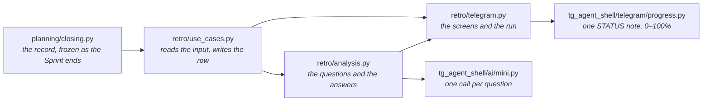
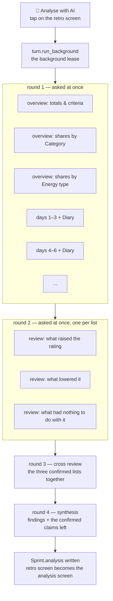
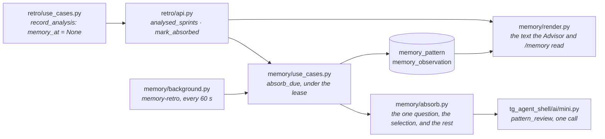
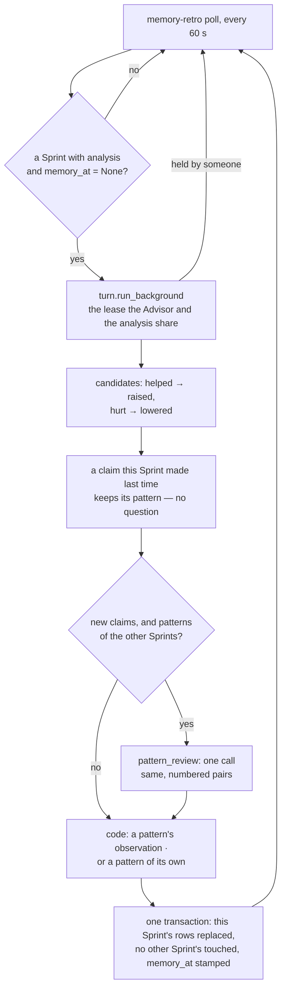

# The retro analysis, and the memory it leaves

What "Analyse with AI" on the retro screen does: what it reads, the questions it asks the model,
what it writes on the Sprint, and how the owner sees it — and then what memory makes of it,
because the analysis is the only thing that writes memory. The rules are
[retro.feature](../tests/brd/retro.feature) (RT-CRIT-004, RT-AI-005 … RT-AI-008) and
[memory.feature](../tests/brd/memory.feature) (MEM-RETRO-010 … MEM-RETRO-016); this is the map
of the mechanism that keeps them.

## The pieces



Nothing in `analysis.py` opens the database: `analysis_input` hands it an `AnalysisInput` and
gets a dict back. Nothing in the run is an agent session — no dialogue, no `query_data`, no
Proposal. Every question is a `run_mini_session` with one terminal tool, so prose is repaired
and the call *is* the answer.

## What is read

| Read | From | When frozen |
|---|---|---|
| Effort and Actions taken in and finished, blocked, removed | `Sprint.retro` — `RetroStatistics` | at the Sprint's end |
| Shares by Category and Energy type (`Bucket`: effort and count, taken in and finished) | `Sprint.retro` | at the Sprint's end |
| One row per local day (`DayTally`: in Today that morning, finished that day, how those fell), from the day it started to the day it ended or its planned end, whichever came first — the Sprint's own calendar, there even when every Action was deleted | `Sprint.retro` | at the Sprint's end |
| Key Actions: how many, how many finished, and how many Actions the model never told key or not (`key_unknown`), so "0 of 0" is never read as "none" | `Sprint.retro` | at the Sprint's end |
| Success criteria and the owner's mark | `Sprint.success_criteria`, `Sprint.criterion_met` | the mark is the owner's, set on the retro screen, `None` reads as "?" |
| The two Sprints that ended before this one | `sprints_before` (`RETRO_SPRINTS_BEFORE = 2`) | each its own record |
| The Diary of the Sprint's days: rating and text, whole | `diary_between` | never — read as it stands today |

An Action with two Categories is in both buckets whole, and one with none is in `none`, so a
share is read against the buckets' own sum and each Sprint's shares add up to 1.00. The effort
sums are `effort_sums` in `planning/api.py`, the same four the Sprint screen shows while it runs.

## The run



- **Round 1.** Three overview questions over the three Sprints, oldest first, this one last —
  `OverviewVerdict`, at most 6 `Finding`s each (metric, trend, the numbers). Beside them the days
  in threes (`ANALYSIS_DAY_BATCH = 3`), each batch with its day rows and Diary — `DayBatchFindings`:
  claims about what likely raised the day's rating, lowered it, or had nothing to do with it, each
  with the dates it rests on, and `events` — what happened those days that the next Sprint
  should know about. The dates are kept to the batch's own, each once (`on_its_days`): a day the
  model named twice, or one outside the batch, is not a second day for round 2 to count. An
  event is not a claim: nothing reviews it, and every batch's events reach round 4 as they are.
- **Round 2.** The claims of every batch are pooled by list, each with the batch that made it,
  and each list is reviewed alone — `ClaimReview`: a claim said in two or more batches, backed
  by another, or resting on two or more days is *confirmed* (so a three-day Sprint, one batch,
  still confirms what two of its days show), one whose opposite is in the same list is
  *contradicted*, one that one batch made about one day, backed by nothing, is *single*. An
  empty list is not asked about; it still counts as a step.
- **Round 3.** The three confirmed lists, numbered across, are read together once —
  `CrossReview`: the model names the pairs of numbers that are one and the same thing standing
  in two different lists, in the same or other words, and `without_same` takes both out and
  keeps their wording as `dropped`. A pair inside one list, or off the numbers, changes nothing.
  Fewer than two lists with a claim are not asked about; it still counts as a step.
- **Round 4.** One call, `SprintAnalysis`, from the overview findings, the confirmed claims
  left and the events.

Every answer's first field is `verbose_analyse`: the model thinks over what it was given before
it fills anything else, "at most 500 tokens" by instruction alone — a hard cut would tear the
call's JSON. Everything the screen shows has a limit the call refuses to exceed, in the schema
the model reads up front: `TRENDS_MAX = 6`, `ITEMS_MAX = 3` per list, `SENTENCE_CHARS = 200`
for the headline and the experiment, `ITEM_CHARS = 140`, `METRIC_CHARS = 40`,
`NOTE_CHARS = 120` — so the screen at every limit is one Telegram message,
and a call over one is repaired by `run_mini_session` rather than cut by the screen. The
prompts are English; the model writes in the language the Diary and the criteria are written
in.

One step per question, `3 + batches + 3 + 1 + 1`; a fourteen-day Sprint is thirteen steps,
reported on the progress note as each answer arrives. One question that fails ends the others and is raised
once they have ended (`_at_once`); the note is taken down, one error message names the Sprint,
the row is untouched, and the retro screen comes back with its buttons.

## The lease

The run holds the background lease the way a hook's request does, and everything it does to
the chat and the row it does under that lease: its first move is to redraw the retro screen
without its buttons, so there is nothing on it to tap while it runs; its last, once
`still_current()` says the lease is still its own, is to write `Sprint.analysis` and draw the
analysis screen in the retro's place. The middleware ends background work on the owner's next
event — a message *or* a tap, before any handler runs — so any action of the owner's cancels
the run: the note is taken down in `finally`, nothing is written, and the buttonless screen is
left where it stands, because the owner's message takes every dashboard down anyway
(SC-LIVE-001) and the retro is reopened from the message that announced the Sprint's end. The
Advisor and the analysis never share the model at the same time.

## What is written

`Sprint.analysis` is the `SprintAnalysis` payload without `verbose_analyse`, plus what the run
and the row add:

```json
{
  "headline": "one sentence",
  "dynamics": [{"metric": "Actions finished", "trend": "up", "note": "15 of 17 against 9 of 15"}],
  "helped": ["…"], "hurt": ["…"], "noise": ["…"],
  "experiment": "one thing to try in the next Sprint",
  "notable": ["an event the next Sprint should know about"],
  "dropped": ["a claim that stood in two lists at once"],
  "compared": ["25.08-02", "25.09-01"],
  "met": true,
  "analysed_at": "2026-09-18T16:22:55+00:00"
}
```

`met` is the owner's mark as the run read it: the screen shows that one, and names a mark
changed since, which counts only once the Sprint is analysed again. A later run replaces the
whole record. Writing it also sets `Sprint.memory_at` back to `None`: from that moment the
analysis is owed to memory, and memory takes it in on its own — the second half of this
document. The screen is drawn from the record by code (`analysis_text`), never by the model:

```text
Sprint 25.09-02 analysis
2026-09-05 – 2026-09-18 · against 25.08-02, 25.09-01      (the days the run read)
Analysed 2026-09-18 19:22, the criteria then met
Marked not met since; analyse again for the mark to count.   (only when it changed)

headline

Trends
▲ metric — note          (▲ up · ▼ down · ● flat · ◌ unclear)

What raised the day's rating / What lowered it / What had nothing to do with it
• confirmed claims, at most 3 each

Experiment for the next Sprint
→ …

Worth knowing next Sprint
• at most 3 events         [🔁 Analyse again]  [📊 Retro]  [↩️ Menu]
```

Nothing on the screen offers the analysis to memory, and nothing here is a Proposal: a Proposal
is a screen that suspends an agent session and resumes it on Save, and this run is not a session.

## What it is not

- Not a hook: the owner starts it, and only the owner.
- Not part of the Advisor's prompt: nothing here touches the byte-stable prefix.
- Not a reader of the tables: the record is the only source of numbers, so a Card deleted or
  relabelled after the Sprint changes neither the retro nor a rerun of the analysis. The Diary is
  the one thing read live, because the owner may still be writing it.

# The memory it leaves

Memory is what the analysis of each Sprint showed, and nothing else writes it: no command, no
file, no turn of the dialogue. What the owner wants Safwa told outright goes in the Profile,
which comes after memory in the Advisor's context and outranks it (PS-CONTEXT-001).

## The pieces



Memory reads the analysis through `retro/api.py` alone — `AnalysedSprint` is the record, the
days it covers and whether memory has taken it in — and knows nothing else of the Sprint.

## What is remembered

Two things. The first is stored as **observations**: one row per claim a Sprint's analysis
confirmed (`memory_observation`: the Sprint, the claim as it worded it, whether it raised the
day's rating, and the pattern it belongs to), and a `memory_pattern` row that is nothing but
the identity the observations of one thing share. The second is read off the last analysed
Sprint's row each time the text is rendered (`memory_text`), so it is never out of step with
a rerun.

```text
Patterns — what raised the day's rating, and in how many Sprints it showed
- Утренняя прогулка поднимает день (3 Sprints)
- Один большой блок работы до обеда (1 Sprint)
Patterns — what lowered it
- Три встречи подряд: вечер без Дневника (2 Sprints)
Patterns — what raised it in some Sprints and lowered it in others
- Прогулка перед работой (raised it in 2 Sprints, lowered it in 1 Sprint)

Last analysed Sprint 25.09-02, ended 2026-09-18, Success criteria met
Лучший Спринт из трёх.
Experiment it set, result not checked: не брать больше двух встреч в день.
Worth knowing: переезд 10.09; первый Спринт с тремя Values.
```

A **pattern** is what the Sprints observed of one thing. It is worded as the earliest Sprint
still observing it said it, and counted by Sprints — those that saw it raise the day's rating
and those that saw it lower it apart, a Sprint that saw both counting once. The count is its
weight, and the Advisor is told how to read it: one Sprint is a hypothesis to check in the
current Sprint, two or more a pattern to plan by, and one with Sprints on both sides is no rule
at all — both sides named, and asked about (AD-MEMORY-002). Nothing decides that the later
Sprints are right and the earlier wrong: the disagreement is what is remembered.

The **last analysed Sprint** is the one that ended last among those analysed, whole: its
headline, the experiment it set — named as one whose result nothing checked, because nothing
does — what is worth knowing, and the owner's mark as the run read it. It is replaced, never
accumulated, and it is about that Sprint, not a durable fact about the owner.

Nothing of a Sprint's numbers reaches memory, and nothing that had nothing to do with the
day's rating (`noise`): neither becomes advice.

**What memory shows is a selection, not the rows.** `active` is made anew each time the text
is rendered, over the observations of the Sprints taken in, in the order they ended: a pattern
one Sprint observed that the next `MEMORY_UNCONFIRMED_SPRINTS = 3` Sprints taken in did not is
left out; over `MEMORY_PATTERNS_MAX = 20`, the weakest — fewest Sprints, then the oldest last
Sprint — go first; the rest read strongest first. Nothing is deleted for any of it. A Sprint
analysed but not yet taken in counts as none of the three, and its observations, if it was
taken in before, count for nothing until it is taken in again.

## How a Sprint is taken in

`record_analysis` writes the record and sets `Sprint.memory_at` back to `None`. That is the
whole of the trigger: an analysis is *owed* to memory until the stamp says it was taken in, and
`memory-retro` (`MEMORY_RETRO_INTERVAL_SECONDS = 60`) looks for the one owed whose Sprint ended
first. A Sprint analysed after a newer one was already taken in is taken in then: the order is
the order of the Sprints' ends among what is owed, not a promise that no older analysis ever
comes after a newer one.



**One question, and the rest is code** (`absorb.py`). The Sprint's confirmed `helped` and
`hurt` items are its candidates, each once. A candidate the Sprint already made last time —
the same words, the same effect — is not a question: it keeps the pattern it had. The new ones
are matched against the patterns the *other* Sprints taken in show — `active` over their
observations, at most 20, and this Sprint left out of the count of Sprints that could have
confirmed a pattern, so a pattern one Sprint observed is still there for this one to confirm.
The model is asked once, `pattern_review`, and only when there are both: which candidate names
the same thing as which pattern, in the same or other words, whatever the effect. The code then
decides what a match is — a number off either list counts for nothing, the first pair about a
candidate counts — and writes each candidate as an observation of this Sprint's: of the pattern
it matched, or of a pattern of its own.

The write is one transaction: this Sprint's observations deleted and written again, a pattern
nothing observes any more deleted with them, and `memory_at` stamped. No other Sprint's row is
touched, which is what makes the rest true:

- taking a Sprint in twice gives the same memory, because its second take replaces exactly
  what its first wrote;
- a Sprint that ended earlier but was analysed later adds its own evidence where it belongs,
  and the counts are read off the rows, whichever Sprint came in first;
- a corrected analysis gives back what the wrong one took away: the claim it no longer makes
  is gone with its row, and the pattern's other Sprints stand as they were.

**Why it is reliable.** The debt is in the row, not in an event: whatever ends one attempt — a
failed call, the owner's message revoking the lease, a restart — leaves `memory_at` empty, and
the next poll does the same work again. The stamp is written in the transaction that writes the
rows, so there is no state between "written" and "stamped". That promises delivery and the same
rows for the same analysis (MEM-RETRO-012, MEM-RETRO-015); it does not promise that the model's
matching is right, or the same for every order the Sprints come in — a pattern the selection
left out is one a later candidate cannot match. An answer the model gives that cannot be read
raises out of the attempt and changes nothing.

**Why no hook.** A `Run` on a committed fact is awaited once and dies with the process; a poll
over a durable mark is the shape the Cue queue already has, and one mechanism covers every way
an attempt can end.

## What it is not

- Not a file: there is nothing for the owner to edit, and `/memory` shows the same text the
  Advisor is given — whole, in as many messages as it takes, none replacing the one before.
- Not a Proposal and not a button: nothing on the analysis screen offers it, and the owner is
  not asked.
- Not a reader of the dialogue: the daily upkeep that retold the conversation into facts is
  gone, and the Advisor's reading of the Diary updates nothing here.
- Not a judge: a pattern the Sprints disagree on is shown as such, and no call decides which
  Sprints were right.
