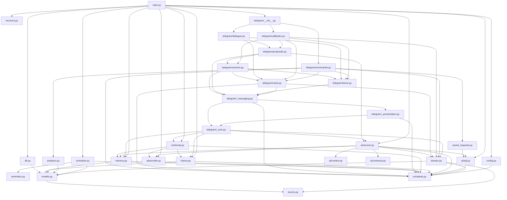

# Safwa — Structure graph

Where every entity lives and what depends on what. Line numbers are anchors, not contracts — grep the
name if a jump lands wrong. Narrative context: [ARCHITECTURE.md](ARCHITECTURE.md).

## Size map (~10.8k lines under `src/safwa/`)

| Lines | File |
|---:|---|
| 1802 | `ai/service.py` |
| 1251 | `domain.py` |
| 971 | `telegram/callbacks.py` |
| 841 | `telegram/cards.py` |
| 736 | `telegram/commands.py` |
| 443 | `history.py` |
| 401 | `telegram/proposals.py` |
| 363 | `models.py` |
| 331 | `telegram/_messaging.py` |
| 322 | `scheduler.py` |
| 286 | `ai/sql.py` |
| 275 | `continuity.py` |
| 251 | `main.py` |
| 243 | `backup.py` |
| 239 | `telegram/_core.py`, `ai/contracts.py` |
| 220 | `telegram/dialogue.py` |
| 208 | `telegram/_presentation.py` |
| 198 | `memory.py` |
| 193 | `telegram/items.py` |
| 188 | `analytics.py` |
| 145 | `qa.py` |
| 99–46 | `ai/provider.py`, `ai/context.py`, `config.py`, `enums.py`, `constants.py`, `recovery.py`, `saved_requests.py`, `telegram/__init__.py`, `db.py` |

## Dependency graph

Cycle guards worth remembering: `constants.py` imports nothing from Safwa, so it is safe from anywhere;
`_presentation.py` touches neither a session nor the bot; nothing below `_core.py` imports upward.

## Module index

### `main.py` — bootstrap

`configure_logging` :34 · `database_path` :50 · `run` :56 (full wiring) · `main` :244.
Nested closure inside `run`: `memory_error`. The Reminder poll's three hooks come from
`ReminderRuntime`, not from a closure here.

### `constants.py` — every tuning knob

Imports nothing from Safwa. Grouped by concern:

- Domain — `EFFORT_POINTS` :17 · `SPRINT_LENGTH_DAYS` :18
- Agent loop — `MAX_TOOL_CALLS` :21 · `MAX_REPAIR_ROUNDS` :22 · `SUSPENDED_BATCH_LOOKUP_LIMIT` :23
- `query_safwa` caps — `DEFAULT_ROW_LIMIT` :27 · `DEFAULT_CHAR_BUDGET` :28 · `DEFAULT_COLUMN_LIMIT` :29 ·
  `DEFAULT_CELL_LIMIT` :30 · `QUERY_TIMEOUT_SECONDS` :31
- History — `HISTORY_RECENT_LIMIT` :34 · `HISTORY_CONTINUITY_LIMIT` :35 ·
  `SUMMARY_CONTEXT_MESSAGE_LIMIT` :36 · `MESSAGE_CORRELATION_SECONDS` :38
- Summaries/memory — `SUMMARY_TRIGGER_TOKENS` :41 · `MEMORY_TOKEN_BUDGET` :42 ·
  `TOKEN_CHARS_ESTIMATE` :43 · `MEMORY_RETELL_CHUNK_TOKENS` :44 · `MEMORY_RETELL_OVERLAP_TOKENS` :45
- Loops — `MEMORY_POLL_SECONDS` :48 · `SCHEDULER_POLL_SECONDS` :49 ·
  `MEMORY_MAINTENANCE_INTERVAL_SECONDS` :50
- Telegram UI — `PAGE_SIZE` :53 · `SELECTOR_PAGE_SIZE` :54 · `REQUEST_RESULT_LIMIT` :55 ·
  `TELEGRAM_TEXT_LIMIT` :56 · `CALLBACK_TOKEN_TTL_HOURS` :57
- Provider — `AI_TIMEOUT_SECONDS` :60 · `AI_MAX_OUTPUT_TOKENS` :61

### `config.py` — `Settings` :12

`SAFWA_` env prefix, `.env`. Keys: `telegram_bot_token`, `telegram_owner_id`, `telegram_api_id/hash`,
`telegram_history_required=True`, `telegram_user_session_path`, `database_url=sqlite:///data/safwa.db`,
`data_dir`, `ai_provider=lmstudio`, `ai_api_key`, `ai_model`, `ai_timeout_seconds=120`,
`ai_max_output_tokens=4096`, `ai_structured_output=False`, `ai_query_row_limit`, `ai_query_char_budget`,
`timezone=Europe/Istanbul`, `summary_trigger_tokens`, `memory_token_budget`, `token_chars_estimate`,
`memory_poll_seconds`, `scheduler_enabled=True`, `scheduler_poll_seconds`, `log_level`. `ai_base_url`,
`ai_max_retries`, `ai_send_temperature`, `ai_cache_breakpoints`, `ai_reasoning_effort` default to `None`
and fall back to `PROVIDER_DEFAULTS[ai_provider]`. Every numeric default comes from
`constants.py`. Properties: `async_database_url`, `memory_path`, `telegram_history_enabled`,
`provider_defaults`, `resolved_ai_base_url`, `resolved_ai_max_retries`, `resolved_ai_send_temperature`,
`resolved_ai_cache_breakpoints`.

### `enums.py`

`WorkspaceMode` `CardKind` `CardStage` `Priority` `Category` `EnergyType` `ActorType` `ProposalStatus`
`MessageKind` (14 members) · `TERMINAL_STAGES` :76 · `LIVE_STAGE_PRECEDENCE` :77.
(`EFFORT_POINTS` lives in `constants.py`.)

### `models.py` — the only schema source

`new_correlation_id` :34 · `Base` :39 · `TimestampMixin` :43 · `Workspace` :50 · `UserProfile` :60 ·
`Value` :79 · `Card` :89 · `CardValue` :133 · `Tag` :143 · `CardTag` :152 ·
`Check` (Pending is `outcome IS NULL`) / `CardCheck` (the one Check relationship, Card-side) ·
`SavedRequest` :160 ·
`CardCategory` :172 · `CardEnergyType` :180 · `Sprint` :188 · `SprintCommitment` :201 · `CardEvent` :215 ·
`ChangeProposal` :230 · `ProposalChange` :239 · `AgentRun` :253 · `AgentStep` :265 · `TelegramMessage` :274 ·
`FeedbackQueue` :286 · `SummaryState` :295 · `MemoryFactCache` :306 · `MemorySyncState` :316 ·
`Reminder` · `UiSession` · `CallbackToken`. `UtcDateTime` is a `TypeDecorator` that always reads
back tz-aware UTC, used by the Reminder datetime columns; SQLite otherwise returns them naive.

### `db.py`

`upgrade_database` :11 (`create_all`) · `Database` :32 (async engine, `sessions`, SQLite PRAGMAs, `dispose`).

### `recovery.py`

`recover_startup` :19 · `_close_interrupted_approval_batches` :41.

### `domain.py` — invariants + every mutation

Errors/values: `DomainError` :44 · `StaleStateError` :48 · `OperationResult` :53 · `utcnow` :60 ·
`listed` :64 · `ReferenceSpec` :72 (+ `TAG_REFERENCE`, `VALUE_REFERENCE`, `CHECK_REFERENCE`;
`name_attr` picks the column a `*_query` resolves against — `title` for a Check) ·
`ResolvedReferences` :99 ·
`resolve_references` :113 · `card_snapshot` :156.

Mutations (all take an `AsyncSession`, all bump `workspace.revision` via `_bump_workspace`):
`bootstrap_workspace` :172 · `create_card` :186 · `create_tag` :274 · `update_tag_fields` :294 ·
`archive_tag` :324 · `create_saved_request` :342 · `update_saved_request` :379 ·
`archive_saved_request` :415 · `create_value` :425 · `update_value_fields` :457 · `archive_value` :490 ·
`create_check` (creates only — attaching is a Card action) · `update_check_fields` · `archive_check` ·
`toggle_card_check` (the one link-write path; records `link_check`/`unlink_check` on the Card) ·
**`resolve_check`** (spawns only on the Pending → resolved transition; the one answer path, used by
the manual screen and by an approved proposal alike) ·
`pending_checks` · `card_checks` · `check_card_ids` · `_apply_check_outcome` ·
`_spawn_check_successor` (successor keeps the live Cards only) · `_clone_checks_for_successor` ·
`_pending_check_resolutions` · `_linked_checks` · `_has_other_live_card` ·
`set_value_focus` :509 · `update_profile` :521 · `snooze_reminders` :549 · `edit_card_text` :559 ·
`update_card_fields` :581 · `set_card_parent` :624 · `toggle_card_value` :650 · `toggle_card_tag` :676 ·
`toggle_card_category` :702 · `toggle_card_energy_type` :733 · `move_card` :965 · `finish_action` :1048 ·
`set_feedback` :1100 · `start_sprint` :1120 · `finish_sprint` :1164 · `archive_subtree` :1195 ·
`delete_subtree` :1225.

Derivation/validation: `_workspace` :764 · `_bump_workspace` :771 · `validate_parent` :777 ·
`validate_action_fields` :805 · `validate_blocked_fields` :821 · `_children` :826 ·
`effective_value_ids` :834 · `card_progress` :847 · `aggregate_child_stages` :876 ·
`propagate_ancestors` :886 · `_record_event` :905 · `_sync_commitment_for_stage` :927 ·
`_copy_repeat_successor` :1013 · `sprint_metrics` :1180.

### `saved_requests.py`

`RequestQueryError` :14 · `normalize_request_sql` :18 (safe SQL **+** must mention `ai_cards` **+** must
return `id`) · `request_cards` :37 (runs the query, loads live Cards in result order).

### `history.py` — canonical Telegram dialogue

`_NEW_SESSION_RE` :24 · `_SUMMARY_RE` :28 · `SUBSESSION_RESULT_HEADER` :29 ·
`_KIND_MARK_CODES` (append-only) · **`mark_kind`** / **`read_kind_mark`** (the `MessageKind`
carried inside the Telegram text, so a rebuilt database loses no dialogue) · `CITATION_TYPES` ·
`CITATION_PATTERN` · `citation_payload` / `parse_citation_payload` (the `[Milk](check:14)` ⇄
`?start=check-14` codec) · **`restore_citations`** (link entities read back as citations; UTF-16
offsets, so it slices in surrogate space) · `_citation_from_url` ·
`HistoryBoundaryMissing` :39 · `HistoryEntry` :44 ·
`TelegramHistorySource` :54 → `from_settings` :71, `start` :92, `close` :102, **`recent`** :106,
`_registered_message` :257 (ID-space correlation), `_new_session_request` :299, `_summary_body` :306,
`_subsession_result_piece` :311, `active_session_start` :320, `_dialogue_content` :342,
**`dialogue`** :354 · `register_message` :391 · `auth_main` :420 (`safwa-auth`).

### `memory.py` — authoritative `data/memory.md`

`MemoryFileError` :16 · `MemorySnapshot` :21 · `estimate_tokens` :33 · `parse_memory` :37 ·
`memory_hash` :46 · `MemoryFileStore` :50 → `sync` :74, `_sync_locked` :78, **`replace_facts`** :127
(hash check before *and* after temp write, then `os.replace`), `append_manual` :171, `forget_line` :179,
`poll` :191 (5 s watcher).

### `continuity.py` — summaries + memory maintenance

`SUMMARY_PROMPT` :28 · `RETELL_PROMPT` :34 · `MEMORY_PROMPT` :39 · `MemoryMaintenanceResult` :45 ·
`PersonaContinuity` :53 → `maybe_summarize` :73, `maintain_memory` :101, `_chunks` :180 ·
`run_memory_maintenance` :194 (60 s loop) · `run_due_memory_maintenance` :217 ·
`record_memory_run` :251 · `parse_memory_update_time` :264.

### `scheduler.py` — the Reminder poll

`Firing` (one due Reminder, resolved) · `reminders_paused` (master switch + snooze) ·
`due_reminders` (`next_fire_at <= now`, `LIMIT REMINDER_FIRE_BATCH`) · `is_stale` (a repeat past the
catch-up grace) · `prepare` (rolls stale repeats forward, applies the two relevance skips) ·
`settle` (deletes one-shots, advances repeats **from the scheduled moment**, writes the verdict
cache) · `tick` · `run_scheduler`.

`gate`, `evaluate` and `escalate` are injected, so this module imports neither the advisor nor the
bot. `next_fire_at` is advanced only after an escalation succeeds; the whole body is guarded so one
failure cannot end the loop.

### `reminders.py` — schedule arithmetic

Pure, no session. `Schedule` · `resolve` (parameters → schedule, or `ScheduleError` naming the
question to ask) · `next_fire` · `roll_forward` (skips a downtime gap by computation, not iteration) ·
`on_wall_clock` (has a timezone move invalidated a stored instant?) · `describe` (the one phrase
source for the proposal screen, `/reminders` and the escalation) · `mentions_item` (the `#id` regex
that decides whether a relevance session is worth running) · `schedule_columns`/`schedule_of` (ORM
row) · `schedule_payload`/`schedule_from_payload` (proposal JSON).

### `ai/mini.py` — one-question model sessions

`TerminalTool` · `run_mini_session` (loops until one terminal tool validates; prose, unknown tools and
bad arguments come back as retryable tool results). Deliberately not `_run_agent_loop`, which is
entangled with proposals and `AgentRun` rows.

### `ai/reminder_sessions.py` — the two Reminder sessions

`SETUP_PROMPT` / `resolve_schedule` (free text → `Schedule`; `not_clear_enough` becomes a
`ToolPreparationError`) · `RELEVANCE_PROMPT` / `check_relevance` (reads the named `#id`s, returns
`trigger`/`irrelevant` plus a state sentence; a failure falls back to firing with no state line).

### `telegram/escalation.py` — due Reminders → one advisor turn

`ReminderRuntime.can_escalate` (guard free, no pending proposal, no unresolved approval batch) ·
`.evaluate` · `.escalate` (background guard lease, `dialogue=None`, answer registered as
`MessageKind.REMINDER`) · `format_escalation`.

### `analytics.py` — retrospectives

`retrospective_data` :25 · `render_retrospective_png` :115 (Matplotlib `Agg`, 3 axes) ·
`retrospective_recommendations` :151.

### `backup.py` — `safwa-backup` / `safwa-restore`

`FORMAT_VERSION` :19 · members `safwa.db` / `memory.md` / `manifest.json` :20 · `BackupError` :25 ·
`BackupInfo` :30 · `RestoreResult` :37 · `database_path` :42 · `_snapshot_database` :61 ·
`create_backup` :78 · `_validated_members` :116 · `inspect_backup` :146 · `restore_backup` :166 ·
`backup_main` :214 · `restore_main` :229.

### `qa.py` — live-test isolation

`QAConfig` :15 · `ResolvedQAConfig` :39 · `resolve_qa_config` :57 (hard-fails on a reused bot token or
Telethon session path) · `auth_main` :112 (`safwa-qa-auth`).

## `ai/` package

### `ai/context.py`

`DialogueMessage` :14 · **`SYSTEM_PROMPT`** :20 (planning rules + the `ai_*` view list + tool/approval
rules — a new view must be listed here too) · `planning_context` :63 (local time, workspace mode,
About me, advisor instructions, active Values, available Tags, Today Actions — deliberately no Sprint
metrics and no precomputed Card candidates; the model uses `query_safwa` for those).

### `ai/contracts.py` — the AI mutation boundary

`AgentChange` :8 (`entity` × `action` × `id` × `values`) · `CardToolInput` :26 (per-mode validator :61;
three relationship groups — `value_*`, `tag_*`, `check_*` — exactly one per link/unlink) ·
`CheckToolInput` (modes `create|edit|complete|cancel`, where complete is Passed and cancel is Missed;
no link modes, since attaching is a Card action) ·
`ValueToolInput` :133 · `TagToolInput` :153 · `RequestToolInput` :172 · `RemoveToolInput` :200
(`permanent` only for Cards) · `MUTATION_TOOL_MODELS` :214 · `mutation_change_from_tool` :223.

### `ai/provider.py`

`ProviderConfig` :12 · `ProviderToolCall` :29 · `ProviderUsage` :36 · `ProviderTurn` :45 ·
`OpenAICompatibleProvider` :78
(`complete`, `complete_turn`, `close`).

### `ai/sql.py` — read-only guard

`UnsafeQueryError` :20 · **`ALLOWED_VIEWS`** :24 · `FORBIDDEN` :33 · `validate_read_sql` :39 ·
**`create_ai_views`** :74 (drops+rebuilds the 7 views; also drops the `card_search` FTS5 table
and its 3 triggers from older databases) · `QueryOutcome` :147 · `ReadOnlyQueryRunner` :158
(`mode=ro` connection + `set_authorizer` + caps from `constants.py`).

Views: `ai_cards` (carries `direct_checks` and `pending_checks`, so no Card↔Check join view is
needed), `ai_checks`, `ai_tags`, `ai_values`, `ai_requests`, `ai_current_sprint`,
`ai_current_sprint_metrics`, `ai_card_events`.

### `ai/service.py` — agent loop + proposals

Tool schemas: `QUERY_SAFWA_TOOL` · `MUTATION_TOOL_DESCRIPTIONS` · `MUTATION_TOOLS` · `SAFWA_TOOLS` ·
`IMMEDIATE_TOOLS` (those that run in-turn instead of becoming a proposal). (`MAX_TOOL_CALLS`, `MAX_REPAIR_ROUNDS`, `SUSPENDED_BATCH_LOOKUP_LIMIT` are
in `constants.py`.)

Types: `ToolPreparationError` :141 (`as_tool_result` :149) · `AIOutcome` :160 · `PendingTool` :167 ·
`AgentLoopResult` :174.

Helpers: `_allows_parent` :81 · `_log_preview` :185 · `_json_safe` :190 · `_result_value` :194 ·
`_detail_value` :221 · `_reference_details` :231 · `_normalized_card_details` :243 ·
`_raw_change_details` :280 · `_approval_change_label` :294 · `_approval_results_summary` :315 ·
`_safe_approval_results_summary` :354 · `_with_queued_siblings` :372 ·
`_assistant_content_with_request_progress` :390 · `_log_provider_request` :405 · `_log_provider_response` :419.

**`AIAdvisor`** :429 → `handle` :445 · `_context_messages` :477 · `compress_subsession` :496 ·
`_provider_turn` :515 · **`_run_agent_loop`** :529 · `_execute_query_tool` :628 ·
`_execute_mutation_tool` :684 · `_validate_named_references` :727 · `_resolve_parent_reference` :764 ·
`_create_proposal` :858 · `_card_detail_snapshot` :953 · `_reference_groups` · `_proposal_display_line`
(the owner's one-line receipt, names instead of IDs) · `_proposal_result_details` :996 ·
`_target_outcome` :1074 · `_materialize` :1077 · `_pending_batch_for_target` :1231 ·
`has_pending_approval` :1260 · `_refresh_queued_proposal` :1265 · **`resolve_approval`** :1289 ·
`cancel_approval_for_target` :1453 · `_finish_run` :1499.

**`ProposalService`** :1511 → `_parent_id` :1515 · `_named_ids` :1518 · `_apply_stage_change` :1532 ·
`_replace_card_sets` :1545 · `_apply_card_links` :1581 · **`apply`** :1599 (calls the same `domain.py`
functions the manual UI uses) · `reject` :1799.

## `telegram/` package

### `telegram/_core.py` — foundation

`router` :29 · **`Services`** :32 (`sessions, advisor, history, memory, continuity, owner_id, guard`) ·
**`GenerationGuard`** :43 (`active`, `acquire`, `reserve`, `release`, `cancel`, `dialogue_revision`) ·
**`OwnerAndWritingMiddleware`** :73 (owner+private filter, slash-command deletion except `/newsession`,
guard enforcement, implicit lease reservation for ordinary text) · `CallbackContext` :133 ·
`CallbackHandler` :154 · `RelationChoice` :158 · **`RELATION_CHOICES`** :170
(`categories`/`energy`/`values`/`tags` → column, payload key, domain toggle, parser) ·
`SINGLE_CHOICE_FIELDS` :209 · `CHOICE_TITLES` :215 · `CARD_CHOICE_FIELDS` :227 ·
`CARD_DRAFT_CHOICE_FIELDS` :228 · `CARD_DRAFT_RELATIONS` :229 · `CARD_RELATION_TOGGLES` :233 ·
`NAMED_CHOICE_FIELDS` :237 · `ITEM_REFERENCES` :239.

### `telegram/_presentation.py` — pure rendering

`_KIND_EMOJIS` :16 · `CATEGORY_EMOJIS` :23 · `ENERGY_EMOJIS` :31 · `typed_label` :39 · `with_notice` :53 ·
`kind_label` :62 · `category_expression` :66 · `energy_expression` :70 · `_PRIORITY_ORDER` :74 ·
`_live_card_order` :77 · `Page` :83 · `paginate` :93 · `paginate_cards` :99 ·
`proposal_change_summary` :103 · **`card_overview_text`** :110 · `menu_markup` :158 · `menu_row` :183 ·
`retro_back_row` :188 · `split_telegram_text` :193.
(Page sizes and the text limit come from `constants.py`.)

### `telegram/_messaging.py` — all Telegram I/O + `MessageKind` registration

`token_button` :32 (single-use `cb:<token>`, 24 h) · **`send_registered`** :52 (edits in place when the
source message is the bot's) · `edit_registered_message` :95 · `delete_text_input` :129 (registers
`UI_INPUT`, deletes) · `clear_message_markup` :148 · `paging_row` :159 · **`dismiss_prior_ui`** :182 ·
`delete_screen` (delete one screen, or drop its buttons when Telegram refuses) ·
`delete_message_range` :299 · `send_subsession_result` :309.

### `telegram/items.py` — shared Tag/Value/Request screens

`render_item_editor` :21 · `render_saved_request` (moved off `commands.py` so a render module can
open one) · `render_item_text_prompt`.

### `telegram/checks.py` — Check screens

`CHECK_STATUS_EMOJIS` :18 · **`SETTABLE_OUTCOMES`** :24 · `check_status` :30 ·
`check_status_label` :34 · `outcome_button_label` :39 (`• ` marks the current answer) ·
`card_title` :44 ·
**`render_checks`** :51 (scoped to one Card; list + Back only — create/link/unlink are
proposal-only) · **`render_check`** :107 (`🔁 Repeat` plus `✅ Passed` / `❌ Missed`; no title edit, no
archive; `card_id`/`back` are optional, so `open` can show a Check that hangs on no Card) ·
**`render_check_resolution`** :193 (the Done-gate screen; `✅ Passed` / `❌ Missed` per
Check, nothing prefilled, `Save` only once an answer is set) · `_deliver` :293.

### `telegram/cards.py` — Card screens

`linked_card_count` :66 · **`render_dashboard`** :75 · `_new_card_creation_state` :151 ·
`sanitize_card_creation_state` :170 · `card_creation_errors` :196 · `card_creation_markup` :224 ·
**`render_card_creation`** :269 · `start_manual_card_creation` :336 · `choice_screen` :351 ·
`require_card_draft` :383 · `card_editor_back_state` :395 · `_choice_options` :403 · `_choice_rows` :429 ·
`_selector_page` :441 · `handle_card_creation_chooser` :448 · `render_card_choices` :486 ·
`render_children` :542 · **`render_card`** :616.

### `telegram/proposals.py` — AI review screens

`_proposal_item_state` :38 · `_display_diff_value` :129 · `_proposal_card_display_state` :137 ·
`_proposal_diff_value` :161 · `_proposal_card_diffs` :188 · **`render_proposal`** :221 (Save/Discard only,
no field controls, for every entity including a Check) · `render_ai_outcome` (the proposal, or the
answer with its citations resolved) · **`continue_agent_approval`** (resumes the model after the last
queue item).

### `telegram/screens.py` — the items the advisor cites

**`render_citations`** (`[Milk](check:14)` in the escaped reply → a `?start=check-14` deep link;
missing or archived ids keep their words and lose the link) · **`open_item_screen`**
(Card/Check/Tag/Value/Request → its manual renderer) · `open_citation` (one `/start` payload) ·
`report_open_failure` (`⚠️ Error while opening: …`) · `OPENABLE_MODELS`. The citation pattern and the
payload codec is in `history.py`, beside the kind mark; `_presentation.start_payload` reads the
`/start` line.

### `telegram/commands.py` — `@router.message` handlers

`end_subsession` :63 · `/start` :84 (greeting, or `open_citation` when it carries a deep-link
payload) · `/newsession` :96 · `/endsession` :126 · `/today` :174 ·
`/backlog` :179 · `/sprint` :184 · `command_add` :240 (nav only) · `/advisor` :245 · `/values` :257 ·
`/tags` :294 · `/requests` :325 · `/memory` :404 · `/syncmem` :417 ·
`/mem` :451 · `/forget` :463 · `/retro` :477 · `render_feedback` :506 · `/feedback` :550 ·
`/reminders` · `/settings` · `/setabout` · `/setadvisor` · `update_profile_field` · `/snooze` ·
`/setcapacity` · `/setmemtime` ·
`/status` :675 · `/cancel` :695 · **`navigation`** :703 (`nav:` prefix → home/today/sprint/backlog/add/
values/tags/requests/advisor/retro/settings/retro_back).

### `telegram/callbacks.py` — `cb:` token handlers

Item (Tag/Value): `_on_item_create_prompt` :81 · `_on_item_view` :86 · `_on_item_edit_text` :96 ·
`_on_item_text_back` :107 · `_on_item_create` :123 · `_on_item_toggle_focus` :143 ·
`_on_item_archive_prompt` :156 · `_on_item_archive_confirm` :191 · `_on_item_back` :215 ·
`_on_request_view` :223.

Session: `_on_subsession_confirm` :230 · `_on_subsession_cancel` :255.

Manual Card draft: `_on_card_draft_view` :268 · `_on_card_draft_edit_text` :284 · `_on_card_draft_toggle` :306 ·
`_on_card_draft_chooser` :317 · `_on_card_draft_set` :326 · `_on_card_draft_toggle_relation` :336 ·
`_on_card_draft_save` :349 · `_on_card_draft_discard` :384.

Committed Card: `_on_dashboard_page` :394 · `_on_card_view` :404 · `_on_card_children` :413 ·
`_on_card_back` :423 · `_on_card_move` :457 · `_on_card_edit_text` :471 · `_on_card_choices` :514 ·
`_on_card_set_field` :524 · `_on_card_toggle_field` :535 · `_on_card_toggle_relation` :582 ·
`_on_card_archive` :598 · `_on_card_restore` :618 · `_on_card_delete_prompt` :631 ·
`_on_card_delete_confirm` :650 · `_on_card_finish` :663 · `_on_feedback` :682.

Sprint: `_on_sprint_start` :692 · `_on_sprint_finish` :708.

Proposals: `_on_proposal_approve` :724 · `_on_proposal_delete_confirm` :770 · `_on_proposal_reject` :792.

Registry + dispatch: **`CALLBACK_ACTIONS`** :814 · `_report_callback_failure` :863 ·
`_resume_failed_approval` :887 · **`callback_token_handler`** :901 (atomic token claim, then
`StaleStateError` / `DomainError` / generic recovery).

### `telegram/dialogue.py`

**`ordinary_text`** :37 — the single `F.text` handler. Branches on the active `UiSession.kind`
(`item_text`, `card_create_text`, `card_text`, `card_blocked_text`); otherwise `dismiss_prior_ui` →
register `DIALOGUE_USER` → capture `dialogue_revision` + `workspace.revision` → `guard.acquire` →
`history.dialogue` → `advisor.handle` → staleness recheck → `render_ai_outcome` → release lease →
`continuity.maybe_summarize`.

### `telegram/__init__.py`

Imports `callbacks`, `commands`, `dialogue` for handler registration side effects, then re-exports the
public surface via `__all__` :33.

## Key flows

**Ordinary advisor turn**
`dialogue.ordinary_text` → `TelegramHistorySource.dialogue` (boundary enforced) → `AIAdvisor.handle` →
`_context_messages` (`SYSTEM_PROMPT` + `planning_context` + `memory.text`) → `_run_agent_loop` →
`query_safwa` runs inline / mutation tools become `ChangeProposal` rows → `_materialize` → `AIOutcome` →
`render_ai_outcome` (`render_proposal` or a `DIALOGUE_ASSISTANT` message) → `maybe_summarize`.

**Proposal approval**
`callback_token_handler` → `_on_proposal_approve` → `ProposalService.apply` (same `domain.py` functions
as the manual UI) → `continue_agent_approval` → `AIAdvisor.resolve_approval` → next queued proposal or
the model's resumed answer.

**Manual Card creation**
`command_add`/`nav:add` → `start_manual_card_creation` → `UiSession(kind="card_create")` →
`render_card_creation` edits one message; text fields round-trip through `card_create_text` +
`delete_text_input`; `_on_card_draft_save` → `domain.create_card`. Discard/navigation/restart leaves no row.

**Reminder**
`run_scheduler` (30 s) → `due_reminders` → `ReminderRuntime.can_escalate` (else advance nothing) →
`prepare` (skip the relevance session when the instruction names no `#id` or the revision is
unchanged, else `check_relevance`) → `format_escalation` → `ReminderRuntime.escalate`
(background guard lease → `AIAdvisor.handle(..., dialogue=None)` → `render_ai_outcome(...,
kind=REMINDER)`) → only on success `settle`: one-shots deleted, repeats advanced from their
scheduled moment.

**Reminder authoring**
`reminder` tool → `_create_proposal` → `_prepare_reminder_values` → setup mini-session
(`set_reminder_config` / `not_clear_enough`) → resolved `Schedule` into `ProposalChange.values` →
Save/Discard screen → `ProposalService._apply_reminder_change` → `domain.create_reminder`.

**Memory**
`memory.poll` (5 s hash watcher) and `run_memory_maintenance` (60 s eligibility) →
`run_due_memory_maintenance` → `PersonaContinuity.maintain_memory` → retell/reconcile chunks →
`MemoryFileStore.replace_facts` → advance `MemorySyncState.processed_message_id`.

## Tests

`tests/test_domain.py` `test_card_creation.py` `test_history.py` `test_memory.py` `test_continuity.py`
`test_ai_sql.py` `test_saved_requests.py` `test_scheduler.py` `test_reminders.py`
`test_reminder_flow.py` `test_telegram_item_ui.py`
`test_infrastructure.py` `test_backup.py` `test_qa.py` ·
`tests/e2e/{test_advisor_flow_e2e.py,test_startup_e2e.py}` (real SQLite +
real services, `ScriptedProvider` at the provider boundary) · `tests/e2e/live/test_telegram_live.py`
(opt-in `--live-telegram`, needs `SAFWA_QA_*` and `safwa-qa-auth`).
