# Safwa — structure graph

Устойчивая карта проекта: зависимости, владельцы данных, ответственность файлов и основные runtime
потоки. Здесь намеренно нет номеров строк и LoC-снимков. Навигация строится по пути файла и имени
символа — они значительно реже устаревают после обычных правок.

## Как читать карту

- Стрелка `A → B` означает, что `A` вызывает или использует `B`.
- `models.py` описывает форму данных, но бизнес-изменения принадлежат `domain.py`.
- Telegram хранит канонический persona-диалог; SQLite хранит классификацию и operational state.
- `memory.md` — самостоятельный авторитетный источник долговременной persona-памяти.
- Точки входа и ключевые символы указаны именами, которые удобно искать через IDE или `rg`.

## Система целиком

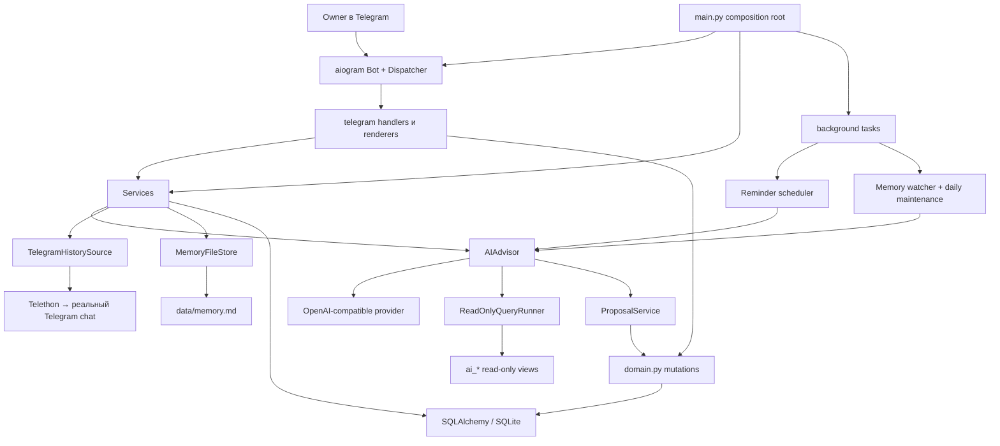

## Направление зависимостей

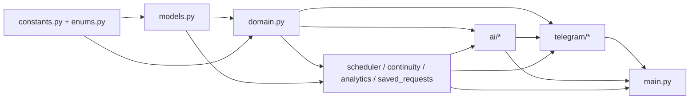

Практическое правило: UI и AI не изменяют ORM-сущности напрямую. Оба пути сходятся в функциях
`domain.py`, а approved AI changes применяет `ProposalService` через те же domain-функции.

## Владельцы состояния

| Состояние | Авторитетный источник | Кто читает | Кто изменяет |
|---|---|---|---|
| Cards, Checks, Values, Tags, Sprints | SQLite models | UI, AI context, `ai_*` views | Только `domain.py` и `ProposalService` через domain |
| Persona dialogue | Приватный Telegram chat | `TelegramHistorySource` через Telethon | Owner и зарегистрированные bot sends |
| Классификация bot messages | Invisible kind + event UUID marker | `history.py` | `send_registered`, `mark_message`, `register_message` |
| Долговременная persona memory | `data/memory.md` | AI context, `/memory`, maintenance | File edits, `/mem`, `PersonaContinuity` |
| Proposal/agent progress | `AgentRun`, `AgentStep`, `ChangeProposal` | AI continuation, proposal UI, recovery | `AIAdvisor`, `ProposalService`, approval handlers |
| Reminder schedule и delivery state | `Reminder` | Scheduler, UI, AI views | Domain operations и `scheduler.settle` |
| Transient Telegram UI | `UiSession`, `CallbackToken` | Telegram handlers | `_messaging.py`, renderers, recovery |

## Composition root

### [`main.py`](../src/safwa/main.py)

Собирает приложение и управляет его жизненным циклом.

Ключевые точки:

- `run` создаёт `Database`, provider, history, memory, advisor, `Services`, Bot и Dispatcher;
- регистрирует bot commands и middleware;
- запускает memory file watcher, Reminder scheduler и daily memory maintenance;
- в `finally` отменяет background tasks и закрывает Telethon, provider, bot session и database;
- `main` загружает `Settings`, создаёт fresh schema и запускает event loop.

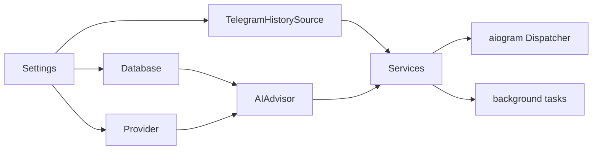

## Foundation

| Файл | Ответственность | Ключевые символы |
|---|---|---|
| [`constants.py`](../src/safwa/constants.py) | Все лимиты, интервалы, budgets и tuning defaults | `EFFORT_POINTS`, history/memory/query/reminder limits |
| [`config.py`](../src/safwa/config.py) | Environment-backed runtime configuration и provider defaults | `Settings`, resolved provider properties |
| [`enums.py`](../src/safwa/enums.py) | Общий словарь состояний домена и UI | `CardKind`, `CardStage`, `MessageKind`, `ProposalStatus` |
| [`models.py`](../src/safwa/models.py) | Единственный источник SQLAlchemy schema | `Workspace`, `Card`, `Check`, `Reminder`, proposal/agent/history/UI models |
| [`db.py`](../src/safwa/db.py) | Engine/session factory, fresh-schema bootstrap и `ai_*` views | `Database`, `upgrade_database`, `create_ai_views` |

До первого выпуска schema обновляется пересозданием базы после backup. `create_all` добавляет
отсутствующее, но не изменяет существующие столбцы. Поддержка миграций начинается после v1.

## Domain и application services

| Файл | Ответственность | Ключевые символы |
|---|---|---|
| [`domain.py`](../src/safwa/domain.py) | Все planning mutations и инварианты | `bootstrap_workspace`, Card/Check/Tag/Value/Sprint operations, `finish_action`, reference toggles |
| [`saved_requests.py`](../src/safwa/saved_requests.py) | Проверка и выполнение Saved Request queries | `normalize_request_sql`, `request_cards`, `RequestQueryError` |
| [`reminders.py`](../src/safwa/reminders.py) | Чистая арифметика расписаний без I/O | `resolve`, `describe`, `next_fire`, `roll_forward`, `schedule_of` |
| [`scheduler.py`](../src/safwa/scheduler.py) | Poll due Reminders, schedule preparation, delivery и settle | `Firing`, `due_reminders`, `prepare`, `settle`, `tick`, `run_scheduler` |
| [`continuity.py`](../src/safwa/continuity.py) | Summary и синхронизация Telegram dialogue → memory | `PersonaContinuity`, `run_memory_maintenance`, `run_due_memory_maintenance` |
| [`history.py`](../src/safwa/history.py) | Каноническая история из Telegram и event marker codec | `TelegramHistorySource`, `HistoryEntry`, `mark_message`, `read_message_mark`, citations |
| [`memory.py`](../src/safwa/memory.py) | Валидация, atomic replace и watcher для `memory.md` | `MemoryFileStore`, `MemorySnapshot`, `parse_memory`, `memory_hash` |
| [`recovery.py`](../src/safwa/recovery.py) | Startup reconciliation interrupted operational state | `recover_startup`, `reconcile_reminders` |
| [`analytics.py`](../src/safwa/analytics.py) | Retrospective data, recommendations и PNG | `retrospective_data`, `retrospective_recommendations`, `render_retrospective_png` |
| [`backup.py`](../src/safwa/backup.py) | Portable backup/restore SQLite + `memory.md` | `create_backup`, `restore_backup` и CLI entry points |
| [`qa.py`](../src/safwa/qa.py) | Изолированная конфигурация live Telegram QA | `QaConfig`, `ResolvedQaConfig`, `resolve_qa_config` |

## AI package

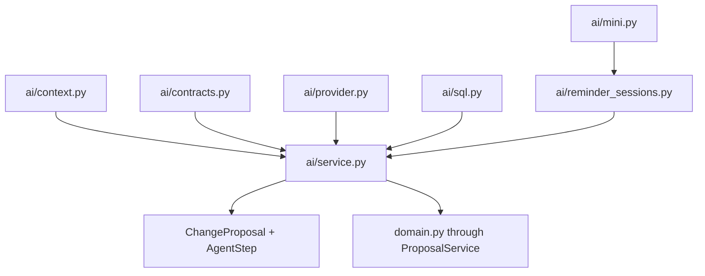

| Файл | Ответственность | Ключевые символы |
|---|---|---|
| [`ai/context.py`](../src/safwa/ai/context.py) | Static prompt, planning context и dialogue types | `SYSTEM_PROMPT`, `DialogueMessage`, `PlanningContext`, `planning_context` |
| [`ai/contracts.py`](../src/safwa/ai/contracts.py) | Pydantic schemas и native tool definitions | mutation tool models, `MUTATION_TOOL_MODELS`, `mutation_change_from_tool` |
| [`ai/provider.py`](../src/safwa/ai/provider.py) | OpenAI-compatible transport, retries и provider turns | `ProviderTurn`, `ProviderToolCall`, `OpenAICompatibleProvider` |
| [`ai/sql.py`](../src/safwa/ai/sql.py) | Read-only SQL validation и isolated SQLite execution | `validate_read_sql`, `ReadOnlyQueryRunner`, `UnsafeQueryError` |
| [`ai/mini.py`](../src/safwa/ai/mini.py) | Узкая tool-only LLM-сессия | `run_tool_session`, terminal/retry protocol |
| [`ai/reminder_sessions.py`](../src/safwa/ai/reminder_sessions.py) | Setup mini-session для расписаний Reminder | `resolve_schedule` |
| [`ai/service.py`](../src/safwa/ai/service.py) | Main agent loop, read tools, proposals, continuation и apply | `AIAdvisor`, `AIOutcome`, `ProposalService`, `_run_agent_loop`, `_materialize` |

### Main advisor context

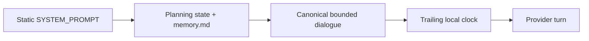

`query_safwa` выполняется немедленно. Mutation tools создают отдельные proposal screens. Если provider
смешал reads и mutations в одном response, reads выполняются, а mutations получают retryable error и
повторяются следующим response после появления read results.

## Telegram package

Пакет разделён на foundation, чистое представление, I/O, renderers и handlers. Зависимости направлены
вниз по этой схеме:

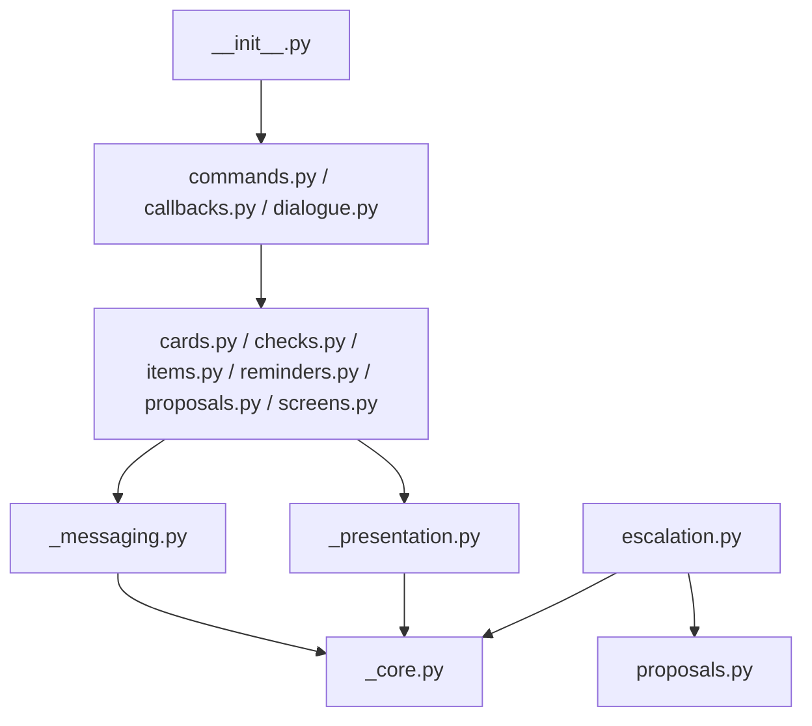

| Файл | Ответственность | Ключевые символы |
|---|---|---|
| [`telegram/_core.py`](../src/safwa/telegram/_core.py) | Shared services, router, generation coordination и owner middleware | `Services`, `GenerationGuard`, `OwnerAndWritingMiddleware`, `CallbackContext` |
| [`telegram/_presentation.py`](../src/safwa/telegram/_presentation.py) | Чистые labels, text formatting, markup и paging | `Page`, menu helpers, proposal summaries, `split_telegram_text` |
| [`telegram/_messaging.py`](../src/safwa/telegram/_messaging.py) | Все send/edit/delete operations и semantic registration | `send_registered`, `edit_registered_message`, `dismiss_prior_ui`, queue materialization |
| [`telegram/cards.py`](../src/safwa/telegram/cards.py) | Card overview, creation editor и selectors | Card render/start/sanitize functions |
| [`telegram/checks.py`](../src/safwa/telegram/checks.py) | Check screens и answer UI | Check renderer и pending-check gate screens |
| [`telegram/items.py`](../src/safwa/telegram/items.py) | Shared Tag/Value editors и Saved Request screens | item renderer, list screens, text prompts |
| [`telegram/reminders.py`](../src/safwa/telegram/reminders.py) | Manual Reminder list/detail/text screens | Reminder renderers и schedule presentation |
| [`telegram/screens.py`](../src/safwa/telegram/screens.py) | Deep links из advisor prose в domain screens | `render_citations`, `open_citation`, `open_item_screen` |
| [`telegram/proposals.py`](../src/safwa/telegram/proposals.py) | Read-only proposal UI, queue progression и agent continuation | `render_proposal`, `continue_agent_approval`, `render_ai_outcome` |
| [`telegram/escalation.py`](../src/safwa/telegram/escalation.py) | Due Reminder → bounded dialogue → main advisor | `ReminderRuntime`, `format_escalation` |
| [`telegram/commands.py`](../src/safwa/telegram/commands.py) | Slash-command handlers | session, dashboard, memory, settings, status и cancellation commands |
| [`telegram/callbacks.py`](../src/safwa/telegram/callbacks.py) | Single-use `cb:` action handlers | item/card/check/proposal/subsession callbacks |
| [`telegram/dialogue.py`](../src/safwa/telegram/dialogue.py) | Ordinary owner text → advisor loop → queued turns → summary | `ordinary_text` |
| [`telegram/__init__.py`](../src/safwa/telegram/__init__.py) | Импорт handler-модулей ради router registration | package exports |

Только `commands.py`, `callbacks.py` и `dialogue.py` регистрируют router handlers. Удаление их imports
из `telegram/__init__.py` молча отключит соответствующие маршруты.

## Ключевые runtime-потоки

### Обычный advisor turn

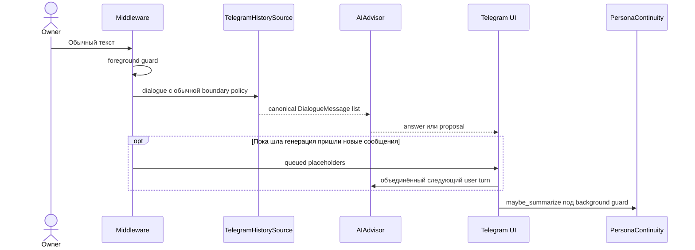

### Proposal queue

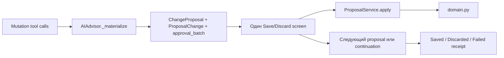

### Reminder escalation

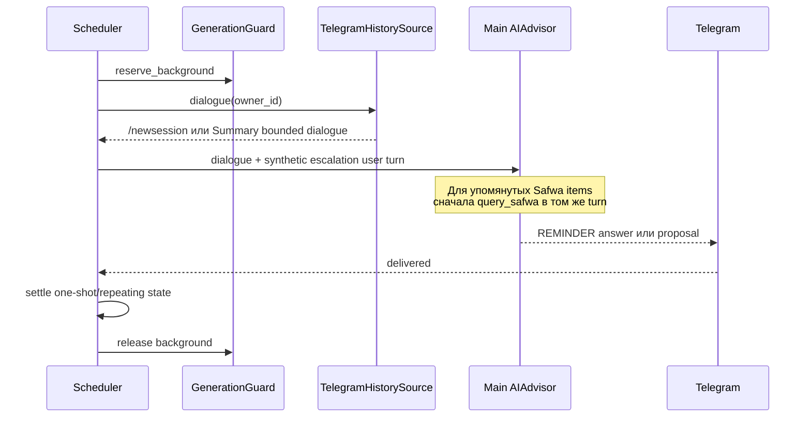

### History reconstruction

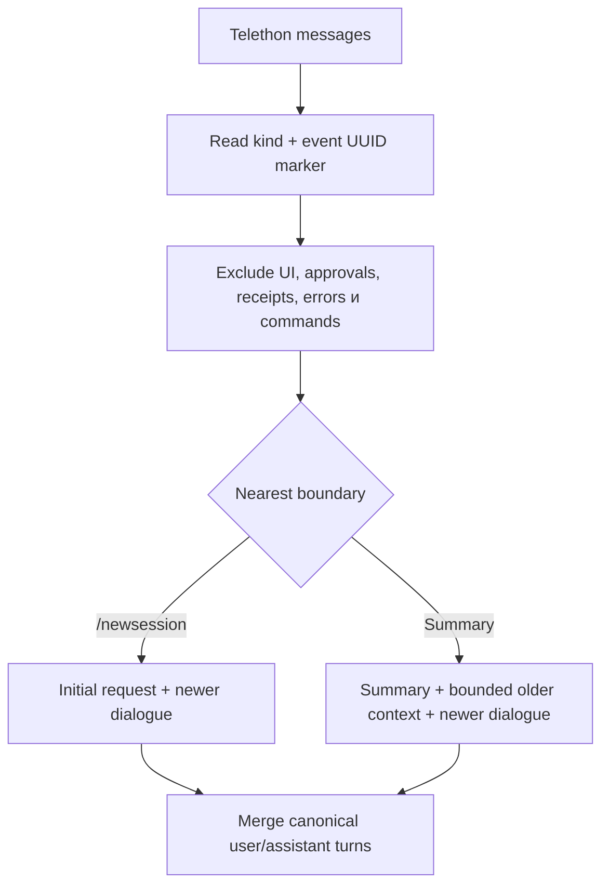

### Memory maintenance

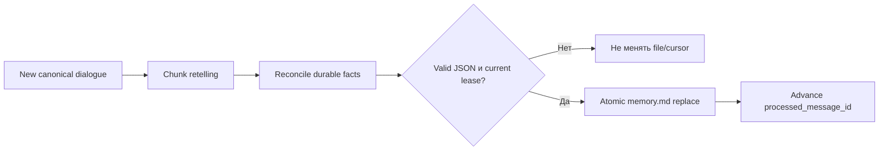

## Модели по подсистемам

| Подсистема | Модели |
|---|---|
| Workspace и profile | `Workspace`, `UserProfile` |
| Planning tree | `Card`, `CardValue`, `CardTag`, `CardCheck`, `Check`, `Value`, `Tag`, `CardEvent` |
| Sprint | `Sprint`, `SprintCommitment`, `CardCategory`, `CardEnergyType` |
| Saved queries | `SavedRequest` |
| Agent и approvals | `AgentRun`, `AgentStep`, `ChangeProposal`, `ProposalChange` |
| Telegram continuity | `TelegramMessage`, `SummaryState`, `UiSession`, `CallbackToken` |
| Persona memory | `MemoryFactCache`, `MemorySyncState` |
| Proactive work | `Reminder`, `FeedbackQueue` |

## Карта тестов

| Область | Основные tests |
|---|---|
| Domain/Card/Check invariants | `test_domain.py`, `test_checks.py`, `test_card_creation.py` |
| SQL и Saved Requests | `test_ai_sql.py`, `test_saved_requests.py` |
| Telegram history и event markers | `test_history.py` |
| UI, callbacks, proposal receipts, queue | `test_telegram_item_ui.py` |
| Summary и memory | `test_continuity.py`, `test_memory.py` |
| Reminder arithmetic и scheduler | `test_reminders.py`, `test_reminder_flow.py`, `test_scheduler.py` |
| Provider/config/infrastructure | `test_provider.py`, `test_config.py`, `test_infrastructure.py`, `test_backup.py` |
| End-to-end agent behavior | `tests/e2e/test_advisor_flow_e2e.py`, `test_reminder_e2e.py`, `test_checks_e2e.py`, `test_startup_e2e.py` |

## Куда вносить изменение

| Изменение | Начать здесь | Затем проверить |
|---|---|---|
| Новый domain invariant | `domain.py` | AI contract, manual UI, proposal apply, domain/e2e tests |
| Новое поле schema | `models.py` | domain, renderers, AI views/context; fresh DB до v1 |
| Новый read-only AI view | `db.py` | `ALLOWED_VIEWS`, `SYSTEM_PROMPT`, SQL tests |
| Новый mutation tool | `ai/contracts.py` | `ai/service.py`, proposal presentation, prompt и e2e tests |
| Новый Telegram screen | Feature renderer | `_presentation.py`, `_messaging.py`, callback token routing |
| Новая slash-команда | `telegram/commands.py` | bot command registration в `main.py`, history classification |
| Изменение истории | `history.py` | marker/send sites, continuity, history tests и diagrams |
| Изменение Reminder flow | `scheduler.py` + `telegram/escalation.py` | reminder sessions, guard, history boundary и scheduler tests |
| Изменение памяти | `memory.py` + `continuity.py` | watcher, commands, cursor atomicity и backup |

Связанные документы: [ARCHITECTURE.md](ARCHITECTURE.md),
[MEMORY_HISTORY_USAGE.md](MEMORY_HISTORY_USAGE.md),
[REMINDERS_PLAN.md](REMINDERS_PLAN.md) и [диаграммы](diagrams/README.md).
