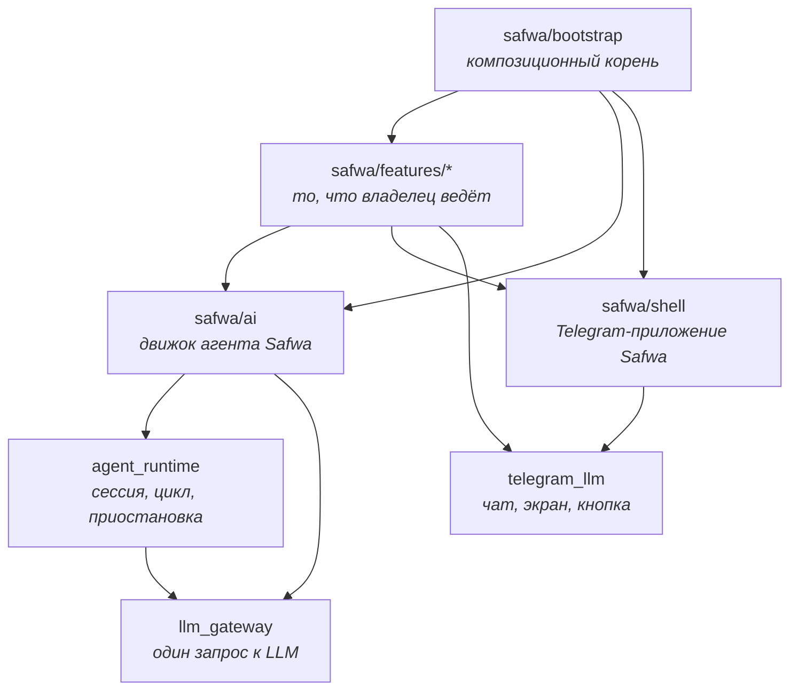
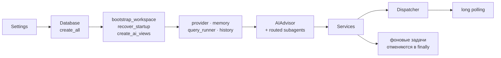

# Архитектура: четыре пространства имён

`src/` держит четыре пакета. Три из них не импортируют Safwa вовсе и проверяются на это
правилом F: их можно взять в другой проект.

**Стрелка вниз — «импортирует».** Обратных стрелок нет ни одной, и это проверяется:

| Правило | Что запрещает |
|---|---|
| F | модуль трёх верхних пакетов импортирует `safwa` |
| M | модуль `safwa/ai/` импортирует `safwa/features/` |
| E | модуль фичи открывает дверь выше своего слоя |
| H | модуль вне фичи перечисляет имена сущностей |

## Кто есть кто

**`llm_gateway`** — обращение к модели не имеет состояния, это одноразовый эффект. Отсюда крошечный
контракт: `complete(request) -> turn`, нейтральные сообщения, сырой `arguments_json`, и адаптер, в
котором остаются SDK, URL и ключ.

**`agent_runtime`** — сессия, которая может остановиться на человеке и быть продолженной. Он не знает
ни что делает инструмент, ни что такое предложение: приостановка отдаёт наружу непрозрачный
`InteractionRef`, и возобновление приходит с ним же.

**`telegram_llm`** — чат бота и человека: каждое исходящее сообщение отправляется зарегистрированным
и помеченным, кнопка одноразовая, экран заменяется или снимается. Что значит каждый вид сообщения,
хост говорит один раз в `ChatVocabulary`.

**`safwa/ai`** — движок агента Safwa: контракты инструментов, порт инструментов, `query_safwa` над
`ai_*` вьюхами, запись сессии в `agent_runs`. Ни одной фичи не знает.

**`safwa/shell`** — Telegram-приложение Safwa: контейнер, роутер, глаголы чата, редактор, три
собственные команды и единственный диспетчер, через который проходит каждая inline-кнопка.

**`safwa/features/*`** — двенадцать пакетов в `MODULES`, каждый со своими правилами в
`tests/brd/`. Плюс два, которых в реестре нет: `advisor` — корневая сессия, которую собирает
композиционный корень, и `heavy_analyzer` — helper, который предлагает не ростер, а результат
инструмента.

## Сборка

Всё это в [bootstrap/main.py](../../src/safwa/bootstrap/main.py). Какие фичи существуют, знает
[bootstrap/modules.py](../../src/safwa/bootstrap/modules.py) — и больше никто.
