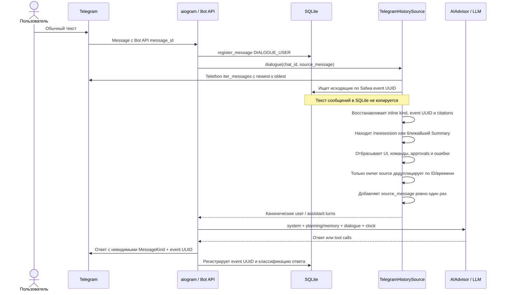
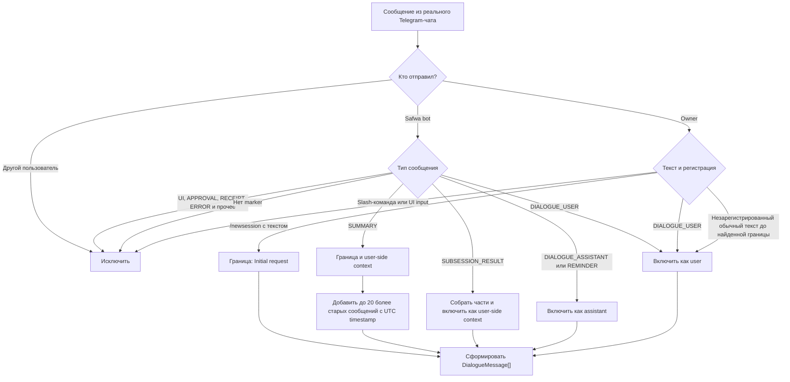
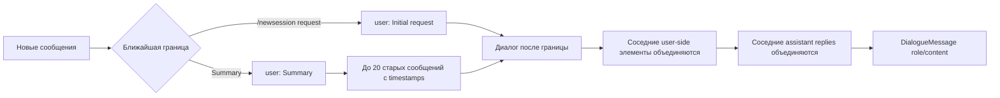

# История Telegram и история для LLM

## Два разных представления

Полная переписка физически живёт в приватном чате Telegram. SQLite не хранит текст persona-диалога:
таблица `telegram_messages` содержит идентификаторы, направление, `MessageKind` и связь с объектом.
Перед каждым обычным запросом Safwa заново читает чат через Telethon и строит отфильтрованный список
`DialogueMessage` для LLM.

У каждого исходящего сообщения в Telegram-тексте есть невидимые `MessageKind` и immutable event UUID.
Тот же UUID хранится в SQLite, поэтому изменение видимого текста не ломает связь, а временная эвристика
для исходящих сообщений не нужна. SQLite — восстанавливаемый индекс: marker остаётся авторитетным.

## Что попадает в контекст

В контекст допускаются только:

- `DIALOGUE_USER`, `DIALOGUE_ASSISTANT`, `REMINDER`;
- границы `SESSION_START` и `SUMMARY`;
- итог завершённой ветки `SUBSESSION_RESULT`.

Команды, callback-действия, dashboards, редакторы, prompts для ввода поля, proposals, receipts,
SQL/tool payloads, ошибки и PNG ретроспективы исключаются. Все slash-команды удаляются из чата,
кроме `/newsession`, потому что она должна остаться видимой границей.

## Граница и сбор turns

Без видимой границы advisor и `/syncmem` завершаются с `HistoryBoundaryMissing`. Текущее сообщение
пользователя передаётся как `source_message`: если Telethon-регистрация уже сопоставлена, дубликат не
добавляется; иначе оно дописывается в конец. Узкая ID/time-корреляция остаётся только здесь, потому что
бот не может встроить marker в сообщение owner. Немаркированные bot-сообщения не считаются диалогом:
версия 1 не поддерживает legacy fallback.

Код: [history.py](../../src/safwa/history.py),
[dialogue.py](../../src/safwa/telegram/dialogue.py),
[_messaging.py](../../src/safwa/telegram/_messaging.py),
[models.py](../../src/safwa/models.py).
