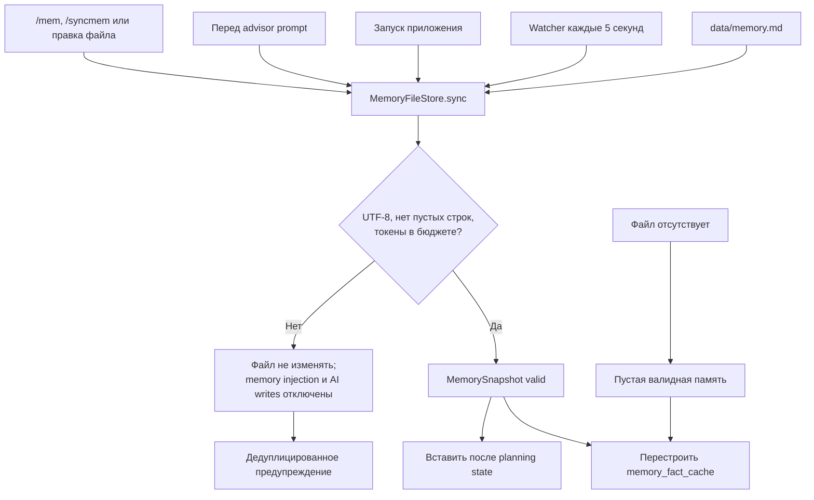
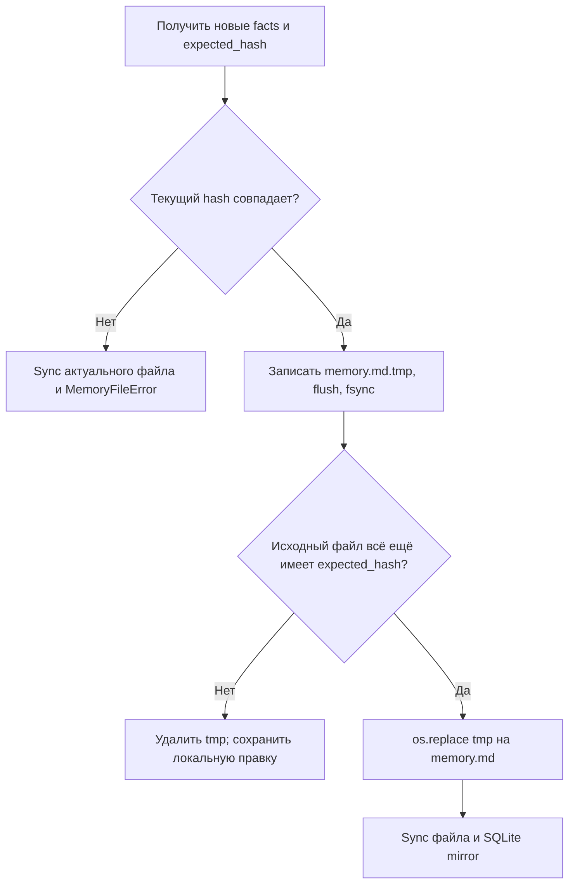

# Память `memory.md`

`data/memory.md` — авторитетная долговременная persona-память. Формат: UTF-8, одна непустая
устойчивая мысль на строку, общий лимит около 4000 токенов. `memory_fact_cache` в SQLite — только
перестраиваемое зеркало.

## Чтение, ручные изменения и prompt



Приоритет в prompt: явные настройки профиля и активные Values выше, чем выводы из `memory.md`.

## Автоматическая синхронизация из диалога

```mermaid
sequenceDiagram
    participant C as Команда или daily loop
    participant G as GenerationGuard
    participant H as TelegramHistorySource
    participant M as PersonaContinuity
    participant L as LLM
    participant F as memory.md
    participant DB as SQLite

    C->>G: Получить background lease
    alt Safwa занята
        G-->>C: Пропустить до следующей проверки
    else Свободна
        C->>M: maintain_memory(chat_id)
        M->>F: sync и сохранить expected_hash
        M->>DB: Прочитать processed_message_id
        M->>H: recent(require_boundary=true)
        H-->>M: Только новые канонические сообщения
        M->>M: Разбить примерно по 2K токенов с overlap
        loop Для каждого chunk
            M->>L: RETELL_PROMPT + chunk
            L-->>M: Компактный retelling
            M->>L: MEMORY_PROMPT + текущие facts + retelling
            L-->>M: JSON facts
            alt JSON и schema валидны, lease актуален
                M->>M: Принять новый список facts
            else Ответ невалиден или lease отменён
                Note over M,DB: Остановить run; cursor не продвигается
            end
        end
        M->>F: replace_facts(facts, expected_hash)
        alt Hash не изменился
            F-->>M: Atomic replace выполнен
            M->>DB: Обновить processed_message_id и file_hash
        else Было локальное изменение
            F-->>M: MemoryFileError; локальная версия сохранена
            Note over M,DB: processed_message_id не продвигается
        end
    end
```

`/syncmem` запускает этот поток вручную. Плановый поток включается через `/setmemtime HH:MM`,
проверяется раз в минуту и выполняется не чаще одного успешного раза за локальный календарный день.
Пятисекундный watcher не вызывает LLM: он только импортирует локальные изменения файла.

## Атомарная запись



Изменение маркера `processed_message_id` происходит только после успешной атомарной записи. Это
гарантирует повторную обработку диалога после сбоя и не позволяет AI затереть более свежую ручную
правку.

Код: [memory.py](../../src/safwa/memory.py),
[continuity.py](../../src/safwa/continuity.py),
[commands.py](../../src/safwa/telegram/commands.py),
[main.py](../../src/safwa/main.py).
