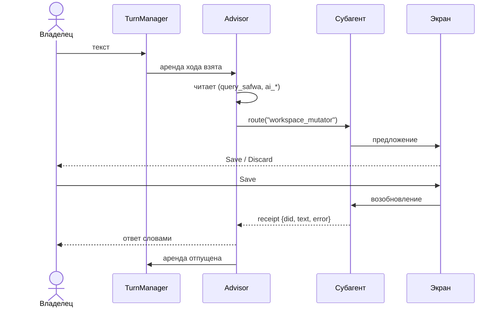
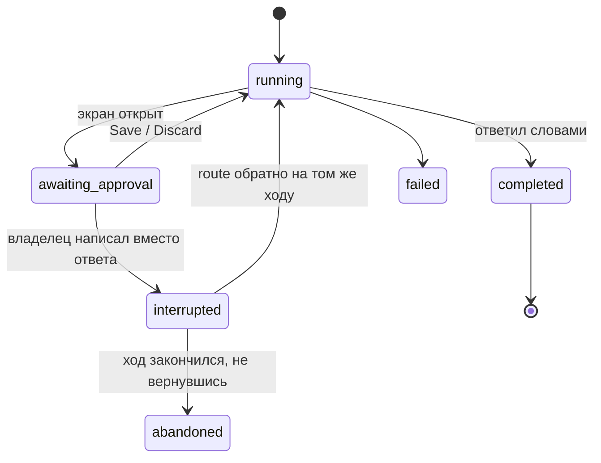

# Один ход

Ход начинается с текста владельца и заканчивается тем, что Advisor ответил словами. Всё, что
между, — сессии.

**Пишет в чат только Advisor.** Субагент рисует экран и возвращает receipt; ход заканчивается,
когда ответил Advisor. Поэтому запрос про две области — это два `route` и одно сообщение.

## Аренда хода

`TurnManager` — единственная аренда переднего плана. Пока ответ пишется:

- одно сообщение владельца остаётся в чате, с нажимаемым `/cancel`;
- всё остальное, что он присылает, убирается из чата и не считается сказанным;
- callback-и отклоняются;
- фоновая работа перед публикацией сверяет ревизию.

## Сессия — это строка `agent_runs`

`state_json` несёт диалог, транскрипт, бюджет и receipt-ы, поэтому приостановленный ход
продолжается со своей записи, а не с экрана, который его приостановил. Обе половины ссылки стерегут
возобновление: `claimed_at` останавливает два одновременных, токен — второй ответ на один экран.

`parent_run_id` — кто сюда сроутил. Экран приостанавливает всю цепочку: Save продолжает субагента,
его receipt продолжает вызвавшего, и так до сессии без родителя.

## route и call_helper — разные вещи

| | `route` | `call_helper` |
|---|---|---|
| что делает | отдаёт ход субагенту, который **пишет** | спрашивает того, кто только **читает** |
| экран | может открыть | не может |
| ход вызвавшего | приостанавливается | остаётся у него |
| в наборе инструментов | по ростеру | только там, где его предложил результат |

Единственный helper — `heavy_analyzer`. Он заканчивает тем, что передаёт своё последнее чтение,
а не пересказывает его.
