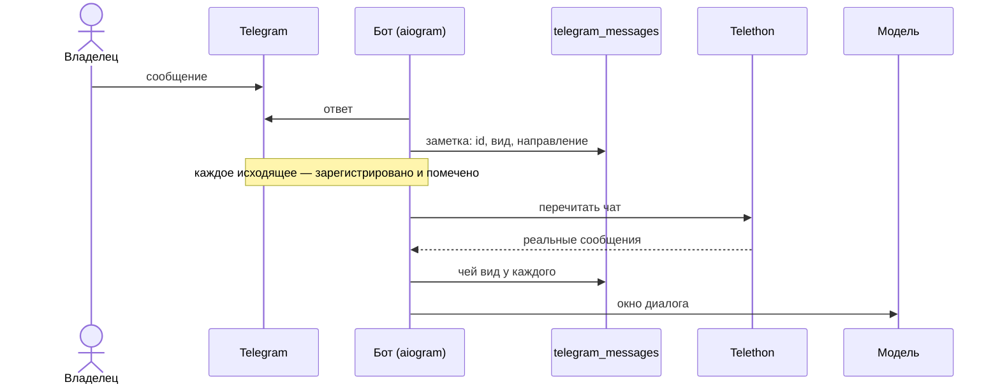
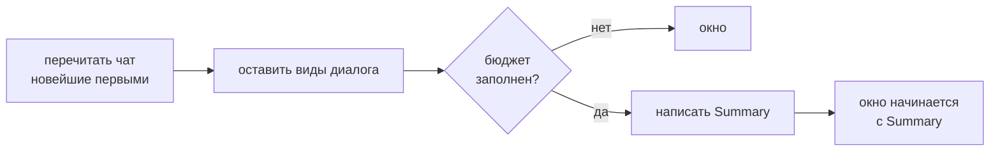

# Чат как хранилище диалога

Переписка физически живёт в приватном чате Telegram. SQLite текста персоны не хранит:
`telegram_messages` держит идентификаторы, направление, `MessageKind` и связь с объектом.

## Что становится диалогом

Диалогом становятся только `dialogue_user`, `dialogue_assistant`, `cue` и `summary`. Экраны,
квитанции, ошибки и статусы исключены **своим видом** — не фильтром по тексту.

Отсюда два следствия, которые легко нарушить:

- **Незарегистрированное или неверно помеченное сообщение** — тихая ошибка на недели вперёд.
  Незарегистрированное невидимо для модели, неверно помеченное течёт UI-шумом в историю.
- **Слова, которые не дошли в чат как текст владельца** — расшифровка голоса, слитая очередь —
  постятся обратно сообщением бота с видом владельца. Иначе Advisor их не увидит.

Текст владельца, который остался в чате, **и есть** диалог: команды и введённые значения удаляются,
поэтому выживание — это и есть доказательство.

## Окно — это бюджет токенов

Не количество сообщений, а бюджет. Summary пишется ровно тогда, когда бюджет заполнен, и
следующее окно начинается с него: Summary — единственный вид, который заканчивает окно и стоит
вместо всего, что было раньше.

Само окно — [`telegram_llm`](../../src/telegram_llm/window.py). Что значат виды Safwa — 
[`adapters/telegram_history.py`](../../src/safwa/adapters/telegram_history.py), один раз, в
`ChatVocabulary`.
