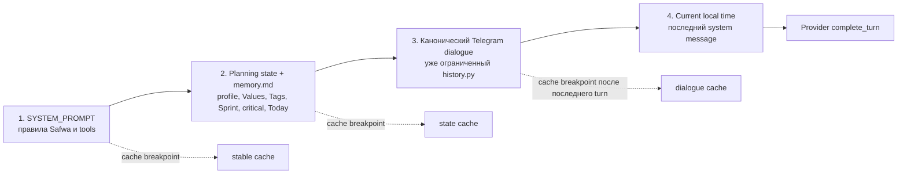
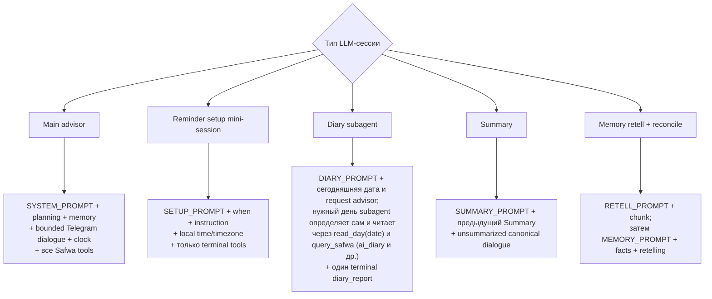

# Контексты LLM и окно истории

«Сессия» здесь означает отдельный вызов LLM со своим узким prompt: main advisor, reminder
mini-session, subagent, summary или memory maintenance. Видимых Telegram-веток нет: окно диалога ограничено
token budget, ближайшим Summary и самой старой регистрацией.

## Main advisor context

Сообщения всегда расположены от наиболее стабильных к наиболее изменчивым. Часы находятся после
диалога, чтобы не разрушать кэшируемый prefix.

`planning_context` содержит режим workspace, About Me, инструкции advisor, активные Values,
доступные Tags, текущий Sprint с его Success criteria (или сообщение о Planning), до десяти critical
Cards и — только при запущенном Sprint — Actions в Today. Каждый элемент записан как citation
`[name](kind:id)`. Остальные данные, кандидаты и метрики модель читает через `query_safwa`.

## Какие данные получает каждый LLM-вызов

Reminder escalation использует тот же main advisor и тот же `history.dialogue(owner_id)`, что обычный
запрос. Сначала `history.py` ограничивает окно, затем synthetic
текст сработавших Reminders добавляется последним user turn. Поэтому модель получает обычный
system/planning/memory/dialogue/clock context и все Safwa tools.

Если Reminder упоминает Safwa item, synthetic turn просит main advisor сначала проверить его через
`query_safwa`; отдельной relevance-сессии нет.

Mini-sessions не создают proposals и approval queue. Они обязаны завершиться валидным terminal tool
call; проза, неизвестный tool и невалидные аргументы возвращаются модели как retryable ошибка.
Reminder setup не пишет `AgentRun`; subagent пишет свой собственный и ограничен wall-clock deadline
вместо cap на число вызовов.

Код: [context.py](../../src/safwa/ai/context.py),
[service.py](../../src/safwa/ai/service.py),
[mini.py](../../src/safwa/ai/mini.py),
[subagents.py](../../src/safwa/ai/subagents.py),
[diary.py](../../src/safwa/ai/diary.py),
[reminder_sessions.py](../../src/safwa/ai/reminder_sessions.py),
[history.py](../../src/safwa/history.py),
[continuity.py](../../src/safwa/continuity.py).
