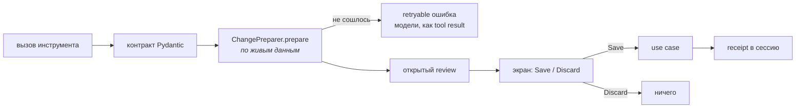
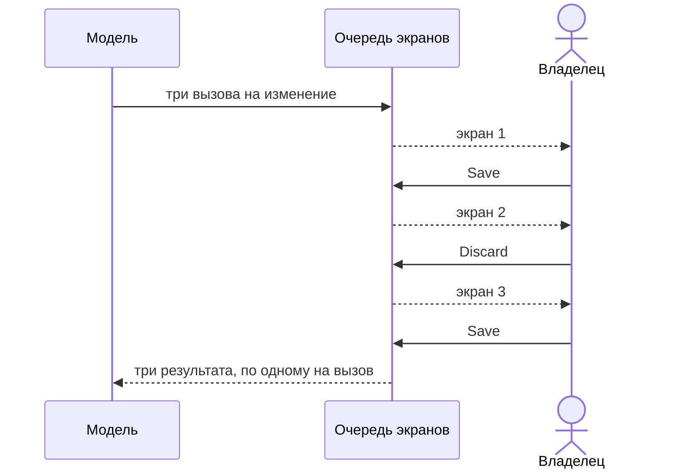

# Предложения

Модель никогда не меняет данные и никогда не пишет SQL на изменение. Вызов инструмента становится
предложением, предложение — экраном, а Save зовёт **те же** use cases, что и ручной интерфейс.

**Экран предложения — ровно Save/Discard.** Экран, которому нужен элемент ввода, — неверный экран.

Review — это состояние процесса, а не строка в базе: его держит `ProposalStore`, и перезапуск
заканчивает каждый.

## Кто чем владеет

| | что |
|---|---|
| **субагент** | владеет вызовами на изменение своей области; Advisor не держит ни одного |
| **`ai/contracts.py`** | как выглядит вызов: `MutationToolSpec`, `AgentChange` |
| **`features/proposals/`** | подготовка, review, экран, разрешение |
| **`features/<x>/proposal.py`** | что этот вызов значит для этой сущности |

Advisor не держит инструментов изменения вообще. `board` предлагает всё, что относится к доске —
Карточки, Проверки, Ценности, Теги, Запросы, Напоминания, — а `diary` владеет Дневником.
Подготовка выполняется там, где изменение придумано.

## Несколько изменений за один ход

Модель продолжает только после последнего. Всё, что ей нужно знать через одобрение, приходит
**результатом инструмента**, а не квитанцией в чате.

Нельзя смешивать немедленный инструмент и инструменты изменения в одном ответе провайдера:
runtime отклоняет изменения, и модель повторяет их, увидев прочитанное.

## Слова поверх экрана

Если владелец вместо кнопки пишет, каждое ожидающее предложение этой пачки отклоняется, и слова
**продолжают тот ход, который открыл экран**, а не начинают второй. Субагент получает: что было
предложено, что отклонено, что уже сохранено, и сами слова.

Экран — не то, к чему возвращаются: UI-сообщение всегда последнее в чате и никогда не поднимается
обратно, поэтому что угодно, сделанное ниже, его прерывает. Прерванный субагент остаётся
**незаконченным**, и `route` обратно на том же ходу продолжает его с его собственным планом —
именно это делает «то же самое, но с большой буквы» поправкой, а не переписыванием.

## Автоодобрение

Автоодобрение решает только, показывать ли экран. Оно не обходит сохранение предложения, и любое
сомнение или сбой оставляют экран нетронутым.

## Цитаты вместо предложений

Когда решение за владельцем, модель **цитирует** объект в своей прозе, а не предлагает изменение.
Ссылка собирается на стороне хоста из проверенного id, никогда из текста модели, и исчезнувший
объект сохраняет свои слова и теряет ссылку.
