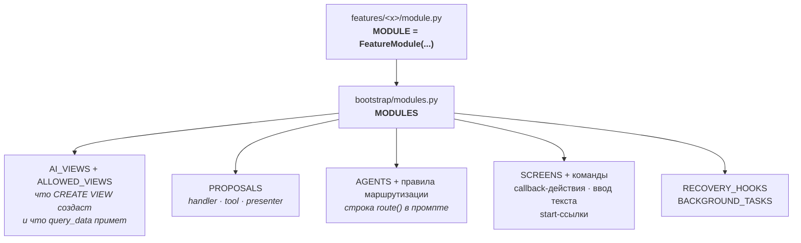
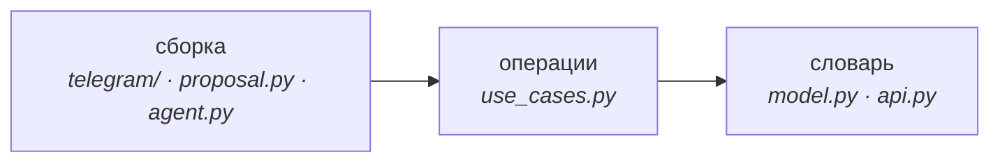

# Как подключается фича

Добавить фичу — это пакет под `features/` плюс одна строка в `MODULES`. Всё остальное выводится.



Один реестр вместо девяти. Что ни одна другая точка не перечисляет имена сущностей, стережёт
правило H.

## Из чего состоит пакет

Это **меню, а не каркас**. Пустые файлы не создаются.

```text
features/<x>/
  module.py      MODULE — единственное, что видит реестр
  api.py         словарь и чтения, которым не нужна операция
  model.py       таблицы и enum-ы этой фичи
  use_cases.py   операции
  references.py  ReferenceSpec на каждую именованную связь
  views.py       SqlView для ai_*
  proposal.py    ProposalHandler
  agent.py       AgentSpec и/или MutationToolSpec
  reducer.py     reduce(state, action), когда у фичи есть процесс
  telegram/      экраны и обработчики
```

`features/workspace_mutator/` — это `agent.py`, `module.py` и `state.py`: субагент рабочего пространства и его состояние,
и больше ничего. `features/advisor/` — промпт и вьюхи корневой сессии, и `MODULE` он не объявляет; сама сессия
в [`tg_agent_shell/session.py`](../../src/tg_agent_shell/session.py).

## Три слоя, и дверь открывается не выше своего



`api` открывает кто угодно, `use_cases` — слой операций и выше, `telegram` — только сборка. Отсюда
следует, что дверь может содержать: словарь и чтения, но никогда саму операцию. Дверь, которая
импортирует то, что построено поверх неё, тянет за собой всю фичу, а две такие двери друг напротив
друга — это цикл импортов.

Это правило E, и оно читает ноль.

## Вьюхи пересоздаются на каждом старте

`SqlView` фичи — единственный источник и для `CREATE VIEW`, и для списка разрешённых.
Форма вьюхи меняется в `views.py` владеющей фичи, никогда миграцией. `SqlView` несёт и свой `doc`,
поэтому блок, который читает модель, лежит рядом с SELECT.

**Список вьюх в промпте — это то, что ограничивает читателя**: агент называет вьюхи, которые
читает, композиционный корень подставляет их в `{views}`, и вьюха, которой нет ни в одном списке, —
та, о существовании которой читатель никогда не узнает.

Подробности — [docs/FEATURE_MODULES.md](../FEATURE_MODULES.md).
