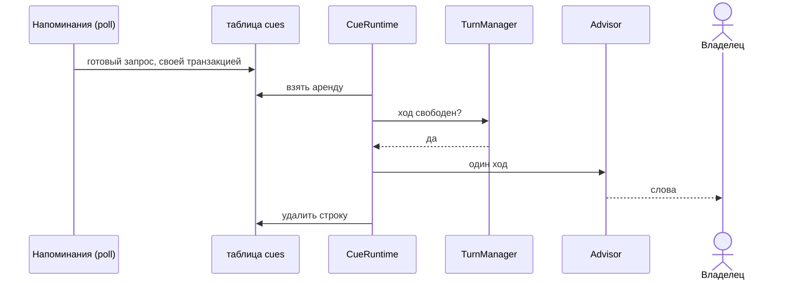
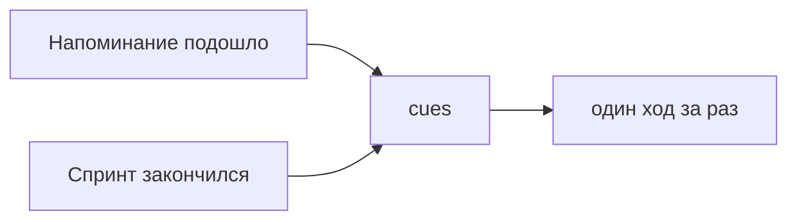

# Cue: Safwa говорит первой

Safwa заговаривает сама только потому, что для неё написали **Cue** — Напоминание, которое подошло,
Спринт, который закончился. Больше ни от чего.

**Строка удаляется только после того, как у владельца есть слова.** Пока она есть, Safwa должна
сказать — перезапуск посреди хода ничего не теряет.

## Почему производитель пишет готовый запрос

Строка в `cues` несёт текст запроса целиком, а не ссылку на то, из чего его собрать. Поэтому:

- **арифметика расписания остаётся у Напоминаний** — poll считает, что подошло, и пишет строку;
- **`CueRuntime` владеет воротами, арендой и одним ходом** — и ничего не знает про Напоминания;
- **`cues` — единственная запись того, что Safwa ещё должна сказать**, и говорится по одному.

Текст Cue приходит Advisor-у как обычный запрос от системы, и он отвечает на него ровно так же, как
ответил бы владельцу. Когда сработавшее Напоминание упоминает объекты Safwa, он сперва проверяет
через `query_data`, в каком они состоянии и применимо ли Напоминание ещё.

Само сообщение попадает в чат с видом `cue` — то есть **становится диалогом**, в отличие от экранов
и квитанций. Advisor на следующем ходу видит, что он сказал первым.
