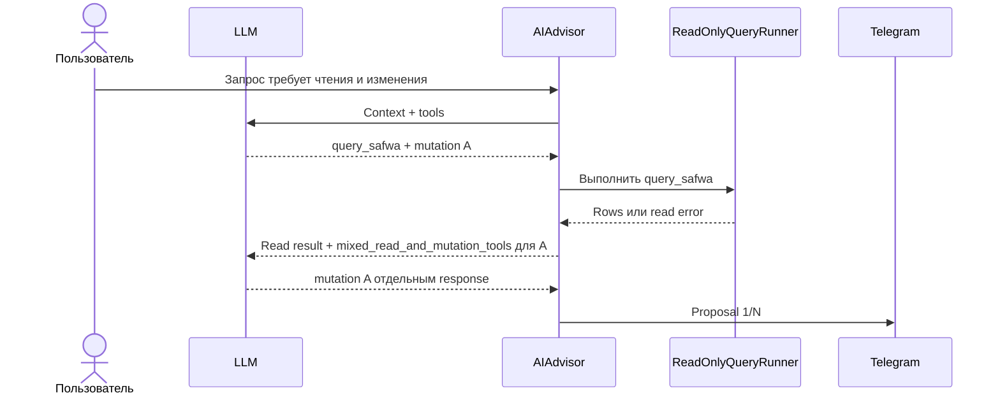
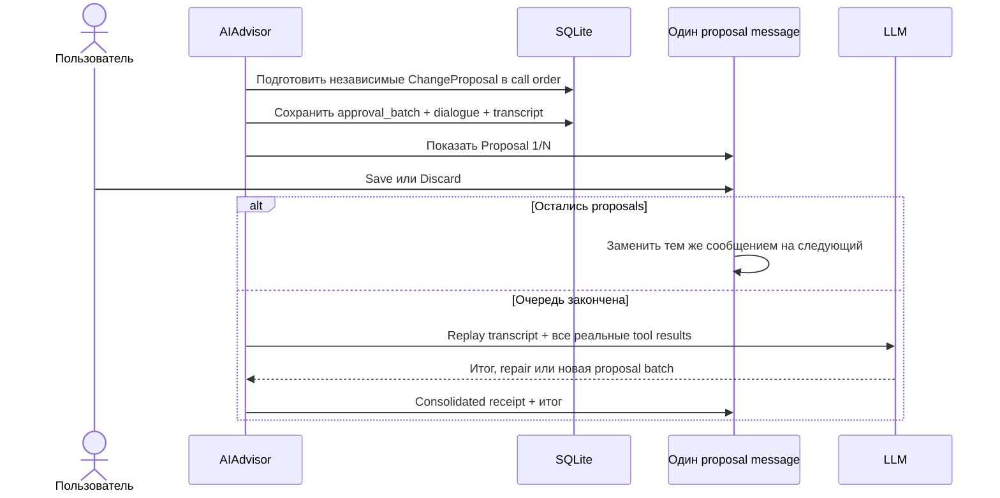
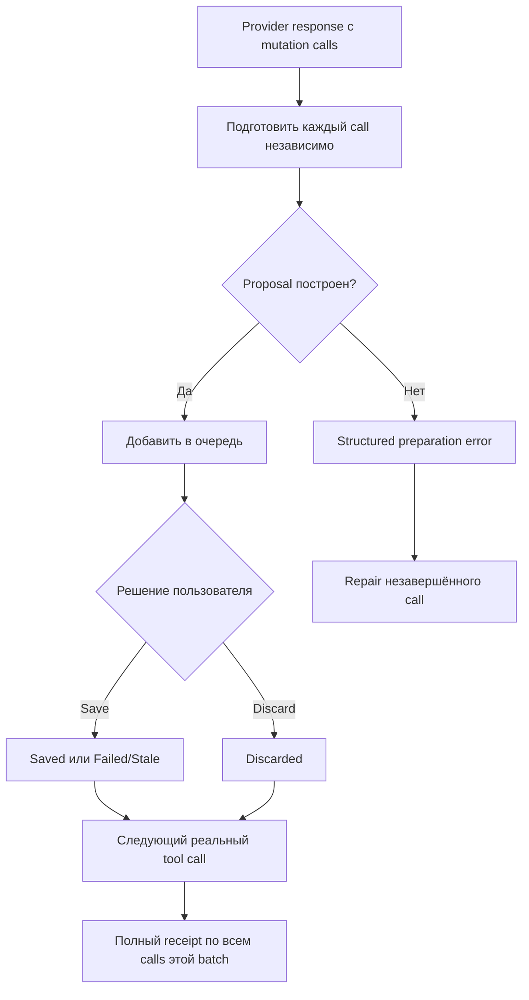

# Proposals и tool calls

LLM никогда не применяет mutation напрямую. `query_safwa` и `route` — immediate tools;
`card`, `check`, `value`, `tag`, `request`, `reminder`, `remove` и `diary` создают
reviewable proposals с явным Save/Discard.

`route(name)` передаёт ход сабагенту: дальше его проза становится сообщением в чате, а его change —
экраном. `diary` доступен только Diary subagent и несёт `mode`, `date`, `pov`, `ai_comment` и
`feeling_score`. Существует ли уже запись за этот день, решает preparation по `ai_diary`, а не
модель: `write` становится create или update, а `remove` над пустым днём отклоняется retryable-ошибкой.

Текст дня остаётся на review screen: receipt Diary-change несёт дату, score и длину, но не сам день —
receipt живёт в переписке и перечитывался бы каждый следующий turn. Черновик держит сама сессия
сабагента, поэтому Approve, Discard и слова поверх экрана возвращаются именно в неё.

## Read перед mutation

Mutation разрешена только когда все нужные данные уже известны модели. Если один provider response
содержит immediate tool и mutation tools, Safwa выполняет reads, но отклоняет **только mutations** этого
response короткой retryable-ошибкой. Следующий provider response уже видит read results и повторяет
нужные mutations отдельно.

`tool_call_id` остаётся внутренним opaque идентификатором provider-протокола. Модель не должна
создавать, преобразовывать или объяснять его. Для версии 1 отдельные `ApprovalBatch`/`ApprovalItem`
таблицы не нужны: persisted `approval_batch` и regression-тесты покрывают переходы без новой схемы.

## Очередь proposals

Каждый mutation call — отдельная атомарная транзакция. Валидные siblings не откатываются из-за
ошибки другого proposal. При Save `ProposalService.apply` заново проверяет version/domain invariants и
использует те же функции `domain.py`, что ручной UI.

## Результаты и частичное решение

Если batch содержит три proposals, первый сохранён, а вместо решения следующих пользователь пишет
новое обычное сообщение, старый экран заменяется статическим результатом:

- первый call — `Saved`;
- второй и третий calls — `Discarded`;
- операция, для которой LLM вообще не прислал tool call, в receipt не появляется.

Это важно: receipt описывает фактически полученные calls, а не весь исходный текстовый замысел. Новый
диалог начинается отдельно; уже сохранённое не откатывается.

## Ошибки

| Сценарий | Поведение |
|---|---|
| Только `query_safwa` | Выполнить read и сразу вернуть result модели |
| Read + mutation в одном response | Read выполнить; mutation отклонить с `mixed_read_and_mutation_tools`; модель повторяет её следующим response |
| Одна mutation невалидна, siblings валидны | Показать валидные siblings; ошибочную вернуть модели для repair |
| Все mutations невалидны | Не создавать UI; начать repair round |
| Save получил `DomainError`/stale state | Отметить item Failed/Stale и продолжить очередь |
| Неожиданная callback-ошибка | Оставить текущий proposal pending; разрешить retry/Discard |
| Continuation LLM упал | Сохранить уже принятые решения и показать receipt с warning |

Лимиты repair и tool calls не откатывают уже применённые решения. Model continuation получает
persisted dialogue/transcript batch; production approval path не перечитывает Telegram.

Код: [context.py](../../src/safwa/ai/context.py),
[service.py](../../src/safwa/ai/service.py),
[contracts.py](../../src/safwa/ai/contracts.py),
[proposals.py](../../src/safwa/telegram/proposals.py),
[_messaging.py](../../src/safwa/telegram/_messaging.py),
[domain.py](../../src/safwa/domain.py).
