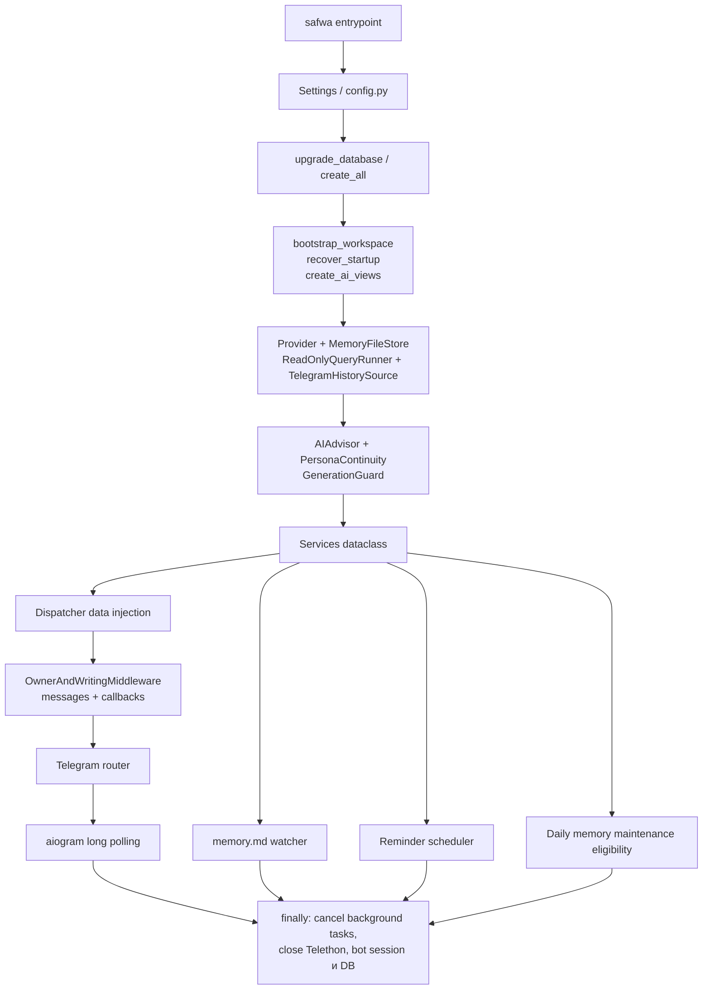
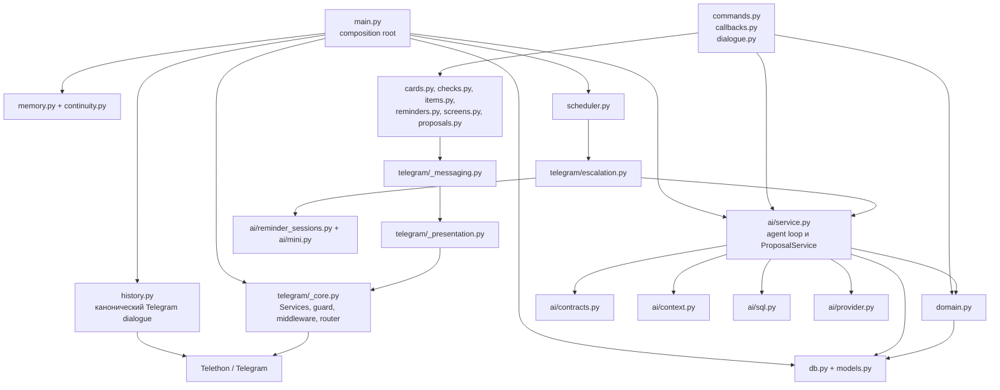
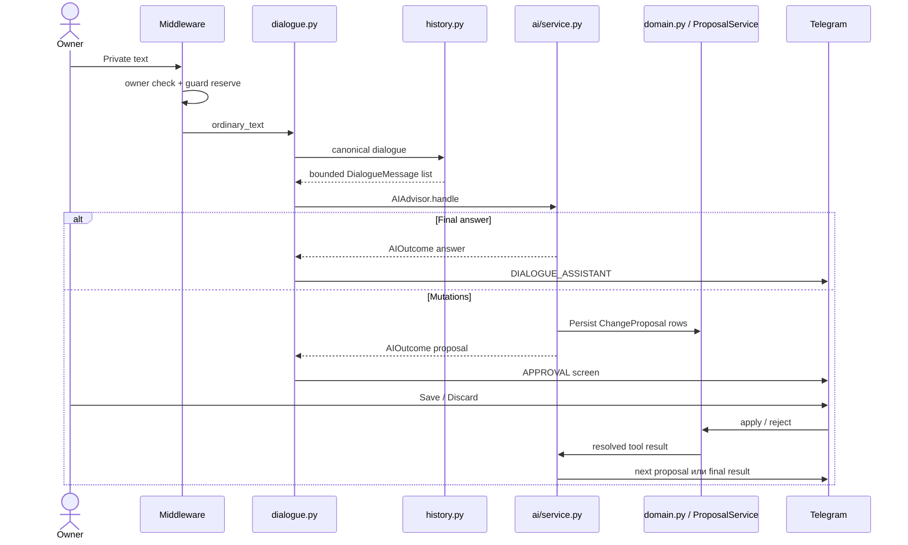

# Архитектура проекта

Safwa — single-owner Telegram-бот на aiogram 3 с OpenAI-compatible LLM и async SQLite/SQLAlchemy.
Приложение работает long polling локально на Windows. Центральная композиция зависимостей находится
в `main.py`.

## Запуск и runtime wiring

`Services` передаёт handlers только нужные live-зависимости: session factory, advisor, history,
memory, continuity, owner ID и guard. Доменный слой не знает об aiogram или Telegram.

## Основные зависимости

Стрелка означает «импортирует или вызывает». Внутри `telegram` зависимости идут от handlers к
rendering/messaging/core; `_presentation.py` остаётся чистым форматированием без bot/session.
`telegram/__init__.py` явно импортирует `commands`, `callbacks` и `dialogue`, потому что именно импорт
регистрирует их `@router` handlers.

## Ответственность файлов

### Корень `src/safwa`

| Файл | Ответственность |
|---|---|
| `main.py` | Composition root, запуск/остановка polling и background tasks |
| `config.py` | `SAFWA_` settings и проверка конфигурации |
| `constants.py` | Все лимиты, интервалы, бюджеты и tuning defaults; не импортирует Safwa |
| `db.py` | Async engine/session factory, SQLite PRAGMA и `create_all` |
| `models.py` | Единственный источник SQLAlchemy schema |
| `enums.py` | Доменные `StrEnum`; в БД хранятся строковые `.value` |
| `domain.py` | Инварианты и все реальные mutations; общий слой для UI и proposals |
| `history.py` | Чтение/фильтрация Telegram через Telethon, границы и `MessageKind` |
| `memory.py` | Авторитетный `memory.md`, validation, mirror и atomic writes |
| `continuity.py` | Summary, `/syncmem`-эквивалент и daily memory maintenance |
| `reminders.py` | Чистый parsing/расчёт/описание расписаний |
| `scheduler.py` | Poll due Reminders, schedule preparation и delivery/settle ordering |
| `saved_requests.py` | Нормализация и правила сохранённых read-only запросов |
| `analytics.py` | Данные и PNG ретроспективы |
| `recovery.py` | Восстановление interrupted runs, UI, tokens, proposals и schedules при старте |
| `backup.py` | Backup/restore SQLite и `memory.md` |
| `qa.py` | Изолированная live Telegram QA-конфигурация |

### Пакет `ai`

| Файл | Ответственность |
|---|---|
| `context.py` | `SYSTEM_PROMPT`, planning state, clock и `DialogueMessage` |
| `contracts.py` | Pydantic tool schemas и преобразование tool call в `AgentChange` |
| `provider.py` | OpenAI-compatible transport, retries и чтение provider turns |
| `service.py` | Main agent loop, immediate reads, proposal batches, resume и apply |
| `sql.py` | Read-only `query_safwa` и allowlist AI views |
| `mini.py` | Узкие LLM-сессии, завершаемые одним terminal tool call |
| `reminder_sessions.py` | Setup mini-session для расписаний Reminders |

### Пакет `telegram`

| Файл | Ответственность |
|---|---|
| `_core.py` | `Services`, router, guard, owner/private middleware, callback context |
| `_presentation.py` | Чистые labels, HTML/markup helpers и pagination |
| `_messaging.py` | Все send/edit/delete, регистрация `MessageKind`, callback tokens, закрытие старого UI |
| `commands.py` | Slash-command handlers и lifecycle subsession |
| `callbacks.py` | Единственный callback-token dispatcher и action handlers |
| `dialogue.py` | Обычный текст, UI text inputs и основной advisor turn |
| `cards.py` | Card editor, creation draft, selectors и dashboards |
| `checks.py` | Check screens и ответы пользователя |
| `items.py` | Общие Tag/Value/Request item screens |
| `reminders.py` | `/reminders` list/detail, text edit и delete confirmation |
| `screens.py` | Открытие citations и связанная item-навигация |
| `proposals.py` | Read-only proposal rendering и продолжение agent approval |
| `escalation.py` | Связка scheduler с bot, guard, bounded history и main advisor |
| `__init__.py` | Регистрация handler modules и публичная поверхность пакета |

## Сквозной путь обычного сообщения

Schema меняется только через `models.py`; startup `create_all` создаёт отсутствующее, но не меняет
существующие столбцы. До первого выпуска миграций Alembic нет: изменение schema требует backup и
пересоздания базы. Поддержка миграций начинается после v1.

См. также [ARCHITECTURE.md](../ARCHITECTURE.md) и
[STRUCTURE_GRAPH.md](../STRUCTURE_GRAPH.md).
