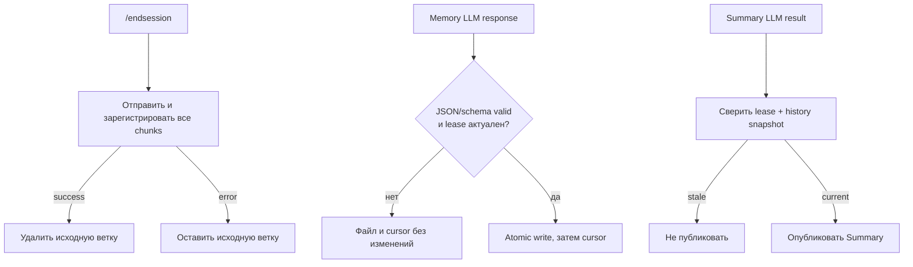

# Решения по найденным странностям

Снимок после стабилизации 14 августа 2026 года. Здесь зафиксированы решения по S-01—S-14, чтобы
предыдущие рекомендации не воспринимались как ещё актуальные дефекты. Для первой версии выбраны
минимальные изменения без новых state-machine таблиц, migration runner и legacy-веток.

| ID | Статус | Принятое решение |
|---|---|---|
| S-01 | Исправлено | `/endsession` сначала полностью отправляет и регистрирует result chunks, только затем удаляет source range |
| S-02 | Исправлено | Невалидный memory JSON останавливает run; файл и cursor не меняются |
| S-03 | Исправлено | Summary проверяет lease и повторно сверяет history snapshot перед публикацией |
| S-04 | Исправлено | Summary, memory и reminder используют background lease общего `GenerationGuard` |
| S-05 | Исправлено | Новые тексты удаляются, показываются как queued placeholders, затем восстанавливаются одним owner turn |
| S-06 | Исправлено | В mixed read/mutation response reads выполняются, mutations получают retryable error и повторяются отдельно |
| S-07 | Подтверждено | Receipt показывает Saved/Discarded/Failed для каждого фактически пришедшего mutation call |
| S-08 | Упрощено | `tool_call_id` остаётся внутренним opaque ID; новая approval schema для v1 не добавляется |
| S-09 | Упрощено | Relevance preflight удалён; Reminder берёт lease перед main advisor и отбрасывает результат после owner event |
| S-10 | Принято | Pending proposal при новом тексте заменяется статическим Discarded-result; reminder delivery имеет notify-only семантику |
| S-11 | Исправлено | Исходящие сообщения несут immutable event UUID + `MessageKind`; text hash и legacy fallback не используются |
| S-12 | Исправлено | `/forget` удалён; удаление и редактирование памяти делается только через `memory.md` |
| S-13 | Осознанная политика | До первого выпуска поддерживаются только fresh databases; миграции начнутся после v1 |
| S-14 | Исправлено | Production approval resume использует persisted dialogue/transcript и не перечитывает Telegram |

## Потеря данных и stale results: S-01—S-05



Для очереди owner input используется только минимальный in-memory список текущего процесса. Каждый
ввод сразу исчезает как owner message и заменяется:

```text
Generating response... /cancel for cancelling.
Queued: <text>
```

После текущего ответа placeholders удаляются. Один или несколько запросов отправляются ботом как
`Name Surname:` с разделителем `----`, классифицируются `DIALOGUE_USER` и становятся следующим turn.
При ошибке, `/cancel` или `/newsession` queued text восстанавливается, поэтому destructive delete не
становится потерей данных.

## Tool protocol и receipts: S-06—S-08

```mermaid
sequenceDiagram
    participant L as LLM
    participant A as Agent loop
    participant U as Пользователь
    L->>A: query_safwa + mutations
    A->>A: Выполнить reads
    A-->>L: Read results + retryable errors mutations
    L->>A: Mutations отдельным response
    A->>U: Proposal 1, 2, 3
    U->>A: Save 1, затем обычный текст
    A-->>U: Saved 1; Discarded 2; Discarded 3
```

Если некоторого действия не было среди tool calls, строки о нём не будет. Это проверяется сценарием с
тремя proposals. Специальный dependency DAG не вводится: поздний proposal при невозможности применить
ссылку завершится Failed, а остальные фактические результаты всё равно видны.

LLM не управляет `tool_call_id`: provider создаёт ID, Safwa только возвращает result на тот же ID.
Нормализация approval state в новые таблицы отложена, потому что в первой версии не даёт продуктовой
выгоды, но увеличивает schema/recovery surface.

## Конкретный stale-snapshot контрпример: S-09

Reminder scheduler получает background lease **до** чтения history и запуска main advisor. Если
пользователь начинает foreground turn, owner event инвалидирует lease. Уже запущенный provider call
может физически завершиться, но его результат не публикуется и Reminder не переводится на следующий
срок: следующий tick повторит его с актуальной историей и planning context.

Отдельный relevance LLM-вызов, terminal verdict и cache удалены. Если Reminder упоминает Safwa item,
main advisor проверяет его через `query_safwa` в том же turn, где решает, что ответить или предложить.
Оставшийся schedule-resolution call внутри proposal preparation не разделён на дополнительный
двухфазный workflow: общий lease уже исключает конкурентного production writer, а новая orchestration
для v1 была бы лишним усложнением.

## History, memory и schema: S-10—S-14

- Pending proposal при новом owner text становится статическим receipt с `Discarded`; уже Saved items
  остаются в том же полном receipt.
- Marker содержит kind и 128-bit event UUID, но не visible-text hash: редактирование текста сохраняет
  identity события.
- Немаркированные bot messages исключаются; legacy-поведение до первого выпуска не поддерживается.
- `/forget` и `MemoryFileStore.forget_line` удалены. `memory.md` остаётся простым line-oriented файлом;
  watcher импортирует ручные изменения.
- Alembic/migrations намеренно отсутствуют до выпуска v1. Схема берётся из `models.py`, существующая
  pre-release DB пересоздаётся после backup.
- Approval batch хранит исходные dialogue/transcript. Telegram history не является fallback в
  production continuation path.

Ключевые regression tests: `tests/test_continuity.py`, `tests/test_history.py`,
`tests/test_telegram_item_ui.py`, `tests/e2e/test_advisor_flow_e2e.py`.
