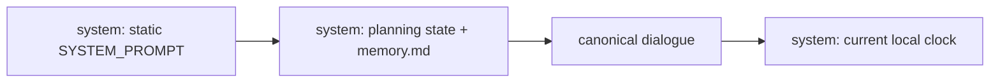
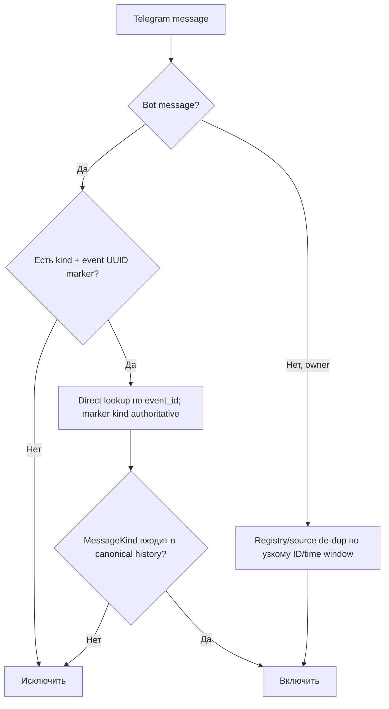

# Несоответствия между `docs/`, `CLAUDE.md` и кодом

Аудит обновлён 14 августа 2026 года после исправлений S-01—S-14. «Spec» описывает желаемое
продуктовое поведение, код и тесты — выполняемое поведение, architecture docs — его устройство.

## Сводка

| ID | Тема | Статус | Результат |
|---|---|---|---|
| D-01 | Форма LLM context | Исправлено | Все основные docs описывают static system → planning+memory → dialogue → trailing clock |
| D-02 | Unmarked bot message | Исправлено | В коде и docs оно исключается; provisional/legacy fallback удалён |
| D-03 | Bot API/Telethon correlation | Исправлено | Outgoing использует event UUID; ID/time эвристика осталась только для owner source de-duplication |
| D-04 | Список mutation tools | Исправлено | `reminder` добавлен в architecture, product spec и unknown-tool hint |
| D-05 | LoC-метрики | Исправлено | Нестабильные size snapshots удалены из `CLAUDE.md` и `STRUCTURE_GRAPH.md` |
| D-06 | Line-number navigation | Исправлено | Structure graph использует file links + symbol names, без line anchors |
| D-07 | Дублирующий `.tmp` graph | Исправлено | Tracked temp удалён, `docs/*.md.tmp.*` добавлен в `.gitignore` |
| D-08 | Приоритет источников | Исправлено | В `CLAUDE.md` добавлена матрица ролей spec/code/descriptive docs/audit |
| D-09 | Ссылка на аудит | Исправлено | `ARCHITECTURE.md` ссылается на этот файл |
| D-10 | `/forget` | Исправлено | Handler, store method и упоминания в пользовательских docs удалены |
| D-11 | Mixed read/mutation | Исправлено | Prompt, runtime и diagrams описывают один двухфазный контракт |
| D-12 | Memory command name | Исправлено | README теперь указывает реальный `/mem`, а не отсутствующий `/remember` |
| D-13 | Reminder advisor context | Исправлено | Escalation получает тот же bounded Telegram dialogue, что обычный advisor turn |

## Каноническая форма LLM context

До исправления `INITIAL_PLAN.md` и `ARCHITECTURE.md` говорили об одном system message, а код,
`MEMORY_HISTORY_USAGE.md` и `CLAUDE.md` — о четырёх позициях. Сейчас описание едино. Это важно и для
prompt caching: volatile clock находится после dialogue и не разрушает стабильный prefix.

## Каноническая корреляция Telegram history

Visible text не хешируется: пользователь или бот может изменить его, но event остаётся тем же. Legacy
bot messages без marker в первой версии не поддерживаются. Поэтому прежнее противоречие
«ID-first против timestamp-first» больше не относится к исходящим событиям.

## Mixed tool contract

`query_safwa` и mutations не должны появляться в одном provider response. Если это всё же произошло,
reads выполняются, а mutations получают `mixed_read_and_mutation_tools` и повторяются следующим
response. Это одинаково зафиксировано в `ai/context.py`, `ai/service.py`, `INITIAL_PLAN.md`,
`ARCHITECTURE.md` и diagram 06.

## Устойчивая структурная карта

`STRUCTURE_GRAPH.md` больше не пытается быть снимком физических строк. Он организован как
`слой → файл → ответственность → ключевые символы`, дополнен dependency/runtime diagrams, владельцами
состояния, картой тестов и таблицей маршрутизации изменений. Ссылки ведут на файлы целиком, а символы
ищутся по имени через IDE или `rg`.

## Роли источников

| Вопрос | Источник |
|---|---|
| Что должно происходить? | `INITIAL_PLAN.md`, `MEMORY_HISTORY_USAGE.md`, feature plans |
| Что происходит сейчас? | `src/safwa/` и regression tests |
| Как связаны компоненты? | `ARCHITECTURE.md`, `STRUCTURE_GRAPH.md`, diagrams 01—07 |
| Какие расхождения известны? | Этот аудит и diagram 08 |

При конфликте нельзя молча объявлять код желаемой спецификацией или описывать ещё не реализованный spec
как текущее поведение. Сначала расхождение классифицируется как bug, expected pre-v1 policy или stale
documentation, затем код и документы синхронизируются одним изменением.
